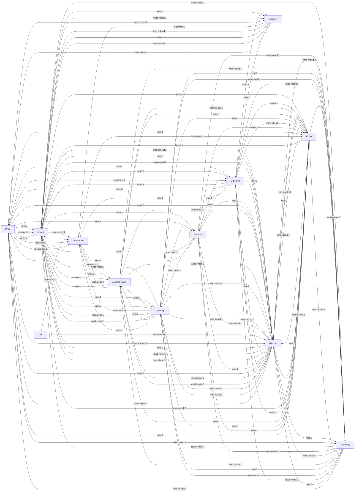

# Migration Intelligence Report

## Execution
- Executed At (UTC): `2026-03-07T14:47:44.3317238+00:00`
- Source Path: `C:\Projects\arabamcom-main`
- Target Path: `C:\Users\ilhan.emir\RiderProjects\monolith-decomposition-agent\output-real`
- Dry Run: `False`

## Inventory / Discovery
- Solutions: `2`
- Projects: `19`
- Source Files: `8282`
- Markdown Files: `39`
- Controller-like Files: `197`
- Repository-like Files: `763`
- Endpoint Candidates: `545`
- Dependency Signals: `29834`
- Legacy Risk Signals: `396`

### Projects and Classification
- `Arabam - Backup.HttpClients` (`netstandard2.0`) - `v2\Arabam.HttpClients\Arabam - Backup.HttpClients.csproj` -> `BusinessDomainCandidate`
- `Arabam.Admin` (`n/a`) - `v2\Arabam.UI\Arabam.Admin\Arabam.Admin.csproj` -> `HostApplication`
- `Arabam.Api` (`n/a`) - `v2\Arabam.UI\Arabam.Api\Arabam.Api.csproj` -> `HostApplication`
- `Arabam.ApiGateway` (`n/a`) - `v2\Arabam.UI\Arabam.ApiGateway\Arabam.ApiGateway.csproj` -> `HostApplication`
- `Arabam.Asset` (`n/a`) - `v2\Arabam.UI\Arabam.Asset\Arabam.Asset.csproj` -> `BusinessDomainCandidate`
- `Arabam.Core` (`n/a`) - `v2\Arabam.Core\Arabam.Core.csproj` -> `InfrastructureComponent`
- `Arabam.Core.Test` (`n/a`) - `v2\Arabam.Tests\Arabam.Core.Test\Arabam.Core.Test.csproj` -> `BusinessDomainCandidate`
- `Arabam.Crawler.Core` (`n/a`) - `v2\Arabam.Crawler\Core\Arabam.Crawler.Core.csproj` -> `InfrastructureComponent`
- `Arabam.Crawler.Data` (`n/a`) - `v2\Arabam.Crawler\Data\Arabam.Crawler.Data.csproj` -> `InfrastructureComponent`
- `Arabam.Crawler.MemberAdvertService` (`n/a`) - `v2\Arabam.Crawler\Services\MemberAdvertService\Arabam.Crawler.MemberAdvertService.csproj` -> `BusinessDomainCandidate`
- `Arabam.Crawler.Service` (`n/a`) - `v2\Arabam.Crawler\Service\Arabam.Crawler.Service.csproj` -> `BusinessDomainCandidate`
- `Arabam.Crawler.Test` (`n/a`) - `v2\Arabam.Crawler.Test\Arabam.Crawler.Test.csproj` -> `BusinessDomainCandidate`
- `Arabam.Data` (`n/a`) - `v2\Arabam.Data\Arabam.Data\Arabam.Data.csproj` -> `InfrastructureComponent`
- `Arabam.Data.EF` (`n/a`) - `v2\Arabam.Data\Arabam.Data.EF\Arabam.Data.EF.csproj` -> `BusinessDomainCandidate`
- `Arabam.Domain` (`n/a`) - `v2\Arabam.Domain\Arabam.Domain.csproj` -> `InfrastructureComponent`
- `Arabam.Hangfire` (`n/a`) - `v2\Arabam.Services\Arabam.Hangfire\Arabam.Hangfire.csproj` -> `HostApplication`
- `Arabam.Helper` (`n/a`) - `v2\Arabam.Helper\Arabam.Helper.csproj` -> `InfrastructureComponent`
- `Arabam.HttpClients` (`netstandard2.0`) - `v2\Arabam.HttpClients\Arabam.HttpClients.csproj` -> `BusinessDomainCandidate`
- `Arabam.Web` (`n/a`) - `v2\Arabam.UI\Arabam.Web\Arabam.Web.csproj` -> `HostApplication`

## Structural Analysis
- Consolidated Domain Candidates: `13`
- Domain Hierarchies: `13`
- Endpoint Mappings: `975`
- Repository-to-Table Mappings: `585`
- Execution Chains: `186`
- Hangfire Jobs: `136`
- Producer->Consumer Relationships: `3`
- Scheduled Jobs (Resolved/Unresolved): `0`/`26`
- Workflows: `25`

### Component Layer Summary
- `HostApplication`: `10` component(s)
- `InfrastructureComponent`: `6` component(s)
- `BusinessDomainCandidate`: `13` component(s)

### External Integration Snapshot
- `Advert`: `172` external signal(s)
- `Authentication`: `70` external signal(s)
- `Campaign`: `47` external signal(s)
- `Category`: `29` external signal(s)
- `Expertise`: `43` external signal(s)
- `Favorite`: `16` external signal(s)
- `Help`: `3` external signal(s)
- `Member`: `74` external signal(s)
- `New`: `35` external signal(s)
- `Order`: `96` external signal(s)
- `Price`: `75` external signal(s)
- `Summary`: `2` external signal(s)
- `Widget`: `13` external signal(s)

## Repository -> Table Mapping
| Domain | Repository | Table | Access Pattern | Confidence | Evidence |
| --- | --- | --- | --- | ---: | --- |
| `Advert` | `AdvertAIAutoApproveRepository` | `Advert` | `write` | `0.88` | Detected via SQL keyword `INTO`. Type=table. |
| `Advert` | `AdvertAIGeneratedTextRepository` | `Advert` | `read/write` | `0.88` | Detected via SQL keyword `INTO`. Type=table. |
| `Advert` | `AdvertAIPromptAttributeRepository` | `Advert` | `read` | `0.88` | Detected via SQL keyword `FROM`. Type=table. |
| `Advert` | `AdvertAISelectedPromptAttributeRepository` | `Advert` | `read/write` | `0.88` | Detected via SQL keyword `INTO`. Type=table. |
| `Advert` | `AdvertCallActionRepository` | `AdvertCallAction` | `unknown` | `0.40` | Inferred from repository naming (low confidence). |
| `Advert` | `AdvertChangeTrackingRepository` | `AdvertChangeTracking` | `unknown` | `0.40` | Inferred from repository naming (low confidence). |
| `Advert` | `AdvertClassifyRepository` | `AdvertClassify` | `read/write` | `0.88` | Detected via SQL keyword `FROM`. Type=table. |
| `Advert` | `AdvertDamageInfoRepository` | `AdvertDamageInfo` | `unknown` | `0.40` | Inferred from repository naming (low confidence). |
| `Advert` | `AdvertDetailViewLogRepository` | `AdvertDetailViewLog` | `unknown` | `0.40` | Inferred from repository naming (low confidence). |
| `Advert` | `AdvertEdgeDefinitionRepository` | `AdvertEdgeDefinition` | `unknown` | `0.40` | Inferred from repository naming (low confidence). |
| `Advert` | `AdvertEdgeRepository` | `Advert` | `read/write` | `0.88` | Detected via SQL keyword `JOIN`. Type=table. |
| `Advert` | `AdvertEdgeRepository` | `Membership` | `read/write` | `0.88` | Detected via SQL keyword `JOIN`. Type=table. |
| `Advert` | `AdvertEdgeRepository` | `Payment` | `read/write` | `0.88` | Detected via SQL keyword `FROM`. Type=table. |
| `Advert` | `AdvertEidsVehicleModelRepository` | `AdvertEidsVehicleModel` | `unknown` | `0.40` | Inferred from repository naming (low confidence). |
| `Advert` | `AdvertElasticSyncCheckRepository` | `AdvertElasticSyncCheck` | `unknown` | `0.40` | Inferred from repository naming (low confidence). |
| `Advert` | `AdvertEquipmentRepository` | `AdvertEquipment` | `unknown` | `0.40` | Inferred from repository naming (low confidence). |
| `Advert` | `AdvertFraudRepository` | `AdvertFraud` | `unknown` | `0.40` | Inferred from repository naming (low confidence). |
| `Advert` | `AdvertHistoryRepository` | `Advert` | `read` | `0.88` | Detected via SQL keyword `FROM`. Type=table. |
| `Advert` | `AdvertHistoryRepository` | `AdvertStatusAction` | `read` | `0.88` | Detected via SQL keyword `FROM`. Type=table. |
| `Advert` | `AdvertIntegrationPhotoRepository` | `Advert` | `read/write` | `0.88` | Detected via SQL keyword `FROM`. Type=table. |
| `Advert` | `AdvertIntegrationPhotoRepository` | `AdvertIntegrationPhoto` | `read/write` | `0.88` | Detected via SQL keyword `JOIN`. Type=table. |
| `Advert` | `AdvertIntegrationPhotoRepository` | `Photo` | `read/write` | `0.88` | Detected via SQL keyword `JOIN`. Type=table. |
| `Advert` | `AdvertLegalObligationsRepository` | `LegalObligations` | `read/write` | `0.88` | Detected via SQL keyword `FROM`. Type=table. |
| `Advert` | `AdvertMobilAppUploadRecordRepository` | `AdvertMobilAppUploadRecord` | `unknown` | `0.40` | Inferred from repository naming (low confidence). |
| `Advert` | `AdvertPriceOfferActionRepository` | `AdvertPriceOfferAction` | `unknown` | `0.40` | Inferred from repository naming (low confidence). |
| `Advert` | `AdvertPriceOfferCallRepository` | `AdvertPriceOfferCall` | `unknown` | `0.40` | Inferred from repository naming (low confidence). |
| `Advert` | `AdvertPriceOfferRepository` | `Advert` | `read/write` | `0.88` | Detected via SQL keyword `FROM`. Type=table. |
| `Advert` | `AdvertPriceOfferRepository` | `AdvertEquipment` | `read/write` | `0.88` | Detected via SQL keyword `JOIN`. Type=table. |
| `Advert` | `AdvertPriceOfferRepository` | `Feature` | `read/write` | `0.88` | Detected via SQL keyword `JOIN`. Type=table. |
| `Advert` | `AdvertPriceOfferRepository` | `FeatureToEquipment` | `read/write` | `0.88` | Detected via SQL keyword `JOIN`. Type=table. |
| `Advert` | `AdvertPriceOfferRepository` | `Membership` | `read/write` | `0.88` | Detected via SQL keyword `JOIN`. Type=table. |
| `Advert` | `AdvertPriceOfferRepository` | `ModelToFeature` | `read/write` | `0.88` | Detected via SQL keyword `JOIN`. Type=table. |
| `Advert` | `AdvertPriceOfferRepository` | `NewCar` | `read/write` | `0.88` | Detected via SQL keyword `JOIN`. Type=table. |
| `Advert` | `AdvertPriceOfferRepository` | `PriceOffer` | `read/write` | `0.88` | Detected via SQL keyword `FROM`. Type=table. |
| `Advert` | `AdvertPropertyRepository` | `AdvertProperty` | `unknown` | `0.40` | Inferred from repository naming (low confidence). |
| `Advert` | `AdvertRepeatedReportRepository` | `AdvertRepeatedReport` | `unknown` | `0.40` | Inferred from repository naming (low confidence). |
| `Advert` | `AdvertReportRepository` | `Advert` | `read/write` | `0.88` | Detected via SQL keyword `FROM`. Type=table. |
| `Advert` | `AdvertRepository` | `AdminUserView` | `read/write` | `0.68` | Detected via SQL keyword `JOIN`. Type=view. |
| `Advert` | `AdvertRepository` | `Advert` | `read/write` | `0.88` | Detected via SQL keyword `from`. Type=table. |
| `Advert` | `AdvertRepository` | `AdvertEdge` | `read/write` | `0.88` | Detected via SQL keyword `from`. Type=table. |
| `Advert` | `AdvertRepository` | `AdvertExpertiseDiscountCodeSyncDate` | `read/write` | `0.88` | Detected via SQL keyword `FROM`. Type=table. |
| `Advert` | `AdvertRepository` | `AdvertHistory` | `read/write` | `0.88` | Detected via SQL keyword `FROM`. Type=table. |
| `Advert` | `AdvertRepository` | `AdvertProperty` | `read/write` | `0.88` | Detected via SQL keyword `FROM`. Type=table. |
| `Advert` | `AdvertRepository` | `AdvertStatusAction` | `read/write` | `0.88` | Detected via SQL keyword `FROM`. Type=table. |
| `Advert` | `AdvertRepository` | `ArabamIstatistik` | `read/write` | `0.88` | Detected via SQL keyword `FROM`. Type=table. |
| `Advert` | `AdvertRepository` | `CategoryTree` | `read/write` | `0.88` | Detected via SQL keyword `FROM`. Type=table. |
| `Advert` | `AdvertRepository` | `Conversation` | `read/write` | `0.88` | Detected via SQL keyword `FROM`. Type=table. |
| `Advert` | `AdvertRepository` | `ExpertiseDetailView` | `read/write` | `0.68` | Detected via SQL keyword `FROM`. Type=view. |
| `Advert` | `AdvertRepository` | `FavoritedAdvert` | `read/write` | `0.88` | Detected via SQL keyword `FROM`. Type=table. |
| `Advert` | `AdvertRepository` | `IlanRedSebep` | `read/write` | `0.88` | Detected via SQL keyword `FROM`. Type=table. |
| `Advert` | `AdvertRepository` | `Members` | `read/write` | `0.88` | Detected via SQL keyword `JOIN`. Type=table. |
| `Advert` | `AdvertRepository` | `Membership` | `read/write` | `0.88` | Detected via SQL keyword `FROM`. Type=table. |
| `Advert` | `AdvertRepository` | `Models` | `read/write` | `0.88` | Detected via SQL keyword `JOIN`. Type=table. |
| `Advert` | `AdvertRepository` | `Payment` | `read/write` | `0.88` | Detected via SQL keyword `FROM`. Type=table. |
| `Advert` | `AdvertRepository` | `Photo` | `read/write` | `0.88` | Detected via SQL keyword `FROM`. Type=table. |
| `Advert` | `AdvertRepository` | `PropertyValue` | `read/write` | `0.88` | Detected via SQL keyword `JOIN`. Type=table. |
| `Advert` | `AdvertSearchRepository` | `Advert` | `read/write` | `0.88` | Detected via SQL keyword `FROM`. Type=table. |
| `Advert` | `AdvertSearchRepository` | `Payment` | `read/write` | `0.88` | Detected via SQL keyword `FROM`. Type=table. |
| `Advert` | `AdvertSearchRepository` | `ROWS` | `read/write` | `0.88` | Detected via SQL keyword `From`. Type=table. |
| `Advert` | `AdvertStateRepository` | `Advert` | `read/write` | `0.88` | Detected via SQL keyword `FROM`. Type=table. |
| `Advert` | `AdvertStateRepository` | `AdvertProperty` | `read/write` | `0.88` | Detected via SQL keyword `JOIN`. Type=table. |
| `Advert` | `AdvertStateRepository` | `Firms` | `read/write` | `0.88` | Detected via SQL keyword `JOIN`. Type=table. |
| `Advert` | `AdvertStateRepository` | `PropertyDefinitionToCategory` | `read/write` | `0.88` | Detected via SQL keyword `JOIN`. Type=table. |
| `Advert` | `AdvertStatisticRepository` | `FavoritedAdvert` | `read/write` | `0.88` | Detected via SQL keyword `FROM`. Type=table. |
| `Advert` | `AdvertStatisticRepository` | `Stat` | `read/write` | `0.88` | Detected via SQL keyword `UPDATE`. Type=table. |
| `Advert` | `AdvertStatisticRepository` | `Statistic` | `read/write` | `0.88` | Detected via SQL keyword `JOIN`. Type=table. |
| `Advert` | `AdvertSwapCriteriaRepository` | `AdvertSwapCriteria` | `unknown` | `0.40` | Inferred from repository naming (low confidence). |
| `Advert` | `AdvertTextRepository` | `Advert` | `read/write` | `0.88` | Detected via SQL keyword `FROM`. Type=table. |
| `Advert` | `AdvertTextRepository` | `Members` | `read/write` | `0.88` | Detected via SQL keyword `JOIN`. Type=table. |
| `Advert` | `AdvertTextRepository` | `Status` | `read/write` | `0.88` | Detected via SQL keyword `JOIN`. Type=table. |
| `Advert` | `AdvertTextRepository` | `Text` | `read/write` | `0.88` | Detected via SQL keyword `JOIN`. Type=table. |
| `Advert` | `AdvertToUpdateRepository` | `AdvertToUpdate` | `unknown` | `0.40` | Inferred from repository naming (low confidence). |
| `Advert` | `AdvertTrackingHistoryDateRepository` | `AdvertTrackingHistoryDate` | `unknown` | `0.40` | Inferred from repository naming (low confidence). |
| `Advert` | `AdvertViewCountRepository` | `Advert` | `read/write` | `0.88` | Detected via SQL keyword `JOIN`. Type=table. |
| `Advert` | `AdvertViewCountRepository` | `AdvertViewCount` | `read/write` | `0.68` | Detected via SQL keyword `FROM`. Type=view. |
| `Advert` | `AdvertViewCountViewRepository` | `AdvertViewCountView` | `unknown` | `0.40` | Inferred from repository naming (low confidence). |
| `Advert` | `ArchiveAdvertRepository` | `ArchiveAdvert` | `unknown` | `0.40` | Inferred from repository naming (low confidence). |
| `Advert` | `CrawlerAdvertEventRecordRepository` | `AdvertEventRecord` | `read/write` | `0.88` | Detected via SQL keyword `JOIN`. Type=table. |
| `Advert` | `CrawlerAdvertEventRecordRepository` | `DeletableAdvertEventRecords` | `read/write` | `0.88` | Detected via SQL keyword `INTO`. Type=table. |
| `Advert` | `CrawlerAdvertRepository` | `Advert` | `read/write` | `0.88` | Detected via SQL keyword `UPDATE`. Type=table. |
| `Advert` | `CrawlerAdvertRepository` | `FREETEXTTABLE` | `read/write` | `0.88` | Detected via SQL keyword `JOIN`. Type=table. |
| `Advert` | `CrawlerAdvertRepository` | `ScomCategoryPathMapping` | `read/write` | `0.88` | Detected via SQL keyword `FROM`. Type=table. |
| `Advert` | `CrawlerAdvertRepository` | `Utility` | `read/write` | `0.88` | Detected via SQL keyword `FROM`. Type=table. |
| `Advert` | `ExpressAdvertRecordRepository` | `ExpressAdvertRecord` | `unknown` | `0.40` | Inferred from repository naming (low confidence). |
| `Advert` | `ExtraAdvertGiveawayRepository` | `Membership` | `read/write` | `0.88` | Detected via SQL keyword `UPDATE`. Type=table. |
| `Advert` | `ExtraAdvertGiveawayRepository` | `Payment` | `read/write` | `0.88` | Detected via SQL keyword `JOIN`. Type=table. |
| `Advert` | `SmsKeyToAdvertIdsRepository` | `SmsKeyToAdvertIds` | `unknown` | `0.40` | Inferred from repository naming (low confidence). |
| `Authentication` | `AdminAuthorizationRepository` | `AdminAuthorization` | `unknown` | `0.40` | Inferred from repository naming (low confidence). |
| `Authentication` | `AdminGroupAuthorizationRepository` | `AdminGroupAuthorization` | `unknown` | `0.40` | Inferred from repository naming (low confidence). |
| `Authentication` | `ProductRestrictionRepository` | `Payment` | `read/write` | `0.88` | Detected via SQL keyword `FROM`. Type=table. |
| `Authentication` | `QueuedNotificationRepository` | `QueuedNotification` | `write` | `0.88` | Detected via SQL keyword `UPDATE`. Type=table. |
| `Authentication` | `RaffleNotificationRepository` | `RaffleNotifications` | `read/write` | `0.88` | Detected via SQL keyword `FROM`. Type=table. |
| `Authentication` | `RaffleUsersNotificationRepository` | `RaffleUsersNotification` | `read/write` | `0.88` | Detected via SQL keyword `FROM`. Type=table. |
| `Campaign` | `CampaignMemberAnswerRepository` | `CampaignMemberAnswer` | `unknown` | `0.40` | Inferred from repository naming (low confidence). |
| `Campaign` | `CampaignMenuRepository` | `CampaignMenu` | `unknown` | `0.40` | Inferred from repository naming (low confidence). |
| `Campaign` | `CampaignNotificationMemberRepository` | `CampaignNotificationMember` | `unknown` | `0.40` | Inferred from repository naming (low confidence). |
| `Campaign` | `CampaignNotificationRepository` | `CampaignNotification` | `unknown` | `0.40` | Inferred from repository naming (low confidence). |
| `Campaign` | `CampaignProductsRepository` | `CampaignProducts` | `unknown` | `0.40` | Inferred from repository naming (low confidence). |
| `Campaign` | `CampaignRepository` | `Campaign` | `read/write` | `0.88` | Detected via SQL keyword `FROM`. Type=table. |
| `Campaign` | `CampaignRepository` | `Payment` | `read/write` | `0.88` | Detected via SQL keyword `JOIN`. Type=table. |
| `Campaign` | `MemberCampaignUseHistoryRepository` | `Membership` | `read` | `0.88` | Detected via SQL keyword `FROM`. Type=table. |
| `Campaign` | `NotificationCampaignQueueRepository` | `NotificationCampaignQueue` | `unknown` | `0.40` | Inferred from repository naming (low confidence). |
| `Campaign` | `NotificationCampaignRepository` | `NotificationCampaign` | `unknown` | `0.40` | Inferred from repository naming (low confidence). |
| `Campaign` | `OfferToFriendCampaignRepository` | `OfferToFriendCampaign` | `unknown` | `0.40` | Inferred from repository naming (low confidence). |
| `Category` | `BundleCategoryRepository` | `BundleCategory` | `unknown` | `0.40` | Inferred from repository naming (low confidence). |
| `Category` | `CategoryRepository` | `Category` | `read` | `0.88` | Detected via SQL keyword `JOIN`. Type=table. |
| `Category` | `CategoryRepository` | `CategoryToVehicle` | `read` | `0.88` | Detected via SQL keyword `FROM`. Type=table. |
| `Category` | `CategoryRepository` | `CategoryTree` | `read` | `0.88` | Detected via SQL keyword `FROM`. Type=table. |
| `Category` | `CategoryRepository` | `ElectricCategoryMap` | `read` | `0.88` | Detected via SQL keyword `FROM`. Type=table. |
| `Category` | `CategoryRepository` | `Models` | `read` | `0.88` | Detected via SQL keyword `JOIN`. Type=table. |
| `Category` | `CategoryRepository` | `Parent` | `read` | `0.88` | Detected via SQL keyword `join`. Type=table. |
| `Category` | `CategoryToVehicleRepository` | `CategoryToVehicle` | `read` | `0.88` | Detected via SQL keyword `FROM`. Type=table. |
| `Category` | `CategoryTreeRepository` | `CategoryTree` | `read/write` | `0.88` | Detected via SQL keyword `from`. Type=table. |
| `Category` | `CategoryTreeRepository` | `Child` | `read/write` | `0.88` | Detected via SQL keyword `join`. Type=table. |
| `Category` | `CategoryTreeRepository` | `Parent` | `read/write` | `0.88` | Detected via SQL keyword `join`. Type=table. |
| `Category` | `CategoryTypeBrandRepository` | `CategoryTypeBrand` | `unknown` | `0.40` | Inferred from repository naming (low confidence). |
| `Category` | `CrawlerCategoryElasticRepository` | `CrawlerCategoryElastic` | `unknown` | `0.40` | Inferred from repository naming (low confidence). |
| `Category` | `CrawlerCategoryFacetRepository` | `CategoryFacet` | `read/write` | `0.88` | Detected via SQL keyword `UPDATE`. Type=table. |
| `Category` | `EquipmentToCategoryRepository` | `CategoryTree` | `read/write` | `0.88` | Detected via SQL keyword `JOIN`. Type=table. |
| `Category` | `EquipmentToCategoryRepository` | `DonanimListesi` | `read/write` | `0.88` | Detected via SQL keyword `JOIN`. Type=table. |
| `Category` | `EquipmentToCategoryRepository` | `EquipmentToCategory` | `read/write` | `0.88` | Detected via SQL keyword `FROM`. Type=table. |
| `Category` | `InsuranceCategoryRepository` | `InsuranceCategory` | `unknown` | `0.40` | Inferred from repository naming (low confidence). |
| `Category` | `IntegrationCategoryElasticRepository` | `IntegrationCategoryElastic` | `unknown` | `0.40` | Inferred from repository naming (low confidence). |
| `Category` | `WizardBrandToCategoryRepository` | `WizardBrandToCategory` | `unknown` | `0.40` | Inferred from repository naming (low confidence). |
| `Expertise` | `AdvertExpertiseReportRepository` | `AdvertExpertiseReport` | `read/write` | `0.88` | Detected via SQL keyword `INTO`. Type=table. |
| `Expertise` | `CrawlerExpertiseRepository` | `CrawlerExpertise` | `unknown` | `0.40` | Inferred from repository naming (low confidence). |
| `Expertise` | `ExpertCitiesRepository` | `ExpertCities` | `unknown` | `0.40` | Inferred from repository naming (low confidence). |
| `Expertise` | `ExpertisePackageRepository` | `ExpertisePackage` | `unknown` | `0.40` | Inferred from repository naming (low confidence). |
| `Expertise` | `ExpertisePhotoRepository` | `ExpertisePhoto` | `unknown` | `0.40` | Inferred from repository naming (low confidence). |
| `Expertise` | `ExpertiseProductBaseItemRepository` | `ExpertiseProductBaseItem` | `unknown` | `0.40` | Inferred from repository naming (low confidence). |
| `Expertise` | `ExpertiseProductRepository` | `Expertise` | `read/write` | `0.88` | Detected via SQL keyword `FROM`. Type=table. |
| `Expertise` | `ExpertiseProductToBaseItemRepository` | `ExpertiseProductToBaseItem` | `unknown` | `0.40` | Inferred from repository naming (low confidence). |
| `Expertise` | `ExpertiseProductToMemberRepository` | `Expertise` | `read/write` | `0.88` | Detected via SQL keyword `FROM`. Type=table. |
| `Expertise` | `ExpertiseProductUsageRepository` | `ExpertiseProductUsage` | `unknown` | `0.40` | Inferred from repository naming (low confidence). |
| `Expertise` | `ExpertiseReportContactRepository` | `ExpertiseReportContact` | `unknown` | `0.40` | Inferred from repository naming (low confidence). |
| `Expertise` | `ExpertiseReportDetailRepository` | `ExpertiseReportDetail` | `unknown` | `0.40` | Inferred from repository naming (low confidence). |
| `Expertise` | `ExpertiseReportPackageRepository` | `ExpertiseReportPackage` | `unknown` | `0.40` | Inferred from repository naming (low confidence). |
| `Expertise` | `ExpertiseReportRepository` | `ExpertiseReport` | `unknown` | `0.40` | Inferred from repository naming (low confidence). |
| `Expertise` | `ExpertiseReportTestCategoryPointRepository` | `ExpertiseReportTestCategoryPoint` | `unknown` | `0.40` | Inferred from repository naming (low confidence). |
| `Expertise` | `ExpertiseReportTestCategoryRepository` | `ExpertiseReportTestCategory` | `unknown` | `0.40` | Inferred from repository naming (low confidence). |
| `Expertise` | `ExpertiseReportTestCategoryTypeRepository` | `ExpertiseReportTestCategoryType` | `unknown` | `0.40` | Inferred from repository naming (low confidence). |
| `Expertise` | `ExpertiseReportTestPointRepository` | `ExpertiseReportTestPoint` | `unknown` | `0.40` | Inferred from repository naming (low confidence). |
| `Expertise` | `ExpertiseReportTestPointTypeRepository` | `ExpertiseReportTestPointType` | `unknown` | `0.40` | Inferred from repository naming (low confidence). |
| `Expertise` | `ExpertiseReportTestRepository` | `ExpertiseReportTest` | `unknown` | `0.40` | Inferred from repository naming (low confidence). |
| `Expertise` | `ExpertiseReportTestTypeRepository` | `ExpertiseReportTestType` | `unknown` | `0.40` | Inferred from repository naming (low confidence). |
| `Expertise` | `ExpertiseReservationRepository` | `Advert` | `read/write` | `0.88` | Detected via SQL keyword `JOIN`. Type=table. |
| `Expertise` | `ExpertiseReservationRepository` | `Expert` | `read/write` | `0.88` | Detected via SQL keyword `JOIN`. Type=table. |
| `Expertise` | `ExpertiseReservationRepository` | `Expertise` | `read/write` | `0.88` | Detected via SQL keyword `FROM`. Type=table. |
| `Expertise` | `ExpertiseReservationRepository` | `Parent` | `read/write` | `0.88` | Detected via SQL keyword `join`. Type=table. |
| `Expertise` | `ExpertiseReservationRepository` | `Product` | `read/write` | `0.88` | Detected via SQL keyword `JOIN`. Type=table. |
| `Expertise` | `ExpertiseReservationRepository` | `ProductToMember` | `read/write` | `0.88` | Detected via SQL keyword `FROM`. Type=table. |
| `Expertise` | `ExpertiseReservationRepository` | `Report` | `read/write` | `0.88` | Detected via SQL keyword `JOIN`. Type=table. |
| `Expertise` | `ExpertiseReservationRepository` | `Reservation` | `read/write` | `0.88` | Detected via SQL keyword `FROM`. Type=table. |
| `Expertise` | `ExpertRepository` | `Expert` | `unknown` | `0.40` | Inferred from repository naming (low confidence). |
| `Expertise` | `PriceOfferExpertiseRepository` | `ExpertiseV2` | `read/write` | `0.88` | Detected via SQL keyword `FROM`. Type=table. |
| `Expertise` | `PriceOfferExpertiseRepository` | `PriceOffer` | `read/write` | `0.88` | Detected via SQL keyword `INTO`. Type=table. |
| `Expertise` | `PriceOfferExpertiseRepository` | `Tops` | `read/write` | `0.88` | Detected via SQL keyword `FROM`. Type=table. |
| `Favorite` | `FavoritedAdvertActivationRepository` | `FavoritedAdvertActivation` | `unknown` | `0.40` | Inferred from repository naming (low confidence). |
| `Favorite` | `FavoritedAdvertListRepository` | `Advert` | `read/write` | `0.88` | Detected via SQL keyword `JOIN`. Type=table. |
| `Favorite` | `FavoritedAdvertRepository` | `Advert` | `read/write` | `0.88` | Detected via SQL keyword `JOIN`. Type=table. |
| `Favorite` | `FavoritedAdvertRepository` | `Expertise` | `read/write` | `0.88` | Detected via SQL keyword `JOIN`. Type=table. |
| `Favorite` | `FavoritedAdvertRepository` | `FavoritedAdvert` | `read/write` | `0.88` | Detected via SQL keyword `FROM`. Type=table. |
| `Favorite` | `FavoritedAdvertRepository` | `FavoritedAdvertList` | `read/write` | `0.88` | Detected via SQL keyword `JOIN`. Type=table. |
| `Favorite` | `FavoritedAdvertRepository` | `Membership` | `read/write` | `0.88` | Detected via SQL keyword `JOIN`. Type=table. |
| `Favorite` | `FavoritedSearchActivationRepository` | `FavoritedSearchActivation` | `unknown` | `0.40` | Inferred from repository naming (low confidence). |
| `Favorite` | `FavoritedSearchRepository` | `FavoritedSearch` | `read/write` | `0.88` | Detected via SQL keyword `UPDATE`. Type=table. |
| `Favorite` | `FavoriteSearchNotificationHistoryDateRepository` | `FavoriteSearchNotificationHistoryDate` | `unknown` | `0.40` | Inferred from repository naming (low confidence). |
| `Favorite` | `InvoiceRepository` | `Invoice` | `unknown` | `0.40` | Inferred from repository naming (low confidence). |
| `Member` | `BlockedMemberRepository` | `BlockedMember` | `unknown` | `0.40` | Inferred from repository naming (low confidence). |
| `Member` | `BlockMemberReasonRepository` | `BlockMemberReason` | `unknown` | `0.40` | Inferred from repository naming (low confidence). |
| `Member` | `DealerRepository` | `Dealer` | `unknown` | `0.40` | Inferred from repository naming (low confidence). |
| `Member` | `MemberAchievementRepository` | `MemberAchievement` | `unknown` | `0.40` | Inferred from repository naming (low confidence). |
| `Member` | `MemberAddressRepository` | `Membership` | `read/write` | `0.88` | Detected via SQL keyword `UPDATE`. Type=table. |
| `Member` | `MemberAgreementActionRepository` | `MemberAgreementAction` | `unknown` | `0.40` | Inferred from repository naming (low confidence). |
| `Member` | `MemberBundleChangeRepository` | `MemberBundleChange` | `unknown` | `0.40` | Inferred from repository naming (low confidence). |
| `Member` | `MemberDocumentRepository` | `MemberDocuments` | `read/write` | `0.88` | Detected via SQL keyword `INTO`. Type=table. |
| `Member` | `MemberEdgeAssignmentRuleRepository` | `MemberEdgeAssignmentRule` | `unknown` | `0.40` | Inferred from repository naming (low confidence). |
| `Member` | `MemberEdgeRepository` | `Membership` | `read` | `0.88` | Detected via SQL keyword `FROM`. Type=table. |
| `Member` | `MemberEdgeRepository` | `Payment` | `read` | `0.88` | Detected via SQL keyword `JOIN`. Type=table. |
| `Member` | `MemberFacebookRepository` | `MemberFacebook` | `unknown` | `0.40` | Inferred from repository naming (low confidence). |
| `Member` | `MemberIntegrationDictionaryRepository` | `MemberIntegrationDictionary` | `unknown` | `0.40` | Inferred from repository naming (low confidence). |
| `Member` | `MemberIntegrationHistoryRepository` | `MemberIntegrationHistory` | `unknown` | `0.40` | Inferred from repository naming (low confidence). |
| `Member` | `MemberIntegrationRepository` | `Membership` | `read/write` | `0.88` | Detected via SQL keyword `UPDATE`. Type=table. |
| `Member` | `MemberMessageNotificationRepository` | `MemberMessageNotification` | `unknown` | `0.40` | Inferred from repository naming (low confidence). |
| `Member` | `MemberMessageReportRepository` | `MemberMessageReport` | `unknown` | `0.40` | Inferred from repository naming (low confidence). |
| `Member` | `MemberMessageRepository` | `Advert` | `read/write` | `0.88` | Detected via SQL keyword `FROM`. Type=table. |
| `Member` | `MemberMessageRepository` | `BlockedMember` | `read/write` | `0.88` | Detected via SQL keyword `FROM`. Type=table. |
| `Member` | `MemberMessageRepository` | `Conversation` | `read/write` | `0.88` | Detected via SQL keyword `JOIN`. Type=table. |
| `Member` | `MemberMessageRepository` | `MemberMessage` | `read/write` | `0.88` | Detected via SQL keyword `FROM`. Type=table. |
| `Member` | `MemberMessageRepository` | `Membership` | `read/write` | `0.88` | Detected via SQL keyword `FROM`. Type=table. |
| `Member` | `MemberMessageRepository` | `MemberSubscription` | `read/write` | `0.88` | Detected via SQL keyword `FROM`. Type=table. |
| `Member` | `MemberMessageRepository` | `Product` | `read/write` | `0.88` | Detected via SQL keyword `JOIN`. Type=table. |
| `Member` | `MemberMessageRepository` | `User` | `read/write` | `0.88` | Detected via SQL keyword `join`. Type=table. |
| `Member` | `MemberMessageTemplateAnswerRepository` | `MemberMessageTemplateAnswer` | `unknown` | `0.40` | Inferred from repository naming (low confidence). |
| `Member` | `MemberMessageTemplateQuestionRepository` | `MemberMessageTemplateQuestion` | `unknown` | `0.40` | Inferred from repository naming (low confidence). |
| `Member` | `MemberNewsletterRepository` | `MemberNewsletter` | `unknown` | `0.40` | Inferred from repository naming (low confidence). |
| `Member` | `MemberRecursiveBundleActionRepository` | `MemberRecursiveBundleAction` | `unknown` | `0.40` | Inferred from repository naming (low confidence). |
| `Member` | `MemberRecursiveBundleRepository` | `Bundle` | `read` | `0.88` | Detected via SQL keyword `from`. Type=table. |
| `Member` | `MemberRecursiveBundleRepository` | `BundleTemp` | `read` | `0.88` | Detected via SQL keyword `into`. Type=table. |
| `Member` | `MemberRecursiveBundleRepository` | `City` | `read` | `0.88` | Detected via SQL keyword `from`. Type=table. |
| `Member` | `MemberRecursiveBundleRepository` | `CityTemp` | `read` | `0.88` | Detected via SQL keyword `into`. Type=table. |
| `Member` | `MemberRecursiveBundleRepository` | `MemberRecursiveBundle` | `read` | `0.88` | Detected via SQL keyword `FROM`. Type=table. |
| `Member` | `MemberRecursiveBundleRepository` | `Mrb` | `read` | `0.88` | Detected via SQL keyword `from`. Type=table. |
| `Member` | `MemberRecursiveBundleRepository` | `Product` | `read` | `0.88` | Detected via SQL keyword `JOIN`. Type=table. |
| `Member` | `MemberRecursiveBundleRepository` | `ProductBundle` | `read` | `0.88` | Detected via SQL keyword `JOIN`. Type=table. |
| `Member` | `MemberRepository` | `Advert` | `read/write` | `0.88` | Detected via SQL keyword `FROM`. Type=table. |
| `Member` | `MemberRepository` | `Membership` | `read/write` | `0.88` | Detected via SQL keyword `FROM`. Type=table. |
| `Member` | `MemberRepository` | `User` | `read/write` | `0.88` | Detected via SQL keyword `JOIN`. Type=table. |
| `Member` | `MemberRepository` | `UserToken` | `read/write` | `0.88` | Detected via SQL keyword `FROM`. Type=table. |
| `Member` | `MembershipDocumentRepository` | `Documents` | `read/write` | `0.88` | Detected via SQL keyword `INTO`. Type=table. |
| `Member` | `MembershipHistoryRepository` | `MembershipHistory` | `unknown` | `0.40` | Inferred from repository naming (low confidence). |
| `Member` | `MembershipSecurityRepository` | `Members` | `read` | `0.88` | Detected via SQL keyword `FROM`. Type=table. |
| `Member` | `MembershipSecurityRepository` | `Membership` | `read` | `0.88` | Detected via SQL keyword `FROM`. Type=table. |
| `Member` | `MembershipSecurityRepository` | `User` | `read` | `0.88` | Detected via SQL keyword `FROM`. Type=table. |
| `Member` | `MemberSubscriptionRepository` | `Firms` | `read` | `0.88` | Detected via SQL keyword `JOIN`. Type=table. |
| `Member` | `MemberSubscriptionRepository` | `MemberRecursiveBundle` | `read` | `0.88` | Detected via SQL keyword `FROM`. Type=table. |
| `Member` | `MemberSubscriptionRepository` | `MemberSubscription` | `read` | `0.88` | Detected via SQL keyword `FROM`. Type=table. |
| `Member` | `MemberSubscriptionRepository` | `Mrb` | `read` | `0.88` | Detected via SQL keyword `join`. Type=table. |
| `Member` | `MemberSubscriptionRepository` | `OrderDetail` | `read` | `0.88` | Detected via SQL keyword `JOIN`. Type=table. |
| `Member` | `MemberSubscriptionRepository` | `Payment` | `read` | `0.88` | Detected via SQL keyword `FROM`. Type=table. |
| `Member` | `MemberSubscriptionRepository` | `Product` | `read` | `0.88` | Detected via SQL keyword `JOIN`. Type=table. |
| `Member` | `MemberSubscriptionRepository` | `User` | `read` | `0.88` | Detected via SQL keyword `JOIN`. Type=table. |
| `Member` | `PreMemberRepository` | `Membership` | `read/write` | `0.88` | Detected via SQL keyword `UPDATE`. Type=table. |
| `New` | `NewCarPricingRepository` | `NewCarPricing` | `unknown` | `0.40` | Inferred from repository naming (low confidence). |
| `New` | `NewsRepository` | `News` | `unknown` | `0.40` | Inferred from repository naming (low confidence). |
| `New` | `NewsToPostRepository` | `NewsToPost` | `unknown` | `0.40` | Inferred from repository naming (low confidence). |
| `Order` | `OrderActionDetailRepository` | `OrderActionDetail` | `unknown` | `0.40` | Inferred from repository naming (low confidence). |
| `Order` | `OrderActionRepository` | `OrderAction` | `unknown` | `0.40` | Inferred from repository naming (low confidence). |
| `Order` | `OrderOperationRepository` | `Payment` | `read` | `0.88` | Detected via SQL keyword `FROM`. Type=table. |
| `Order` | `OrderRefundRepository` | `OrderRefund` | `unknown` | `0.40` | Inferred from repository naming (low confidence). |
| `Order` | `OrderRefundResultRepository` | `OrderRefundResult` | `unknown` | `0.40` | Inferred from repository naming (low confidence). |
| `Order` | `OrderRepository` | `Advert` | `read/write` | `0.88` | Detected via SQL keyword `JOIN`. Type=table. |
| `Order` | `OrderRepository` | `BundlePaymentPlan` | `read/write` | `0.88` | Detected via SQL keyword `FROM`. Type=table. |
| `Order` | `OrderRepository` | `Firms` | `read/write` | `0.88` | Detected via SQL keyword `JOIN`. Type=table. |
| `Order` | `OrderRepository` | `Mrb` | `read/write` | `0.88` | Detected via SQL keyword `join`. Type=table. |
| `Order` | `OrderRepository` | `OrderDetail` | `read/write` | `0.88` | Detected via SQL keyword `JOIN`. Type=table. |
| `Order` | `OrderRepository` | `OrderDiscount` | `read/write` | `0.88` | Detected via SQL keyword `JOIN`. Type=table. |
| `Order` | `OrderRepository` | `OrderToAdvert` | `read/write` | `0.88` | Detected via SQL keyword `INTO`. Type=table. |
| `Order` | `OrderRepository` | `Payment` | `read/write` | `0.88` | Detected via SQL keyword `FROM`. Type=table. |
| `Order` | `OrderRepository` | `Product` | `read/write` | `0.88` | Detected via SQL keyword `JOIN`. Type=table. |
| `Order` | `OrderRepository` | `User` | `read/write` | `0.88` | Detected via SQL keyword `JOIN`. Type=table. |
| `Price` | `BundlePriceRepository` | `BundlePrice` | `unknown` | `0.40` | Inferred from repository naming (low confidence). |
| `Price` | `PriceCheckStepInformationRepository` | `PriceCheckStepInformation` | `unknown` | `0.40` | Inferred from repository naming (low confidence). |
| `Price` | `PriceOfferActionRepository` | `PriceOfferAction` | `unknown` | `0.40` | Inferred from repository naming (low confidence). |
| `Price` | `PriceOfferCodeRepository` | `PriceOffer` | `read` | `0.88` | Detected via SQL keyword `FROM`. Type=table. |
| `Price` | `PriceOfferContentRepository` | `ContentMedia` | `read/write` | `0.88` | Detected via SQL keyword `FROM`. Type=table. |
| `Price` | `PriceOfferConversationRepository` | `Conversation` | `read/write` | `0.88` | Detected via SQL keyword `INTO`. Type=table. |
| `Price` | `PriceOfferConversationRepository` | `Offer` | `read/write` | `0.88` | Detected via SQL keyword `JOIN`. Type=table. |
| `Price` | `PriceOfferDamageQueryRepository` | `DamageQuery` | `read` | `0.88` | Detected via SQL keyword `FROM`. Type=table. |
| `Price` | `PriceOfferFeatureRepository` | `PriceOfferFeature` | `unknown` | `0.40` | Inferred from repository naming (low confidence). |
| `Price` | `PriceOfferFeedbackRepository` | `Feedback` | `read` | `0.88` | Detected via SQL keyword `FROM`. Type=table. |
| `Price` | `PriceOfferKilometerImageRepository` | `PriceOffer` | `read/write` | `0.88` | Detected via SQL keyword `FROM`. Type=table. |
| `Price` | `PriceOfferKilometerRepository` | `PriceOffer` | `read/write` | `0.88` | Detected via SQL keyword `FROM`. Type=table. |
| `Price` | `PriceOfferLiveActivityLogRepository` | `OfferLiveActivityLog` | `read/write` | `0.88` | Detected via SQL keyword `FROM`. Type=table. |
| `Price` | `PriceOfferLiveActivityLogRepository` | `ReservationLiveActivityLog` | `read/write` | `0.88` | Detected via SQL keyword `FROM`. Type=table. |
| `Price` | `PriceOfferNotificationLogRepository` | `NotificationLog` | `read/write` | `0.88` | Detected via SQL keyword `INTO`. Type=table. |
| `Price` | `PriceOfferOfferFirmRepository` | `Firm` | `read/write` | `0.88` | Detected via SQL keyword `JOIN`. Type=table. |
| `Price` | `PriceOfferOfferFirmRepository` | `OfferFirm` | `read/write` | `0.88` | Detected via SQL keyword `FROM`. Type=table. |
| `Price` | `PriceOfferOfferFirmRepository` | `PriceOffer` | `read/write` | `0.88` | Detected via SQL keyword `INTO`. Type=table. |
| `Price` | `PriceOfferOtpCodeRepository` | `PriceOffer` | `read` | `0.88` | Detected via SQL keyword `FROM`. Type=table. |
| `Price` | `PriceOfferRecomputeRepository` | `AgreementAction` | `read/write` | `0.88` | Detected via SQL keyword `JOIN`. Type=table. |
| `Price` | `PriceOfferRecomputeRepository` | `Brands` | `read/write` | `0.88` | Detected via SQL keyword `JOIN`. Type=table. |
| `Price` | `PriceOfferRecomputeRepository` | `ModelGroups` | `read/write` | `0.88` | Detected via SQL keyword `JOIN`. Type=table. |
| `Price` | `PriceOfferRecomputeRepository` | `Models` | `read/write` | `0.88` | Detected via SQL keyword `JOIN`. Type=table. |
| `Price` | `PriceOfferRecomputeRepository` | `Offer` | `read/write` | `0.88` | Detected via SQL keyword `FROM`. Type=table. |
| `Price` | `PriceOfferRecomputeRepository` | `OfferWorkflowHistory` | `read/write` | `0.88` | Detected via SQL keyword `FROM`. Type=table. |
| `Price` | `PriceOfferRecomputeRepository` | `Recompute` | `read/write` | `0.88` | Detected via SQL keyword `JOIN`. Type=table. |
| `Price` | `PriceOfferRecomputeRepository` | `RecomputeInsiderEventTracker` | `read/write` | `0.88` | Detected via SQL keyword `JOIN`. Type=table. |
| `Price` | `PriceOfferRecomputeRepository` | `RecomputeNotificationPeriodRule` | `read/write` | `0.88` | Detected via SQL keyword `FROM`. Type=table. |
| `Price` | `PriceOfferRecomputeRepository` | `RecomputeNotificationRule` | `read/write` | `0.88` | Detected via SQL keyword `FROM`. Type=table. |
| `Price` | `PriceOfferRecomputeRepository` | `Reservation` | `read/write` | `0.88` | Detected via SQL keyword `JOIN`. Type=table. |
| `Price` | `PriceOfferRepository` | `Advert` | `read/write` | `0.88` | Detected via SQL keyword `FROM`. Type=table. |
| `Price` | `PriceOfferRepository` | `Firm` | `read/write` | `0.88` | Detected via SQL keyword `JOIN`. Type=table. |
| `Price` | `PriceOfferRepository` | `FnSplit` | `read/write` | `0.88` | Detected via SQL keyword `from`. Type=table. |
| `Price` | `PriceOfferRepository` | `GovdeSekilleri` | `read/write` | `0.88` | Detected via SQL keyword `JOIN`. Type=table. |
| `Price` | `PriceOfferRepository` | `LastOfferDisplayCancellations` | `read/write` | `0.88` | Detected via SQL keyword `JOIN`. Type=table. |
| `Price` | `PriceOfferRepository` | `Markalar` | `read/write` | `0.88` | Detected via SQL keyword `JOIN`. Type=table. |
| `Price` | `PriceOfferRepository` | `Members` | `read/write` | `0.88` | Detected via SQL keyword `JOIN`. Type=table. |
| `Price` | `PriceOfferRepository` | `Models` | `read/write` | `0.88` | Detected via SQL keyword `JOIN`. Type=table. |
| `Price` | `PriceOfferRepository` | `Offer` | `read/write` | `0.88` | Detected via SQL keyword `FROM`. Type=table. |
| `Price` | `PriceOfferRepository` | `OfferFirm` | `read/write` | `0.88` | Detected via SQL keyword `FROM`. Type=table. |
| `Price` | `PriceOfferRepository` | `OfferHistory` | `read/write` | `0.88` | Detected via SQL keyword `FROM`. Type=table. |
| `Price` | `PriceOfferRepository` | `OfferLiveActivityLog` | `read/write` | `0.88` | Detected via SQL keyword `FROM`. Type=table. |
| `Price` | `PriceOfferRepository` | `OfferVehicleInfo` | `read/write` | `0.88` | Detected via SQL keyword `JOIN`. Type=table. |
| `Price` | `PriceOfferRepository` | `PreReservationControlsUserAnswers` | `read/write` | `0.88` | Detected via SQL keyword `JOIN`. Type=table. |
| `Price` | `PriceOfferRepository` | `PriceOffer` | `read/write` | `0.88` | Detected via SQL keyword `FROM`. Type=table. |
| `Price` | `PriceOfferRepository` | `Renkler` | `read/write` | `0.88` | Detected via SQL keyword `JOIN`. Type=table. |
| `Price` | `PriceOfferRepository` | `Reservation` | `read/write` | `0.88` | Detected via SQL keyword `JOIN`. Type=table. |
| `Price` | `PriceOfferRepository` | `ReservationLiveActivityLog` | `read/write` | `0.88` | Detected via SQL keyword `FROM`. Type=table. |
| `Price` | `PriceOfferRepository` | `ReservationNoShowOffer` | `read/write` | `0.88` | Detected via SQL keyword `FROM`. Type=table. |
| `Price` | `PriceOfferRepository` | `SalesPoint` | `read/write` | `0.88` | Detected via SQL keyword `JOIN`. Type=table. |
| `Price` | `PriceOfferRepository` | `TestMember` | `read/write` | `0.88` | Detected via SQL keyword `FROM`. Type=table. |
| `Price` | `PriceOfferRepository` | `Vitesler` | `read/write` | `0.88` | Detected via SQL keyword `JOIN`. Type=table. |
| `Price` | `PriceOfferRepository` | `Yakitlar` | `read/write` | `0.88` | Detected via SQL keyword `JOIN`. Type=table. |
| `Price` | `PriceOfferReservationCancellationComponentRepository` | `PriceOffer` | `read/write` | `0.88` | Detected via SQL keyword `FROM`. Type=table. |
| `Price` | `PriceOfferReservationRepository` | `PriceOfferReservation` | `unknown` | `0.40` | Inferred from repository naming (low confidence). |
| `Price` | `PriceOfferTestimonialRepository` | `PriceOfferTestimonial` | `unknown` | `0.40` | Inferred from repository naming (low confidence). |
| `Price` | `PriceOfferUnavailableRecomputeRepository` | `Brands` | `read/write` | `0.88` | Detected via SQL keyword `JOIN`. Type=table. |
| `Price` | `PriceOfferUnavailableRecomputeRepository` | `ModelGroups` | `read/write` | `0.88` | Detected via SQL keyword `JOIN`. Type=table. |
| `Price` | `PriceOfferUnavailableRecomputeRepository` | `Models` | `read/write` | `0.88` | Detected via SQL keyword `JOIN`. Type=table. |
| `Price` | `PriceOfferUnavailableRecomputeRepository` | `Offer` | `read/write` | `0.88` | Detected via SQL keyword `JOIN`. Type=table. |
| `Price` | `PriceOfferUnavailableRecomputeRepository` | `OfferUnavailable` | `read/write` | `0.88` | Detected via SQL keyword `FROM`. Type=table. |
| `Price` | `PriceOfferUnavailableRecomputeRepository` | `UnavailableRecompute` | `read/write` | `0.88` | Detected via SQL keyword `JOIN`. Type=table. |
| `Price` | `PriceOfferUnavailableRepository` | `OfferUnavailable` | `write` | `0.88` | Detected via SQL keyword `INTO`. Type=table. |
| `Price` | `PriceZoneRepository` | `PriceZone` | `unknown` | `0.40` | Inferred from repository naming (low confidence). |
| `Summary` | `MemberSummaryRepository` | `Advert` | `read` | `0.88` | Detected via SQL keyword `JOIN`. Type=table. |
| `Summary` | `MemberSummaryRepository` | `Membership` | `read` | `0.88` | Detected via SQL keyword `FROM`. Type=table. |
| `Summary` | `MemberSummaryRepository` | `Payment` | `read` | `0.88` | Detected via SQL keyword `FROM`. Type=table. |
| `Unmapped` | `AdminGroupRepository` | `AdminGrup` | `read` | `0.88` | Detected via SQL keyword `FROM`. Type=table. |
| `Unmapped` | `AdminGroupRepository` | `AdminKullaniciGrup` | `read` | `0.88` | Detected via SQL keyword `FROM`. Type=table. |
| `Unmapped` | `AdminUserGroupRepository` | `AdminUserGroup` | `unknown` | `0.40` | Inferred from repository naming (low confidence). |
| `Unmapped` | `AdminUserLoginActionRepository` | `AdminUserLoginAction` | `unknown` | `0.40` | Inferred from repository naming (low confidence). |
| `Unmapped` | `AdminUserRepository` | `AdminKullanici` | `read/write` | `0.88` | Detected via SQL keyword `FROM`. Type=table. |
| `Unmapped` | `AdminUserRepository` | `Membership` | `read/write` | `0.88` | Detected via SQL keyword `INTO`. Type=table. |
| `Unmapped` | `AdminUserTokenRepository` | `AdminUserToken` | `unknown` | `0.40` | Inferred from repository naming (low confidence). |
| `Unmapped` | `AgreementRepository` | `Agreement` | `unknown` | `0.40` | Inferred from repository naming (low confidence). |
| `Unmapped` | `AkBankBranchRepository` | `AkBankBranch` | `read/write` | `0.88` | Detected via SQL keyword `FROM`. Type=table. |
| `Unmapped` | `AkBankBranchRepository` | `Towns` | `read/write` | `0.88` | Detected via SQL keyword `join`. Type=table. |
| `Unmapped` | `AljFirmRepository` | `AljFirm` | `unknown` | `0.40` | Inferred from repository naming (low confidence). |
| `Unmapped` | `AljUserActionRepository` | `AljUserAction` | `unknown` | `0.40` | Inferred from repository naming (low confidence). |
| `Unmapped` | `AloTechCallResultRepository` | `AloTechCallResult` | `unknown` | `0.40` | Inferred from repository naming (low confidence). |
| `Unmapped` | `AloTechCampaignContactActionRepository` | `AloTechCampaignContactAction` | `unknown` | `0.40` | Inferred from repository naming (low confidence). |
| `Unmapped` | `AloTechIndexDateRepository` | `AloTechIndexDate` | `unknown` | `0.40` | Inferred from repository naming (low confidence). |
| `Unmapped` | `AnnouncementRepository` | `Announcement` | `unknown` | `0.40` | Inferred from repository naming (low confidence). |
| `Unmapped` | `ApiPageRepository` | `ApiPage` | `unknown` | `0.40` | Inferred from repository naming (low confidence). |
| `Unmapped` | `ApiUserPageRepository` | `ApiUserPage` | `unknown` | `0.40` | Inferred from repository naming (low confidence). |
| `Unmapped` | `ApiUserRepository` | `ApiUser` | `unknown` | `0.40` | Inferred from repository naming (low confidence). |
| `Unmapped` | `ApplicationDictionaryRepository` | `ApplicationDictionary` | `unknown` | `0.40` | Inferred from repository naming (low confidence). |
| `Unmapped` | `ApplyToCreditRepository` | `Integration` | `read/write` | `0.88` | Detected via SQL keyword `FROM`. Type=table. |
| `Unmapped` | `AppRedirectionRecordRepository` | `AppRedirectionRecord` | `unknown` | `0.40` | Inferred from repository naming (low confidence). |
| `Unmapped` | `ArchiveModelRepository` | `ArchiveModel` | `unknown` | `0.40` | Inferred from repository naming (low confidence). |
| `Unmapped` | `AutoClubDealerRepository` | `AutoClubDealer` | `unknown` | `0.40` | Inferred from repository naming (low confidence). |
| `Unmapped` | `BankAccountRepository` | `BankAccount` | `unknown` | `0.40` | Inferred from repository naming (low confidence). |
| `Unmapped` | `BankMaturityRepository` | `BankMaturity` | `unknown` | `0.40` | Inferred from repository naming (low confidence). |
| `Unmapped` | `BankRepository` | `Bank` | `unknown` | `0.40` | Inferred from repository naming (low confidence). |
| `Unmapped` | `BannerRepository` | `Banner` | `unknown` | `0.40` | Inferred from repository naming (low confidence). |
| `Unmapped` | `BodyTypeRepository` | `BodyType` | `unknown` | `0.40` | Inferred from repository naming (low confidence). |
| `Unmapped` | `BrandPageRepository` | `BrandPage` | `unknown` | `0.40` | Inferred from repository naming (low confidence). |
| `Unmapped` | `BrandRepository` | `Brand` | `read/write` | `0.88` | Detected via SQL keyword `from`. Type=table. |
| `Unmapped` | `BulkDamageQueryOrderRepository` | `Payment` | `read` | `0.88` | Detected via SQL keyword `JOIN`. Type=table. |
| `Unmapped` | `BulkMessageActionRepository` | `BulkMessageAction` | `unknown` | `0.40` | Inferred from repository naming (low confidence). |
| `Unmapped` | `BundleDiscountRepository` | `Bdr` | `read` | `0.88` | Detected via SQL keyword `from`. Type=table. |
| `Unmapped` | `BundleDiscountRepository` | `Mrb` | `read` | `0.88` | Detected via SQL keyword `join`. Type=table. |
| `Unmapped` | `BundleDiscountRestrictionRepository` | `BundleDiscountRestriction` | `unknown` | `0.40` | Inferred from repository naming (low confidence). |
| `Unmapped` | `BundlePaymentPlanRepository` | `BundlePaymentPlan` | `unknown` | `0.40` | Inferred from repository naming (low confidence). |
| `Unmapped` | `BundleProductRepository` | `BundleProduct` | `unknown` | `0.40` | Inferred from repository naming (low confidence). |
| `Unmapped` | `BundleRenewDiscountRepository` | `BundleRenewDiscount` | `unknown` | `0.40` | Inferred from repository naming (low confidence). |
| `Unmapped` | `BundleRepository` | `Payment` | `read/write` | `0.88` | Detected via SQL keyword `FROM`. Type=table. |
| `Unmapped` | `ColorRepository` | `Color` | `unknown` | `0.40` | Inferred from repository naming (low confidence). |
| `Unmapped` | `CompetenceCertificateContactInfoRepository` | `CompetenceCertificateContactInfo` | `unknown` | `0.40` | Inferred from repository naming (low confidence). |
| `Unmapped` | `CompetenceCertificateRepository` | `CompetenceCertificate` | `unknown` | `0.40` | Inferred from repository naming (low confidence). |
| `Unmapped` | `ConversationRepository` | `Advert` | `read/write` | `0.88` | Detected via SQL keyword `JOIN`. Type=table. |
| `Unmapped` | `ConversationRepository` | `Conversation` | `read/write` | `0.88` | Detected via SQL keyword `FROM`. Type=table. |
| `Unmapped` | `ConversationRepository` | `MemberMessage` | `read/write` | `0.88` | Detected via SQL keyword `FROM`. Type=table. |
| `Unmapped` | `ConversationRepository` | `MemberMessageReport` | `read/write` | `0.88` | Detected via SQL keyword `JOIN`. Type=table. |
| `Unmapped` | `ConversationRepository` | `Membership` | `read/write` | `0.88` | Detected via SQL keyword `JOIN`. Type=table. |
| `Unmapped` | `ConversationRepository` | `User` | `read/write` | `0.88` | Detected via SQL keyword `JOIN`. Type=table. |
| `Unmapped` | `CrawlerDamageInfoRepository` | `CrawlerDamageInfo` | `unknown` | `0.40` | Inferred from repository naming (low confidence). |
| `Unmapped` | `CrawlerFirmRepository` | `Advert` | `read/write` | `0.88` | Detected via SQL keyword `FROM`. Type=table. |
| `Unmapped` | `CrawlerFirmRepository` | `CategoryTree` | `read/write` | `0.88` | Detected via SQL keyword `FROM`. Type=table. |
| `Unmapped` | `CrawlerFirmRepository` | `Crawler` | `read/write` | `0.88` | Detected via SQL keyword `FROM`. Type=table. |
| `Unmapped` | `CrawlerFirmRepository` | `Membership` | `read/write` | `0.88` | Detected via SQL keyword `FROM`. Type=table. |
| `Unmapped` | `CrawlerFirmRepository` | `Payment` | `read/write` | `0.88` | Detected via SQL keyword `FROM`. Type=table. |
| `Unmapped` | `CrawlerFirmRepository` | `PropertyDefinition` | `read/write` | `0.88` | Detected via SQL keyword `JOIN`. Type=table. |
| `Unmapped` | `CrawlerFirmRepository` | `PropertyDefinitionToCategory` | `read/write` | `0.88` | Detected via SQL keyword `JOIN`. Type=table. |
| `Unmapped` | `CrawlerModelsToEquipmentsRepository` | `Equipment` | `read/write` | `0.88` | Detected via SQL keyword `FROM`. Type=table. |
| `Unmapped` | `CrawlerModelsToEquipmentsRepository` | `ModelsToEquipments` | `read/write` | `0.88` | Detected via SQL keyword `JOIN`. Type=table. |
| `Unmapped` | `CrawlerNonUserAdvertTransferRepository` | `ArabamCrawler` | `read` | `0.88` | Detected via SQL keyword `FROM`. Type=table. |
| `Unmapped` | `CrawlerPhotoRepository` | `Photo` | `write` | `0.88` | Detected via SQL keyword `INTO`. Type=table. |
| `Unmapped` | `CrawlerStoreRepository` | `CrawlerStore` | `unknown` | `0.40` | Inferred from repository naming (low confidence). |
| `Unmapped` | `CrudElasticRepository` | `CrudElastic` | `unknown` | `0.40` | Inferred from repository naming (low confidence). |
| `Unmapped` | `DamagePreQueryRecordRepository` | `DamagePreQueryRecord` | `read` | `0.88` | Detected via SQL keyword `join`. Type=table. |
| `Unmapped` | `DamagePreQueryRecordRepository` | `DamageQueryRecord` | `read` | `0.88` | Detected via SQL keyword `join`. Type=table. |
| `Unmapped` | `DamagePreQueryRecordRepository` | `OrderDetail` | `read` | `0.88` | Detected via SQL keyword `JOIN`. Type=table. |
| `Unmapped` | `DamageQueryAtTextRepository` | `DamageQueryAtText` | `unknown` | `0.40` | Inferred from repository naming (low confidence). |
| `Unmapped` | `DamageQueryKeywordRepository` | `DamageQueryKeyword` | `unknown` | `0.40` | Inferred from repository naming (low confidence). |
| `Unmapped` | `DamageQueryRecordRepository` | `DamageQueryRecord` | `unknown` | `0.40` | Inferred from repository naming (low confidence). |
| `Unmapped` | `EidsUnAuthorizedAdvertsModelRepository` | `EidsUnAuthorizedAdvertsModel` | `unknown` | `0.40` | Inferred from repository naming (low confidence). |
| `Unmapped` | `ElasticHealthRepository` | `ElasticHealth` | `unknown` | `0.40` | Inferred from repository naming (low confidence). |
| `Unmapped` | `ElasticRepository` | `Elastic` | `unknown` | `0.40` | Inferred from repository naming (low confidence). |
| `Unmapped` | `EmailRepository` | `QueuedEmail` | `write` | `0.88` | Detected via SQL keyword `UPDATE`. Type=table. |
| `Unmapped` | `EquipmentRepository` | `Equipment` | `unknown` | `0.40` | Inferred from repository naming (low confidence). |
| `Unmapped` | `EuroTaxBatteryTypeRepository` | `EuroTaxBatteryType` | `unknown` | `0.40` | Inferred from repository naming (low confidence). |
| `Unmapped` | `EuroTaxBodyTypeRepository` | `EuroTaxBodyType` | `unknown` | `0.40` | Inferred from repository naming (low confidence). |
| `Unmapped` | `EuroTaxBrandFeatureListRepository` | `EuroTaxBrandFeatureList` | `unknown` | `0.40` | Inferred from repository naming (low confidence). |
| `Unmapped` | `EuroTaxBrandTransmissionListRepository` | `EuroTaxBrandTransmissionList` | `unknown` | `0.40` | Inferred from repository naming (low confidence). |
| `Unmapped` | `EuroTaxCylinderTypeRepository` | `EuroTaxCylinderType` | `unknown` | `0.40` | Inferred from repository naming (low confidence). |
| `Unmapped` | `EuroTaxEmissionTypeRepository` | `EuroTaxEmissionType` | `unknown` | `0.40` | Inferred from repository naming (low confidence). |
| `Unmapped` | `EuroTaxEngineTypeRepository` | `EuroTaxEngineType` | `unknown` | `0.40` | Inferred from repository naming (low confidence). |
| `Unmapped` | `EuroTaxFuelTypeRepository` | `EuroTaxFuelType` | `unknown` | `0.40` | Inferred from repository naming (low confidence). |
| `Unmapped` | `EuroTaxPriceArchiveRepository` | `EuroTaxPriceArchive` | `unknown` | `0.40` | Inferred from repository naming (low confidence). |
| `Unmapped` | `EuroTaxTractionTypeRepository` | `EuroTaxTractionType` | `unknown` | `0.40` | Inferred from repository naming (low confidence). |
| `Unmapped` | `EuroTaxTransmissionRepository` | `EuroTaxTransmission` | `unknown` | `0.40` | Inferred from repository naming (low confidence). |
| `Unmapped` | `EuroTaxVehicleTypeRepository` | `EuroTaxVehicleType` | `unknown` | `0.40` | Inferred from repository naming (low confidence). |
| `Unmapped` | `ExchangeRateRepository` | `ExchangeRate` | `unknown` | `0.40` | Inferred from repository naming (low confidence). |
| `Unmapped` | `ExpertRelatedCityRepository` | `ExpertRelatedCity` | `unknown` | `0.40` | Inferred from repository naming (low confidence). |
| `Unmapped` | `ExternalAdvertPriceIndexerDateRepository` | `ExternalAdvertPriceIndexerDate` | `unknown` | `0.40` | Inferred from repository naming (low confidence). |
| `Unmapped` | `ExternalDamageQueryRepository` | `ExternalDamageQuery` | `read/write` | `0.88` | Detected via SQL keyword `INTO`. Type=table. |
| `Unmapped` | `FeatureRepository` | `Feature` | `unknown` | `0.40` | Inferred from repository naming (low confidence). |
| `Unmapped` | `FeatureToEquipmentRepository` | `ModelToFeatures` | `read` | `0.88` | Detected via SQL keyword `join`. Type=table. |
| `Unmapped` | `FirmBranchRepository` | `FirmBranch` | `unknown` | `0.40` | Inferred from repository naming (low confidence). |
| `Unmapped` | `FirmRepository` | `Advert` | `read/write` | `0.88` | Detected via SQL keyword `join`. Type=table. |
| `Unmapped` | `FirmRepository` | `Firm` | `read/write` | `0.88` | Detected via SQL keyword `from`. Type=table. |
| `Unmapped` | `FirmRepository` | `Firms` | `read/write` | `0.88` | Detected via SQL keyword `FROM`. Type=table. |
| `Unmapped` | `FirmRepository` | `MemberRecursiveBundle` | `read/write` | `0.88` | Detected via SQL keyword `FROM`. Type=table. |
| `Unmapped` | `FirmRepository` | `Membership` | `read/write` | `0.88` | Detected via SQL keyword `FROM`. Type=table. |
| `Unmapped` | `FirmRepository` | `MembershipFirm` | `read/write` | `0.88` | Detected via SQL keyword `FROM`. Type=table. |
| `Unmapped` | `FirmRepository` | `MemberSubscription` | `read/write` | `0.88` | Detected via SQL keyword `FROM`. Type=table. |
| `Unmapped` | `FirmRepository` | `OrderDetail` | `read/write` | `0.88` | Detected via SQL keyword `JOIN`. Type=table. |
| `Unmapped` | `FirmSalesRepresentativeRepository` | `Membership` | `read` | `0.88` | Detected via SQL keyword `FROM`. Type=table. |
| `Unmapped` | `FirmsBrandsRepository` | `FirmsBrands` | `unknown` | `0.40` | Inferred from repository naming (low confidence). |
| `Unmapped` | `ForthcomingPaymentRepository` | `ForthcomingPayment` | `unknown` | `0.40` | Inferred from repository naming (low confidence). |
| `Unmapped` | `FreeProductReasonRepository` | `AdminUser` | `read` | `0.88` | Detected via SQL keyword `from`. Type=table. |
| `Unmapped` | `FreeProductReasonRepository` | `Advert` | `read` | `0.88` | Detected via SQL keyword `from`. Type=table. |
| `Unmapped` | `FreeProductReasonRepository` | `Reason` | `read` | `0.88` | Detected via SQL keyword `from`. Type=table. |
| `Unmapped` | `FuelRepository` | `Fuel` | `unknown` | `0.40` | Inferred from repository naming (low confidence). |
| `Unmapped` | `GovernmentalRepository` | `Governmental` | `read/write` | `0.88` | Detected via SQL keyword `FROM`. Type=table. |
| `Unmapped` | `GovernmentalRepository` | `Membership` | `read/write` | `0.88` | Detected via SQL keyword `FROM`. Type=table. |
| `Unmapped` | `HangiKrediCreditResultRepository` | `HangiKrediCreditResult` | `read/write` | `0.88` | Detected via SQL keyword `FROM`. Type=table. |
| `Unmapped` | `HomePageBannerRepository` | `HomePageBanner` | `unknown` | `0.40` | Inferred from repository naming (low confidence). |
| `Unmapped` | `HotJarSurveyRepository` | `HotJarSurvey` | `unknown` | `0.40` | Inferred from repository naming (low confidence). |
| `Unmapped` | `InsuranceAfnBasedSaleReportRepository` | `AfnBasedSaleReport` | `read/write` | `0.88` | Detected via SQL keyword `FROM`. Type=table. |
| `Unmapped` | `InsuranceAfnBasedSaleReportRepository` | `Months` | `read/write` | `0.88` | Detected via SQL keyword `FROM`. Type=table. |
| `Unmapped` | `InsuranceIntegrationRepository` | `InsuranceIntegration` | `unknown` | `0.40` | Inferred from repository naming (low confidence). |
| `Unmapped` | `InterestRateRepository` | `Util` | `read` | `0.88` | Detected via SQL keyword `FROM`. Type=table. |
| `Unmapped` | `InvalidPhoneNumberRepository` | `InvalidPhoneNumber` | `unknown` | `0.40` | Inferred from repository naming (low confidence). |
| `Unmapped` | `InventoryItemOrderRepository` | `InventoryItemOrder` | `unknown` | `0.40` | Inferred from repository naming (low confidence). |
| `Unmapped` | `InventoryListRepository` | `InventoryList` | `unknown` | `0.40` | Inferred from repository naming (low confidence). |
| `Unmapped` | `IsBankBranchRepository` | `IsBankBranch` | `read/write` | `0.88` | Detected via SQL keyword `FROM`. Type=table. |
| `Unmapped` | `IsBankBranchRepository` | `Towns` | `read/write` | `0.88` | Detected via SQL keyword `join`. Type=table. |
| `Unmapped` | `IvtDailyUpdateRepository` | `IvtDailyUpdate` | `unknown` | `0.40` | Inferred from repository naming (low confidence). |
| `Unmapped` | `IyzicoApiLogRepository` | `IyzicoApiLog` | `unknown` | `0.40` | Inferred from repository naming (low confidence). |
| `Unmapped` | `JobLastExecuteDateRepository` | `JobLastExecuteDate` | `unknown` | `0.40` | Inferred from repository naming (low confidence). |
| `Unmapped` | `KariyerLeadRecordRepository` | `KariyerLeadRecord` | `unknown` | `0.40` | Inferred from repository naming (low confidence). |
| `Unmapped` | `KeywordDictionaryRepository` | `KeywordDictionary` | `unknown` | `0.40` | Inferred from repository naming (low confidence). |
| `Unmapped` | `KeywordPropertyDefinitionRepository` | `KeywordPropertyDefinition` | `unknown` | `0.40` | Inferred from repository naming (low confidence). |
| `Unmapped` | `LeadAnswerDefinitionRepository` | `LeadAnswerDefinition` | `unknown` | `0.40` | Inferred from repository naming (low confidence). |
| `Unmapped` | `LeadDefinitionFacebookRepository` | `LeadDefinitionFacebook` | `unknown` | `0.40` | Inferred from repository naming (low confidence). |
| `Unmapped` | `LeadDefinitionRepository` | `LeadDefinition` | `unknown` | `0.40` | Inferred from repository naming (low confidence). |
| `Unmapped` | `LeadFacebookRepository` | `LeadFacebook` | `unknown` | `0.40` | Inferred from repository naming (low confidence). |
| `Unmapped` | `LeadIntegrationRepository` | `LeadIntegration` | `unknown` | `0.40` | Inferred from repository naming (low confidence). |
| `Unmapped` | `LeadQuestionRepository` | `LeadQuestion` | `read` | `0.88` | Detected via SQL keyword `FROM`. Type=table. |
| `Unmapped` | `LeadUserAnswerAlotechActionRepository` | `LeadUserAnswerAlotechAction` | `read/write` | `0.88` | Detected via SQL keyword `FROM`. Type=table. |
| `Unmapped` | `LeadUserAnswerConsentRepository` | `LeadUserAnswerConsent` | `unknown` | `0.40` | Inferred from repository naming (low confidence). |
| `Unmapped` | `LeadUserAnswerDetailRepository` | `LeadUserAnswerDetail` | `unknown` | `0.40` | Inferred from repository naming (low confidence). |
| `Unmapped` | `LeadUserAnswerIntegrationRepository` | `LeadUserAnswerIntegration` | `read/write` | `0.88` | Detected via SQL keyword `INTO`. Type=table. |
| `Unmapped` | `LeadUserAnswerRepository` | `LeadDefinition` | `read/write` | `0.88` | Detected via SQL keyword `JOIN`. Type=table. |
| `Unmapped` | `LeadUserAnswerRepository` | `LeadUserAnswer` | `read/write` | `0.88` | Detected via SQL keyword `FROM`. Type=table. |
| `Unmapped` | `LeadUserAnswerRepository` | `LeadUserAnswerAlotechAction` | `read/write` | `0.88` | Detected via SQL keyword `JOIN`. Type=table. |
| `Unmapped` | `LocationRepository` | `Location` | `unknown` | `0.40` | Inferred from repository naming (low confidence). |
| `Unmapped` | `LoginActionRepository` | `Membership` | `read` | `0.88` | Detected via SQL keyword `FROM`. Type=table. |
| `Unmapped` | `LogoConnectorRepository` | `LogoConnector` | `unknown` | `0.40` | Inferred from repository naming (low confidence). |
| `Unmapped` | `LogoTransactionRepository` | `LogoTransaction` | `unknown` | `0.40` | Inferred from repository naming (low confidence). |
| `Unmapped` | `MailDefinitionRepository` | `MailDefinition` | `unknown` | `0.40` | Inferred from repository naming (low confidence). |
| `Unmapped` | `MailDefinitionToMessagePlatformTypeRepository` | `MailDefinitionToMessagePlatformType` | `unknown` | `0.40` | Inferred from repository naming (low confidence). |
| `Unmapped` | `MobileReleaseRepository` | `Membership` | `read/write` | `0.88` | Detected via SQL keyword `FROM`. Type=table. |
| `Unmapped` | `MobileVersionRepository` | `MobileVersion` | `unknown` | `0.40` | Inferred from repository naming (low confidence). |
| `Unmapped` | `ModelGroupRepository` | `ModelGroup` | `read/write` | `0.88` | Detected via SQL keyword `from`. Type=table. |
| `Unmapped` | `ModelPhotoRepository` | `ModelPhoto` | `unknown` | `0.40` | Inferred from repository naming (low confidence). |
| `Unmapped` | `ModelToFeatureRepository` | `ModelToFeature` | `read/write` | `0.88` | Detected via SQL keyword `INTO`. Type=table. |
| `Unmapped` | `MonthlySalesTargetsRepository` | `MonthlySalesTargets` | `unknown` | `0.40` | Inferred from repository naming (low confidence). |
| `Unmapped` | `OfferToFriendRefecerenceRepository` | `OfferToFriendRefecerence` | `unknown` | `0.40` | Inferred from repository naming (low confidence). |
| `Unmapped` | `OrganizerAloTechCallRecordRepository` | `OrganizerAloTechCallRecord` | `unknown` | `0.40` | Inferred from repository naming (low confidence). |
| `Unmapped` | `OrganizerApiRequestsRepository` | `OrganizerApiRequests` | `unknown` | `0.40` | Inferred from repository naming (low confidence). |
| `Unmapped` | `OrganizerArabamRepository` | `OrganizerArabam` | `unknown` | `0.40` | Inferred from repository naming (low confidence). |
| `Unmapped` | `OrganizerCommonRepository` | `OrganizerCommon` | `unknown` | `0.40` | Inferred from repository naming (low confidence). |
| `Unmapped` | `OrganizerPullHistoryRepository` | `OrganizerPullHistory` | `unknown` | `0.40` | Inferred from repository naming (low confidence). |
| `Unmapped` | `OrganizerTableVersionRepository` | `OrganizerTableVersion` | `unknown` | `0.40` | Inferred from repository naming (low confidence). |
| `Unmapped` | `OrganizerToUpdateRepository` | `OrganizerToUpdate` | `unknown` | `0.40` | Inferred from repository naming (low confidence). |
| `Unmapped` | `PasswordRecoveryRepository` | `PasswordRecovery` | `unknown` | `0.40` | Inferred from repository naming (low confidence). |
| `Unmapped` | `PaymentRepository` | `Payment` | `unknown` | `0.40` | Inferred from repository naming (low confidence). |
| `Unmapped` | `PersonalDataDeleteReasonDictionaryRepository` | `PersonalDataDeleteReasonDictionary` | `unknown` | `0.40` | Inferred from repository naming (low confidence). |
| `Unmapped` | `PersonalDataDeleteReasonRepository` | `PersonalDataDeleteReason` | `unknown` | `0.40` | Inferred from repository naming (low confidence). |
| `Unmapped` | `PersonalDataDeletionRepository` | `PersonalDataDeletion` | `unknown` | `0.40` | Inferred from repository naming (low confidence). |
| `Unmapped` | `PersonnelGroupRepository` | `PersonnelGroup` | `unknown` | `0.40` | Inferred from repository naming (low confidence). |
| `Unmapped` | `PlusBundleProductRepository` | `PlusBundleProduct` | `unknown` | `0.40` | Inferred from repository naming (low confidence). |
| `Unmapped` | `PreReservationControlsRepository` | `PreReservationControlsAnswer` | `read/write` | `0.88` | Detected via SQL keyword `JOIN`. Type=table. |
| `Unmapped` | `PreReservationControlsRepository` | `PreReservationControlsErrorMessage` | `read/write` | `0.88` | Detected via SQL keyword `JOIN`. Type=table. |
| `Unmapped` | `PreReservationControlsRepository` | `PreReservationControlsQuestion` | `read/write` | `0.88` | Detected via SQL keyword `FROM`. Type=table. |
| `Unmapped` | `PreReservationControlsRepository` | `PreReservationControlsUserAnswers` | `read/write` | `0.88` | Detected via SQL keyword `INTO`. Type=table. |
| `Unmapped` | `PreReservationControlsRepository` | `PreReservationControlsUserAnswersDetail` | `read/write` | `0.88` | Detected via SQL keyword `INTO`. Type=table. |
| `Unmapped` | `PriceOfferEligibleModelsForListingRedirectRepository` | `EligibleModelsForListingRedirect` | `read` | `0.88` | Detected via SQL keyword `FROM`. Type=table. |
| `Unmapped` | `PriceOfferVehicleInfoRepository` | `OfferVehicleInfo` | `read/write` | `0.88` | Detected via SQL keyword `FROM`. Type=table. |
| `Unmapped` | `PricingDashboardRepository` | `PricingDashboard` | `unknown` | `0.40` | Inferred from repository naming (low confidence). |
| `Unmapped` | `PricingExpertRuleBrandRepository` | `PricingExpertRuleBrand` | `unknown` | `0.40` | Inferred from repository naming (low confidence). |
| `Unmapped` | `PricingExpertRuleCityRepository` | `PricingExpertRuleCity` | `unknown` | `0.40` | Inferred from repository naming (low confidence). |
| `Unmapped` | `PricingExpertRuleRepository` | `PricingExpertRule` | `unknown` | `0.40` | Inferred from repository naming (low confidence). |
| `Unmapped` | `PricingMedianValuesRepository` | `Advert` | `read/write` | `0.88` | Detected via SQL keyword `FROM`. Type=table. |
| `Unmapped` | `ProcedureRepository` | `Procedure` | `unknown` | `0.40` | Inferred from repository naming (low confidence). |
| `Unmapped` | `ProductRepository` | `Payment` | `read` | `0.88` | Detected via SQL keyword `FROM`. Type=table. |
| `Unmapped` | `ProfileAttributeRepository` | `ProfileAttribute` | `unknown` | `0.40` | Inferred from repository naming (low confidence). |
| `Unmapped` | `PromoStoryGroupItemRepository` | `PromoStoryGroupItem` | `unknown` | `0.40` | Inferred from repository naming (low confidence). |
| `Unmapped` | `PromoStoryGroupRepository` | `PromoStoryGroup` | `unknown` | `0.40` | Inferred from repository naming (low confidence). |
| `Unmapped` | `PromotionAdminUserRepository` | `Payment` | `read` | `0.88` | Detected via SQL keyword `FROM`. Type=table. |
| `Unmapped` | `PromotionBundleRepository` | `PromotionBundle` | `unknown` | `0.40` | Inferred from repository naming (low confidence). |
| `Unmapped` | `PromotionCodeRepository` | `PromotionCode` | `write` | `0.88` | Detected via SQL keyword `INTO`. Type=table. |
| `Unmapped` | `PromotionCodeUsageHistoryRepository` | `PromotionCodeUsageHistory` | `unknown` | `0.40` | Inferred from repository naming (low confidence). |
| `Unmapped` | `PromotionRepository` | `Payment` | `read` | `0.88` | Detected via SQL keyword `FROM`. Type=table. |
| `Unmapped` | `PropertyDefinitionRepository` | `PropertyValue` | `read` | `0.88` | Detected via SQL keyword `JOIN`. Type=table. |
| `Unmapped` | `PropertyDefinitionRepository` | `PropertyValueTree` | `read` | `0.88` | Detected via SQL keyword `FROM`. Type=table. |

_Repository->Table Continuation (501-585 of 585)_
| Domain | Repository | Table | Access Pattern | Confidence | Evidence |
| --- | --- | --- | --- | ---: | --- |
| `Unmapped` | `PropertyDefinitionToCategoryRepository` | `PropertyDefinitionToCategory` | `unknown` | `0.40` | Inferred from repository naming (low confidence). |
| `Unmapped` | `PropertyGroupDefinitionRepository` | `PropertyGroupDefinition` | `unknown` | `0.40` | Inferred from repository naming (low confidence). |
| `Unmapped` | `PropertyPointDefinitionRepository` | `PropertyPointDefinition` | `unknown` | `0.40` | Inferred from repository naming (low confidence). |
| `Unmapped` | `PropertyValueRepository` | `Advert` | `read/write` | `0.88` | Detected via SQL keyword `FROM`. Type=table. |
| `Unmapped` | `PropertyValueRepository` | `AdvertProperty` | `read/write` | `0.88` | Detected via SQL keyword `JOIN`. Type=table. |
| `Unmapped` | `PropertyValueRepository` | `PropertyValue` | `read/write` | `0.88` | Detected via SQL keyword `JOIN`. Type=table. |
| `Unmapped` | `PropertyValueRepository` | `PropertyValueTree` | `read/write` | `0.88` | Detected via SQL keyword `JOIN`. Type=table. |
| `Unmapped` | `PureRepository` | `Pure` | `unknown` | `0.40` | Inferred from repository naming (low confidence). |
| `Unmapped` | `RaffleAnswerRepository` | `RaffleAnswer` | `write` | `0.88` | Detected via SQL keyword `INTO`. Type=table. |
| `Unmapped` | `RaffleFormRepository` | `Operations` | `read/write` | `0.88` | Detected via SQL keyword `update`. Type=table. |
| `Unmapped` | `RaffleFormRepository` | `RaffleForm` | `read/write` | `0.88` | Detected via SQL keyword `INTO`. Type=table. |
| `Unmapped` | `RaffleFormRepository` | `RaffleFormQuestion` | `read/write` | `0.88` | Detected via SQL keyword `JOIN`. Type=table. |
| `Unmapped` | `RaffleRepository` | `Raffle` | `read/write` | `0.88` | Detected via SQL keyword `FROM`. Type=table. |
| `Unmapped` | `RecursiveBundlePromotionRepository` | `RecursiveBundlePromotion` | `unknown` | `0.40` | Inferred from repository naming (low confidence). |
| `Unmapped` | `RedirectRouteRepository` | `Redirect` | `read/write` | `0.88` | Detected via SQL keyword `FROM`. Type=table. |
| `Unmapped` | `ReferenceCodeRepository` | `ReferenceCode` | `unknown` | `0.40` | Inferred from repository naming (low confidence). |
| `Unmapped` | `RoutePhoneAppealRepository` | `RoutePhoneAppeal` | `write` | `0.88` | Detected via SQL keyword `UPDATE`. Type=table. |
| `Unmapped` | `RoutePhoneCallingReportRepository` | `RoutePhone` | `read/write` | `0.88` | Detected via SQL keyword `JOIN`. Type=table. |
| `Unmapped` | `RoutePhoneCallingReportRepository` | `User` | `read/write` | `0.88` | Detected via SQL keyword `JOIN`. Type=table. |
| `Unmapped` | `RoutePhoneCallingReportRepository` | `UserRoutePhone` | `read/write` | `0.88` | Detected via SQL keyword `FROM`. Type=table. |
| `Unmapped` | `RoutePhoneRepository` | `JoinedUsers` | `read/write` | `0.88` | Detected via SQL keyword `into`. Type=table. |
| `Unmapped` | `RoutePhoneRepository` | `Urp` | `read/write` | `0.88` | Detected via SQL keyword `from`. Type=table. |
| `Unmapped` | `RtbHouseRepository` | `Advert` | `read` | `0.88` | Detected via SQL keyword `JOIN`. Type=table. |
| `Unmapped` | `RtbHouseRepository` | `AdvertProperty` | `read` | `0.88` | Detected via SQL keyword `FROM`. Type=table. |
| `Unmapped` | `RtbHouseRepository` | `AdvertViewCount` | `read` | `0.68` | Detected via SQL keyword `FROM`. Type=view. |
| `Unmapped` | `RtbHouseRepository` | `Category` | `read` | `0.88` | Detected via SQL keyword `JOIN`. Type=table. |
| `Unmapped` | `RtbHouseRepository` | `CategoryToVehicle` | `read` | `0.88` | Detected via SQL keyword `FROM`. Type=table. |
| `Unmapped` | `RtbHouseRepository` | `CategoryTree` | `read` | `0.88` | Detected via SQL keyword `FROM`. Type=table. |
| `Unmapped` | `RtbHouseRepository` | `Cities` | `read` | `0.88` | Detected via SQL keyword `JOIN`. Type=table. |
| `Unmapped` | `RtbHouseRepository` | `DamageInfo` | `read` | `0.88` | Detected via SQL keyword `FROM`. Type=table. |
| `Unmapped` | `RtbHouseRepository` | `Firms` | `read` | `0.88` | Detected via SQL keyword `JOIN`. Type=table. |
| `Unmapped` | `RtbHouseRepository` | `KurTipleri` | `read` | `0.88` | Detected via SQL keyword `JOIN`. Type=table. |
| `Unmapped` | `RtbHouseRepository` | `Members` | `read` | `0.88` | Detected via SQL keyword `JOIN`. Type=table. |
| `Unmapped` | `RtbHouseRepository` | `Models` | `read` | `0.88` | Detected via SQL keyword `JOIN`. Type=table. |
| `Unmapped` | `RtbHouseRepository` | `Photo` | `read` | `0.88` | Detected via SQL keyword `FROM`. Type=table. |
| `Unmapped` | `RtbHouseRepository` | `PropertyDefinition` | `read` | `0.88` | Detected via SQL keyword `JOIN`. Type=table. |
| `Unmapped` | `RtbHouseRepository` | `PropertyDefinitionToCategory` | `read` | `0.88` | Detected via SQL keyword `JOIN`. Type=table. |
| `Unmapped` | `RtbHouseRepository` | `Towns` | `read` | `0.88` | Detected via SQL keyword `JOIN`. Type=table. |
| `Unmapped` | `SalesGuaranteeRepository` | `SalesGuarantee` | `unknown` | `0.40` | Inferred from repository naming (low confidence). |
| `Unmapped` | `ScomIntegrationRepository` | `ScomIntegration` | `read/write` | `0.88` | Detected via SQL keyword `FROM`. Type=table. |
| `Unmapped` | `SegmentifyJobQueRepository` | `SegmentifyJobQue` | `unknown` | `0.40` | Inferred from repository naming (low confidence). |
| `Unmapped` | `ShortUrlRepository` | `ShortUrl` | `unknown` | `0.40` | Inferred from repository naming (low confidence). |
| `Unmapped` | `SmsRepository` | `Sms` | `unknown` | `0.40` | Inferred from repository naming (low confidence). |
| `Unmapped` | `StaticLinkedItemRepository` | `StaticLinkedItem` | `unknown` | `0.40` | Inferred from repository naming (low confidence). |
| `Unmapped` | `StoryGroupItemRepository` | `StoryGroupItem` | `unknown` | `0.40` | Inferred from repository naming (low confidence). |
| `Unmapped` | `SuggestionSearchRepository` | `SuggestionSearch` | `unknown` | `0.40` | Inferred from repository naming (low confidence). |
| `Unmapped` | `SurveyMonkeyRepository` | `Advert` | `read` | `0.88` | Detected via SQL keyword `FROM`. Type=table. |
| `Unmapped` | `SurveyMonkeyRepository` | `AdvertStatusAction` | `read` | `0.88` | Detected via SQL keyword `FROM`. Type=table. |
| `Unmapped` | `SurveyMonkeyRepository` | `Members` | `read` | `0.88` | Detected via SQL keyword `JOIN`. Type=table. |
| `Unmapped` | `SurveyMonkeyRepository` | `Offer` | `read` | `0.88` | Detected via SQL keyword `FROM`. Type=table. |
| `Unmapped` | `SurveyMonkeyRepository` | `OfferWorkflowHistory` | `read` | `0.88` | Detected via SQL keyword `FROM`. Type=table. |
| `Unmapped` | `SurveyMonkeyRepository` | `Reservation` | `read` | `0.88` | Detected via SQL keyword `JOIN`. Type=table. |
| `Unmapped` | `SurveyMonkeyRepository` | `SurveyMonkeyAction` | `read` | `0.88` | Detected via SQL keyword `FROM`. Type=table. |
| `Unmapped` | `SurveyMonkeyRepository` | `User` | `read` | `0.88` | Detected via SQL keyword `JOIN`. Type=table. |
| `Unmapped` | `TagRepository` | `Tag` | `unknown` | `0.40` | Inferred from repository naming (low confidence). |
| `Unmapped` | `TaxDepartmentRepository` | `TaxDepartment` | `unknown` | `0.40` | Inferred from repository naming (low confidence). |
| `Unmapped` | `TermDictionaryRepository` | `TermDictionary` | `unknown` | `0.40` | Inferred from repository naming (low confidence). |
| `Unmapped` | `ThirdPartyApiLogRepository` | `ThirdPartyApiLog` | `unknown` | `0.40` | Inferred from repository naming (low confidence). |
| `Unmapped` | `UniqueIdentifierRepository` | `UniqueIdentifier` | `unknown` | `0.40` | Inferred from repository naming (low confidence). |
| `Unmapped` | `UnPublishReasonDictionaryRepository` | `UnPublishReasonDictionary` | `unknown` | `0.40` | Inferred from repository naming (low confidence). |
| `Unmapped` | `UnPublishReasonRepository` | `UnPublishReason` | `unknown` | `0.40` | Inferred from repository naming (low confidence). |
| `Unmapped` | `UserChangeActionRepository` | `UserChangeAction` | `unknown` | `0.40` | Inferred from repository naming (low confidence). |
| `Unmapped` | `UserRepository` | `Advert` | `read/write` | `0.88` | Detected via SQL keyword `FROM`. Type=table. |
| `Unmapped` | `UserRepository` | `Ediliyor` | `read/write` | `0.88` | Detected via SQL keyword `update`. Type=table. |
| `Unmapped` | `UserRepository` | `Firms` | `read/write` | `0.88` | Detected via SQL keyword `JOIN`. Type=table. |
| `Unmapped` | `UserRepository` | `Members` | `read/write` | `0.88` | Detected via SQL keyword `JOIN`. Type=table. |
| `Unmapped` | `UserRepository` | `Membership` | `read/write` | `0.88` | Detected via SQL keyword `FROM`. Type=table. |
| `Unmapped` | `UserRepository` | `PredefinedProvision` | `read/write` | `0.88` | Detected via SQL keyword `FROM`. Type=table. |
| `Unmapped` | `UserRepository` | `User` | `read/write` | `0.88` | Detected via SQL keyword `FROM`. Type=table. |
| `Unmapped` | `UserRepository` | `UserToken` | `read/write` | `0.88` | Detected via SQL keyword `JOIN`. Type=table. |
| `Unmapped` | `UserRoutePhoneRepository` | `UserRoutePhone` | `read` | `0.88` | Detected via SQL keyword `from`. Type=table. |
| `Unmapped` | `UserTokenRepository` | `UserToken` | `unknown` | `0.40` | Inferred from repository naming (low confidence). |
| `Unmapped` | `UtmSourceRepository` | `UtmSource` | `unknown` | `0.40` | Inferred from repository naming (low confidence). |
| `Unmapped` | `VehicleElasticRepository` | `VehicleElastic` | `unknown` | `0.40` | Inferred from repository naming (low confidence). |
| `Unmapped` | `VehicleSearchGroupRepository` | `VehicleSearchGroup` | `unknown` | `0.40` | Inferred from repository naming (low confidence). |
| `Unmapped` | `VehicleTaxRepository` | `VehicleTax` | `unknown` | `0.40` | Inferred from repository naming (low confidence). |
| `Unmapped` | `VisitLogBackupRepository` | `VisitLogBackup` | `unknown` | `0.40` | Inferred from repository naming (low confidence). |
| `Unmapped` | `VisitorInfoRepository` | `VisitorInfo` | `unknown` | `0.40` | Inferred from repository naming (low confidence). |
| `Unmapped` | `WizardAnswerRepository` | `WizardAnswer` | `unknown` | `0.40` | Inferred from repository naming (low confidence). |
| `Unmapped` | `WizardOptionPropertyRepository` | `WizardOptionProperty` | `unknown` | `0.40` | Inferred from repository naming (low confidence). |
| `Unmapped` | `WizardOptionRepository` | `WizardOption` | `unknown` | `0.40` | Inferred from repository naming (low confidence). |
| `Unmapped` | `WizardQuestionRepository` | `WizardQuestion` | `unknown` | `0.40` | Inferred from repository naming (low confidence). |
| `Unmapped` | `WizardQuestionToRuleRepository` | `WizardQuestionToRule` | `unknown` | `0.40` | Inferred from repository naming (low confidence). |
| `Unmapped` | `WizardRepository` | `Wizard` | `unknown` | `0.40` | Inferred from repository naming (low confidence). |
| `Unmapped` | `WizardRuleRepository` | `WizardRule` | `unknown` | `0.40` | Inferred from repository naming (low confidence). |

## Execution Chains
- Unknown/partial chain count: `83` of `186`

| Domain | Controller | Service | Repository | Table | Evidence |
| --- | --- | --- | --- | --- | --- |
| `Advert` | `AdvertApprovalController` | `AdvertApprovalService` | `AdvertRepository` | `Advert` | Controller -> service -> repository -> table chain detected from constructor dependencies and table mapping. |
| `Advert` | `AdvertController` | `AdvertIntegrationService` | `AdvertRepository` | `Advert` | Controller -> service -> repository -> table chain detected from constructor dependencies and table mapping. |
| `Advert` | `AdvertController` | `AdvertIntegrationService` | `AdvertRepository` | `Advert` | Controller -> service -> repository -> table chain detected from constructor dependencies and table mapping. |
| `Advert` | `AdvertController` | `AdvertIntegrationService` | `AdvertRepository` | `Advert` | Controller -> service -> repository -> table chain detected from constructor dependencies and table mapping. |
| `Advert` | `AdvertDetailController` | `AdvertDetailPropertiesService` | `AdvertDetailViewLogRepository` | `AdvertDetailViewLog` | Controller -> service -> repository -> table chain detected from constructor dependencies and table mapping. |
| `Advert` | `AdvertDetailPropertiesController` | `AdvertDetailPropertiesService` | `AdvertDetailViewLogRepository` | `AdvertDetailViewLog` | Controller -> service -> repository -> table chain detected from constructor dependencies and table mapping. |
| `Advert` | `AdvertEdgeController` | `AdvertEdgeService` | `AdvertEdgeRepository` | `Advert` | Controller -> service -> repository -> table chain detected from constructor dependencies and table mapping. |
| `Advert` | `AdvertEdgeController` | `AdvertEdgeService` | `AdvertEdgeRepository` | `Advert` | Controller -> service -> repository -> table chain detected from constructor dependencies and table mapping. |
| `Advert` | `AdvertEdgePriceController` | `AdvertEdgeService` | `AdvertEdgeRepository` | `Advert` | Controller -> service -> repository -> table chain detected from constructor dependencies and table mapping. |
| `Advert` | `AdvertPriceOfferController` | `PriceOfferCallService` | `AdvertPriceOfferRepository` | `Advert` | Controller -> service -> repository -> table chain detected from constructor dependencies and table mapping. |
| `Advert` | `AdvertRestrictedController` | `AdvertReportService` | `AdvertReportRepository` | `Advert` | Controller -> service -> repository -> table chain detected from constructor dependencies and table mapping. |
| `Advert` | `AdvertStatisticController` | `AdvertStateService` | `AdvertStatisticRepository` | `FavoritedAdvert` | Controller -> service -> repository -> table chain detected from constructor dependencies and table mapping. |
| `Advert` | `AdvertTrackingController` | `AdvertTrackingService` | `AdvertTrackingHistoryDateRepository` | `AdvertTrackingHistoryDate` | Controller -> service -> repository -> table chain detected from constructor dependencies and table mapping. |
| `Advert` | `ExpressAdvertController` | `AdminMemberAdvertService` | `ExpressAdvertRecordRepository` | `ExpressAdvertRecord` | Controller -> service -> repository -> table chain detected from constructor dependencies and table mapping. |
| `Advert` | `MemberAdvertController` | `AdminMemberAdvertService` | `CrawlerAdvertRepository` | `Advert` | Controller -> service -> repository -> table chain detected from constructor dependencies and table mapping. |
| `Authentication` | `AuthenticationController` | `AuthenticationService` | `AdminUserRepository` | `AdminKullanici` | Controller -> service -> repository -> table chain detected from constructor dependencies and table mapping. |
| `Authentication` | `AuthenticationController` | `AuthenticationService` | `AdminUserRepository` | `AdminKullanici` | Controller -> service -> repository -> table chain detected from constructor dependencies and table mapping. |
| `Authentication` | `AuthenticationController` | `AuthenticationService` | `AdminUserRepository` | `AdminKullanici` | Controller -> service -> repository -> table chain detected from constructor dependencies and table mapping. |
| `Authentication` | `AuthenticationController` | `AuthenticationService` | `AdminUserRepository` | `AdminKullanici` | Controller -> service -> repository -> table chain detected from constructor dependencies and table mapping. |
| `Authentication` | `AutomationController` | `AutomationService` | `AdminAuthorizationRepository` | `AdminAuthorization` | Controller -> service -> repository -> table chain detected from constructor dependencies and table mapping. |
| `Authentication` | `IntegrationController` | `AutomationService` | `AdminAuthorizationRepository` | `AdminAuthorization` | Controller -> service -> repository -> table chain detected from constructor dependencies and table mapping. |
| `Authentication` | `IntegrationController` | `OrderService` | `AdminAuthorizationRepository` | `AdminAuthorization` | Controller -> service -> repository -> table chain detected from constructor dependencies and table mapping. |
| `Authentication` | `MemberNotificationController` | `MemberNotificationService` | `QueuedNotificationRepository` | `QueuedNotification` | Controller -> service -> repository -> table chain detected from constructor dependencies and table mapping. |
| `Authentication` | `NotificationController` | `NotificationCampaignService` | `NotificationCampaignRepository` | `NotificationCampaign` | Controller -> service -> repository -> table chain detected from constructor dependencies and table mapping. |
| `Campaign` | `CampaignController` | `CampaignService` | `CampaignRepository` | `Campaign` | Controller -> service -> repository -> table chain detected from constructor dependencies and table mapping. |
| `Campaign` | `CampaignController` | `CampaignService` | `CampaignRepository` | `Campaign` | Controller -> service -> repository -> table chain detected from constructor dependencies and table mapping. |
| `Campaign` | `CampaignController` | `CampaignService` | `CampaignRepository` | `Campaign` | Controller -> service -> repository -> table chain detected from constructor dependencies and table mapping. |
| `Campaign` | `CampaignController` | `CampaignService` | `CampaignRepository` | `Campaign` | Controller -> service -> repository -> table chain detected from constructor dependencies and table mapping. |
| `Campaign` | `CampaignNotificationController` | `CampaignNotificationService` | `CampaignNotificationRepository` | `CampaignNotification` | Controller -> service -> repository -> table chain detected from constructor dependencies and table mapping. |
| `Campaign` | `CampaignPriceController` | `CampaignService` | `CampaignRepository` | `Campaign` | Controller -> service -> repository -> table chain detected from constructor dependencies and table mapping. |
| `Campaign` | `SmsCampaignsController` | `SmsCampaignService` | `AdvertRepository` | `Advert` | Controller -> service -> repository -> table chain detected from constructor dependencies and table mapping. |
| `Category` | `CategoryController` | `CategoryService` | `CategoryRepository` | `Category` | Controller -> service -> repository -> table chain detected from constructor dependencies and table mapping. |
| `Category` | `CategoryController` | `CategoryService` | `CategoryRepository` | `Category` | Controller -> service -> repository -> table chain detected from constructor dependencies and table mapping. |
| `Category` | `CategoryController` | `CategoryService` | `CategoryRepository` | `Category` | Controller -> service -> repository -> table chain detected from constructor dependencies and table mapping. |
| `Category` | `StoryController` | `StoryService` | `PromoStoryGroupRepository` | `PromoStoryGroup` | Controller -> service -> repository -> table chain detected from constructor dependencies and table mapping. |
| `Category` | `StoryController` | `StoryService` | `PromoStoryGroupRepository` | `PromoStoryGroup` | Controller -> service -> repository -> table chain detected from constructor dependencies and table mapping. |
| `Expertise` | `ExpertiseController` | `ExpertiseService` | `ExpertiseReservationRepository` | `Advert` | Controller -> service -> repository -> table chain detected from constructor dependencies and table mapping. |
| `Expertise` | `ExpertiseController` | `ExpertiseService` | `ExpertiseReservationRepository` | `Advert` | Controller -> service -> repository -> table chain detected from constructor dependencies and table mapping. |
| `Expertise` | `ExpertiseController` | `ExpertiseService` | `ExpertiseReservationRepository` | `Advert` | Controller -> service -> repository -> table chain detected from constructor dependencies and table mapping. |
| `Expertise` | `ExternalExpertiseController` | `ExpertiseService` | `ExpertiseReservationRepository` | `Advert` | Controller -> service -> repository -> table chain detected from constructor dependencies and table mapping. |
| `Favorite` | `FavoriteAdvertController` | `FavoriteAdvertService` | `FavoritedAdvertRepository` | `Advert` | Controller -> service -> repository -> table chain detected from constructor dependencies and table mapping. |
| `Favorite` | `FavoriteController` | `FavoriteFirmService` | `FavoritedAdvertRepository` | `Advert` | Controller -> service -> repository -> table chain detected from constructor dependencies and table mapping. |
| `Favorite` | `FavoriteController` | `FavoriteFirmService` | `FavoritedAdvertRepository` | `Advert` | Controller -> service -> repository -> table chain detected from constructor dependencies and table mapping. |
| `Help` | `HelpController` | `unknown` | `unknown` | `unknown` | Partial chain inferred from naming and dependency signals. Requires validation. |
| `Help` | `HelpController` | `unknown` | `unknown` | `unknown` | Partial chain inferred from naming and dependency signals. Requires validation. |
| `Member` | `BulkMemberMessageController` | `MembershipMessageService` | `MemberMessageRepository` | `Advert` | Controller -> service -> repository -> table chain detected from constructor dependencies and table mapping. |
| `Member` | `CommercialMemberDocumentController` | `CommercialMemberDocumentService` | `MemberDocumentRepository` | `MemberDocuments` | Controller -> service -> repository -> table chain detected from constructor dependencies and table mapping. |
| `Member` | `CommercialMemberDocumentController` | `MemberDocumentService` | `MemberDocumentRepository` | `MemberDocuments` | Controller -> service -> repository -> table chain detected from constructor dependencies and table mapping. |
| `Member` | `DealerController` | `DealerService` | `DealerRepository` | `Dealer` | Controller -> service -> repository -> table chain detected from constructor dependencies and table mapping. |
| `Member` | `MemberDetailController` | `AdminMemberService` | `MemberIntegrationRepository` | `Membership` | Controller -> service -> repository -> table chain detected from constructor dependencies and table mapping. |
| `Member` | `MemberPackageChangeController` | `MembershipMessageService` | `MemberBundleChangeRepository` | `MemberBundleChange` | Controller -> service -> repository -> table chain detected from constructor dependencies and table mapping. |
| `Member` | `MemberPackageController` | `SubscriptionAdminService` | `MemberMessageRepository` | `Advert` | Controller -> service -> repository -> table chain detected from constructor dependencies and table mapping. |
| `Member` | `MembershipController` | `MembershipService` | `MemberIntegrationRepository` | `Membership` | Controller -> service -> repository -> table chain detected from constructor dependencies and table mapping. |
| `Member` | `MembershipController` | `MembershipService` | `MemberIntegrationRepository` | `Membership` | Controller -> service -> repository -> table chain detected from constructor dependencies and table mapping. |
| `Member` | `MembershipRestrictedController` | `MembershipSecurityService` | `MembershipSecurityRepository` | `Members` | Controller -> service -> repository -> table chain detected from constructor dependencies and table mapping. |
| `Member` | `MembershipSecurityController` | `MembershipSecurityService` | `MembershipSecurityRepository` | `Members` | Controller -> service -> repository -> table chain detected from constructor dependencies and table mapping. |
| `Member` | `SuspiciousMemberController` | `AdminMemberService` | `BlockedMemberRepository` | `BlockedMember` | Controller -> service -> repository -> table chain detected from constructor dependencies and table mapping. |
| `New` | `NewCarComparisionController` | `NewCarComparisionService` | `VehicleElasticRepository` | `VehicleElastic` | Controller -> service -> repository -> table chain detected from constructor dependencies and table mapping. |
| `New` | `NewCarController` | `NewCarService` | `NewCarPricingRepository` | `NewCarPricing` | Controller -> service -> repository -> table chain detected from constructor dependencies and table mapping. |
| `New` | `NewCarLeadContentController` | `NewCarLeadService` | `NewCarPricingRepository` | `NewCarPricing` | Controller -> service -> repository -> table chain detected from constructor dependencies and table mapping. |
| `New` | `NewCarLeadController` | `NewCarLeadService` | `NewCarPricingRepository` | `NewCarPricing` | Controller -> service -> repository -> table chain detected from constructor dependencies and table mapping. |
| `New` | `NewCarLeadController` | `NewCarLeadService` | `NewCarPricingRepository` | `NewCarPricing` | Controller -> service -> repository -> table chain detected from constructor dependencies and table mapping. |
| `New` | `NewsController` | `NewCarService` | `NewsRepository` | `News` | Controller -> service -> repository -> table chain detected from constructor dependencies and table mapping. |
| `Order` | `GarageIntegrationController` | `OrderDetailService` | `OrderActionRepository` | `OrderAction` | Controller -> service -> repository -> table chain detected from constructor dependencies and table mapping. |
| `Order` | `NewOrderController` | `OrderService` | `OrderRepository` | `Advert` | Controller -> service -> repository -> table chain detected from constructor dependencies and table mapping. |
| `Order` | `OrderApprovalListingController` | `OrderApprovalService` | `OrderOperationRepository` | `Payment` | Controller -> service -> repository -> table chain detected from constructor dependencies and table mapping. |
| `Order` | `OrderController` | `OrderService` | `OrderRepository` | `Advert` | Controller -> service -> repository -> table chain detected from constructor dependencies and table mapping. |
| `Order` | `OrderController` | `OrderService` | `OrderRepository` | `Advert` | Controller -> service -> repository -> table chain detected from constructor dependencies and table mapping. |
| `Order` | `OrderDetailController` | `OrderService` | `OrderRepository` | `Advert` | Controller -> service -> repository -> table chain detected from constructor dependencies and table mapping. |
| `Order` | `OrderListingController` | `OrderSearchService` | `OrderRepository` | `Advert` | Controller -> service -> repository -> table chain detected from constructor dependencies and table mapping. |
| `Order` | `OrderRestrictedController` | `OrderService` | `OrderRepository` | `Advert` | Controller -> service -> repository -> table chain detected from constructor dependencies and table mapping. |
| `Order` | `OrderSubscriptionCancellationController` | `OrderService` | `OrderActionDetailRepository` | `OrderActionDetail` | Controller -> service -> repository -> table chain detected from constructor dependencies and table mapping. |
| `Price` | `ApprovePriceOfferController` | `PriceOfferService` | `PriceOfferRepository` | `Advert` | Controller -> service -> repository -> table chain detected from constructor dependencies and table mapping. |
| `Price` | `PriceOfferController` | `PriceOfferService` | `PriceOfferRepository` | `Advert` | Controller -> service -> repository -> table chain detected from constructor dependencies and table mapping. |
| `Price` | `PriceOfferController` | `PriceOfferService` | `PriceOfferRepository` | `Advert` | Controller -> service -> repository -> table chain detected from constructor dependencies and table mapping. |
| `Price` | `PriceOfferRestrictedController` | `PriceOfferReservationService` | `PriceOfferReservationRepository` | `PriceOfferReservation` | Controller -> service -> repository -> table chain detected from constructor dependencies and table mapping. |
| `Price` | `PriceOfferTestimonialController` | `PriceOfferTestimonialService` | `PriceOfferTestimonialRepository` | `PriceOfferTestimonial` | Controller -> service -> repository -> table chain detected from constructor dependencies and table mapping. |
| `Price` | `PriceSuggestionController` | `PriceOfferReservationService` | `PriceOfferActionRepository` | `PriceOfferAction` | Controller -> service -> repository -> table chain detected from constructor dependencies and table mapping. |
| `Price` | `PriceSuggestionController` | `PriceOfferReservationService` | `PriceOfferActionRepository` | `PriceOfferAction` | Controller -> service -> repository -> table chain detected from constructor dependencies and table mapping. |
| `Price` | `PricingApiController` | `PriceOfferService` | `PriceZoneRepository` | `PriceZone` | Controller -> service -> repository -> table chain detected from constructor dependencies and table mapping. |
| `Price` | `PricingController` | `PriceOfferService` | `PriceZoneRepository` | `PriceZone` | Controller -> service -> repository -> table chain detected from constructor dependencies and table mapping. |
| `Summary` | `SummaryController` | `unknown` | `MemberSummaryRepository` | `Advert` | Partial chain inferred from naming and dependency signals. Requires validation. |
| `Unmapped` | `AdminController` | `PermissionService` | `ApiUserPageRepository` | `ApiUserPage` | Controller -> service -> repository -> table chain detected from constructor dependencies and table mapping. |
| `Unmapped` | `AljApplyController` | `AljService` | `unknown` | `unknown` | Partial chain inferred from naming and dependency signals. Requires validation. |
| `Unmapped` | `AloTechIntegrationController` | `AloTechService` | `unknown` | `unknown` | Partial chain inferred from naming and dependency signals. Requires validation. |
| `Unmapped` | `AppConfigController` | `AljService` | `unknown` | `unknown` | Partial chain inferred from naming and dependency signals. Requires validation. |
| `Unmapped` | `BannerController` | `OrganizerApiService` | `unknown` | `unknown` | Partial chain inferred from naming and dependency signals. Requires validation. |
| `Unmapped` | `BrandController` | `BundleService` | `unknown` | `unknown` | Partial chain inferred from naming and dependency signals. Requires validation. |
| `Unmapped` | `BundleController` | `BundleService` | `unknown` | `unknown` | Partial chain inferred from naming and dependency signals. Requires validation. |
| `Unmapped` | `BundleDiscountController` | `BundleDiscountService` | `BundleRepository` | `Payment` | Controller -> service -> repository -> table chain detected from constructor dependencies and table mapping. |
| `Unmapped` | `CarCareIntegrationController` | `KariyerLeadIntegrationService` | `KariyerLeadRecordRepository` | `KariyerLeadRecord` | Controller -> service -> repository -> table chain detected from constructor dependencies and table mapping. |
| `Unmapped` | `CheckoutController` | `OrderService` | `unknown` | `unknown` | Partial chain inferred from naming and dependency signals. Requires validation. |
| `Unmapped` | `ColorController` | `CouponService` | `CampaignRepository` | `Campaign` | Controller -> service -> repository -> table chain detected from constructor dependencies and table mapping. |
| `Unmapped` | `CommentsController` | `ContentService` | `unknown` | `unknown` | Partial chain inferred from naming and dependency signals. Requires validation. |
| `Unmapped` | `ConfigController` | `ConfigurationService` | `unknown` | `unknown` | Partial chain inferred from naming and dependency signals. Requires validation. |
| `Unmapped` | `ConfigController` | `ConfigurationService` | `unknown` | `unknown` | Partial chain inferred from naming and dependency signals. Requires validation. |
| `Unmapped` | `CouponController` | `CouponService` | `CampaignRepository` | `Campaign` | Controller -> service -> repository -> table chain detected from constructor dependencies and table mapping. |
| `Unmapped` | `CrawlerController` | `CrawlerService` | `unknown` | `unknown` | Partial chain inferred from naming and dependency signals. Requires validation. |
| `Unmapped` | `CreditController` | `NewCarLeadService` | `unknown` | `unknown` | Partial chain inferred from naming and dependency signals. Requires validation. |
| `Unmapped` | `CreditController` | `CreditsService` | `unknown` | `unknown` | Partial chain inferred from naming and dependency signals. Requires validation. |
| `Unmapped` | `CrmController` | `CrmApiService` | `unknown` | `unknown` | Partial chain inferred from naming and dependency signals. Requires validation. |
| `Unmapped` | `DamageQueryController` | `DamageQueryService` | `unknown` | `unknown` | Partial chain inferred from naming and dependency signals. Requires validation. |
| `Unmapped` | `DamageQueryController` | `DamageQueryService` | `unknown` | `unknown` | Partial chain inferred from naming and dependency signals. Requires validation. |
| `Unmapped` | `DamageQueryRestrictedController` | `DamageQueryService` | `unknown` | `unknown` | Partial chain inferred from naming and dependency signals. Requires validation. |
| `Unmapped` | `DefinitionController` | `PropertyDefinitionService` | `unknown` | `unknown` | Partial chain inferred from naming and dependency signals. Requires validation. |
| `Unmapped` | `EuroNCapController` | `EuroTaxIntegrationService` | `unknown` | `unknown` | Partial chain inferred from naming and dependency signals. Requires validation. |
| `Unmapped` | `ExternalIntegrationController` | `ExternalDamageQueryService` | `unknown` | `unknown` | Partial chain inferred from naming and dependency signals. Requires validation. |
| `Unmapped` | `FirmController` | `FirmService` | `unknown` | `unknown` | Partial chain inferred from naming and dependency signals. Requires validation. |
| `Unmapped` | `FirmController` | `FirmService` | `unknown` | `unknown` | Partial chain inferred from naming and dependency signals. Requires validation. |
| `Unmapped` | `GarageApiController` | `HomePageService` | `unknown` | `unknown` | Partial chain inferred from naming and dependency signals. Requires validation. |
| `Unmapped` | `GarageIntegrationCarAssistantController` | `OrganizerSyncHistoryService` | `OrganizerPullHistoryRepository` | `OrganizerPullHistory` | Controller -> service -> repository -> table chain detected from constructor dependencies and table mapping. |
| `Unmapped` | `GroupController` | `StoryService` | `PromoStoryGroupRepository` | `PromoStoryGroup` | Controller -> service -> repository -> table chain detected from constructor dependencies and table mapping. |
| `Unmapped` | `HealthCheckController` | `ElasticHealthService` | `unknown` | `unknown` | Partial chain inferred from naming and dependency signals. Requires validation. |
| `Unmapped` | `HomeController` | `HomePageService` | `unknown` | `unknown` | Partial chain inferred from naming and dependency signals. Requires validation. |
| `Unmapped` | `HomeController` | `HomePageService` | `unknown` | `unknown` | Partial chain inferred from naming and dependency signals. Requires validation. |
| `Unmapped` | `HomeController` | `HomePageService` | `unknown` | `unknown` | Partial chain inferred from naming and dependency signals. Requires validation. |
| `Unmapped` | `HomeController` | `HomePageService` | `unknown` | `unknown` | Partial chain inferred from naming and dependency signals. Requires validation. |
| `Unmapped` | `HomePageController` | `HomePageService` | `unknown` | `unknown` | Partial chain inferred from naming and dependency signals. Requires validation. |
| `Unmapped` | `InfobipIntegrationController` | `InfobipService` | `unknown` | `unknown` | Partial chain inferred from naming and dependency signals. Requires validation. |
| `Unmapped` | `InfoController` | `MembershipService` | `unknown` | `unknown` | Partial chain inferred from naming and dependency signals. Requires validation. |
| `Unmapped` | `InventoryController` | `InventoryService` | `unknown` | `unknown` | Partial chain inferred from naming and dependency signals. Requires validation. |
| `Unmapped` | `InvoiceTransferController` | `LogoTransactionService` | `unknown` | `unknown` | Partial chain inferred from naming and dependency signals. Requires validation. |
| `Unmapped` | `ItemController` | `StoryService` | `PromoStoryGroupRepository` | `PromoStoryGroup` | Controller -> service -> repository -> table chain detected from constructor dependencies and table mapping. |
| `Unmapped` | `LandingController` | `ListingService` | `unknown` | `unknown` | Partial chain inferred from naming and dependency signals. Requires validation. |
| `Unmapped` | `LeadController` | `KariyerLeadIntegrationService` | `KariyerLeadRecordRepository` | `KariyerLeadRecord` | Controller -> service -> repository -> table chain detected from constructor dependencies and table mapping. |
| `Unmapped` | `ListingController` | `ListingService` | `unknown` | `unknown` | Partial chain inferred from naming and dependency signals. Requires validation. |
| `Unmapped` | `ListingController` | `ListingService` | `unknown` | `unknown` | Partial chain inferred from naming and dependency signals. Requires validation. |
| `Unmapped` | `LocationAssigmentController` | `LocationService` | `unknown` | `unknown` | Partial chain inferred from naming and dependency signals. Requires validation. |
| `Unmapped` | `LocationController` | `LocationService` | `unknown` | `unknown` | Partial chain inferred from naming and dependency signals. Requires validation. |
| `Unmapped` | `LocationController` | `LocationService` | `unknown` | `unknown` | Partial chain inferred from naming and dependency signals. Requires validation. |
| `Unmapped` | `ManagementController` | `AdminGroupAndUserManagementService` | `unknown` | `unknown` | Partial chain inferred from naming and dependency signals. Requires validation. |
| `Unmapped` | `MobileAppDownloadController` | `AdvertMobileAppPhotoUploadService` | `unknown` | `unknown` | Partial chain inferred from naming and dependency signals. Requires validation. |
| `Unmapped` | `MobileAppPhotoUploadController` | `AdvertMobileAppPhotoUploadService` | `unknown` | `unknown` | Partial chain inferred from naming and dependency signals. Requires validation. |
| `Unmapped` | `MobileRedirectController` | `AuthenticationService` | `AdminUserRepository` | `AdminKullanici` | Controller -> service -> repository -> table chain detected from constructor dependencies and table mapping. |
| `Unmapped` | `ModelBaseController` | `HomePageService` | `unknown` | `unknown` | Partial chain inferred from naming and dependency signals. Requires validation. |
| `Unmapped` | `ModelController` | `SmsCodeApprovalService` | `unknown` | `unknown` | Partial chain inferred from naming and dependency signals. Requires validation. |
| `Unmapped` | `MonthlySalesTargetsController` | `MonthlySalesTargetsService` | `unknown` | `unknown` | Partial chain inferred from naming and dependency signals. Requires validation. |
| `Unmapped` | `MostPreferredController` | `MonthlySalesTargetsService` | `unknown` | `unknown` | Partial chain inferred from naming and dependency signals. Requires validation. |
| `Unmapped` | `MyGarageController` | `HomePageService` | `unknown` | `unknown` | Partial chain inferred from naming and dependency signals. Requires validation. |
| `Unmapped` | `NotificationRestrictedController` | `NotificationPermissionService` | `unknown` | `unknown` | Partial chain inferred from naming and dependency signals. Requires validation. |
| `Unmapped` | `OfferToFriendController` | `OfferToFriendService` | `unknown` | `unknown` | Partial chain inferred from naming and dependency signals. Requires validation. |
| `Unmapped` | `OrganizerApiController` | `OrganizerApiService` | `unknown` | `unknown` | Partial chain inferred from naming and dependency signals. Requires validation. |
| `Unmapped` | `PaymentCheckoutRestrictedController` | `PaymentCheckoutRestrictedService` | `unknown` | `unknown` | Partial chain inferred from naming and dependency signals. Requires validation. |
| `Unmapped` | `PaymentController` | `PaymentCheckoutService` | `unknown` | `unknown` | Partial chain inferred from naming and dependency signals. Requires validation. |
| `Unmapped` | `PersonalDataController` | `PersonalDataService` | `unknown` | `unknown` | Partial chain inferred from naming and dependency signals. Requires validation. |
| `Unmapped` | `PersonalDataController` | `PersonalDataService` | `unknown` | `unknown` | Partial chain inferred from naming and dependency signals. Requires validation. |
| `Unmapped` | `PhotoController` | `LogoConnectorService` | `OrderRepository` | `Advert` | Controller -> service -> repository -> table chain detected from constructor dependencies and table mapping. |
| `Unmapped` | `PortfolioManagementController` | `SalesRepresentativeService` | `unknown` | `unknown` | Partial chain inferred from naming and dependency signals. Requires validation. |
| `Unmapped` | `PromotionController` | `PromotionManagementService` | `unknown` | `unknown` | Partial chain inferred from naming and dependency signals. Requires validation. |
| `Unmapped` | `PromotionManagementController` | `PromotionManagementService` | `unknown` | `unknown` | Partial chain inferred from naming and dependency signals. Requires validation. |
| `Unmapped` | `ProsConsController` | `PermissionService` | `ApiUserPageRepository` | `ApiUserPage` | Controller -> service -> repository -> table chain detected from constructor dependencies and table mapping. |
| `Unmapped` | `RaffleController` | `AuthenticationService` | `AdminUserRepository` | `AdminKullanici` | Controller -> service -> repository -> table chain detected from constructor dependencies and table mapping. |
| `Unmapped` | `RaffleController` | `AuthenticationService` | `AdminUserRepository` | `AdminKullanici` | Controller -> service -> repository -> table chain detected from constructor dependencies and table mapping. |
| `Unmapped` | `RecursiveBundleReportController` | `RecursiveBundleReportService` | `unknown` | `unknown` | Partial chain inferred from naming and dependency signals. Requires validation. |
| `Unmapped` | `RedirectController` | `RedirectRouteService` | `unknown` | `unknown` | Partial chain inferred from naming and dependency signals. Requires validation. |
| `Unmapped` | `ReviewController` | `FirmReviewService` | `unknown` | `unknown` | Partial chain inferred from naming and dependency signals. Requires validation. |
| `Unmapped` | `RoutePhoneApiController` | `RoutePhoneService` | `UserRoutePhoneRepository` | `UserRoutePhone` | Controller -> service -> repository -> table chain detected from constructor dependencies and table mapping. |
| `Unmapped` | `RoutePhoneController` | `RoutePhoneService` | `UserRoutePhoneRepository` | `UserRoutePhone` | Controller -> service -> repository -> table chain detected from constructor dependencies and table mapping. |
| `Unmapped` | `SearchController` | `UserSearchService` | `UserRepository` | `Advert` | Controller -> service -> repository -> table chain detected from constructor dependencies and table mapping. |
| `Unmapped` | `SearchGroupController` | `RedirectRouteService` | `unknown` | `unknown` | Partial chain inferred from naming and dependency signals. Requires validation. |
| `Unmapped` | `SeoController` | `ScomIntegrationService` | `AdvertRepository` | `Advert` | Controller -> service -> repository -> table chain detected from constructor dependencies and table mapping. |
| `Unmapped` | `ShortUrlController` | `ShortUrlService` | `unknown` | `unknown` | Partial chain inferred from naming and dependency signals. Requires validation. |
| `Unmapped` | `ShowroomController` | `ShowroomService` | `unknown` | `unknown` | Partial chain inferred from naming and dependency signals. Requires validation. |
| `Unmapped` | `SwapController` | `SwapService` | `unknown` | `unknown` | Partial chain inferred from naming and dependency signals. Requires validation. |
| `Unmapped` | `TermDictionaryController` | `TermDictionaryService` | `TermDictionaryRepository` | `TermDictionary` | Controller -> service -> repository -> table chain detected from constructor dependencies and table mapping. |
| `Unmapped` | `TestimonialController` | `TestimonialService` | `unknown` | `unknown` | Partial chain inferred from naming and dependency signals. Requires validation. |
| `Unmapped` | `TrinkAlCockpitController` | `TrinkAlCockpitService` | `unknown` | `unknown` | Partial chain inferred from naming and dependency signals. Requires validation. |
| `Unmapped` | `TrinkAlCockpitController` | `TrinkAlCockpitService` | `unknown` | `unknown` | Partial chain inferred from naming and dependency signals. Requires validation. |
| `Unmapped` | `TrinkAlController` | `TrinkAlService` | `ExpertiseProductRepository` | `Expertise` | Controller -> service -> repository -> table chain detected from constructor dependencies and table mapping. |
| `Unmapped` | `TrinkAlController` | `TrinkAlService` | `ExpertiseProductRepository` | `Expertise` | Controller -> service -> repository -> table chain detected from constructor dependencies and table mapping. |
| `Unmapped` | `UsedCarComparisionController` | `UsedCarComparisionService` | `unknown` | `unknown` | Partial chain inferred from naming and dependency signals. Requires validation. |
| `Unmapped` | `UsedCarComparisionController` | `UsedCarComparisionService` | `unknown` | `unknown` | Partial chain inferred from naming and dependency signals. Requires validation. |
| `Unmapped` | `UserExternalValidationController` | `FirmScoreCalculationService` | `FirmRepository` | `Advert` | Controller -> service -> repository -> table chain detected from constructor dependencies and table mapping. |
| `Unmapped` | `UserListingController` | `UserSearchService` | `UserRepository` | `Advert` | Controller -> service -> repository -> table chain detected from constructor dependencies and table mapping. |
| `Unmapped` | `UserRestrictedController` | `UserSearchService` | `UserRepository` | `Advert` | Controller -> service -> repository -> table chain detected from constructor dependencies and table mapping. |
| `Unmapped` | `VehicleController` | `VehicleService` | `unknown` | `unknown` | Partial chain inferred from naming and dependency signals. Requires validation. |
| `Unmapped` | `VehicleRestrictedController` | `VehicleService` | `unknown` | `unknown` | Partial chain inferred from naming and dependency signals. Requires validation. |
| `Unmapped` | `VehicleTestController` | `VehicleService` | `unknown` | `unknown` | Partial chain inferred from naming and dependency signals. Requires validation. |
| `Unmapped` | `VitrineController` | `ListingService` | `unknown` | `unknown` | Partial chain inferred from naming and dependency signals. Requires validation. |
| `Unmapped` | `WebMobilePhotoUploadController` | `AdvertMobileAppPhotoUploadService` | `unknown` | `unknown` | Partial chain inferred from naming and dependency signals. Requires validation. |
| `Unmapped` | `WizardController` | `WizardService` | `unknown` | `unknown` | Partial chain inferred from naming and dependency signals. Requires validation. |
| `Unmapped` | `WizardController` | `WizardService` | `unknown` | `unknown` | Partial chain inferred from naming and dependency signals. Requires validation. |
| `Unmapped` | `WorkflowController` | `WorkflowHandlerService` | `unknown` | `unknown` | Partial chain inferred from naming and dependency signals. Requires validation. |
| `Unmapped` | `WorkflowHandlerController` | `WorkflowHandlerService` | `unknown` | `unknown` | Partial chain inferred from naming and dependency signals. Requires validation. |
| `Widget` | `WidgetController` | `unknown` | `unknown` | `unknown` | Partial chain inferred from naming and dependency signals. Requires validation. |
| `Widget` | `WidgetController` | `unknown` | `unknown` | `unknown` | Partial chain inferred from naming and dependency signals. Requires validation. |

## Hangfire Job Analysis
- Total Jobs: `136`
- Consumer Jobs: `36`
- Scheduled Jobs: `27`
- Triggered Jobs: `68`
- Producer Jobs: `5`
- Normal / Non-Consumer Jobs: `100`
- Infrastructure-only Jobs: `1`
- Validation: discovered `136`, typed `136`, scheduled resolved `0`, scheduled unresolved `26`, mapped `77`, unmapped `59`
- Validation Warnings:
  - 26 scheduled job(s) have unresolved/partial schedule resolution.
  - 59 job(s) remain unmapped and require boundary validation.
  - 1 consumer job(s) have no inferred message/topic.

### A. Background Job Inventory
| Job | Type | Trigger | Domain | Queue/Topic | Message | Raw Schedule Key | Resolved Schedule | Schedule Status | Registration Source | Legacy Hosted |
| --- | --- | --- | --- | --- | --- | --- | --- | --- | --- | --- |
| `AdvertAutoApproveConsumer` | `ConsumerJob` | `QueueOrEvent` | `Advert` | `unknown` | `AdvertAutoApproveMessage` | `unknown` | `unknown` | `NotApplicable` | `v2\Arabam.Services\Arabam.Hangfire\Jobs\Advert\AdvertAutoApproveConsumer.cs` | `yes` |
| `AdvertCreationAdvertSavedConsumer` | `ConsumerJob` | `QueueOrEvent` | `Advert` | `unknown` | `AdvertCreationSavedMessage` | `unknown` | `unknown` | `NotApplicable` | `v2\Arabam.Services\Arabam.Hangfire\Jobs\Advert\AdvertCreationAdvertSavedConsumer.cs` | `yes` |
| `AdvertCreationDeleteAdvertConsumer` | `ConsumerJob` | `QueueOrEvent` | `Advert` | `unknown` | `AdvertCreationDeleteMessage` | `unknown` | `unknown` | `NotApplicable` | `v2\Arabam.Services\Arabam.Hangfire\Jobs\Advert\AdvertCreationDeleteAdvertConsumer.cs` | `yes` |
| `AdvertCreationSaveAdvertConsumer` | `ConsumerJob` | `QueueOrEvent` | `Advert` | `unknown` | `AdvertCreationSaveMessage` | `unknown` | `unknown` | `NotApplicable` | `v2\Arabam.Services\Arabam.Hangfire\Jobs\Advert\AdvertCreationSaveAdvertConsumer.cs` | `yes` |
| `AdvertCreationUpdateAdvertConsumer` | `ConsumerJob` | `QueueOrEvent` | `Advert` | `unknown` | `AdvertCreationUpdateMessage` | `unknown` | `unknown` | `NotApplicable` | `v2\Arabam.Services\Arabam.Hangfire\Jobs\Advert\AdvertCreationUpdateAdvertConsumer.cs` | `yes` |
| `AdvertExpertiseDiscountCodeNotificationConsumerJob` | `ConsumerJob` | `QueueOrEvent` | `Advert` | `unknown` | `AdvertExpertiseDiscountCodeNotification` | `unknown` | `unknown` | `NotApplicable` | `v2\Arabam.Services\Arabam.Hangfire\Jobs\Advert\AdvertExpertiseDiscountCodeNotificationConsumerJob.cs` | `yes` |
| `AdvertSoldCheckStateConsumerJob` | `ConsumerJob` | `QueueOrEvent` | `Advert` | `unknown` | `AdvertStateUpdateMessage` | `unknown` | `unknown` | `NotApplicable` | `v2\Arabam.Services\Arabam.Hangfire\Jobs\Advert\AdvertSoldCheckStateConsumerJob.cs` | `yes` |
| `ExtendedAdvertConsumerJob` | `ConsumerJob` | `QueueOrEvent` | `Advert` | `unknown` | `ExtendedAdvertEventSourceDto` | `unknown` | `unknown` | `NotApplicable` | `v2\Arabam.Services\Arabam.Hangfire\Jobs\Advert\ExtendedAdvertConsumerJob.cs` | `yes` |
| `AdvertExpertiseDiscountCodeNotificationJob` | `ScheduledJob` | `Scheduled` | `Advert` | `unknown` | `PrepareAdvertExpertiseDiscountCodeNotification` | `AdvertExpertiseDiscountCodeNotificationConsumerJob` | `unknown` | `Unresolved` | `v2\Arabam.Services\Arabam.Hangfire\Jobs\Advert\AdvertExpertiseDiscountCodeNotificationJob.cs` | `yes` |
| `AdvertIndexerJob` | `ScheduledJob` | `Scheduled` | `Advert` | `unknown` | `unknown` | `AdvertIndexer1` | `unknown` | `Unresolved` | `v2\Arabam.Services\Arabam.Hangfire\Jobs\Indexers\AdvertIndexerJob.cs` | `yes` |
| `AdvertPriceOfferRecomputeJob` | `ScheduledJob` | `Scheduled` | `Advert` | `unknown` | `AdvertPriceOfferRecomputeDto` | `AdvertPriceOfferRecomputeJob1` | `unknown` | `Unresolved` | `v2\Arabam.Services\Arabam.Hangfire\Jobs\Advert\AdvertPriceOfferRecomputeJob.cs` | `yes` |
| `AdvertSoldCheckStateJob` | `ScheduledJob` | `Scheduled` | `Advert` | `unknown` | `unknown` | `AdvertSoldCheckStateConsumerJob1` | `unknown` | `Unresolved` | `v2\Arabam.Services\Arabam.Hangfire\Jobs\Advert\AdvertSoldCheckStateJob.cs` | `yes` |
| `AdvertTrackingJob` | `ScheduledJob` | `Scheduled` | `Advert` | `unknown` | `unknown` | `AdvertTracking` | `unknown` | `Unresolved` | `v2\Arabam.Services\Arabam.Hangfire\Jobs\Trackings\AdvertTrackingJob.cs` | `yes` |
| `ApproveAdvertsWaitingUserPhoneConfirmationJob` | `ScheduledJob` | `Scheduled` | `Advert` | `unknown` | `unknown` | `ApproveAdvertsWaitingUserPhoneConfirmationJob` | `unknown` | `Unresolved` | `v2\Arabam.Services\Arabam.Hangfire\Jobs\Advert\ApproveAdvertsWaitingUserPhoneConfirmationJob.cs` | `yes` |
| `OrganizerSynchAdvertJob` | `ScheduledJob` | `Scheduled` | `Advert` | `unknown` | `unknown` | `OrganizerSynchAdvert` | `unknown` | `Unresolved` | `v2\Arabam.Services\Arabam.Hangfire\Jobs\Organizer\OrganizerSynchAdvertJob.cs` | `yes` |
| `AdvertArchiveJob` | `TriggeredJob` | `Unknown` | `Advert` | `unknown` | `unknown` | `unknown` | `unknown` | `NotApplicable` | `v2\Arabam.Services\Arabam.Hangfire\Jobs\Archive\AdvertArchiveJob.cs` | `no` |
| `AdvertClassifyJob` | `TriggeredJob` | `Unknown` | `Advert` | `unknown` | `unknown` | `unknown` | `unknown` | `NotApplicable` | `v2\Arabam.Services\Arabam.Hangfire\Jobs\Advert\AdvertClassifyJob.cs` | `no` |
| `AdvertMailingJob` | `TriggeredJob` | `Unknown` | `Advert` | `unknown` | `unknown` | `unknown` | `unknown` | `NotApplicable` | `v2\Arabam.Services\Arabam.Hangfire\Jobs\Mailings\AdvertMailingJob.cs` | `no` |
| `AdvertPriceOfferNotificationJob` | `TriggeredJob` | `Unknown` | `Advert` | `unknown` | `unknown` | `unknown` | `unknown` | `NotApplicable` | `v2\Arabam.Services\Arabam.Hangfire\Jobs\Advert\AdvertPriceOfferNotificationJob.cs` | `no` |
| `AdvertSecurityJob` | `TriggeredJob` | `Unknown` | `Advert` | `unknown` | `unknown` | `unknown` | `unknown` | `NotApplicable` | `v2\Arabam.Services\Arabam.Hangfire\Jobs\Advert\AdvertSecurityJob.cs` | `no` |
| `AdvertUpdateFavoriteStatisticsFromFavoritedAdvertJob` | `TriggeredJob` | `Unknown` | `Advert` | `unknown` | `unknown` | `unknown` | `unknown` | `NotApplicable` | `v2\Arabam.Services\Arabam.Hangfire\Jobs\Advert\AdvertUpdateFavoriteStatisticsFromFavoritedAdvertJob.cs` | `no` |
| `EidsAuthorityCheckJob` | `TriggeredJob` | `Unknown` | `Advert` | `unknown` | `unknown` | `unknown` | `unknown` | `NotApplicable` | `v2\Arabam.Services\Arabam.Hangfire\Jobs\Advert\EidsAuthorityCheckJob.cs` | `no` |
| `UpdateAdvertsWithExtendStartDateEdgeJob` | `TriggeredJob` | `Unknown` | `Advert` | `unknown` | `unknown` | `unknown` | `unknown` | `NotApplicable` | `v2\Arabam.Services\Arabam.Hangfire\Jobs\Advert\UpdateAdvertsWithExtendStartDateEdgeJob.cs` | `no` |
| `UpdateAdvertsWithTurboExpireDateJob` | `TriggeredJob` | `Unknown` | `Advert` | `unknown` | `unknown` | `unknown` | `unknown` | `NotApplicable` | `v2\Arabam.Services\Arabam.Hangfire\Jobs\Advert\UpdateAdvertsWithTurboExpireDateJob.cs` | `no` |
| `AdvertPriceOfferRecomputeProducerJob` | `ProducerJob` | `Unknown` | `Advert` | `unknown` | `unknown` | `unknown` | `unknown` | `NotApplicable` | `v2\Arabam.Services\Arabam.Hangfire\Jobs\Advert\AdvertPriceOfferRecomputeProducerJob.cs` | `yes` |
| `RaffleNotificationConsumer` | `ConsumerJob` | `QueueOrEvent` | `Authentication` | `unknown` | `RaffleNotification` | `unknown` | `unknown` | `NotApplicable` | `v2\Arabam.Services\Arabam.Hangfire\Jobs\Raffle\RaffleNotificationConsumer.cs` | `yes` |
| `AdvertRaffleNotificationJob` | `TriggeredJob` | `Unknown` | `Authentication` | `unknown` | `unknown` | `unknown` | `unknown` | `NotApplicable` | `v2\Arabam.Services\Arabam.Hangfire\Jobs\Raffle\AdvertRaffleNotificationJob.cs` | `no` |
| `CommercialMemberActivityReportMonthlySmsJob` | `TriggeredJob` | `Unknown` | `Authentication` | `unknown` | `unknown` | `unknown` | `unknown` | `NotApplicable` | `v2\Arabam.Services\Arabam.Hangfire\Jobs\Notifications\CommercialMemberActivityReportMonthlySmsJob.cs` | `no` |
| `RaffleCountCalculationJob` | `TriggeredJob` | `Unknown` | `Authentication` | `unknown` | `unknown` | `unknown` | `unknown` | `NotApplicable` | `v2\Arabam.Services\Arabam.Hangfire\Jobs\Raffle\RaffleCountCalculationJob.cs` | `no` |
| `SearchNotificationJob` | `TriggeredJob` | `Unknown` | `Authentication` | `unknown` | `unknown` | `unknown` | `unknown` | `NotApplicable` | `v2\Arabam.Services\Arabam.Hangfire\Jobs\Notifications\SearchNotificationJob.cs` | `no` |
| `ScomIntegrationPassiveDataConsumer` | `ConsumerJob` | `QueueOrEvent` | `Campaign` | `unknown` | `ScomIntegrationDataCallBackMessage` | `unknown` | `unknown` | `NotApplicable` | `v2\Arabam.Services\Arabam.Hangfire\Jobs\ScomIntegration\ScomIntegrationPassiveDataConsumer.cs` | `yes` |
| `CampaignNotificationDailyApprovedJob` | `TriggeredJob` | `Unknown` | `Campaign` | `unknown` | `CampaignNotification` | `unknown` | `unknown` | `NotApplicable` | `v2\Arabam.Services\Arabam.Hangfire\Jobs\CampaignNotifications\CampaignNotificationDailyApprovedJob.cs` | `no` |
| `CategoryDescriptionCreatorJob` | `TriggeredJob` | `Unknown` | `Category` | `unknown` | `unknown` | `unknown` | `unknown` | `NotApplicable` | `v2\Arabam.Services\Arabam.Hangfire\Jobs\StaticFileCreators\CategoryDescriptionCreatorJob.cs` | `no` |
| `CrawlerCategoryIndexerJob` | `TriggeredJob` | `Unknown` | `Category` | `unknown` | `unknown` | `unknown` | `unknown` | `NotApplicable` | `v2\Arabam.Services\Arabam.Hangfire\Jobs\Indexers\CrawlerCategoryIndexerJob.cs` | `no` |
| `IntegrationCategoryIndexerJob` | `TriggeredJob` | `Unknown` | `Category` | `unknown` | `unknown` | `unknown` | `unknown` | `NotApplicable` | `v2\Arabam.Services\Arabam.Hangfire\Jobs\Indexers\IntegrationCategoryIndexerJob.cs` | `no` |
| `ExpertiseReservationTrackingJob` | `ScheduledJob` | `Scheduled` | `Expertise` | `unknown` | `unknown` | `ExpertiseReservationTracking` | `unknown` | `Unresolved` | `v2\Arabam.Services\Arabam.Hangfire\Jobs\Trackings\ExpertiseReservationTrackingJob.cs` | `yes` |
| `ArabamExpertiseExpertTrackingJob` | `TriggeredJob` | `Unknown` | `Expertise` | `unknown` | `unknown` | `unknown` | `unknown` | `NotApplicable` | `v2\Arabam.Services\Arabam.Hangfire\Jobs\Trackings\ArabamExpertiseExpertTrackingJob.cs` | `no` |
| `ExpertiseExpertTrackingJob` | `TriggeredJob` | `Unknown` | `Expertise` | `unknown` | `unknown` | `unknown` | `unknown` | `NotApplicable` | `v2\Arabam.Services\Arabam.Hangfire\Jobs\Trackings\ExpertiseExpertTrackingJob.cs` | `no` |
| `ExpiringExpertiseTrackingJob` | `TriggeredJob` | `Unknown` | `Expertise` | `unknown` | `unknown` | `unknown` | `unknown` | `NotApplicable` | `v2\Arabam.Services\Arabam.Hangfire\Jobs\Trackings\ExpiringExpertiseTrackingJob.cs` | `no` |
| `UpdateFavoriteSearchOldUrlJob` | `TriggeredJob` | `Unknown` | `Favorite` | `unknown` | `unknown` | `unknown` | `unknown` | `NotApplicable` | `v2\Arabam.Services\Arabam.Hangfire\Jobs\FavoriteSearches\UpdateFavoriteSearchOldUrlJob.cs` | `no` |
| `ArabamRecurring` | `ScheduledJob` | `Recurring` | `Infrastructure` | `unknown` | `unknown` | `unknown` | `unknown` | `NotApplicable` | `v2\Arabam.Services\Arabam.Hangfire\Infrastructures\ArabamHangfireJobBuilder.cs` | `no` |
| `MemberIntegrationConsumerJob` | `ConsumerJob` | `QueueOrEvent` | `Member` | `unknown` | `EventSourceIntegrationAdvertDto` | `unknown` | `unknown` | `NotApplicable` | `v2\Arabam.Services\Arabam.Hangfire\Jobs\Integrations\MemberIntegrationConsumerJob.cs` | `yes` |
| `MemberDocumentMailJsonJob` | `ScheduledJob` | `Scheduled` | `Member` | `unknown` | `MemberDocumentKafkaMessage` | `MemberDocumentMailJsonJob` | `unknown` | `Unresolved` | `v2\Arabam.Services\Arabam.Hangfire\Jobs\MemberDocument\MemberDocumentMailJsonJob.cs` | `yes` |
| `MemberIntegrationJob` | `ScheduledJob` | `Scheduled` | `Member` | `unknown` | `unknown` | `MemberIntegration` | `unknown` | `Unresolved` | `v2\Arabam.Services\Arabam.Hangfire\Jobs\Integrations\MemberIntegrationJob.cs` | `yes` |
| `OrganizerSynchMemberJob` | `ScheduledJob` | `Scheduled` | `Member` | `unknown` | `unknown` | `OrganizerSynchMember` | `unknown` | `Unresolved` | `v2\Arabam.Services\Arabam.Hangfire\Jobs\Organizer\OrganizerSynchMemberJob.cs` | `yes` |
| `NewCarPricingConsumerJob` | `ConsumerJob` | `QueueOrEvent` | `New` | `unknown` | `NewCarPricingKafkaMessage` | `unknown` | `unknown` | `NotApplicable` | `v2\Arabam.Services\Arabam.Hangfire\Jobs\Pricing\NewCarPricingConsumerJob.cs` | `yes` |
| `NewCarPricingProducerJob` | `ProducerJob` | `Unknown` | `New` | `unknown` | `unknown` | `unknown` | `unknown` | `NotApplicable` | `v2\Arabam.Services\Arabam.Hangfire\Jobs\Pricing\NewCarPricingProducerJob.cs` | `yes` |
| `AddPriceOfferLiveActivityLogConsumerJob` | `ConsumerJob` | `QueueOrEvent` | `Price` | `unknown` | `AddPriceOfferLiveActivityLogKafkaMessage` | `unknown` | `unknown` | `NotApplicable` | `v2\Arabam.Services\Arabam.Hangfire\Jobs\PriceOffer\AddPriceOfferLiveActivityLogConsumerJob.cs` | `yes` |
| `PriceOfferAddUnavailableTypeConsumerJob` | `ConsumerJob` | `QueueOrEvent` | `Price` | `unknown` | `PriceOfferUnavailableTypeAddedMessage` | `unknown` | `unknown` | `NotApplicable` | `v2\Arabam.Services\Arabam.Hangfire\Jobs\PriceOffer\PriceOfferAddUnavailableTypeConsumerJob.cs` | `yes` |
| `PriceOfferAnonymizationConsumerJob` | `ConsumerJob` | `QueueOrEvent` | `Price` | `unknown` | `PriceOfferAnonymizationMessage` | `unknown` | `unknown` | `NotApplicable` | `v2\Arabam.Services\Arabam.Hangfire\Jobs\PriceOffer\PriceOfferAnonymizationConsumerJob.cs` | `yes` |
| `PriceOfferAnonymizationDateConsumerJob` | `ConsumerJob` | `QueueOrEvent` | `Price` | `unknown` | `PriceOfferAnonymizationDateUpdatedMessage` | `unknown` | `unknown` | `NotApplicable` | `v2\Arabam.Services\Arabam.Hangfire\Jobs\PriceOffer\PriceOfferAnonymizationDateConsumerJob.cs` | `yes` |
| `PriceOfferCallConsumerJob` | `ConsumerJob` | `QueueOrEvent` | `Price` | `unknown` | `EventSourcePriceOfferCallDto` | `unknown` | `unknown` | `NotApplicable` | `v2\Arabam.Services\Arabam.Hangfire\Jobs\EventSource\PriceOfferCallConsumerJob.cs` | `yes` |
| `PriceOfferForNoReservationSendWpAgentConsumerJob` | `ConsumerJob` | `QueueOrEvent` | `Price` | `unknown` | `PriceOfferForNoReservationSendWpAgentKafkaMessage` | `unknown` | `unknown` | `NotApplicable` | `v2\Arabam.Services\Arabam.Hangfire\Jobs\PriceOffer\PriceOfferForNoReservationSendWpAgentConsumerJob.cs` | `yes` |
| `PriceOfferLiveActivityEventDispatcherConsumerJob` | `ConsumerJob` | `QueueOrEvent` | `Price` | `unknown` | `PriceOfferLiveActivityDispatchKafkaMessage` | `unknown` | `unknown` | `NotApplicable` | `v2\Arabam.Services\Arabam.Hangfire\Jobs\PriceOffer\PriceOfferLiveActivityEventDispatcherConsumerJob.cs` | `yes` |
| `PriceOfferMobileIdentifierConsumer` | `ConsumerJob` | `QueueOrEvent` | `Price` | `unknown` | `PriceOfferMobileIdentifierMessage` | `unknown` | `unknown` | `NotApplicable` | `v2\Arabam.Services\Arabam.Hangfire\Jobs\PriceOffer\PriceOfferMobileIdentifierConsumer.cs` | `yes` |
| `PriceOfferNotificationLogConsumerJob` | `ConsumerJob` | `QueueOrEvent` | `Price` | `unknown` | `PriceOfferNotificationLogMessage` | `unknown` | `unknown` | `NotApplicable` | `v2\Arabam.Services\Arabam.Hangfire\Jobs\PriceOffer\PriceOfferNotificationLogConsumerJob.cs` | `yes` |
| `PriceOfferOutOfDateReservationSmsConsumerJob` | `ConsumerJob` | `QueueOrEvent` | `Price` | `unknown` | `PriceOfferOutOfDateReservationSmsMessage` | `unknown` | `unknown` | `NotApplicable` | `v2\Arabam.Services\Arabam.Hangfire\Jobs\PriceOffer\PriceOfferOutOfDateReservationSmsConsumerJob.cs` | `yes` |
| `PriceOfferProcessWPTrinksatReservationAgentConsumerJob` | `ConsumerJob` | `QueueOrEvent` | `Price` | `unknown` | `ProcessWPTrinksatReservationAgentKafkaMessage` | `unknown` | `unknown` | `NotApplicable` | `v2\Arabam.Services\Arabam.Hangfire\Jobs\PriceOffer\PriceOfferProcessWPTrinksatReservationAgentConsumerJob.cs` | `yes` |
| `PriceOfferRecomputeConsumerJob` | `ConsumerJob` | `QueueOrEvent` | `Price` | `unknown` | `PriceOfferRecomputeDto` | `unknown` | `unknown` | `NotApplicable` | `v2\Arabam.Services\Arabam.Hangfire\Jobs\PriceOffer\PriceOfferRecomputeConsumerJob.cs` | `yes` |
| `PriceOfferRecomputeInsiderUserEventJob` | `ConsumerJob` | `QueueOrEvent` | `Price` | `unknown` | `ProduceInsiderUserEvent` | `unknown` | `unknown` | `NotApplicable` | `v2\Arabam.Services\Arabam.Hangfire\Jobs\PriceOffer\PriceOfferRecomputeInsiderUserEventJob.cs` | `no` |
| `PriceOfferAnonymizationJob` | `ScheduledJob` | `Scheduled` | `Price` | `unknown` | `unknown` | `PriceOfferAnonymizationConsumerJob` | `unknown` | `Unresolved` | `v2\Arabam.Services\Arabam.Hangfire\Jobs\PriceOffer\PriceOfferAnonymizationJob.cs` | `yes` |
| `PriceOfferForNoReservationJob` | `ScheduledJob` | `Scheduled` | `Price` | `unknown` | `unknown` | `PriceOfferForNoReservationSms` | `unknown` | `Unresolved` | `v2\Arabam.Services\Arabam.Hangfire\Jobs\PriceOffer\PriceOfferForNoReservationJob.cs` | `yes` |
| `PriceOfferStatusJob` | `ScheduledJob` | `Scheduled` | `Price` | `unknown` | `unknown` | `PriceOfferStatus` | `unknown` | `Unresolved` | `v2\Arabam.Services\Arabam.Hangfire\Jobs\PriceOffer\PriceOfferStatusJob.cs` | `yes` |
| `UpdateMedianValuesJob` | `ScheduledJob` | `Scheduled` | `Price` | `unknown` | `UpdateMedianValueMessage` | `UpdateMedianValuesJob` | `unknown` | `Unresolved` | `v2\Arabam.Services\Arabam.Hangfire\Jobs\Pricing\UpdateMedianValuesJob.cs` | `yes` |
| `PriceOfferAdvertsReservationMessageJob` | `TriggeredJob` | `Unknown` | `Price` | `unknown` | `SendPriceOfferAdvertsReservationMessage` | `unknown` | `unknown` | `NotApplicable` | `v2\Arabam.Services\Arabam.Hangfire\Jobs\PriceOffer\PriceOfferAdvertsReservationMessageJob.cs` | `no` |
| `PriceOfferCustomerPromocodeGiftJob` | `TriggeredJob` | `Unknown` | `Price` | `unknown` | `AddMessage` | `unknown` | `unknown` | `NotApplicable` | `v2\Arabam.Services\Arabam.Hangfire\Jobs\PriceOffer\PriceOfferCustomerPromocodeGiftJob.cs` | `no` |
| `PriceOfferRecomputeInsiderUserAttributeJob` | `TriggeredJob` | `Unknown` | `Price` | `unknown` | `unknown` | `unknown` | `unknown` | `NotApplicable` | `v2\Arabam.Services\Arabam.Hangfire\Jobs\PriceOffer\PriceOfferRecomputeInsiderUserAttributeJob.cs` | `no` |
| `PriceOfferRecomputeSmsJob` | `TriggeredJob` | `Unknown` | `Price` | `unknown` | `unknown` | `unknown` | `unknown` | `NotApplicable` | `v2\Arabam.Services\Arabam.Hangfire\Jobs\PriceOffer\PriceOfferRecomputeSmsJob.cs` | `no` |
| `PriceOfferRemindersJob` | `TriggeredJob` | `Unknown` | `Price` | `unknown` | `unknown` | `unknown` | `unknown` | `NotApplicable` | `v2\Arabam.Services\Arabam.Hangfire\Jobs\PriceOffer\PriceOfferRemindersJob.cs` | `no` |
| `PriceOfferUnavailableRecomputeSmsJob` | `TriggeredJob` | `Unknown` | `Price` | `unknown` | `unknown` | `unknown` | `unknown` | `NotApplicable` | `v2\Arabam.Services\Arabam.Hangfire\Jobs\PriceOffer\PriceOfferUnavailableRecomputeSmsJob.cs` | `no` |
| `PricingProduceAdvertViewCountJob` | `TriggeredJob` | `Unknown` | `Price` | `unknown` | `unknown` | `unknown` | `unknown` | `NotApplicable` | `v2\Arabam.Services\Arabam.Hangfire\Jobs\Pricing\PricingProduceAdvertViewCountJob.cs` | `no` |
| `SendPriceOfferCallListsToAloTechJob` | `TriggeredJob` | `Unknown` | `Price` | `unknown` | `unknown` | `unknown` | `unknown` | `NotApplicable` | `v2\Arabam.Services\Arabam.Hangfire\Jobs\PriceOffer\SendPriceOfferCallListsToAlotechJob.cs` | `no` |
| `StartPriceOfferReminderLiveActivityJob` | `TriggeredJob` | `Unknown` | `Price` | `unknown` | `unknown` | `unknown` | `unknown` | `NotApplicable` | `v2\Arabam.Services\Arabam.Hangfire\Jobs\PriceOffer\StartPriceOfferReminderLiveActivityJob.cs` | `no` |
| `StopPriceOfferReminderLiveActivityJob` | `TriggeredJob` | `Unknown` | `Price` | `unknown` | `unknown` | `unknown` | `unknown` | `NotApplicable` | `v2\Arabam.Services\Arabam.Hangfire\Jobs\PriceOffer\StopPriceOfferReminderLiveActivityJob.cs` | `no` |
| `PriceOfferOutOfDateReservationRecomputeProducerJob` | `ProducerJob` | `Unknown` | `Price` | `unknown` | `unknown` | `unknown` | `unknown` | `NotApplicable` | `v2\Arabam.Services\Arabam.Hangfire\Jobs\PriceOffer\PriceOfferOutOfDateReservationRecomputeProducerJob.cs` | `no` |
| `PriceOfferRecomputeProducerJob` | `ProducerJob` | `Unknown` | `Price` | `unknown` | `unknown` | `unknown` | `unknown` | `NotApplicable` | `v2\Arabam.Services\Arabam.Hangfire\Jobs\PriceOffer\PriceOfferRecomputeProducerJob.cs` | `yes` |
| `PriceOfferReservationConfirmRecomputeProducerJob` | `ProducerJob` | `Unknown` | `Price` | `unknown` | `unknown` | `unknown` | `unknown` | `NotApplicable` | `v2\Arabam.Services\Arabam.Hangfire\Jobs\PriceOffer\PriceOfferReservationConfirmRecomputeProducerJob.cs` | `no` |
| `CancelTrinkAlProcessConsumer` | `ConsumerJob` | `QueueOrEvent` | `Unmapped` | `unknown` | `BrokerVehicleCancelledMessage` | `unknown` | `unknown` | `NotApplicable` | `v2\Arabam.Services\Arabam.Hangfire\Jobs\TrinkAl\CancelTrinkAlProcessConsumer.cs` | `yes` |
| `CompleteTrinkAlProcessConsumer` | `ConsumerJob` | `QueueOrEvent` | `Unmapped` | `unknown` | `BrokerVehicleCompletedMessage` | `unknown` | `unknown` | `NotApplicable` | `v2\Arabam.Services\Arabam.Hangfire\Jobs\TrinkAl\CompleteTrinkAlProcessConsumer.cs` | `yes` |
| `CrawledAdvertCompetitorListingEventConsumer` | `ConsumerJob` | `QueueOrEvent` | `Unmapped` | `unknown` | `AdvertCompetitorListingCreatedEvent` | `unknown` | `unknown` | `NotApplicable` | `v2\Arabam.Services\Arabam.Hangfire\Jobs\Crawler\CrawledAdvertCompetitorListingEventConsumer.cs` | `yes` |
| `CrawlerCrawlCategoriesConsumer` | `ConsumerJob` | `QueueOrEvent` | `Unmapped` | `unknown` | `CrawlCategoryAdvertsMessage` | `unknown` | `unknown` | `NotApplicable` | `v2\Arabam.Services\Arabam.Hangfire\Jobs\Crawler\CrawlerCrawlCategoriesConsumer.cs` | `yes` |
| `DobbyCrawlerArabamAdvertSavedConsumer` | `ConsumerJob` | `QueueOrEvent` | `Unmapped` | `unknown` | `AdvertCreationSavedMessage` | `unknown` | `unknown` | `NotApplicable` | `v2\Arabam.Services\Arabam.Hangfire\Jobs\DobbyCrawler\DobbyCrawlerArabamAdvertSavedConsumer.cs` | `no` |
| `DobbyCrawlerDeleteAdvertConsumer` | `ConsumerJob` | `QueueOrEvent` | `Unmapped` | `unknown` | `DobbyCrawlerDeleteMessage` | `unknown` | `unknown` | `NotApplicable` | `v2\Arabam.Services\Arabam.Hangfire\Jobs\DobbyCrawler\DobbyCrawlerDeleteAdvertConsumer.cs` | `yes` |
| `DobbyCrawlerInsertAdvertConsumer` | `ConsumerJob` | `QueueOrEvent` | `Unmapped` | `unknown` | `DobbyCrawlerInsertMessage` | `unknown` | `unknown` | `NotApplicable` | `v2\Arabam.Services\Arabam.Hangfire\Jobs\DobbyCrawler\DobbyCrawlerInsertAdvertConsumer.cs` | `yes` |
| `DobbyCrawlerUpdateAdvertConsumer` | `ConsumerJob` | `QueueOrEvent` | `Unmapped` | `unknown` | `DobbyCrawlerUpdateMessage` | `unknown` | `unknown` | `NotApplicable` | `v2\Arabam.Services\Arabam.Hangfire\Jobs\DobbyCrawler\DobbyCrawlerUpdateAdvertConsumer.cs` | `yes` |
| `DobbyCrawlerWatermarkConsumer` | `ConsumerJob` | `QueueOrEvent` | `Unmapped` | `unknown` | `AdvertCrawlerWatermarkOutputMessage` | `unknown` | `unknown` | `NotApplicable` | `v2\Arabam.Services\Arabam.Hangfire\Jobs\DobbyCrawler\DobbyCrawlerWatermarkConsumer.cs` | `yes` |
| `IvtDailyUpdateConsumerJob` | `ConsumerJob` | `QueueOrEvent` | `Unmapped` | `unknown` | `unknown` | `unknown` | `unknown` | `NotApplicable` | `v2\Arabam.Services\Arabam.Hangfire\Jobs\Ivt\IvtDailyUpdateConsumerJob.cs` | `yes` |
| `ScomIntegrationDataConsumerJob` | `ConsumerJob` | `QueueOrEvent` | `Unmapped` | `unknown` | `ScomIntegrationDataEvent` | `unknown` | `unknown` | `NotApplicable` | `v2\Arabam.Services\Arabam.Hangfire\Jobs\ScomIntegration\ScomIntegrationDataConsumerJob.cs` | `yes` |
| `CrawlerSetAdvertToArabamCategoryJob` | `ScheduledJob` | `Scheduled` | `Unmapped` | `unknown` | `unknown` | `CrawlerSetAdvertToArabamCategoryJob` | `unknown` | `Unresolved` | `v2\Arabam.Services\Arabam.Hangfire\Jobs\Indexers\CrawlerSetAdvertToArabamCategoryJob.cs` | `yes` |
| `InstantFavoriteSearchTrackingJob` | `ScheduledJob` | `Scheduled` | `Unmapped` | `unknown` | `unknown` | `InstantFavoriteSearchTracking` | `unknown` | `Unresolved` | `v2\Arabam.Services\Arabam.Hangfire\Jobs\Trackings\InstantFavoriteSearchTrackingJob.cs` | `yes` |
| `IvtDailyUpdateJob` | `ScheduledJob` | `Scheduled` | `Unmapped` | `unknown` | `unknown` | `IvtDailyUpdateConsumerJob` | `unknown` | `Unresolved` | `v2\Arabam.Services\Arabam.Hangfire\Jobs\Ivt\IvtDailyUpdateJob.cs` | `yes` |
| `IvtSingleEntryJob` | `ScheduledJob` | `Scheduled` | `Unmapped` | `unknown` | `unknown` | `IvtSingleEntryJob` | `unknown` | `Unresolved` | `v2\Arabam.Services\Arabam.Hangfire\Jobs\Ivt\IvtSingleEntryJob.cs` | `yes` |
| `OrganizerSynchLoginActionJob` | `ScheduledJob` | `Scheduled` | `Unmapped` | `unknown` | `unknown` | `OrganizerSynchLoginAction` | `unknown` | `Unresolved` | `v2\Arabam.Services\Arabam.Hangfire\Jobs\Organizer\OrganizerSynchLoginActionJob.cs` | `yes` |
| `OrganizerSynchOrderJob` | `ScheduledJob` | `Scheduled` | `Unmapped` | `unknown` | `unknown` | `OrganizerSynchOrder` | `unknown` | `Unresolved` | `v2\Arabam.Services\Arabam.Hangfire\Jobs\Organizer\OrganizerSynchOrderJob.cs` | `yes` |
| `OrganizerSynchOrgMemberJob` | `ScheduledJob` | `Scheduled` | `Unmapped` | `unknown` | `unknown` | `OrganizerSynchOrgMember` | `unknown` | `Unresolved` | `v2\Arabam.Services\Arabam.Hangfire\Jobs\Organizer\OrganizerSynchOrgMemberJob.cs` | `yes` |
| `OrganizerSynchSubscriptionJob` | `ScheduledJob` | `Scheduled` | `Unmapped` | `unknown` | `unknown` | `OrganizerSynchSubscription` | `unknown` | `Unresolved` | `v2\Arabam.Services\Arabam.Hangfire\Jobs\Organizer\OrganizerSynchSubscriptionJob.cs` | `yes` |
| `OutOfDateAdvertsIndexerJob` | `ScheduledJob` | `Scheduled` | `Unmapped` | `unknown` | `unknown` | `OutOfDateAdvertsIndexerJob` | `unknown` | `Unresolved` | `v2\Arabam.Services\Arabam.Hangfire\Jobs\Indexers\OutOfDateAdvertsIndexerJob.cs` | `yes` |
| `SurveyMonkeyPriceOfferReservationSmsJob` | `ScheduledJob` | `Scheduled` | `Unmapped` | `unknown` | `unknown` | `SurveyMonkeyPriceOfferReservationSmsJob` | `unknown` | `Unresolved` | `v2\Arabam.Services\Arabam.Hangfire\Jobs\SurveyMonkey\SurveyMonkeyPriceOfferReservationSmsJob.cs` | `yes` |
| `UserAnonymizationOrganizerLogJsonJob` | `ScheduledJob` | `Scheduled` | `Unmapped` | `unknown` | `UserAnonymizationOrganizerLogMessage` | `UserAnonymizationOrganizerLogJsonJob` | `unknown` | `Unresolved` | `v2\Arabam.Services\Arabam.Hangfire\Jobs\Trackings\UserAnonymizationOrganizerLogJsonJob.cs` | `yes` |
| `AnonymizeDamagePreQueryRecordsJob` | `TriggeredJob` | `Unknown` | `Unmapped` | `unknown` | `unknown` | `unknown` | `unknown` | `NotApplicable` | `v2\Arabam.Services\Arabam.Hangfire\Jobs\DamageQuery\AnonymizeDamagePreQueryRecordsJob.cs` | `no` |
| `ArabamExpertiseReservationTrackingJob` | `TriggeredJob` | `Unknown` | `Unmapped` | `unknown` | `unknown` | `unknown` | `unknown` | `NotApplicable` | `v2\Arabam.Services\Arabam.Hangfire\Jobs\Trackings\ArabamExpertiseReservationTrackingJob.cs` | `no` |
| `BrandsCreatorJob` | `TriggeredJob` | `Unknown` | `Unmapped` | `unknown` | `unknown` | `unknown` | `unknown` | `NotApplicable` | `v2\Arabam.Services\Arabam.Hangfire\Jobs\StaticFileCreators\BrandsCreatorJob.cs` | `no` |
| `CheckTrinkAlPendingOrderJob` | `TriggeredJob` | `Unknown` | `Unmapped` | `unknown` | `unknown` | `unknown` | `unknown` | `NotApplicable` | `v2\Arabam.Services\Arabam.Hangfire\Jobs\TrinkAl\CheckTrinkAlPendingOrderJob.cs` | `no` |
| `CommercialMemberMonthlyActivityReportMailingJob` | `TriggeredJob` | `Unknown` | `Unmapped` | `unknown` | `unknown` | `unknown` | `unknown` | `NotApplicable` | `v2\Arabam.Services\Arabam.Hangfire\Jobs\Mailings\CommercialMemberMonthlyActivityReportMailingJob.cs` | `no` |
| `CrawlConstructionAdvertsJob` | `TriggeredJob` | `Unknown` | `Unmapped` | `unknown` | `unknown` | `unknown` | `unknown` | `NotApplicable` | `v2\Arabam.Services\Arabam.Hangfire\Jobs\Crawler\CrawlConstructionAdvertsJob.cs` | `no` |
| `CrawledAdvertInsiderUserInfoDeleteJob` | `TriggeredJob` | `Unknown` | `Unmapped` | `unknown` | `unknown` | `unknown` | `unknown` | `NotApplicable` | `v2\Arabam.Services\Arabam.Hangfire\Jobs\Crawler\CrawledAdvertInsiderUserInfoDeleteJob.cs` | `no` |
| `CrawlerCrawlStoreMissingAdvertsJob` | `TriggeredJob` | `Unknown` | `Unmapped` | `unknown` | `unknown` | `unknown` | `unknown` | `NotApplicable` | `v2\Arabam.Services\Arabam.Hangfire\Jobs\Crawler\CrawlerCrawlStoreMissingAdvertsJob.cs` | `no` |
| `CrawlerNewAdvertsSahibindenXmlJob` | `TriggeredJob` | `Unknown` | `Unmapped` | `unknown` | `unknown` | `unknown` | `unknown` | `NotApplicable` | `v2\Arabam.Services\Arabam.Hangfire\Jobs\Crawler\CrawlerNewAdvertsSahibindenXmlJob.cs` | `no` |
| `CrawlerNewStoreFromSahibindenXmlJob` | `TriggeredJob` | `Unknown` | `Unmapped` | `unknown` | `unknown` | `unknown` | `unknown` | `NotApplicable` | `v2\Arabam.Services\Arabam.Hangfire\Jobs\Crawler\CrawlerNewStoreFromSahibindenXmlJob.cs` | `no` |
| `ElasticHealthCheckJob` | `TriggeredJob` | `Unknown` | `Unmapped` | `unknown` | `unknown` | `unknown` | `unknown` | `NotApplicable` | `v2\Arabam.Services\Arabam.Hangfire\Jobs\Mailings\ElasticHealthCheckJob.cs` | `no` |
| `EuroTaxModelIndexerJob` | `TriggeredJob` | `Unknown` | `Unmapped` | `unknown` | `unknown` | `unknown` | `unknown` | `NotApplicable` | `v2\Arabam.Services\Arabam.Hangfire\Jobs\Indexers\EuroTaxModelIndexerJob.cs` | `no` |
| `EuroTaxPriceArchiveIndexerJob` | `TriggeredJob` | `Unknown` | `Unmapped` | `unknown` | `unknown` | `unknown` | `unknown` | `NotApplicable` | `v2\Arabam.Services\Arabam.Hangfire\Jobs\Indexers\EuroTaxPriceArchiveIndexerJob.cs` | `no` |
| `ExpertiseReportsMoveToCloudTrackingJob` | `TriggeredJob` | `Unknown` | `Unmapped` | `unknown` | `unknown` | `unknown` | `unknown` | `NotApplicable` | `v2\Arabam.Services\Arabam.Hangfire\Jobs\Trackings\ExpertiseReportsMoveToCloudTrackingJob.cs` | `no` |
| `FacebookLeadJob` | `TriggeredJob` | `Unknown` | `Unmapped` | `unknown` | `unknown` | `unknown` | `unknown` | `NotApplicable` | `v2\Arabam.Services\Arabam.Hangfire\Jobs\Leads\FacebookLeadJob.cs` | `no` |
| `FirmScoreTrackingJob` | `TriggeredJob` | `Unknown` | `Unmapped` | `unknown` | `unknown` | `unknown` | `unknown` | `NotApplicable` | `v2\Arabam.Services\Arabam.Hangfire\Jobs\Trackings\FirmScoreTrackingJob.cs` | `no` |
| `ForthcomingOrdersJob` | `TriggeredJob` | `Unknown` | `Unmapped` | `unknown` | `unknown` | `unknown` | `unknown` | `NotApplicable` | `v2\Arabam.Services\Arabam.Hangfire\Jobs\Subscriptions\ForthcomingOrdersJob.cs` | `no` |
| `IvtSingleEntryPoisonJob` | `TriggeredJob` | `Unknown` | `Unmapped` | `unknown` | `unknown` | `unknown` | `unknown` | `NotApplicable` | `v2\Arabam.Services\Arabam.Hangfire\Jobs\Ivt\IvtSingleEntryPoisonJob.cs` | `no` |
| `KariyerLeadJiraJob` | `TriggeredJob` | `Unknown` | `Unmapped` | `unknown` | `unknown` | `unknown` | `unknown` | `NotApplicable` | `v2\Arabam.Services\Arabam.Hangfire\Jobs\KariyerLead\KariyerLeadJiraJob.cs` | `no` |
| `LandingPageCreatorJob` | `TriggeredJob` | `Unknown` | `Unmapped` | `unknown` | `unknown` | `unknown` | `unknown` | `NotApplicable` | `v2\Arabam.Services\Arabam.Hangfire\Jobs\StaticFileCreators\LandingPageCreatorJob.cs` | `no` |
| `LeadAlotechIntegrationJob` | `TriggeredJob` | `Unknown` | `Unmapped` | `unknown` | `unknown` | `unknown` | `unknown` | `NotApplicable` | `v2\Arabam.Services\Arabam.Hangfire\Jobs\Leads\LeadAlotechIntegrationJob.cs` | `no` |
| `LogoConnectorJob` | `TriggeredJob` | `Unknown` | `Unmapped` | `unknown` | `unknown` | `unknown` | `unknown` | `NotApplicable` | `v2\Arabam.Services\Arabam.Hangfire\Jobs\Logo\LogoConnectorJob.cs` | `no` |
| `NewCarIndexerJob` | `TriggeredJob` | `Unknown` | `Unmapped` | `unknown` | `unknown` | `unknown` | `unknown` | `NotApplicable` | `v2\Arabam.Services\Arabam.Hangfire\Jobs\Indexers\NewCarIndexerJob.cs` | `no` |
| `OrganizerSynchAloTechJob` | `TriggeredJob` | `Unknown` | `Unmapped` | `unknown` | `unknown` | `unknown` | `unknown` | `NotApplicable` | `v2\Arabam.Services\Arabam.Hangfire\Jobs\Organizer\OrganizerSynchAloTechJob.cs` | `no` |
| `PriceDecreaseTrackingJob` | `TriggeredJob` | `Unknown` | `Unmapped` | `unknown` | `unknown` | `unknown` | `unknown` | `NotApplicable` | `v2\Arabam.Services\Arabam.Hangfire\Jobs\Trackings\PriceDecreaseTrackingJob.cs` | `no` |
| `PromotionAssignedAdminUserJob` | `TriggeredJob` | `Unknown` | `Unmapped` | `unknown` | `unknown` | `unknown` | `unknown` | `NotApplicable` | `v2\Arabam.Services\Arabam.Hangfire\Jobs\Promotions\PromotionAssignedAdminUserJob.cs` | `no` |
| `PublishLogoNotaryCarryForwardsJob` | `TriggeredJob` | `Unknown` | `Unmapped` | `unknown` | `unknown` | `unknown` | `unknown` | `NotApplicable` | `v2\Arabam.Services\Arabam.Hangfire\Jobs\Logo\PublishLogoNotaryCarryForwardsJob.cs` | `no` |
| `PublishLogoTaxNumberChangedFirmsJob` | `TriggeredJob` | `Unknown` | `Unmapped` | `unknown` | `unknown` | `unknown` | `unknown` | `NotApplicable` | `v2\Arabam.Services\Arabam.Hangfire\Jobs\Logo\PublishLogoTaxNumberChangedFirmsJob.cs` | `no` |
| `PublishLogoTransactionsJob` | `TriggeredJob` | `Unknown` | `Unmapped` | `unknown` | `unknown` | `unknown` | `unknown` | `NotApplicable` | `v2\Arabam.Services\Arabam.Hangfire\Jobs\Logo\PublishLogoTransactionsJob.cs` | `no` |
| `RemarketingCreatorJob` | `TriggeredJob` | `Unknown` | `Unmapped` | `unknown` | `unknown` | `unknown` | `unknown` | `NotApplicable` | `v2\Arabam.Services\Arabam.Hangfire\Jobs\StaticFileCreators\RemarketingCreatorJob.cs` | `no` |
| `RoutePhoneTrackingJob` | `TriggeredJob` | `Unknown` | `Unmapped` | `unknown` | `unknown` | `unknown` | `unknown` | `NotApplicable` | `v2\Arabam.Services\Arabam.Hangfire\Jobs\Trackings\RoutePhoneTrackingJob.cs` | `no` |
| `RtbHouseCreatorJob` | `TriggeredJob` | `Unknown` | `Unmapped` | `unknown` | `unknown` | `unknown` | `unknown` | `NotApplicable` | `v2\Arabam.Services\Arabam.Hangfire\Jobs\StaticFileCreators\RtbHouseCreatorJob.cs` | `no` |
| `SearchDamageQueryAtAdvertTextJob` | `TriggeredJob` | `Unknown` | `Unmapped` | `unknown` | `unknown` | `unknown` | `unknown` | `NotApplicable` | `v2\Arabam.Services\Arabam.Hangfire\Jobs\DamageQuery\SearchDamageQueryAtAdvertTextJob.cs` | `no` |
| `SitemapCreatorJob` | `TriggeredJob` | `Unknown` | `Unmapped` | `unknown` | `unknown` | `unknown` | `unknown` | `NotApplicable` | `v2\Arabam.Services\Arabam.Hangfire\Jobs\StaticFileCreators\SitemapCreatorJob.cs` | `no` |
| `SurveyMonkeyAdvertSmsJob` | `TriggeredJob` | `Unknown` | `Unmapped` | `unknown` | `unknown` | `unknown` | `unknown` | `NotApplicable` | `v2\Arabam.Services\Arabam.Hangfire\Jobs\SurveyMonkey\SurveyMonkeyAdvertSmsJob.cs` | `no` |
| `SurveyMonkeyPriceOfferMissedSmsJob` | `TriggeredJob` | `Unknown` | `Unmapped` | `unknown` | `unknown` | `unknown` | `unknown` | `NotApplicable` | `v2\Arabam.Services\Arabam.Hangfire\Jobs\SurveyMonkey\SurveyMonkeyPriceOfferMissedSmsJob.cs` | `no` |
| `TentativeAdvertTrackingJob` | `TriggeredJob` | `Unknown` | `Unmapped` | `unknown` | `unknown` | `unknown` | `unknown` | `NotApplicable` | `v2\Arabam.Services\Arabam.Hangfire\Jobs\Trackings\TentativeAdvertTrackingJob.cs` | `no` |

### B. Jobs by Domain
| Domain | Consumer Jobs | Normal Jobs | Scheduled | Triggered | Producer | Legacy Hosted |
| --- | ---: | ---: | ---: | ---: | ---: | ---: |
| `Advert` | `8` | `17` | `7` | `9` | `1` | `16` |
| `Authentication` | `1` | `4` | `0` | `4` | `0` | `1` |
| `Campaign` | `1` | `1` | `0` | `1` | `0` | `1` |
| `Category` | `0` | `3` | `0` | `3` | `0` | `0` |
| `Expertise` | `0` | `4` | `1` | `3` | `0` | `1` |
| `Favorite` | `0` | `1` | `0` | `1` | `0` | `0` |
| `Infrastructure` | `0` | `1` | `1` | `0` | `0` | `0` |
| `Member` | `1` | `3` | `3` | `0` | `0` | `4` |
| `New` | `1` | `1` | `0` | `0` | `1` | `2` |
| `Price` | `13` | `17` | `4` | `10` | `3` | `17` |
| `Unmapped` | `11` | `48` | `11` | `37` | `0` | `21` |

### C. Consumer Jobs
| Job | Domain | Consumed Message | Queue/Topic | Producer Job | Confidence |
| --- | --- | --- | --- | --- | ---: |
| `AdvertAutoApproveConsumer` | `Advert` | `AdvertAutoApproveMessage` | `unknown` | `unknown` | `0.97` |
| `AdvertCreationAdvertSavedConsumer` | `Advert` | `AdvertCreationSavedMessage` | `unknown` | `unknown` | `0.97` |
| `AdvertCreationDeleteAdvertConsumer` | `Advert` | `AdvertCreationDeleteMessage` | `unknown` | `unknown` | `0.97` |
| `AdvertCreationSaveAdvertConsumer` | `Advert` | `AdvertCreationSaveMessage` | `unknown` | `unknown` | `0.97` |
| `AdvertCreationUpdateAdvertConsumer` | `Advert` | `AdvertCreationUpdateMessage` | `unknown` | `unknown` | `0.97` |
| `AdvertExpertiseDiscountCodeNotificationConsumerJob` | `Advert` | `AdvertExpertiseDiscountCodeNotification` | `unknown` | `unknown` | `0.97` |
| `AdvertSoldCheckStateConsumerJob` | `Advert` | `AdvertStateUpdateMessage` | `unknown` | `unknown` | `0.97` |
| `ExtendedAdvertConsumerJob` | `Advert` | `ExtendedAdvertEventSourceDto` | `unknown` | `unknown` | `0.97` |
| `RaffleNotificationConsumer` | `Authentication` | `RaffleNotification` | `unknown` | `unknown` | `0.97` |
| `ScomIntegrationPassiveDataConsumer` | `Campaign` | `ScomIntegrationDataCallBackMessage` | `unknown` | `unknown` | `0.97` |
| `MemberIntegrationConsumerJob` | `Member` | `EventSourceIntegrationAdvertDto` | `unknown` | `unknown` | `0.80` |
| `NewCarPricingConsumerJob` | `New` | `NewCarPricingKafkaMessage` | `unknown` | `NewCarPricingProducerJob` | `0.50` |
| `AddPriceOfferLiveActivityLogConsumerJob` | `Price` | `AddPriceOfferLiveActivityLogKafkaMessage` | `unknown` | `unknown` | `0.97` |
| `PriceOfferAddUnavailableTypeConsumerJob` | `Price` | `PriceOfferUnavailableTypeAddedMessage` | `unknown` | `unknown` | `0.97` |
| `PriceOfferAnonymizationConsumerJob` | `Price` | `PriceOfferAnonymizationMessage` | `unknown` | `unknown` | `0.97` |
| `PriceOfferAnonymizationDateConsumerJob` | `Price` | `PriceOfferAnonymizationDateUpdatedMessage` | `unknown` | `unknown` | `0.97` |
| `PriceOfferCallConsumerJob` | `Price` | `EventSourcePriceOfferCallDto` | `unknown` | `unknown` | `0.97` |
| `PriceOfferForNoReservationSendWpAgentConsumerJob` | `Price` | `PriceOfferForNoReservationSendWpAgentKafkaMessage` | `unknown` | `unknown` | `0.97` |
| `PriceOfferLiveActivityEventDispatcherConsumerJob` | `Price` | `PriceOfferLiveActivityDispatchKafkaMessage` | `unknown` | `unknown` | `0.97` |
| `PriceOfferMobileIdentifierConsumer` | `Price` | `PriceOfferMobileIdentifierMessage` | `unknown` | `unknown` | `0.97` |
| `PriceOfferNotificationLogConsumerJob` | `Price` | `PriceOfferNotificationLogMessage` | `unknown` | `unknown` | `0.97` |
| `PriceOfferOutOfDateReservationSmsConsumerJob` | `Price` | `PriceOfferOutOfDateReservationSmsMessage` | `unknown` | `unknown` | `0.97` |
| `PriceOfferProcessWPTrinksatReservationAgentConsumerJob` | `Price` | `ProcessWPTrinksatReservationAgentKafkaMessage` | `unknown` | `unknown` | `0.97` |
| `PriceOfferRecomputeConsumerJob` | `Price` | `PriceOfferRecomputeDto` | `unknown` | `PriceOfferRecomputeProducerJob` | `0.97` |
| `PriceOfferRecomputeInsiderUserEventJob` | `Price` | `ProduceInsiderUserEvent` | `unknown` | `PriceOfferRecomputeProducerJob` | `0.97` |
| `CancelTrinkAlProcessConsumer` | `Unmapped` | `BrokerVehicleCancelledMessage` | `unknown` | `unknown` | `0.25` |
| `CompleteTrinkAlProcessConsumer` | `Unmapped` | `BrokerVehicleCompletedMessage` | `unknown` | `unknown` | `0.25` |
| `CrawledAdvertCompetitorListingEventConsumer` | `Unmapped` | `AdvertCompetitorListingCreatedEvent` | `unknown` | `unknown` | `0.25` |
| `CrawlerCrawlCategoriesConsumer` | `Unmapped` | `CrawlCategoryAdvertsMessage` | `unknown` | `unknown` | `0.25` |
| `DobbyCrawlerArabamAdvertSavedConsumer` | `Unmapped` | `AdvertCreationSavedMessage` | `unknown` | `unknown` | `0.25` |
| `DobbyCrawlerDeleteAdvertConsumer` | `Unmapped` | `DobbyCrawlerDeleteMessage` | `unknown` | `unknown` | `0.25` |
| `DobbyCrawlerInsertAdvertConsumer` | `Unmapped` | `DobbyCrawlerInsertMessage` | `unknown` | `unknown` | `0.25` |
| `DobbyCrawlerUpdateAdvertConsumer` | `Unmapped` | `DobbyCrawlerUpdateMessage` | `unknown` | `unknown` | `0.25` |
| `DobbyCrawlerWatermarkConsumer` | `Unmapped` | `AdvertCrawlerWatermarkOutputMessage` | `unknown` | `unknown` | `0.25` |
| `IvtDailyUpdateConsumerJob` | `Unmapped` | `unknown` | `unknown` | `unknown` | `0.25` |
| `ScomIntegrationDataConsumerJob` | `Unmapped` | `ScomIntegrationDataEvent` | `unknown` | `unknown` | `0.25` |

### D. Scheduled Jobs
| Job | Domain | Raw Key | Resolved Schedule | Resolution Status | Source Type | Source |
| --- | --- | --- | --- | --- | --- | --- |
| `AdvertExpertiseDiscountCodeNotificationJob` | `Advert` | `AdvertExpertiseDiscountCodeNotificationConsumerJob` | `unknown` | `Unresolved` | `WebConfig` | `v2\Arabam.Services\Arabam.Hangfire\Web.config; v2\Arabam.Services\Arabam.Hangfire\Web.Live.config` |
| `AdvertIndexerJob` | `Advert` | `AdvertIndexer1` | `unknown` | `Unresolved` | `WebConfig` | `v2\Arabam.Services\Arabam.Hangfire\Web.config; v2\Arabam.Services\Arabam.Hangfire\Web.Live.config` |
| `AdvertPriceOfferRecomputeJob` | `Advert` | `AdvertPriceOfferRecomputeJob1` | `unknown` | `Unresolved` | `WebConfig` | `v2\Arabam.Services\Arabam.Hangfire\Web.config; v2\Arabam.Services\Arabam.Hangfire\Web.Live.config` |
| `AdvertSoldCheckStateJob` | `Advert` | `AdvertSoldCheckStateConsumerJob1` | `unknown` | `Unresolved` | `WebConfig` | `v2\Arabam.Services\Arabam.Hangfire\Web.config; v2\Arabam.Services\Arabam.Hangfire\Web.Live.config` |
| `AdvertTrackingJob` | `Advert` | `AdvertTracking` | `unknown` | `Unresolved` | `WebConfig` | `v2\Arabam.Services\Arabam.Hangfire\Web.config; v2\Arabam.Services\Arabam.Hangfire\Web.Live.config` |
| `ApproveAdvertsWaitingUserPhoneConfirmationJob` | `Advert` | `ApproveAdvertsWaitingUserPhoneConfirmationJob` | `unknown` | `Unresolved` | `WebConfig` | `v2\Arabam.Services\Arabam.Hangfire\Web.config; v2\Arabam.Services\Arabam.Hangfire\Web.Live.config` |
| `OrganizerSynchAdvertJob` | `Advert` | `OrganizerSynchAdvert` | `unknown` | `Unresolved` | `WebConfig` | `v2\Arabam.Services\Arabam.Hangfire\Web.config; v2\Arabam.Services\Arabam.Hangfire\Web.Live.config` |
| `ExpertiseReservationTrackingJob` | `Expertise` | `ExpertiseReservationTracking` | `unknown` | `Unresolved` | `WebConfig` | `v2\Arabam.Services\Arabam.Hangfire\Web.config; v2\Arabam.Services\Arabam.Hangfire\Web.Live.config` |
| `ArabamRecurring` | `Infrastructure` | `unknown` | `unknown` | `NotApplicable` | `Unknown` | `v2\Arabam.Services\Arabam.Hangfire\Infrastructures\ArabamHangfireJobBuilder.cs` |
| `MemberDocumentMailJsonJob` | `Member` | `MemberDocumentMailJsonJob` | `unknown` | `Unresolved` | `WebConfig` | `v2\Arabam.Services\Arabam.Hangfire\Web.config; v2\Arabam.Services\Arabam.Hangfire\Web.Live.config` |
| `MemberIntegrationJob` | `Member` | `MemberIntegration` | `unknown` | `Unresolved` | `WebConfig` | `v2\Arabam.Services\Arabam.Hangfire\Web.config; v2\Arabam.Services\Arabam.Hangfire\Web.Live.config` |
| `OrganizerSynchMemberJob` | `Member` | `OrganizerSynchMember` | `unknown` | `Unresolved` | `WebConfig` | `v2\Arabam.Services\Arabam.Hangfire\Web.config; v2\Arabam.Services\Arabam.Hangfire\Web.Live.config` |
| `PriceOfferAnonymizationJob` | `Price` | `PriceOfferAnonymizationConsumerJob` | `unknown` | `Unresolved` | `WebConfig` | `v2\Arabam.Services\Arabam.Hangfire\Web.config; v2\Arabam.Services\Arabam.Hangfire\Web.Live.config` |
| `PriceOfferForNoReservationJob` | `Price` | `PriceOfferForNoReservationSms` | `unknown` | `Unresolved` | `WebConfig` | `v2\Arabam.Services\Arabam.Hangfire\Web.config; v2\Arabam.Services\Arabam.Hangfire\Web.Live.config` |
| `PriceOfferStatusJob` | `Price` | `PriceOfferStatus` | `unknown` | `Unresolved` | `WebConfig` | `v2\Arabam.Services\Arabam.Hangfire\Web.config; v2\Arabam.Services\Arabam.Hangfire\Web.Live.config` |
| `UpdateMedianValuesJob` | `Price` | `UpdateMedianValuesJob` | `unknown` | `Unresolved` | `WebConfig` | `v2\Arabam.Services\Arabam.Hangfire\Web.config; v2\Arabam.Services\Arabam.Hangfire\Web.Live.config` |
| `CrawlerSetAdvertToArabamCategoryJob` | `Unmapped` | `CrawlerSetAdvertToArabamCategoryJob` | `unknown` | `Unresolved` | `WebConfig` | `v2\Arabam.Services\Arabam.Hangfire\Web.config` |
| `InstantFavoriteSearchTrackingJob` | `Unmapped` | `InstantFavoriteSearchTracking` | `unknown` | `Unresolved` | `WebConfig` | `v2\Arabam.Services\Arabam.Hangfire\Web.config; v2\Arabam.Services\Arabam.Hangfire\Web.Live.config` |
| `IvtDailyUpdateJob` | `Unmapped` | `IvtDailyUpdateConsumerJob` | `unknown` | `Unresolved` | `WebConfig` | `v2\Arabam.Services\Arabam.Hangfire\Web.config; v2\Arabam.Services\Arabam.Hangfire\Web.Live.config` |
| `IvtSingleEntryJob` | `Unmapped` | `IvtSingleEntryJob` | `unknown` | `Unresolved` | `WebConfig` | `v2\Arabam.Services\Arabam.Hangfire\Web.config; v2\Arabam.Services\Arabam.Hangfire\Web.Live.config` |
| `OrganizerSynchLoginActionJob` | `Unmapped` | `OrganizerSynchLoginAction` | `unknown` | `Unresolved` | `WebConfig` | `v2\Arabam.Services\Arabam.Hangfire\Web.config; v2\Arabam.Services\Arabam.Hangfire\Web.Live.config` |
| `OrganizerSynchOrderJob` | `Unmapped` | `OrganizerSynchOrder` | `unknown` | `Unresolved` | `WebConfig` | `v2\Arabam.Services\Arabam.Hangfire\Web.config; v2\Arabam.Services\Arabam.Hangfire\Web.Live.config` |
| `OrganizerSynchOrgMemberJob` | `Unmapped` | `OrganizerSynchOrgMember` | `unknown` | `Unresolved` | `WebConfig` | `v2\Arabam.Services\Arabam.Hangfire\Web.config; v2\Arabam.Services\Arabam.Hangfire\Web.Live.config` |
| `OrganizerSynchSubscriptionJob` | `Unmapped` | `OrganizerSynchSubscription` | `unknown` | `Unresolved` | `WebConfig` | `v2\Arabam.Services\Arabam.Hangfire\Web.config; v2\Arabam.Services\Arabam.Hangfire\Web.Live.config` |
| `OutOfDateAdvertsIndexerJob` | `Unmapped` | `OutOfDateAdvertsIndexerJob` | `unknown` | `Unresolved` | `WebConfig` | `v2\Arabam.Services\Arabam.Hangfire\Web.config; v2\Arabam.Services\Arabam.Hangfire\Web.Live.config` |
| `SurveyMonkeyPriceOfferReservationSmsJob` | `Unmapped` | `SurveyMonkeyPriceOfferReservationSmsJob` | `unknown` | `Unresolved` | `WebConfig` | `v2\Arabam.Services\Arabam.Hangfire\Web.config; v2\Arabam.Services\Arabam.Hangfire\Web.Live.config` |
| `UserAnonymizationOrganizerLogJsonJob` | `Unmapped` | `UserAnonymizationOrganizerLogJsonJob` | `unknown` | `Unresolved` | `WebConfig` | `v2\Arabam.Services\Arabam.Hangfire\Web.config; v2\Arabam.Services\Arabam.Hangfire\Web.Live.config` |

### E. Producer -> Consumer Relationships
| Producer Job | Consumer Job | Domain | Relationship Type | Confidence |
| --- | --- | --- | --- | ---: |
| `NewCarPricingProducerJob` | `NewCarPricingConsumerJob` | `New` | `inferred` | `0.60` |
| `PriceOfferRecomputeProducerJob` | `PriceOfferRecomputeConsumerJob` | `Price` | `inferred` | `0.60` |
| `PriceOfferRecomputeProducerJob` | `PriceOfferRecomputeInsiderUserEventJob` | `Price` | `inferred` | `0.60` |

### F. Unmapped / Low-Confidence Jobs
- `ArabamRecurring` (`Infrastructure`): confidence `0.45`, top candidates `none`, reason `unknown`
- `NewCarPricingConsumerJob` (`New`): confidence `0.50`, top candidates `New, Price`, reason `unknown`
- `NewCarPricingProducerJob` (`New`): confidence `0.50`, top candidates `New, Price`, reason `unknown`
- `AnonymizeDamagePreQueryRecordsJob` (`Unmapped`): confidence `0.25`, top candidates `none`, reason `No reliable domain ownership signal from namespace, dependencies, and message/topic usage.`
- `ArabamExpertiseReservationTrackingJob` (`Unmapped`): confidence `0.25`, top candidates `none`, reason `No reliable domain ownership signal from namespace, dependencies, and message/topic usage.`
- `BrandsCreatorJob` (`Unmapped`): confidence `0.25`, top candidates `none`, reason `No reliable domain ownership signal from namespace, dependencies, and message/topic usage.`
- `CancelTrinkAlProcessConsumer` (`Unmapped`): confidence `0.25`, top candidates `none`, reason `No reliable domain ownership signal from namespace, dependencies, and message/topic usage.`
- `CheckTrinkAlPendingOrderJob` (`Unmapped`): confidence `0.25`, top candidates `none`, reason `No reliable domain ownership signal from namespace, dependencies, and message/topic usage.`
- `CommercialMemberMonthlyActivityReportMailingJob` (`Unmapped`): confidence `0.25`, top candidates `none`, reason `No reliable domain ownership signal from namespace, dependencies, and message/topic usage.`
- `CompleteTrinkAlProcessConsumer` (`Unmapped`): confidence `0.25`, top candidates `none`, reason `No reliable domain ownership signal from namespace, dependencies, and message/topic usage.`
- `CrawlConstructionAdvertsJob` (`Unmapped`): confidence `0.25`, top candidates `none`, reason `No reliable domain ownership signal from namespace, dependencies, and message/topic usage.`
- `CrawledAdvertCompetitorListingEventConsumer` (`Unmapped`): confidence `0.25`, top candidates `none`, reason `No reliable domain ownership signal from namespace, dependencies, and message/topic usage.`
- `CrawledAdvertInsiderUserInfoDeleteJob` (`Unmapped`): confidence `0.25`, top candidates `none`, reason `No reliable domain ownership signal from namespace, dependencies, and message/topic usage.`
- `CrawlerCrawlCategoriesConsumer` (`Unmapped`): confidence `0.25`, top candidates `none`, reason `No reliable domain ownership signal from namespace, dependencies, and message/topic usage.`
- `CrawlerCrawlStoreMissingAdvertsJob` (`Unmapped`): confidence `0.25`, top candidates `none`, reason `No reliable domain ownership signal from namespace, dependencies, and message/topic usage.`
- `CrawlerNewAdvertsSahibindenXmlJob` (`Unmapped`): confidence `0.25`, top candidates `none`, reason `No reliable domain ownership signal from namespace, dependencies, and message/topic usage.`
- `CrawlerNewStoreFromSahibindenXmlJob` (`Unmapped`): confidence `0.25`, top candidates `none`, reason `No reliable domain ownership signal from namespace, dependencies, and message/topic usage.`
- `CrawlerSetAdvertToArabamCategoryJob` (`Unmapped`): confidence `0.25`, top candidates `none`, reason `No reliable domain ownership signal from namespace, dependencies, and message/topic usage.`
- `DobbyCrawlerArabamAdvertSavedConsumer` (`Unmapped`): confidence `0.25`, top candidates `none`, reason `No reliable domain ownership signal from namespace, dependencies, and message/topic usage.`
- `DobbyCrawlerDeleteAdvertConsumer` (`Unmapped`): confidence `0.25`, top candidates `none`, reason `No reliable domain ownership signal from namespace, dependencies, and message/topic usage.`
- `DobbyCrawlerInsertAdvertConsumer` (`Unmapped`): confidence `0.25`, top candidates `none`, reason `No reliable domain ownership signal from namespace, dependencies, and message/topic usage.`
- `DobbyCrawlerUpdateAdvertConsumer` (`Unmapped`): confidence `0.25`, top candidates `none`, reason `No reliable domain ownership signal from namespace, dependencies, and message/topic usage.`
- `DobbyCrawlerWatermarkConsumer` (`Unmapped`): confidence `0.25`, top candidates `none`, reason `No reliable domain ownership signal from namespace, dependencies, and message/topic usage.`
- `ElasticHealthCheckJob` (`Unmapped`): confidence `0.25`, top candidates `none`, reason `No reliable domain ownership signal from namespace, dependencies, and message/topic usage.`
- `EuroTaxModelIndexerJob` (`Unmapped`): confidence `0.25`, top candidates `none`, reason `No reliable domain ownership signal from namespace, dependencies, and message/topic usage.`
- `EuroTaxPriceArchiveIndexerJob` (`Unmapped`): confidence `0.25`, top candidates `none`, reason `No reliable domain ownership signal from namespace, dependencies, and message/topic usage.`
- `ExpertiseReportsMoveToCloudTrackingJob` (`Unmapped`): confidence `0.25`, top candidates `none`, reason `No reliable domain ownership signal from namespace, dependencies, and message/topic usage.`
- `FacebookLeadJob` (`Unmapped`): confidence `0.25`, top candidates `none`, reason `No reliable domain ownership signal from namespace, dependencies, and message/topic usage.`
- `FirmScoreTrackingJob` (`Unmapped`): confidence `0.25`, top candidates `none`, reason `No reliable domain ownership signal from namespace, dependencies, and message/topic usage.`
- `ForthcomingOrdersJob` (`Unmapped`): confidence `0.25`, top candidates `none`, reason `No reliable domain ownership signal from namespace, dependencies, and message/topic usage.`
- `InstantFavoriteSearchTrackingJob` (`Unmapped`): confidence `0.25`, top candidates `none`, reason `No reliable domain ownership signal from namespace, dependencies, and message/topic usage.`
- `IvtDailyUpdateConsumerJob` (`Unmapped`): confidence `0.25`, top candidates `none`, reason `No reliable domain ownership signal from namespace, dependencies, and message/topic usage.`
- `IvtDailyUpdateJob` (`Unmapped`): confidence `0.25`, top candidates `none`, reason `No reliable domain ownership signal from namespace, dependencies, and message/topic usage.`
- `IvtSingleEntryJob` (`Unmapped`): confidence `0.25`, top candidates `none`, reason `No reliable domain ownership signal from namespace, dependencies, and message/topic usage.`
- `IvtSingleEntryPoisonJob` (`Unmapped`): confidence `0.25`, top candidates `Authentication`, reason `Low-confidence ownership. Closest candidates: Authentication.`
- `KariyerLeadJiraJob` (`Unmapped`): confidence `0.25`, top candidates `none`, reason `No reliable domain ownership signal from namespace, dependencies, and message/topic usage.`
- `LandingPageCreatorJob` (`Unmapped`): confidence `0.25`, top candidates `none`, reason `No reliable domain ownership signal from namespace, dependencies, and message/topic usage.`
- `LeadAlotechIntegrationJob` (`Unmapped`): confidence `0.25`, top candidates `none`, reason `No reliable domain ownership signal from namespace, dependencies, and message/topic usage.`
- `LogoConnectorJob` (`Unmapped`): confidence `0.25`, top candidates `none`, reason `No reliable domain ownership signal from namespace, dependencies, and message/topic usage.`
- `NewCarIndexerJob` (`Unmapped`): confidence `0.25`, top candidates `none`, reason `No reliable domain ownership signal from namespace, dependencies, and message/topic usage.`
- `OrganizerSynchAloTechJob` (`Unmapped`): confidence `0.25`, top candidates `none`, reason `No reliable domain ownership signal from namespace, dependencies, and message/topic usage.`
- `OrganizerSynchLoginActionJob` (`Unmapped`): confidence `0.25`, top candidates `Authentication`, reason `Low-confidence ownership. Closest candidates: Authentication.`
- `OrganizerSynchOrderJob` (`Unmapped`): confidence `0.25`, top candidates `none`, reason `No reliable domain ownership signal from namespace, dependencies, and message/topic usage.`
- `OrganizerSynchOrgMemberJob` (`Unmapped`): confidence `0.25`, top candidates `none`, reason `No reliable domain ownership signal from namespace, dependencies, and message/topic usage.`
- `OrganizerSynchSubscriptionJob` (`Unmapped`): confidence `0.25`, top candidates `none`, reason `No reliable domain ownership signal from namespace, dependencies, and message/topic usage.`
- `OutOfDateAdvertsIndexerJob` (`Unmapped`): confidence `0.25`, top candidates `none`, reason `No reliable domain ownership signal from namespace, dependencies, and message/topic usage.`
- `PriceDecreaseTrackingJob` (`Unmapped`): confidence `0.25`, top candidates `none`, reason `No reliable domain ownership signal from namespace, dependencies, and message/topic usage.`
- `PromotionAssignedAdminUserJob` (`Unmapped`): confidence `0.25`, top candidates `none`, reason `No reliable domain ownership signal from namespace, dependencies, and message/topic usage.`
- `PublishLogoNotaryCarryForwardsJob` (`Unmapped`): confidence `0.25`, top candidates `none`, reason `No reliable domain ownership signal from namespace, dependencies, and message/topic usage.`
- `PublishLogoTaxNumberChangedFirmsJob` (`Unmapped`): confidence `0.25`, top candidates `none`, reason `No reliable domain ownership signal from namespace, dependencies, and message/topic usage.`
- `PublishLogoTransactionsJob` (`Unmapped`): confidence `0.25`, top candidates `none`, reason `No reliable domain ownership signal from namespace, dependencies, and message/topic usage.`
- `RemarketingCreatorJob` (`Unmapped`): confidence `0.25`, top candidates `none`, reason `No reliable domain ownership signal from namespace, dependencies, and message/topic usage.`
- `RoutePhoneTrackingJob` (`Unmapped`): confidence `0.25`, top candidates `none`, reason `No reliable domain ownership signal from namespace, dependencies, and message/topic usage.`
- `RtbHouseCreatorJob` (`Unmapped`): confidence `0.25`, top candidates `none`, reason `No reliable domain ownership signal from namespace, dependencies, and message/topic usage.`
- `ScomIntegrationDataConsumerJob` (`Unmapped`): confidence `0.25`, top candidates `none`, reason `No reliable domain ownership signal from namespace, dependencies, and message/topic usage.`
- `SearchDamageQueryAtAdvertTextJob` (`Unmapped`): confidence `0.25`, top candidates `none`, reason `No reliable domain ownership signal from namespace, dependencies, and message/topic usage.`
- `SitemapCreatorJob` (`Unmapped`): confidence `0.25`, top candidates `none`, reason `No reliable domain ownership signal from namespace, dependencies, and message/topic usage.`
- `SurveyMonkeyAdvertSmsJob` (`Unmapped`): confidence `0.25`, top candidates `none`, reason `No reliable domain ownership signal from namespace, dependencies, and message/topic usage.`
- `SurveyMonkeyPriceOfferMissedSmsJob` (`Unmapped`): confidence `0.25`, top candidates `none`, reason `No reliable domain ownership signal from namespace, dependencies, and message/topic usage.`
- `SurveyMonkeyPriceOfferReservationSmsJob` (`Unmapped`): confidence `0.25`, top candidates `none`, reason `No reliable domain ownership signal from namespace, dependencies, and message/topic usage.`
- `TentativeAdvertTrackingJob` (`Unmapped`): confidence `0.25`, top candidates `none`, reason `No reliable domain ownership signal from namespace, dependencies, and message/topic usage.`
- `UserAnonymizationOrganizerLogJsonJob` (`Unmapped`): confidence `0.25`, top candidates `none`, reason `No reliable domain ownership signal from namespace, dependencies, and message/topic usage.`

### G. Legacy-Hosted Jobs
| Job | Domain | Reason | Needs Refactor |
| --- | --- | --- | --- |
| `AdvertAutoApproveConsumer` | `Advert` | Schedule source depends on web/app config or legacy startup hosting. | `yes` |
| `AdvertCreationAdvertSavedConsumer` | `Advert` | Schedule source depends on web/app config or legacy startup hosting. | `yes` |
| `AdvertCreationDeleteAdvertConsumer` | `Advert` | Schedule source depends on web/app config or legacy startup hosting. | `yes` |
| `AdvertCreationSaveAdvertConsumer` | `Advert` | Schedule source depends on web/app config or legacy startup hosting. | `yes` |
| `AdvertCreationUpdateAdvertConsumer` | `Advert` | Schedule source depends on web/app config or legacy startup hosting. | `yes` |
| `AdvertExpertiseDiscountCodeNotificationConsumerJob` | `Advert` | Schedule source depends on web/app config or legacy startup hosting. | `yes` |
| `AdvertExpertiseDiscountCodeNotificationJob` | `Advert` | Schedule source depends on web/app config or legacy startup hosting. | `yes` |
| `AdvertIndexerJob` | `Advert` | Schedule source depends on web/app config or legacy startup hosting. | `yes` |
| `AdvertPriceOfferRecomputeJob` | `Advert` | Schedule source depends on web/app config or legacy startup hosting. | `yes` |
| `AdvertPriceOfferRecomputeProducerJob` | `Advert` | Schedule source depends on web/app config or legacy startup hosting. | `yes` |
| `AdvertSoldCheckStateConsumerJob` | `Advert` | Schedule source depends on web/app config or legacy startup hosting. | `yes` |
| `AdvertSoldCheckStateJob` | `Advert` | Schedule source depends on web/app config or legacy startup hosting. | `yes` |
| `AdvertTrackingJob` | `Advert` | Schedule source depends on web/app config or legacy startup hosting. | `yes` |
| `ApproveAdvertsWaitingUserPhoneConfirmationJob` | `Advert` | Schedule source depends on web/app config or legacy startup hosting. | `yes` |
| `ExtendedAdvertConsumerJob` | `Advert` | Schedule source depends on web/app config or legacy startup hosting. | `yes` |
| `OrganizerSynchAdvertJob` | `Advert` | Schedule source depends on web/app config or legacy startup hosting. | `yes` |
| `RaffleNotificationConsumer` | `Authentication` | Schedule source depends on web/app config or legacy startup hosting. | `yes` |
| `ScomIntegrationPassiveDataConsumer` | `Campaign` | Schedule source depends on web/app config or legacy startup hosting. | `yes` |
| `ExpertiseReservationTrackingJob` | `Expertise` | Schedule source depends on web/app config or legacy startup hosting. | `yes` |
| `MemberDocumentMailJsonJob` | `Member` | Schedule source depends on web/app config or legacy startup hosting. | `yes` |
| `MemberIntegrationConsumerJob` | `Member` | Schedule source depends on web/app config or legacy startup hosting. | `yes` |
| `MemberIntegrationJob` | `Member` | Schedule source depends on web/app config or legacy startup hosting. | `yes` |
| `OrganizerSynchMemberJob` | `Member` | Schedule source depends on web/app config or legacy startup hosting. | `yes` |
| `NewCarPricingConsumerJob` | `New` | Schedule source depends on web/app config or legacy startup hosting. | `yes` |
| `NewCarPricingProducerJob` | `New` | Schedule source depends on web/app config or legacy startup hosting. | `yes` |
| `AddPriceOfferLiveActivityLogConsumerJob` | `Price` | Schedule source depends on web/app config or legacy startup hosting. | `yes` |
| `PriceOfferAddUnavailableTypeConsumerJob` | `Price` | Schedule source depends on web/app config or legacy startup hosting. | `yes` |
| `PriceOfferAnonymizationConsumerJob` | `Price` | Schedule source depends on web/app config or legacy startup hosting. | `yes` |
| `PriceOfferAnonymizationDateConsumerJob` | `Price` | Schedule source depends on web/app config or legacy startup hosting. | `yes` |
| `PriceOfferAnonymizationJob` | `Price` | Schedule source depends on web/app config or legacy startup hosting. | `yes` |
| `PriceOfferCallConsumerJob` | `Price` | Schedule source depends on web/app config or legacy startup hosting. | `yes` |
| `PriceOfferForNoReservationJob` | `Price` | Schedule source depends on web/app config or legacy startup hosting. | `yes` |
| `PriceOfferForNoReservationSendWpAgentConsumerJob` | `Price` | Schedule source depends on web/app config or legacy startup hosting. | `yes` |
| `PriceOfferLiveActivityEventDispatcherConsumerJob` | `Price` | Schedule source depends on web/app config or legacy startup hosting. | `yes` |
| `PriceOfferMobileIdentifierConsumer` | `Price` | Schedule source depends on web/app config or legacy startup hosting. | `yes` |
| `PriceOfferNotificationLogConsumerJob` | `Price` | Schedule source depends on web/app config or legacy startup hosting. | `yes` |
| `PriceOfferOutOfDateReservationSmsConsumerJob` | `Price` | Schedule source depends on web/app config or legacy startup hosting. | `yes` |
| `PriceOfferProcessWPTrinksatReservationAgentConsumerJob` | `Price` | Schedule source depends on web/app config or legacy startup hosting. | `yes` |
| `PriceOfferRecomputeConsumerJob` | `Price` | Schedule source depends on web/app config or legacy startup hosting. | `yes` |
| `PriceOfferRecomputeProducerJob` | `Price` | Schedule source depends on web/app config or legacy startup hosting. | `yes` |
| `PriceOfferStatusJob` | `Price` | Schedule source depends on web/app config or legacy startup hosting. | `yes` |
| `UpdateMedianValuesJob` | `Price` | Schedule source depends on web/app config or legacy startup hosting. | `yes` |
| `CancelTrinkAlProcessConsumer` | `Unmapped` | Schedule source depends on web/app config or legacy startup hosting. | `yes` |
| `CompleteTrinkAlProcessConsumer` | `Unmapped` | Schedule source depends on web/app config or legacy startup hosting. | `yes` |
| `CrawledAdvertCompetitorListingEventConsumer` | `Unmapped` | Schedule source depends on web/app config or legacy startup hosting. | `yes` |
| `CrawlerCrawlCategoriesConsumer` | `Unmapped` | Schedule source depends on web/app config or legacy startup hosting. | `yes` |
| `CrawlerSetAdvertToArabamCategoryJob` | `Unmapped` | Schedule source depends on web/app config or legacy startup hosting. | `yes` |
| `DobbyCrawlerDeleteAdvertConsumer` | `Unmapped` | Schedule source depends on web/app config or legacy startup hosting. | `yes` |
| `DobbyCrawlerInsertAdvertConsumer` | `Unmapped` | Schedule source depends on web/app config or legacy startup hosting. | `yes` |
| `DobbyCrawlerUpdateAdvertConsumer` | `Unmapped` | Schedule source depends on web/app config or legacy startup hosting. | `yes` |
| `DobbyCrawlerWatermarkConsumer` | `Unmapped` | Schedule source depends on web/app config or legacy startup hosting. | `yes` |
| `InstantFavoriteSearchTrackingJob` | `Unmapped` | Schedule source depends on web/app config or legacy startup hosting. | `yes` |
| `IvtDailyUpdateConsumerJob` | `Unmapped` | Schedule source depends on web/app config or legacy startup hosting. | `yes` |
| `IvtDailyUpdateJob` | `Unmapped` | Schedule source depends on web/app config or legacy startup hosting. | `yes` |
| `IvtSingleEntryJob` | `Unmapped` | Schedule source depends on web/app config or legacy startup hosting. | `yes` |
| `OrganizerSynchLoginActionJob` | `Unmapped` | Schedule source depends on web/app config or legacy startup hosting. | `yes` |
| `OrganizerSynchOrderJob` | `Unmapped` | Schedule source depends on web/app config or legacy startup hosting. | `yes` |
| `OrganizerSynchOrgMemberJob` | `Unmapped` | Schedule source depends on web/app config or legacy startup hosting. | `yes` |
| `OrganizerSynchSubscriptionJob` | `Unmapped` | Schedule source depends on web/app config or legacy startup hosting. | `yes` |
| `OutOfDateAdvertsIndexerJob` | `Unmapped` | Schedule source depends on web/app config or legacy startup hosting. | `yes` |
| `ScomIntegrationDataConsumerJob` | `Unmapped` | Schedule source depends on web/app config or legacy startup hosting. | `yes` |
| `SurveyMonkeyPriceOfferReservationSmsJob` | `Unmapped` | Schedule source depends on web/app config or legacy startup hosting. | `yes` |
| `UserAnonymizationOrganizerLogJsonJob` | `Unmapped` | Schedule source depends on web/app config or legacy startup hosting. | `yes` |

## Endpoint Clusters
| Domain | Controllers | Route Prefixes | Endpoint Count | Public | Admin | Internal |
| --- | --- | --- | ---: | ---: | ---: | ---: |
| `Advert` | `AdvertApprovalController, AdvertController, AdvertDetailController, AdvertEdgeController, AdvertEdgePriceController, AdvertPriceOfferController, AdvertTrackingController, ExpressAdvertController, MemberAdvertController` | `/advert, /advertapproval, /advertdetail, /advertedge, /advertedgeprice, /advertpriceoffer, /adverttracking, /expressadvert, /memberadvert` | `102` | `51` | `51` | `0` |
| `Authentication` | `AuthenticationController, MemberNotificationController, NotificationController` | `/authentication, /membernotification, /notification` | `53` | `37` | `16` | `0` |
| `Campaign` | `CampaignController, CampaignNotificationController, CampaignPriceController, SmsCampaignsController` | `/campaign, /campaignnotification, /campaignprice, /smscampaigns` | `33` | `12` | `21` | `0` |
| `Category` | `CategoryController, StoryController` | `/category, /story` | `47` | `12` | `35` | `0` |
| `Expertise` | `ExpertiseController` | `/expertise` | `12` | `5` | `7` | `0` |
| `Favorite` | `FavoriteAdvertController, FavoriteController` | `/favorite, /favoriteadvert` | `28` | `28` | `0` | `0` |
| `Help` | `HelpController` | `/help` | `65` | `65` | `0` | `0` |
| `Member` | `BulkMemberMessageController, CommercialMemberDocumentController, MemberDetailController, MemberPackageChangeController, MemberPackageController, MembershipController, MembershipSecurityController, SuspiciousMemberController` | `/bulkmembermessage, /commercialmemberdocument, /memberdetail, /memberpackage, /memberpackagechange, /membership, /membershipsecurity, /suspiciousmember` | `74` | `13` | `61` | `0` |
| `New` | `NewCarController, NewCarLeadContentController, NewCarLeadController, NewsController` | `/newcar, /newcarlead, /newcarleadcontent, /news` | `45` | `14` | `31` | `0` |
| `Order` | `GarageIntegrationController, NewOrderController, OrderApprovalListingController, OrderController, OrderDetailController, OrderListingController, OrderSubscriptionCancellationController` | `/neworder, /order, /orderapprovallisting, /orderdetail, /orderlisting, /ordersubscriptioncancellation, /save-order` | `37` | `13` | `24` | `0` |
| `Price` | `ApprovePriceOfferController, PriceOfferController, PriceOfferTestimonialController, PriceSuggestionController` | `/approvepriceoffer, /priceoffer, /priceoffertestimonial, /pricesuggestion` | `73` | `69` | `4` | `0` |
| `Summary` | `SummaryController` | `/summary` | `37` | `0` | `37` | `0` |
| `Widget` | `WidgetController` | `/widget` | `33` | `33` | `0` | `0` |

### Endpoint Ownership Details
| Endpoint | Controller | Domain Owner | Endpoint Type | Ownership Confidence |
| --- | --- | --- | --- | ---: |
| `Get /advert/advertcompare` | `AdvertController` | `Advert` | `Public` | `0.95` |
| `Post /advert/advertphotochange` | `AdvertController` | `Advert` | `Admin` | `0.95` |
| `Get /advert/advertreportmarkasdeleted` | `AdvertController` | `Advert` | `Admin` | `0.95` |
| `Get /advert/advertreportmarkasdone` | `AdvertController` | `Advert` | `Admin` | `0.95` |
| `Get /advert/approvaladvertphoto` | `AdvertController` | `Advert` | `Admin` | `0.95` |
| `Post /advert/approvalapprove` | `AdvertController` | `Advert` | `Admin` | `0.95` |
| `Get /advert/approvaldescription` | `AdvertController` | `Advert` | `Admin` | `0.95` |
| `Post /advert/approvalfraudsearch` | `AdvertController` | `Advert` | `Admin` | `0.95` |
| `Get /advert/approvalmodel` | `AdvertController` | `Advert` | `Admin` | `0.95` |
| `Post /advert/approvalsearch` | `AdvertController` | `Advert` | `Admin` | `0.95` |
| `Get /advert/authoritycheck` | `AdvertController` | `Advert` | `Public` | `0.95` |
| `Delete /advert/deleteadvert` | `AdvertController` | `Advert` | `Public` | `0.95` |
| `Get /advert/extendadvertdate` | `AdvertController` | `Advert` | `Public` | `0.95` |
| `Get /advert/getadvert` | `AdvertController` | `Advert` | `Admin` | `0.95` |
| `Get /advert/getadvertreport` | `AdvertController` | `Advert` | `Admin` | `0.95` |
| `Get /advert/getconversation` | `AdvertController` | `Advert` | `Public` | `0.95` |
| `Get /advert/getfavoritedadvertpricehistory` | `AdvertController` | `Advert` | `Public` | `0.95` |
| `Get /advert/getfraudscore` | `AdvertController` | `Advert` | `Admin` | `0.95` |
| `Post /advert/getproperties` | `AdvertController` | `Advert` | `Admin` | `0.95` |
| `Get /advert/getreportadmincategories` | `AdvertController` | `Advert` | `Admin` | `0.95` |
| `Get /advert/getunpublishreasons` | `AdvertController` | `Advert` | `Public` | `0.95` |
| `Get /advert/indexadvert` | `AdvertController` | `Advert` | `Public` | `0.95` |
| `Get /advert/isexpertiseallowed` | `AdvertController` | `Advert` | `Public` | `0.95` |
| `Get /advert/migrateusercode` | `AdvertController` | `Advert` | `Public` | `0.95` |
| `Get /advert/publishadvert` | `AdvertController` | `Advert` | `Public` | `0.95` |
| `Get /advert/recommendedadverts` | `AdvertController` | `Advert` | `Public` | `0.95` |
| `Get /advert/reportadvert` | `AdvertController` | `Advert` | `Public` | `0.95` |
| `Get /advert/reportadvertcategories` | `AdvertController` | `Advert` | `Public` | `0.95` |
| `Get /advert/reportadvertcategories` | `AdvertController` | `Advert` | `Admin` | `0.95` |
| `Get /advert/reportadvertcategories` | `AdvertController` | `Advert` | `Admin` | `0.95` |
| `Get /advert/search` | `AdvertController` | `Advert` | `Public` | `0.95` |
| `Get /advert/searchselectionpageinfo` | `AdvertController` | `Advert` | `Public` | `0.95` |
| `Get /advert/sendmessage` | `AdvertController` | `Advert` | `Public` | `0.95` |
| `Get /advert/shouldredirectsearchselectionpage` | `AdvertController` | `Advert` | `Public` | `0.95` |
| `Get /advert/shouldredirectsuggestpage` | `AdvertController` | `Advert` | `Public` | `0.95` |
| `Get /advert/suggest` | `AdvertController` | `Advert` | `Public` | `0.95` |
| `Post /advert/tentativeadvert` | `AdvertController` | `Advert` | `Admin` | `0.95` |
| `Post /advert/tentativeadvertsearch` | `AdvertController` | `Advert` | `Admin` | `0.95` |
| `Get /advert/unpublishadvert` | `AdvertController` | `Advert` | `Public` | `0.95` |
| `Put /advert/updateadvert` | `AdvertController` | `Advert` | `Admin` | `0.95` |
| `Get /advertapproval/analyze` | `AdvertApprovalController` | `Advert` | `Public` | `0.95` |
| `Get /advertapproval/index` | `AdvertApprovalController` | `Advert` | `Public` | `0.95` |
| `Get /advertdetail/advertnotfound` | `AdvertDetailController` | `Advert` | `Public` | `0.95` |
| `Get /advertdetail/detail` | `AdvertDetailController` | `Advert` | `Public` | `0.95` |
| `Get /advertdetail/details` | `AdvertDetailController` | `Advert` | `Public` | `0.95` |
| `Get /advertdetail/detailsv2` | `AdvertDetailController` | `Advert` | `Public` | `0.95` |
| `Get /advertdetail/equipmentsv2` | `AdvertDetailController` | `Advert` | `Public` | `0.95` |
| `Get /advertdetail/getadvertdetailservices` | `AdvertDetailController` | `Advert` | `Public` | `0.95` |
| `Get /advertdetail/historyadvertdetail` | `AdvertDetailController` | `Advert` | `Public` | `0.95` |
| `Get /advertdetail/historydetails` | `AdvertDetailController` | `Advert` | `Public` | `0.95` |
| `Get /advertdetail/insurance` | `AdvertDetailController` | `Advert` | `Public` | `0.95` |
| `Get /advertdetail/preview` | `AdvertDetailController` | `Advert` | `Public` | `0.95` |
| `Post /advertedge/addfreeadvertedge` | `AdvertEdgeController` | `Advert` | `Admin` | `0.95` |
| `Delete /advertedge/deleteadvertedge` | `AdvertEdgeController` | `Advert` | `Admin` | `0.95` |
| `Get /advertedge/extenddateadvertedge` | `AdvertEdgeController` | `Advert` | `Admin` | `0.95` |
| `Get /advertedge/getadvertedgelist` | `AdvertEdgeController` | `Advert` | `Admin` | `0.95` |
| `Get /advertedge/getadverts` | `AdvertEdgeController` | `Advert` | `Admin` | `0.95` |
| `Get /advertedge/gethistory` | `AdvertEdgeController` | `Advert` | `Admin` | `0.95` |
| `Get /advertedge/getmemberinfo` | `AdvertEdgeController` | `Advert` | `Admin` | `0.95` |
| `Get /advertedge/index` | `AdvertEdgeController` | `Advert` | `Public` | `0.95` |
| `Get /advertedge/index` | `AdvertEdgeController` | `Advert` | `Admin` | `0.95` |
| `Get /advertedge/search` | `AdvertEdgeController` | `Advert` | `Admin` | `0.95` |
| `Get /advertedgeprice/advertedgelist` | `AdvertEdgePriceController` | `Advert` | `Admin` | `0.95` |
| `Get /advertedgeprice/index` | `AdvertEdgePriceController` | `Advert` | `Admin` | `0.95` |
| `Put /advertedgeprice/updateadvertedgeprices` | `AdvertEdgePriceController` | `Advert` | `Admin` | `0.95` |
| `Get /advertpriceoffer/calculate` | `AdvertPriceOfferController` | `Advert` | `Admin` | `0.95` |
| `Get /advertpriceoffer/calculate` | `AdvertPriceOfferController` | `Advert` | `Admin` | `0.95` |
| `Get /advertpriceoffer/cities` | `AdvertPriceOfferController` | `Advert` | `Admin` | `0.95` |
| `Get /advertpriceoffer/getcitylist` | `AdvertPriceOfferController` | `Advert` | `Admin` | `0.95` |
| `Get /advertpriceoffer/getexpertlist` | `AdvertPriceOfferController` | `Advert` | `Admin` | `0.95` |
| `Get /advertpriceoffer/getlist` | `AdvertPriceOfferController` | `Advert` | `Admin` | `0.95` |
| `Get /advertpriceoffer/getnext` | `AdvertPriceOfferController` | `Advert` | `Admin` | `0.95` |
| `Get /advertpriceoffer/index` | `AdvertPriceOfferController` | `Advert` | `Admin` | `0.95` |
| `Get /advertpriceoffer/saverelatedcity` | `AdvertPriceOfferController` | `Advert` | `Admin` | `0.95` |
| `Get /advertpriceoffer/saverelatedcity` | `AdvertPriceOfferController` | `Advert` | `Admin` | `0.95` |
| `Post /adverttracking/addadvertcallaction` | `AdvertTrackingController` | `Advert` | `Admin` | `0.95` |
| `Get /adverttracking/index` | `AdvertTrackingController` | `Advert` | `Admin` | `0.95` |
| `Get /adverttracking/searchclosedadvertlist` | `AdvertTrackingController` | `Advert` | `Admin` | `0.95` |
| `Post /expressadvert/createaidesciprion` | `ExpressAdvertController` | `Advert` | `Public` | `0.90` |
| `Post /expressadvert/createexpressadvert` | `ExpressAdvertController` | `Advert` | `Public` | `0.90` |
| `Get /expressadvert/getadvertstatusinfo` | `ExpressAdvertController` | `Advert` | `Public` | `0.90` |
| `Get /expressadvert/getallowedphotocount` | `ExpressAdvertController` | `Advert` | `Public` | `0.90` |
| `Get /expressadvert/getcreationvaluesv2` | `ExpressAdvertController` | `Advert` | `Public` | `0.90` |
| `Get /expressadvert/getdamageentrancecreationvalue` | `ExpressAdvertController` | `Advert` | `Public` | `0.90` |
| `Get /expressadvert/getmemberunfinishedadverts` | `ExpressAdvertController` | `Advert` | `Public` | `0.90` |
| `Get /expressadvert/getmemberunfinisheddeleteadverts` | `ExpressAdvertController` | `Advert` | `Public` | `0.90` |
| `Get /expressadvert/getpopup` | `ExpressAdvertController` | `Advert` | `Public` | `0.90` |
| `Get /expressadvert/getpropertychildvalues` | `ExpressAdvertController` | `Advert` | `Public` | `0.90` |
| `Get /expressadvert/getpublishedadvertinfo` | `ExpressAdvertController` | `Advert` | `Public` | `0.90` |
| `Get /expressadvert/getsaveadverttype` | `ExpressAdvertController` | `Advert` | `Public` | `0.90` |
| `Get /expressadvert/memberphonenumber` | `ExpressAdvertController` | `Advert` | `Public` | `0.90` |
| `Get /expressadvert/prepareaipopup` | `ExpressAdvertController` | `Advert` | `Public` | `0.90` |
| `Get /expressadvert/publishexpressadvert` | `ExpressAdvertController` | `Advert` | `Public` | `0.90` |
| `Put /expressadvert/updateexpressadvertdamageentrances` | `ExpressAdvertController` | `Advert` | `Public` | `0.90` |
| `Put /expressadvert/updateexpressadvertimages` | `ExpressAdvertController` | `Advert` | `Public` | `0.90` |
| `Get /memberadvert/archiveadvertadverts` | `MemberAdvertController` | `Advert` | `Admin` | `0.95` |
| `Delete /memberadvert/deleteadverts` | `MemberAdvertController` | `Advert` | `Admin` | `0.95` |
| `Get /memberadvert/getutilities` | `MemberAdvertController` | `Advert` | `Admin` | `0.95` |
| `Get /memberadvert/publishadverts` | `MemberAdvertController` | `Advert` | `Admin` | `0.95` |
| `Get /memberadvert/search` | `MemberAdvertController` | `Advert` | `Admin` | `0.95` |
| `Get /memberadvert/searchforcrm` | `MemberAdvertController` | `Advert` | `Admin` | `0.95` |
| `Get /memberadvert/unpublishadvert` | `MemberAdvertController` | `Advert` | `Admin` | `0.95` |
| `Get /authentication/applicationerror` | `AuthenticationController` | `Authentication` | `Admin` | `0.95` |
| `Get /authentication/approveindividualusermail` | `AuthenticationController` | `Authentication` | `Public` | `0.95` |
| `Get /authentication/approvephonecode` | `AuthenticationController` | `Authentication` | `Public` | `0.95` |
| `Get /authentication/approvephonecodefornewadvert` | `AuthenticationController` | `Authentication` | `Public` | `0.95` |
| `Get /authentication/approvephonecodeforregister` | `AuthenticationController` | `Authentication` | `Public` | `0.95` |
| `Post /authentication/auctionregistration` | `AuthenticationController` | `Authentication` | `Public` | `0.95` |
| `Get /authentication/checkfacebookregister` | `AuthenticationController` | `Authentication` | `Public` | `0.95` |
| `Get /authentication/checkgoogleregister` | `AuthenticationController` | `Authentication` | `Public` | `0.95` |
| `Get /authentication/facebookloginregister` | `AuthenticationController` | `Authentication` | `Public` | `0.95` |
| `Post /authentication/forgottenpassword` | `AuthenticationController` | `Authentication` | `Public` | `0.95` |
| `Post /authentication/forgottenpasswordformobile` | `AuthenticationController` | `Authentication` | `Public` | `0.95` |
| `Get /authentication/googlelogin` | `AuthenticationController` | `Authentication` | `Public` | `0.95` |
| `Get /authentication/handleloginssoresult` | `AuthenticationController` | `Authentication` | `Admin` | `0.95` |
| `Get /authentication/handlelogoutssoresult` | `AuthenticationController` | `Authentication` | `Admin` | `0.95` |
| `Get /authentication/login` | `AuthenticationController` | `Authentication` | `Admin` | `0.95` |
| `Post /authentication/login` | `AuthenticationController` | `Authentication` | `Public` | `0.95` |
| `Get /authentication/login` | `AuthenticationController` | `Authentication` | `Public` | `0.95` |
| `Post /authentication/login` | `AuthenticationController` | `Authentication` | `Public` | `0.95` |
| `Get /authentication/loginsso` | `AuthenticationController` | `Authentication` | `Admin` | `0.95` |
| `Get /authentication/logout` | `AuthenticationController` | `Authentication` | `Admin` | `0.95` |
| `Get /authentication/logout` | `AuthenticationController` | `Authentication` | `Public` | `0.95` |
| `Get /authentication/pagenotfound` | `AuthenticationController` | `Authentication` | `Admin` | `0.95` |
| `Post /authentication/registercommercial` | `AuthenticationController` | `Authentication` | `Public` | `0.95` |
| `Post /authentication/registerindividual` | `AuthenticationController` | `Authentication` | `Public` | `0.95` |
| `Post /authentication/registerindividualv2` | `AuthenticationController` | `Authentication` | `Public` | `0.95` |
| `Get /authentication/sendactivation` | `AuthenticationController` | `Authentication` | `Public` | `0.95` |
| `Post /authentication/sendforgetpasswordmail` | `AuthenticationController` | `Authentication` | `Public` | `0.95` |
| `Get /authentication/sendnewmailapprovecode` | `AuthenticationController` | `Authentication` | `Public` | `0.95` |
| `Get /authentication/sendphoneapprovecode` | `AuthenticationController` | `Authentication` | `Public` | `0.95` |
| `Get /authentication/sendphoneapprovecodefornewadvert` | `AuthenticationController` | `Authentication` | `Public` | `0.95` |
| `Get /authentication/sendphoneapprovecodeforregister` | `AuthenticationController` | `Authentication` | `Public` | `0.95` |
| `Get /authentication/socialregisteragreement` | `AuthenticationController` | `Authentication` | `Public` | `0.95` |
| `Get /authentication/unauthenticated` | `AuthenticationController` | `Authentication` | `Admin` | `0.95` |
| `Put /authentication/updatevalidatephoneexistence` | `AuthenticationController` | `Authentication` | `Public` | `0.95` |
| `Get /authentication/validateemailanduserexistance` | `AuthenticationController` | `Authentication` | `Public` | `0.95` |
| `Get /authentication/validatenotapprovalmailanduserexistance` | `AuthenticationController` | `Authentication` | `Public` | `0.95` |
| `Get /authentication/validatephoneexistence` | `AuthenticationController` | `Authentication` | `Public` | `0.95` |
| `Get /authentication/validatephoneexistencefornewadvert` | `AuthenticationController` | `Authentication` | `Public` | `0.95` |
| `Post /authentication/validatesingincredentials` | `AuthenticationController` | `Authentication` | `Public` | `0.95` |
| `Get /membernotification/devicetokenregister` | `MemberNotificationController` | `Authentication` | `Public` | `0.95` |
| `Get /membernotification/getmembernotifications` | `MemberNotificationController` | `Authentication` | `Public` | `0.95` |
| `Get /membernotification/index` | `MemberNotificationController` | `Authentication` | `Public` | `0.95` |
| `Get /membernotification/marknotificationasread` | `MemberNotificationController` | `Authentication` | `Public` | `0.95` |
| `Get /membernotification/marknotificationasread` | `MemberNotificationController` | `Authentication` | `Public` | `0.95` |
| `Get /membernotification/marknotificationasreadbytoken` | `MemberNotificationController` | `Authentication` | `Public` | `0.95` |
| `Get /notification/cancelnotificationcampaign` | `NotificationController` | `Authentication` | `Admin` | `0.80` |
| `Post /notification/createnotificationcampaign` | `NotificationController` | `Authentication` | `Admin` | `0.80` |
| `Post /notification/createtestnotificationcampaign` | `NotificationController` | `Authentication` | `Admin` | `0.80` |
| `Delete /notification/deletenotificationcampaign` | `NotificationController` | `Authentication` | `Admin` | `0.80` |
| `Get /notification/getcampaigndetail` | `NotificationController` | `Authentication` | `Admin` | `0.80` |
| `Get /notification/getnotificationcampaings` | `NotificationController` | `Authentication` | `Admin` | `0.80` |
| `Get /notification/gettargetcount` | `NotificationController` | `Authentication` | `Admin` | `0.80` |
| `Get /notification/index` | `NotificationController` | `Authentication` | `Admin` | `0.80` |
| `Post /campaign/addcampaign` | `CampaignController` | `Campaign` | `Admin` | `0.95` |
| `Get /campaign/campaignnotification` | `CampaignController` | `Campaign` | `Public` | `0.95` |
| `Get /campaign/commercialcampaignnotification` | `CampaignController` | `Campaign` | `Public` | `0.95` |
| `Get /campaign/commercialcampaignnotificationsuccess` | `CampaignController` | `Campaign` | `Public` | `0.95` |
| `Post /campaign/createpromotioncode` | `CampaignController` | `Campaign` | `Public` | `0.95` |
| `Delete /campaign/deletecampaign` | `CampaignController` | `Campaign` | `Admin` | `0.95` |
| `Get /campaign/getallcategories` | `CampaignController` | `Campaign` | `Admin` | `0.95` |
| `Get /campaign/getallrelatedbrands` | `CampaignController` | `Campaign` | `Admin` | `0.95` |
| `Get /campaign/getallrelatedproducts` | `CampaignController` | `Campaign` | `Admin` | `0.95` |
| `Get /campaign/getautoclubdealers` | `CampaignController` | `Campaign` | `Admin` | `0.95` |
| `Get /campaign/getcampaigndetail` | `CampaignController` | `Campaign` | `Admin` | `0.95` |
| `Get /campaign/getcampaigndetail` | `CampaignController` | `Campaign` | `Admin` | `0.95` |
| `Get /campaign/getlogincampaign` | `CampaignController` | `Campaign` | `Public` | `0.95` |
| `Get /campaign/index` | `CampaignController` | `Campaign` | `Admin` | `0.95` |
| `Get /campaign/index` | `CampaignController` | `Campaign` | `Public` | `0.95` |
| `Get /campaign/list` | `CampaignController` | `Campaign` | `Public` | `0.95` |
| `Get /campaign/membercampaignnotificationconfirmation` | `CampaignController` | `Campaign` | `Public` | `0.95` |
| `Post /campaign/postpromotioncodeusage` | `CampaignController` | `Campaign` | `Admin` | `0.95` |
| `Get /campaign/searchpromotioncode` | `CampaignController` | `Campaign` | `Admin` | `0.95` |
| `Get /campaign/setmemberanswer` | `CampaignController` | `Campaign` | `Public` | `0.95` |
| `Put /campaign/updatecampaign` | `CampaignController` | `Campaign` | `Admin` | `0.95` |
| `Put /campaign/updatecampaignstatus` | `CampaignController` | `Campaign` | `Admin` | `0.95` |
| `Post /campaign/uploadcampaignmedia` | `CampaignController` | `Campaign` | `Admin` | `0.95` |
| `Get /campaignnotification/getcampaignnotifications` | `CampaignNotificationController` | `Campaign` | `Admin` | `0.95` |
| `Get /campaignnotification/getutilities` | `CampaignNotificationController` | `Campaign` | `Admin` | `0.95` |
| `Get /campaignnotification/upload` | `CampaignNotificationController` | `Campaign` | `Admin` | `0.95` |
| `Get /campaignnotification/upload` | `CampaignNotificationController` | `Campaign` | `Admin` | `0.95` |
| `Delete /campaignprice/remove` | `CampaignPriceController` | `Campaign` | `Admin` | `0.95` |
| `Get /campaignprice/savecampaignprice` | `CampaignPriceController` | `Campaign` | `Admin` | `0.95` |
| `Get /campaignprice/setcampaignprice` | `CampaignPriceController` | `Campaign` | `Admin` | `0.95` |
| `Get /smscampaigns/publish` | `SmsCampaignsController` | `Campaign` | `Public` | `0.95` |
| `Get /smscampaigns/publishadvert` | `SmsCampaignsController` | `Campaign` | `Public` | `0.95` |
| `Get /smscampaigns/publishpendingpaymentadvert` | `SmsCampaignsController` | `Campaign` | `Public` | `0.95` |
| `Post /category/addvehicletocategory` | `CategoryController` | `Category` | `Admin` | `0.95` |
| `Get /category/allbrandpart` | `CategoryController` | `Category` | `Public` | `0.95` |
| `Get /category/allbrands` | `CategoryController` | `Category` | `Public` | `0.95` |
| `Get /category/brands` | `CategoryController` | `Category` | `Public` | `0.95` |
| `Get /category/brandswithrootcategories` | `CategoryController` | `Category` | `Public` | `0.95` |
| `Get /category/childcategories` | `CategoryController` | `Category` | `Public` | `0.95` |
| `Post /category/createcategoriesbulk` | `CategoryController` | `Category` | `Admin` | `0.95` |
| `Post /category/createcategory` | `CategoryController` | `Category` | `Admin` | `0.95` |
| `Post /category/deletecategory` | `CategoryController` | `Category` | `Admin` | `0.95` |
| `Post /category/deletevehiclefromcategory` | `CategoryController` | `Category` | `Admin` | `0.95` |
| `Get /category/getadvertcategorybyid` | `CategoryController` | `Category` | `Admin` | `0.95` |
| `Get /category/getadvertlistbycategoryid` | `CategoryController` | `Category` | `Admin` | `0.95` |
| `Get /category/getcategories` | `CategoryController` | `Category` | `Public` | `0.95` |
| `Get /category/getcategorybycategoryfacetparentid` | `CategoryController` | `Category` | `Admin` | `0.95` |
| `Get /category/getcategorybyid` | `CategoryController` | `Category` | `Admin` | `0.95` |
| `Get /category/getcategorychilds` | `CategoryController` | `Category` | `Public` | `0.95` |
| `Get /category/getchildcategories` | `CategoryController` | `Category` | `Public` | `0.95` |
| `Get /category/getchildcategories` | `CategoryController` | `Category` | `Admin` | `0.95` |
| `Get /category/getcrawlercategoryfacetwithoutcategory` | `CategoryController` | `Category` | `Admin` | `0.95` |
| `Get /category/getrootcategories` | `CategoryController` | `Category` | `Admin` | `0.95` |
| `Get /category/getstepdefinition` | `CategoryController` | `Category` | `Public` | `0.95` |
| `Get /category/gettotalcounts` | `CategoryController` | `Category` | `Public` | `0.95` |
| `Get /category/getvehiclelistbycategoryid` | `CategoryController` | `Category` | `Admin` | `0.95` |
| `Get /category/getvehiclelistbyname` | `CategoryController` | `Category` | `Admin` | `0.95` |
| `Get /category/getvehiclelistwithoutcategory` | `CategoryController` | `Category` | `Admin` | `0.95` |
| `Get /category/getviewsbyabsolutepath` | `CategoryController` | `Category` | `Admin` | `0.95` |
| `Get /category/getwithoutcategorybrandsandmodels` | `CategoryController` | `Category` | `Admin` | `0.95` |
| `Get /category/index` | `CategoryController` | `Category` | `Public` | `0.95` |
| `Post /category/movevehicletocategory` | `CategoryController` | `Category` | `Admin` | `0.95` |
| `Get /category/rootcategorieswithbrands` | `CategoryController` | `Category` | `Public` | `0.95` |
| `Post /category/savecategoryhomepagepicture` | `CategoryController` | `Category` | `Admin` | `0.95` |
| `Put /category/setcrawlercategoryfacetarabamcategoryid` | `CategoryController` | `Category` | `Admin` | `0.95` |
| `Post /category/setdisplayorder` | `CategoryController` | `Category` | `Admin` | `0.95` |
| `Post /category/updateadvertcategory` | `CategoryController` | `Category` | `Admin` | `0.95` |
| `Post /category/updatecategory` | `CategoryController` | `Category` | `Admin` | `0.95` |
| `Post /category/updatecategorydescription` | `CategoryController` | `Category` | `Admin` | `0.95` |
| `Post /category/updatecategoryparent` | `CategoryController` | `Category` | `Admin` | `0.95` |
| `Post /story/addstorygroupitem` | `StoryController` | `Category` | `Admin` | `0.80` |
| `Delete /story/deletegroup` | `StoryController` | `Category` | `Admin` | `0.80` |
| `Get /story/detail` | `StoryController` | `Category` | `Admin` | `0.80` |
| `Get /story/getstorylist` | `StoryController` | `Category` | `Admin` | `0.80` |
| `Get /story/gettypes` | `StoryController` | `Category` | `Admin` | `0.80` |
| `Get /story/index` | `StoryController` | `Category` | `Admin` | `0.80` |
| `Get /story/setactivegroup` | `StoryController` | `Category` | `Admin` | `0.80` |
| `Put /story/updategroupitem` | `StoryController` | `Category` | `Admin` | `0.80` |
| `Put /story/updatestorygroupitem` | `StoryController` | `Category` | `Admin` | `0.80` |
| `Get /story/uploadimage` | `StoryController` | `Category` | `Admin` | `0.80` |
| `Get /expertise/apply` | `ExpertiseController` | `Expertise` | `Public` | `0.95` |
| `Get /expertise/cancelreservation` | `ExpertiseController` | `Expertise` | `Admin` | `0.95` |
| `Get /expertise/expertisepackages` | `ExpertiseController` | `Expertise` | `Public` | `0.95` |
| `Get /expertise/expertisepoints` | `ExpertiseController` | `Expertise` | `Public` | `0.95` |
| `Get /expertise/getadvertbyid` | `ExpertiseController` | `Expertise` | `Admin` | `0.95` |
| `Get /expertise/getexpertisepoints` | `ExpertiseController` | `Expertise` | `Public` | `0.95` |
| `Get /expertise/getpackagesbycompanyid` | `ExpertiseController` | `Expertise` | `Public` | `0.95` |
| `Get /expertise/index` | `ExpertiseController` | `Expertise` | `Admin` | `0.95` |
| `Get /expertise/refreshreservationreport` | `ExpertiseController` | `Expertise` | `Admin` | `0.95` |
| `Get /expertise/searchreservations` | `ExpertiseController` | `Expertise` | `Admin` | `0.95` |
| `Get /expertise/showonadvert` | `ExpertiseController` | `Expertise` | `Admin` | `0.95` |
| `Put /expertise/updatereservation` | `ExpertiseController` | `Expertise` | `Admin` | `0.95` |
| `Get /favorite/activatefavoritesearchemail` | `FavoriteController` | `Favorite` | `Public` | `0.95` |
| `Post /favorite/addfavoritedsearch` | `FavoriteController` | `Favorite` | `Public` | `0.95` |
| `Get /favorite/checkfavoritedsearch` | `FavoriteController` | `Favorite` | `Public` | `0.95` |
| `Delete /favorite/deletefavoritedsearch` | `FavoriteController` | `Favorite` | `Public` | `0.95` |
| `Delete /favorite/deletefavoritedsearches` | `FavoriteController` | `Favorite` | `Public` | `0.95` |
| `Get /favorite/getfavoritedsearches` | `FavoriteController` | `Favorite` | `Public` | `0.95` |
| `Get /favorite/getfavoritesearchesbyemail` | `FavoriteController` | `Favorite` | `Public` | `0.95` |
| `Get /favorite/getsearchutilities` | `FavoriteController` | `Favorite` | `Public` | `0.95` |
| `Get /favorite/issearchalreadysaved` | `FavoriteController` | `Favorite` | `Public` | `0.95` |
| `Get /favorite/unsubscribe` | `FavoriteController` | `Favorite` | `Public` | `0.95` |
| `Put /favorite/updatefavoritedsearch` | `FavoriteController` | `Favorite` | `Public` | `0.95` |
| `Get /favoriteadvert/activatefavoritedadvertlistemail` | `FavoriteAdvertController` | `Favorite` | `Public` | `0.95` |
| `Post /favoriteadvert/addadvertfavorite` | `FavoriteAdvertController` | `Favorite` | `Public` | `0.95` |
| `Post /favoriteadvert/addeditfavoritedadvertlist` | `FavoriteAdvertController` | `Favorite` | `Public` | `0.95` |
| `Post /favoriteadvert/addeditfavoritedadvertlist` | `FavoriteAdvertController` | `Favorite` | `Public` | `0.95` |
| `Delete /favoriteadvert/deleteadvertfavorite` | `FavoriteAdvertController` | `Favorite` | `Public` | `0.95` |
| `Get /favoriteadvert/detail` | `FavoriteAdvertController` | `Favorite` | `Public` | `0.95` |
| `Get /favoriteadvert/getadvertfavorites` | `FavoriteAdvertController` | `Favorite` | `Public` | `0.95` |
| `Get /favoriteadvert/getadvertfavoritesv2` | `FavoriteAdvertController` | `Favorite` | `Public` | `0.95` |
| `Get /favoriteadvert/getfavoritedadvertidlist` | `FavoriteAdvertController` | `Favorite` | `Public` | `0.95` |
| `Get /favoriteadvert/getfavoritedadvertlistbasedtos` | `FavoriteAdvertController` | `Favorite` | `Public` | `0.95` |
| `Get /favoriteadvert/getfavoritedadvertscount` | `FavoriteAdvertController` | `Favorite` | `Public` | `0.95` |
| `Get /favoriteadvert/index` | `FavoriteAdvertController` | `Favorite` | `Public` | `0.95` |
| `Get /favoriteadvert/markasdeletedmemberfavoritelist` | `FavoriteAdvertController` | `Favorite` | `Public` | `0.95` |
| `Delete /favoriteadvert/removeadvertfavorites` | `FavoriteAdvertController` | `Favorite` | `Public` | `0.95` |
| `Get /favoriteadvert/searchfavoritedadvertlists` | `FavoriteAdvertController` | `Favorite` | `Public` | `0.95` |
| `Get /favoriteadvert/searchfavoritedadvertlistsv2` | `FavoriteAdvertController` | `Favorite` | `Public` | `0.95` |
| `Get /favoriteadvert/sharedlist` | `FavoriteAdvertController` | `Favorite` | `Public` | `0.95` |
| `Get /help/aboutus` | `HelpController` | `Help` | `Public` | `0.95` |
| `Get /help/aboutusold` | `HelpController` | `Help` | `Public` | `0.95` |
| `Get /help/advertedges` | `HelpController` | `Help` | `Public` | `0.95` |
| `Get /help/advertise` | `HelpController` | `Help` | `Public` | `0.95` |
| `Get /help/android` | `HelpController` | `Help` | `Public` | `0.95` |
| `Get /help/api` | `HelpController` | `Help` | `Public` | `0.95` |
| `Get /help/attention` | `HelpController` | `Help` | `Public` | `0.95` |
| `Get /help/attentioncommercial` | `HelpController` | `Help` | `Public` | `0.95` |
| `Get /help/auctionreceiverpersoninformationtext` | `HelpController` | `Help` | `Public` | `0.95` |
| `Get /help/contact` | `HelpController` | `Help` | `Public` | `0.95` |
| `Get /help/contactold` | `HelpController` | `Help` | `Public` | `0.95` |
| `Get /help/contactus` | `HelpController` | `Help` | `Public` | `0.95` |
| `Get /help/cookiepolicy` | `HelpController` | `Help` | `Public` | `0.95` |
| `Get /help/cookiesold` | `HelpController` | `Help` | `Public` | `0.95` |
| `Get /help/corporatemembershipagreement` | `HelpController` | `Help` | `Public` | `0.95` |
| `Get /help/downloadmobileapp` | `HelpController` | `Help` | `Public` | `0.95` |
| `Get /help/eidsforcommercial` | `HelpController` | `Help` | `Public` | `0.95` |
| `Get /help/eidsforindividual` | `HelpController` | `Help` | `Public` | `0.95` |
| `Get /help/endusermembershipagreement` | `HelpController` | `Help` | `Public` | `0.95` |
| `Get /help/expertiseold` | `HelpController` | `Help` | `Public` | `0.95` |
| `Get /help/garage` | `HelpController` | `Help` | `Public` | `0.95` |
| `Get /help/garagecommercial` | `HelpController` | `Help` | `Public` | `0.95` |
| `Get /help/howmuchcar` | `HelpController` | `Help` | `Public` | `0.95` |
| `Get /help/howmuchcarcommercial` | `HelpController` | `Help` | `Public` | `0.95` |
| `Get /help/index` | `HelpController` | `Help` | `Public` | `0.95` |
| `Get /help/informationsocietyservices` | `HelpController` | `Help` | `Public` | `0.95` |
| `Get /help/institutional` | `HelpController` | `Help` | `Public` | `0.95` |
| `Get /help/iphone` | `HelpController` | `Help` | `Public` | `0.95` |
| `Get /help/kvkkinformation` | `HelpController` | `Help` | `Public` | `0.95` |
| `Get /help/membershipagreementold` | `HelpController` | `Help` | `Public` | `0.95` |
| `Get /help/membershipold` | `HelpController` | `Help` | `Public` | `0.95` |
| `Get /help/menuofaboutus` | `HelpController` | `Help` | `Public` | `0.95` |
| `Get /help/menuofhelp` | `HelpController` | `Help` | `Public` | `0.95` |
| `Get /help/menuofprivacyandcontracts` | `HelpController` | `Help` | `Public` | `0.95` |
| `Get /help/mobileappsold` | `HelpController` | `Help` | `Public` | `0.95` |
| `Get /help/notsupportedbrowser` | `HelpController` | `Help` | `Public` | `0.95` |
| `Get /help/ourhappycustomers` | `HelpController` | `Help` | `Public` | `0.95` |
| `Get /help/ourmobileapplications` | `HelpController` | `Help` | `Public` | `0.95` |
| `Get /help/ourproductsandservices` | `HelpController` | `Help` | `Public` | `0.95` |
| `Get /help/oursocialresponsibilityprojects` | `HelpController` | `Help` | `Public` | `0.95` |
| `Get /help/personalinformationhtml` | `HelpController` | `Help` | `Public` | `0.95` |
| `Get /help/personalinformationold` | `HelpController` | `Help` | `Public` | `0.95` |
| `Get /help/phonenumberold` | `HelpController` | `Help` | `Public` | `0.95` |
| `Post /help/postadvert` | `HelpController` | `Help` | `Public` | `0.95` |
| `Post /help/postadvertcommercial` | `HelpController` | `Help` | `Public` | `0.95` |
| `Get /help/precontractinformationform` | `HelpController` | `Help` | `Public` | `0.95` |
| `Get /help/pressroom` | `HelpController` | `Help` | `Public` | `0.95` |
| `Get /help/privacy` | `HelpController` | `Help` | `Public` | `0.95` |
| `Get /help/privacyhtml` | `HelpController` | `Help` | `Public` | `0.95` |
| `Get /help/privacyold` | `HelpController` | `Help` | `Public` | `0.95` |
| `Get /help/privacypolicy` | `HelpController` | `Help` | `Public` | `0.95` |
| `Get /help/redirecttoandroidapp` | `HelpController` | `Help` | `Public` | `0.95` |
| `Get /help/resourcemodel` | `HelpController` | `Help` | `Public` | `0.95` |
| `Get /help/searchadvert` | `HelpController` | `Help` | `Public` | `0.95` |
| `Get /help/selltrink` | `HelpController` | `Help` | `Public` | `0.95` |
| `Post /help/sendappurl` | `HelpController` | `Help` | `Public` | `0.95` |
| `Post /help/sendappurltomember` | `HelpController` | `Help` | `Public` | `0.95` |
| `Get /help/signuplogin` | `HelpController` | `Help` | `Public` | `0.95` |
| `Get /help/signuplogincommercial` | `HelpController` | `Help` | `Public` | `0.95` |
| `Get /help/supply` | `HelpController` | `Help` | `Public` | `0.95` |
| `Get /help/transactionguide` | `HelpController` | `Help` | `Public` | `0.95` |
| `Get /help/turbo` | `HelpController` | `Help` | `Public` | `0.95` |
| `Get /help/turbocommercial` | `HelpController` | `Help` | `Public` | `0.95` |
| `Get /help/visitorinformationtext` | `HelpController` | `Help` | `Public` | `0.95` |
| `Get /help/whatwehaveold` | `HelpController` | `Help` | `Public` | `0.95` |
| `Get /bulkmembermessage/getbulkmessages` | `BulkMemberMessageController` | `Member` | `Admin` | `0.90` |
| `Get /bulkmembermessage/index` | `BulkMemberMessageController` | `Member` | `Admin` | `0.90` |
| `Get /bulkmembermessage/sendbulkmessage` | `BulkMemberMessageController` | `Member` | `Admin` | `0.90` |
| `Get /commercialmemberdocument/photodelete` | `CommercialMemberDocumentController` | `Member` | `Public` | `0.55` |
| `Get /commercialmemberdocument/photoupload` | `CommercialMemberDocumentController` | `Member` | `Public` | `0.55` |
| `Get /commercialmemberdocument/uploaddocument` | `CommercialMemberDocumentController` | `Member` | `Public` | `0.55` |
| `Post /memberdetail/addcreditcard` | `MemberDetailController` | `Member` | `Admin` | `0.95` |
| `Post /memberdetail/addreservation` | `MemberDetailController` | `Member` | `Admin` | `0.95` |
| `Post /memberdetail/addtocrawlerqueue` | `MemberDetailController` | `Member` | `Admin` | `0.95` |
| `Get /memberdetail/cancelreservation` | `MemberDetailController` | `Member` | `Admin` | `0.95` |
| `Get /memberdetail/changesalesrepresentative` | `MemberDetailController` | `Member` | `Admin` | `0.95` |
| `Delete /memberdetail/deletecreditcard` | `MemberDetailController` | `Member` | `Admin` | `0.95` |
| `Delete /memberdetail/deleteuseremailandphone` | `MemberDetailController` | `Member` | `Admin` | `0.95` |
| `Get /memberdetail/detail` | `MemberDetailController` | `Member` | `Admin` | `0.95` |
| `Get /memberdetail/getaddresslocation` | `MemberDetailController` | `Member` | `Admin` | `0.95` |
| `Get /memberdetail/getcreditcard` | `MemberDetailController` | `Member` | `Admin` | `0.95` |
| `Get /memberdetail/getmemberbuyedproducts` | `MemberDetailController` | `Member` | `Admin` | `0.95` |
| `Get /memberdetail/getmembereidsinfo` | `MemberDetailController` | `Member` | `Admin` | `0.95` |
| `Get /memberdetail/getmembertokeninfo` | `MemberDetailController` | `Member` | `Admin` | `0.95` |
| `Get /memberdetail/getnoreservationadvertlist` | `MemberDetailController` | `Member` | `Admin` | `0.95` |
| `Get /memberdetail/getsalesrepresentatives` | `MemberDetailController` | `Member` | `Admin` | `0.95` |
| `Get /memberdetail/index` | `MemberDetailController` | `Member` | `Admin` | `0.95` |
| `Get /memberdetail/loginasuser` | `MemberDetailController` | `Member` | `Admin` | `0.95` |
| `Get /memberdetail/loginasuserandredirect` | `MemberDetailController` | `Member` | `Admin` | `0.95` |
| `Get /memberdetail/loginasuserandredirectselfservicepackagepage` | `MemberDetailController` | `Member` | `Admin` | `0.95` |
| `Get /memberdetail/loginformobileapp` | `MemberDetailController` | `Member` | `Admin` | `0.95` |
| `Delete /memberdetail/removemembereidsapprove` | `MemberDetailController` | `Member` | `Admin` | `0.95` |
| `Put /memberdetail/updateaddresslocation` | `MemberDetailController` | `Member` | `Admin` | `0.95` |
| `Put /memberdetail/updateintegration` | `MemberDetailController` | `Member` | `Admin` | `0.95` |
| `Put /memberdetail/updaterefurl` | `MemberDetailController` | `Member` | `Admin` | `0.95` |
| `Get /memberpackage/complete` | `MemberPackageController` | `Member` | `Admin` | `0.95` |
| `Get /memberpackage/detail` | `MemberPackageController` | `Member` | `Admin` | `0.95` |
| `Get /memberpackage/extenddate` | `MemberPackageController` | `Member` | `Admin` | `0.95` |
| `Get /memberpackage/getdelayedpayments` | `MemberPackageController` | `Member` | `Admin` | `0.95` |
| `Get /memberpackage/index` | `MemberPackageController` | `Member` | `Admin` | `0.95` |
| `Get /memberpackage/performdelayedpayments` | `MemberPackageController` | `Member` | `Admin` | `0.95` |
| `Get /memberpackage/performdelayedpaymentsandcontinue` | `MemberPackageController` | `Member` | `Admin` | `0.95` |
| `Get /memberpackage/recursivebundlestart` | `MemberPackageController` | `Member` | `Admin` | `0.95` |
| `Get /memberpackage/recursivebundlestop` | `MemberPackageController` | `Member` | `Admin` | `0.95` |
| `Get /memberpackage/recursivebundlestopreasons` | `MemberPackageController` | `Member` | `Admin` | `0.95` |
| `Get /memberpackage/subscriptioncancel` | `MemberPackageController` | `Member` | `Admin` | `0.95` |
| `Get /memberpackage/subscriptioncancelreasons` | `MemberPackageController` | `Member` | `Admin` | `0.95` |
| `Get /memberpackagechange/changepackage` | `MemberPackageChangeController` | `Member` | `Admin` | `0.95` |
| `Get /memberpackagechange/getdetail` | `MemberPackageChangeController` | `Member` | `Admin` | `0.95` |
| `Get /memberpackagechange/total` | `MemberPackageChangeController` | `Member` | `Admin` | `0.95` |
| `Get /membership/changecommunicationtype` | `MembershipController` | `Member` | `Public` | `0.95` |
| `Get /membership/changepassword` | `MembershipController` | `Member` | `Public` | `0.95` |
| `Get /membership/checkcommercialagreement` | `MembershipController` | `Member` | `Public` | `0.95` |
| `Delete /membership/deletefacebookuserdata` | `MembershipController` | `Member` | `Public` | `0.95` |
| `Get /membership/getusertoken` | `MembershipController` | `Member` | `Public` | `0.95` |
| `Get /membership/logout` | `MembershipController` | `Member` | `Public` | `0.95` |
| `Get /membership/memberlastaccessdate` | `MembershipController` | `Member` | `Public` | `0.95` |
| `Get /membership/membershipagreement` | `MembershipController` | `Member` | `Public` | `0.95` |
| `Get /membership/membershipcommercialagreement` | `MembershipController` | `Member` | `Public` | `0.95` |
| `Get /membership/mobilephone` | `MembershipController` | `Member` | `Public` | `0.95` |
| `Post /membershipsecurity/addmembershipsecurity` | `MembershipSecurityController` | `Member` | `Admin` | `0.95` |
| `Post /membershipsecurity/addtoblacklist` | `MembershipSecurityController` | `Member` | `Admin` | `0.95` |
| `Delete /membershipsecurity/deletemembershipsecurity` | `MembershipSecurityController` | `Member` | `Admin` | `0.95` |
| `Get /membershipsecurity/export` | `MembershipSecurityController` | `Member` | `Admin` | `0.95` |
| `Get /membershipsecurity/getbymember` | `MembershipSecurityController` | `Member` | `Admin` | `0.95` |
| `Get /membershipsecurity/getmemberbysecurityid` | `MembershipSecurityController` | `Member` | `Admin` | `0.95` |
| `Get /membershipsecurity/getreasons` | `MembershipSecurityController` | `Member` | `Admin` | `0.95` |
| `Get /membershipsecurity/getsecuritylayers` | `MembershipSecurityController` | `Member` | `Admin` | `0.95` |
| `Get /membershipsecurity/getsources` | `MembershipSecurityController` | `Member` | `Admin` | `0.95` |
| `Get /membershipsecurity/getutilities` | `MembershipSecurityController` | `Member` | `Admin` | `0.95` |
| `Get /membershipsecurity/index` | `MembershipSecurityController` | `Member` | `Admin` | `0.95` |
| `Get /membershipsecurity/movetoblacklist` | `MembershipSecurityController` | `Member` | `Admin` | `0.95` |
| `Get /membershipsecurity/search` | `MembershipSecurityController` | `Member` | `Admin` | `0.95` |
| `Put /membershipsecurity/updateblacklistsource` | `MembershipSecurityController` | `Member` | `Admin` | `0.95` |
| `Get /suspiciousmember/downloadasexcel` | `SuspiciousMemberController` | `Member` | `Admin` | `0.90` |
| `Get /suspiciousmember/downloadasword` | `SuspiciousMemberController` | `Member` | `Admin` | `0.90` |
| `Get /suspiciousmember/downloadphotos` | `SuspiciousMemberController` | `Member` | `Admin` | `0.90` |
| `Get /suspiciousmember/index` | `SuspiciousMemberController` | `Member` | `Admin` | `0.90` |
| `Get /suspiciousmember/searchmember` | `SuspiciousMemberController` | `Member` | `Admin` | `0.90` |
| `Get /newcar/list` | `NewCarController` | `New` | `Admin` | `0.95` |
| `Get /newcar/newcar` | `NewCarController` | `New` | `Admin` | `0.95` |
| `Get /newcar/search` | `NewCarController` | `New` | `Admin` | `0.95` |
| `Post /newcarlead/addfacebookleadcode` | `NewCarLeadController` | `New` | `Admin` | `0.95` |
| `Post /newcarlead/addisbankuseranswer` | `NewCarLeadController` | `New` | `Public` | `0.95` |
| `Post /newcarlead/adduseranswer` | `NewCarLeadController` | `New` | `Public` | `0.95` |
| `Get /newcarlead/branches` | `NewCarLeadController` | `New` | `Public` | `0.95` |
| `Post /newcarlead/calculateisbankloan` | `NewCarLeadController` | `New` | `Public` | `0.95` |
| `Get /newcarlead/campaigns` | `NewCarLeadController` | `New` | `Public` | `0.95` |
| `Get /newcarlead/contractedbankdetails` | `NewCarLeadController` | `New` | `Admin` | `0.95` |
| `Get /newcarlead/counties` | `NewCarLeadController` | `New` | `Public` | `0.95` |
| `Put /newcarlead/editfacebookleadcode` | `NewCarLeadController` | `New` | `Admin` | `0.95` |
| `Get /newcarlead/exportfacebookanswertoexcel` | `NewCarLeadController` | `New` | `Admin` | `0.95` |
| `Get /newcarlead/exportorders` | `NewCarLeadController` | `New` | `Admin` | `0.95` |
| `Get /newcarlead/facebookleaduseranswers` | `NewCarLeadController` | `New` | `Admin` | `0.95` |
| `Get /newcarlead/filterleaduseranswers` | `NewCarLeadController` | `New` | `Admin` | `0.95` |
| `Get /newcarlead/getutilities` | `NewCarLeadController` | `New` | `Admin` | `0.95` |
| `Get /newcarlead/index` | `NewCarLeadController` | `New` | `Public` | `0.95` |
| `Get /newcarlead/index` | `NewCarLeadController` | `New` | `Admin` | `0.95` |
| `Get /newcarlead/interestraterevize` | `NewCarLeadController` | `New` | `Admin` | `0.95` |
| `Put /newcarlead/updatecontractedbankdetails` | `NewCarLeadController` | `New` | `Admin` | `0.95` |
| `Put /newcarlead/updatecontractedbankstatus` | `NewCarLeadController` | `New` | `Admin` | `0.95` |
| `Post /newcarleadcontent/createalotechactions` | `NewCarLeadContentController` | `New` | `Admin` | `0.65` |
| `Post /newcarleadcontent/createleadanswer` | `NewCarLeadContentController` | `New` | `Admin` | `0.65` |
| `Post /newcarleadcontent/createleadanswer` | `NewCarLeadContentController` | `New` | `Admin` | `0.65` |
| `Post /newcarleadcontent/createleadquestion` | `NewCarLeadContentController` | `New` | `Admin` | `0.65` |
| `Post /newcarleadcontent/createnewcarleaddefinition` | `NewCarLeadContentController` | `New` | `Admin` | `0.65` |
| `Delete /newcarleadcontent/deleteanswer` | `NewCarLeadContentController` | `New` | `Admin` | `0.65` |
| `Delete /newcarleadcontent/deletequestion` | `NewCarLeadContentController` | `New` | `Admin` | `0.65` |
| `Get /newcarleadcontent/getactiveleaddefinitionslist` | `NewCarLeadContentController` | `New` | `Admin` | `0.65` |
| `Get /newcarleadcontent/getinputtypeslist` | `NewCarLeadContentController` | `New` | `Admin` | `0.65` |
| `Get /newcarleadcontent/getleadadminquestionsbyleadid` | `NewCarLeadContentController` | `New` | `Admin` | `0.65` |
| `Get /newcarleadcontent/getleadanswersbyleadid` | `NewCarLeadContentController` | `New` | `Admin` | `0.65` |
| `Get /newcarleadcontent/getleaddefinitionbyid` | `NewCarLeadContentController` | `New` | `Admin` | `0.65` |
| `Get /newcarleadcontent/getleadquestionsbyleadid` | `NewCarLeadContentController` | `New` | `Admin` | `0.65` |
| `Get /newcarleadcontent/getleadtypes` | `NewCarLeadContentController` | `New` | `Admin` | `0.65` |
| `Get /newcarleadcontent/getquestiontypes` | `NewCarLeadContentController` | `New` | `Admin` | `0.65` |
| `Put /newcarleadcontent/updateleaddefinition` | `NewCarLeadContentController` | `New` | `Admin` | `0.65` |
| `Get /news/compare` | `NewsController` | `New` | `Public` | `0.95` |
| `Get /news/detail` | `NewsController` | `New` | `Public` | `0.95` |
| `Get /news/index` | `NewsController` | `New` | `Public` | `0.95` |
| `Get /news/keyword` | `NewsController` | `New` | `Public` | `0.95` |
| `Get /news/newsbybrand` | `NewsController` | `New` | `Public` | `0.95` |
| `Get /news/newscategory` | `NewsController` | `New` | `Public` | `0.95` |
| `Get /news/newsredirect` | `NewsController` | `New` | `Public` | `0.95` |
| `Get /neworder/getproducts` | `NewOrderController` | `Order` | `Admin` | `0.95` |
| `Get /neworder/getpromotions` | `NewOrderController` | `Order` | `Admin` | `0.95` |
| `Get /neworder/neworder` | `NewOrderController` | `Order` | `Admin` | `0.95` |
| `Get /neworder/total` | `NewOrderController` | `Order` | `Admin` | `0.95` |
| `Post /order/addselfservicebundletoorder` | `OrderController` | `Order` | `Public` | `0.95` |
| `Post /order/applycode` | `OrderController` | `Order` | `Public` | `0.95` |
| `Get /order/checkout` | `OrderController` | `Order` | `Public` | `0.95` |
| `Get /order/checkout` | `OrderController` | `Order` | `Public` | `0.95` |
| `Get /order/getbankbybin` | `OrderController` | `Order` | `Public` | `0.95` |
| `Get /order/getinstallmentoptions` | `OrderController` | `Order` | `Public` | `0.95` |
| `Get /order/getorder` | `OrderController` | `Order` | `Public` | `0.95` |
| `Get /order/invoicepdf` | `OrderController` | `Order` | `Public` | `0.95` |
| `Get /order/makeorderpassive` | `OrderController` | `Order` | `Public` | `0.95` |
| `Post /order/removecode` | `OrderController` | `Order` | `Public` | `0.95` |
| `Post /order/securepayment` | `OrderController` | `Order` | `Public` | `0.95` |
| `Get /order/securepaymentcraftgate` | `OrderController` | `Order` | `Public` | `0.95` |
| `Get /orderapprovallisting/approve` | `OrderApprovalListingController` | `Order` | `Admin` | `0.65` |
| `Get /orderapprovallisting/changediscount` | `OrderApprovalListingController` | `Order` | `Admin` | `0.65` |
| `Get /orderapprovallisting/getutilities` | `OrderApprovalListingController` | `Order` | `Admin` | `0.65` |
| `Get /orderapprovallisting/reject` | `OrderApprovalListingController` | `Order` | `Admin` | `0.65` |
| `Get /orderapprovallisting/search` | `OrderApprovalListingController` | `Order` | `Admin` | `0.65` |
| `Get /orderapprovallisting/showorderdetail` | `OrderApprovalListingController` | `Order` | `Admin` | `0.65` |
| `Get /orderapprovallisting/showplan` | `OrderApprovalListingController` | `Order` | `Admin` | `0.65` |
| `Get /orderapprovallisting/showpromotion` | `OrderApprovalListingController` | `Order` | `Admin` | `0.65` |
| `Get /orderdetail/approvalbanks` | `OrderDetailController` | `Order` | `Admin` | `0.95` |
| `Get /orderdetail/approve` | `OrderDetailController` | `Order` | `Admin` | `0.95` |
| `Get /orderdetail/cancelorder` | `OrderDetailController` | `Order` | `Admin` | `0.95` |
| `Get /orderdetail/getdetail` | `OrderDetailController` | `Order` | `Admin` | `0.95` |
| `Get /orderdetail/index` | `OrderDetailController` | `Order` | `Admin` | `0.95` |
| `Get /orderdetail/manuelinvoicenumber` | `OrderDetailController` | `Order` | `Admin` | `0.95` |
| `Get /orderlisting/exportorders` | `OrderListingController` | `Order` | `Admin` | `0.95` |
| `Get /orderlisting/getutilities` | `OrderListingController` | `Order` | `Admin` | `0.95` |
| `Get /orderlisting/search` | `OrderListingController` | `Order` | `Admin` | `0.95` |
| `Get /ordersubscriptioncancellation/cancel` | `OrderSubscriptionCancellationController` | `Order` | `Admin` | `0.65` |
| `Get /ordersubscriptioncancellation/index` | `OrderSubscriptionCancellationController` | `Order` | `Admin` | `0.65` |
| `Get /ordersubscriptioncancellation/search` | `OrderSubscriptionCancellationController` | `Order` | `Admin` | `0.65` |
| `Post /save-order/saveadditionalorder` | `GarageIntegrationController` | `Order` | `Public` | `0.55` |
| `Get /approvepriceoffer/index` | `ApprovePriceOfferController` | `Price` | `Admin` | `0.55` |
| `Get /priceoffer/acceptednewssms` | `PriceOfferController` | `Price` | `Public` | `0.95` |
| `Get /priceoffer/approvenewsletter` | `PriceOfferController` | `Price` | `Public` | `0.95` |
| `Get /priceoffer/approvephone` | `PriceOfferController` | `Price` | `Public` | `0.95` |

_Endpoint Ownership Continuation (501-975 of 975)_
| Endpoint | Controller | Domain Owner | Endpoint Type | Ownership Confidence |
| --- | --- | --- | --- | ---: |
| `Get /priceoffer/cancelationreason` | `PriceOfferController` | `Price` | `Public` | `0.95` |
| `Get /priceoffer/cancelreservation` | `PriceOfferController` | `Price` | `Public` | `0.95` |
| `Post /priceoffer/createoffer` | `PriceOfferController` | `Price` | `Public` | `0.95` |
| `Post /priceoffer/createofferbyadvert` | `PriceOfferController` | `Price` | `Public` | `0.95` |
| `Post /priceoffer/createreservation` | `PriceOfferController` | `Price` | `Public` | `0.95` |
| `Get /priceoffer/definitionbycode` | `PriceOfferController` | `Price` | `Public` | `0.95` |
| `Get /priceoffer/detail` | `PriceOfferController` | `Price` | `Public` | `0.95` |
| `Get /priceoffer/erroroffer` | `PriceOfferController` | `Price` | `Public` | `0.95` |
| `Get /priceoffer/expertises` | `PriceOfferController` | `Price` | `Public` | `0.95` |
| `Get /priceoffer/expertisescityandsalespointcounts` | `PriceOfferController` | `Price` | `Public` | `0.95` |
| `Get /priceoffer/expertisesjson` | `PriceOfferController` | `Price` | `Public` | `0.95` |
| `Get /priceoffer/feedback` | `PriceOfferController` | `Price` | `Public` | `0.95` |
| `Get /priceoffer/findmodelsbyinsurancecode` | `PriceOfferController` | `Price` | `Public` | `0.95` |
| `Get /priceoffer/foreclosurelanding` | `PriceOfferController` | `Price` | `Public` | `0.95` |
| `Get /priceoffer/getbycode` | `PriceOfferController` | `Price` | `Public` | `0.95` |
| `Get /priceoffer/getcalendar` | `PriceOfferController` | `Price` | `Public` | `0.95` |
| `Get /priceoffer/getcities` | `PriceOfferController` | `Price` | `Public` | `0.95` |
| `Get /priceoffer/getcustompopup` | `PriceOfferController` | `Price` | `Public` | `0.95` |
| `Get /priceoffer/getcustompopupdynamic` | `PriceOfferController` | `Price` | `Public` | `0.95` |
| `Get /priceoffer/getexperts` | `PriceOfferController` | `Price` | `Public` | `0.95` |
| `Get /priceoffer/getlastvehicleoffered` | `PriceOfferController` | `Price` | `Public` | `0.95` |
| `Get /priceoffer/getmycarinthegaragecomponent` | `PriceOfferController` | `Price` | `Public` | `0.95` |
| `Get /priceoffer/getonlinereservationconfirmationquestions` | `PriceOfferController` | `Price` | `Public` | `0.95` |
| `Get /priceoffer/getprereservationquestionlist` | `PriceOfferController` | `Price` | `Public` | `0.95` |
| `Get /priceoffer/getreservationcancellationcomponent` | `PriceOfferController` | `Price` | `Public` | `0.95` |
| `Get /priceoffer/getstepdefinition` | `PriceOfferController` | `Price` | `Public` | `0.95` |
| `Get /priceoffer/index` | `PriceOfferController` | `Price` | `Public` | `0.95` |
| `Get /priceoffer/kvkkagrement` | `PriceOfferController` | `Price` | `Public` | `0.95` |
| `Get /priceoffer/kvkkagrementrejection` | `PriceOfferController` | `Price` | `Public` | `0.95` |
| `Get /priceoffer/listoffersbyphone` | `PriceOfferController` | `Price` | `Public` | `0.95` |
| `Get /priceoffer/prereservationcontrol` | `PriceOfferController` | `Price` | `Public` | `0.95` |
| `Get /priceoffer/resendactivationcode` | `PriceOfferController` | `Price` | `Public` | `0.95` |
| `Get /priceoffer/reservation` | `PriceOfferController` | `Price` | `Public` | `0.95` |
| `Get /priceoffer/reservationcount` | `PriceOfferController` | `Price` | `Public` | `0.95` |
| `Get /priceoffer/reservationdetail` | `PriceOfferController` | `Price` | `Public` | `0.95` |
| `Get /priceoffer/reservationdetailjson` | `PriceOfferController` | `Price` | `Public` | `0.95` |
| `Get /priceoffer/reservationjson` | `PriceOfferController` | `Price` | `Public` | `0.95` |
| `Get /priceoffer/result` | `PriceOfferController` | `Price` | `Public` | `0.95` |
| `Get /priceoffer/result` | `PriceOfferController` | `Price` | `Public` | `0.95` |
| `Get /priceoffer/saveadvertfromoffer` | `PriceOfferController` | `Price` | `Public` | `0.95` |
| `Get /priceoffer/saveprereservationanswers` | `PriceOfferController` | `Price` | `Public` | `0.95` |
| `Get /priceoffer/savev2` | `PriceOfferController` | `Price` | `Public` | `0.95` |
| `Get /priceoffer/search` | `PriceOfferController` | `Price` | `Public` | `0.95` |
| `Get /priceoffer/sendactivationcode` | `PriceOfferController` | `Price` | `Public` | `0.95` |
| `Get /priceoffer/sendotpcode` | `PriceOfferController` | `Price` | `Public` | `0.95` |
| `Get /priceoffer/setexpertnotify` | `PriceOfferController` | `Price` | `Public` | `0.95` |
| `Get /priceoffer/testimonials` | `PriceOfferController` | `Price` | `Public` | `0.95` |
| `Put /priceoffer/updatephone` | `PriceOfferController` | `Price` | `Public` | `0.95` |
| `Put /priceoffer/updatepriceofferreservation` | `PriceOfferController` | `Price` | `Public` | `0.95` |
| `Put /priceoffer/updatereservationdetail` | `PriceOfferController` | `Price` | `Public` | `0.95` |
| `Get /priceoffer/utmsource` | `PriceOfferController` | `Price` | `Public` | `0.95` |
| `Get /priceoffer/_faqjson` | `PriceOfferController` | `Price` | `Public` | `0.95` |
| `Post /priceoffertestimonial/add` | `PriceOfferTestimonialController` | `Price` | `Admin` | `0.65` |
| `Get /priceoffertestimonial/testimonials` | `PriceOfferTestimonialController` | `Price` | `Admin` | `0.65` |
| `Put /priceoffertestimonial/update` | `PriceOfferTestimonialController` | `Price` | `Admin` | `0.65` |
| `Post /pricesuggestion/approvecellphone` | `PriceSuggestionController` | `Price` | `Public` | `0.95` |
| `Get /pricesuggestion/approvephone` | `PriceSuggestionController` | `Price` | `Public` | `0.95` |
| `Post /pricesuggestion/calculate` | `PriceSuggestionController` | `Price` | `Public` | `0.95` |
| `Post /pricesuggestion/createoffer` | `PriceSuggestionController` | `Price` | `Public` | `0.95` |
| `Get /pricesuggestion/index` | `PriceSuggestionController` | `Price` | `Public` | `0.95` |
| `Get /pricesuggestion/isphoneapproved` | `PriceSuggestionController` | `Price` | `Public` | `0.95` |
| `Get /pricesuggestion/priceunavailableresult` | `PriceSuggestionController` | `Price` | `Public` | `0.95` |
| `Get /pricesuggestion/result` | `PriceSuggestionController` | `Price` | `Public` | `0.95` |
| `Get /pricesuggestion/saveadvertfromsuggestion` | `PriceSuggestionController` | `Price` | `Public` | `0.95` |
| `Post /pricesuggestion/sendactivation` | `PriceSuggestionController` | `Price` | `Public` | `0.95` |
| `Post /pricesuggestion/sendapprovecode` | `PriceSuggestionController` | `Price` | `Public` | `0.95` |
| `Get /pricesuggestion/start` | `PriceSuggestionController` | `Price` | `Public` | `0.95` |
| `Get /pricesuggestion/step` | `PriceSuggestionController` | `Price` | `Public` | `0.95` |
| `Post /pricesuggestion/updatephoneforactivationcode` | `PriceSuggestionController` | `Price` | `Public` | `0.95` |
| `Get /summary/canmemberseedistrictandtop5basedstatistics` | `SummaryController` | `Summary` | `Admin` | `0.95` |
| `Get /summary/canmemberseememberbasedstatistics` | `SummaryController` | `Summary` | `Admin` | `0.95` |
| `Get /summary/extendadvertdate` | `SummaryController` | `Summary` | `Admin` | `0.95` |
| `Get /summary/findmemberactivedadvertcountbyperiod` | `SummaryController` | `Summary` | `Admin` | `0.95` |
| `Get /summary/findmemberallroutephonecallingreportbyperiod` | `SummaryController` | `Summary` | `Admin` | `0.95` |
| `Get /summary/findmemberauctionstatus` | `SummaryController` | `Summary` | `Admin` | `0.95` |
| `Get /summary/findmemberconversationcount` | `SummaryController` | `Summary` | `Admin` | `0.95` |
| `Get /summary/findmemberfavoritedadvertcount` | `SummaryController` | `Summary` | `Admin` | `0.95` |
| `Get /summary/findmembermissedconversationcount` | `SummaryController` | `Summary` | `Admin` | `0.95` |
| `Get /summary/findmembermissedroutephonecallingreportbyperiod` | `SummaryController` | `Summary` | `Admin` | `0.95` |
| `Get /summary/findmemberpurchasedcarcount` | `SummaryController` | `Summary` | `Admin` | `0.95` |
| `Get /summary/findmemberwhatsappinteractioncount` | `SummaryController` | `Summary` | `Admin` | `0.95` |
| `Get /summary/getallactiveaverageadvertmessagecount` | `SummaryController` | `Summary` | `Admin` | `0.95` |
| `Get /summary/getallactiveaverageadvertphoneviewcount` | `SummaryController` | `Summary` | `Admin` | `0.95` |
| `Get /summary/getallactiveaverageadvertviewcount` | `SummaryController` | `Summary` | `Admin` | `0.95` |
| `Get /summary/getcommercialmembercitysummaryaverageadvertmessagecount` | `SummaryController` | `Summary` | `Admin` | `0.95` |
| `Get /summary/getcommercialmembercitysummaryaverageadvertphoneviewcount` | `SummaryController` | `Summary` | `Admin` | `0.95` |
| `Get /summary/getcommercialmembercitysummaryaverageadvertviewcount` | `SummaryController` | `Summary` | `Admin` | `0.95` |
| `Get /summary/getcommercialmemberregioncitiessummaryaverageadvertmessagecount` | `SummaryController` | `Summary` | `Admin` | `0.95` |
| `Get /summary/getcommercialmemberregioncitiessummaryaverageadvertphoneviewcount` | `SummaryController` | `Summary` | `Admin` | `0.95` |
| `Get /summary/getcommercialmemberregioncitiessummaryaverageadvertviewcount` | `SummaryController` | `Summary` | `Admin` | `0.95` |
| `Get /summary/getcommercialmembersummary` | `SummaryController` | `Summary` | `Admin` | `0.95` |
| `Get /summary/getcommercialmembersummaryadvertcount` | `SummaryController` | `Summary` | `Admin` | `0.95` |
| `Get /summary/getcommercialmembersummaryadvertviewcount` | `SummaryController` | `Summary` | `Admin` | `0.95` |
| `Get /summary/getcommercialmembersummaryexpertisecount` | `SummaryController` | `Summary` | `Admin` | `0.95` |
| `Get /summary/getcommercialmembersummarylastaccessdate` | `SummaryController` | `Summary` | `Admin` | `0.95` |
| `Get /summary/getcommercialmembersummarymembersince` | `SummaryController` | `Summary` | `Admin` | `0.95` |
| `Get /summary/getcommercialmembersummarymembersubscription` | `SummaryController` | `Summary` | `Admin` | `0.95` |
| `Get /summary/getcommercialmembersummaryolderthanonemonthadvert` | `SummaryController` | `Summary` | `Admin` | `0.95` |
| `Get /summary/getcommercialmembersummaryphoneviewcount` | `SummaryController` | `Summary` | `Admin` | `0.95` |
| `Get /summary/getcommercialmembersummarypricedifferent` | `SummaryController` | `Summary` | `Admin` | `0.95` |
| `Get /summary/getcommercialmembersummarysoldbyarabamcount` | `SummaryController` | `Summary` | `Admin` | `0.95` |
| `Get /summary/getmemberaverageadvertmessagecount` | `SummaryController` | `Summary` | `Admin` | `0.95` |
| `Get /summary/getmemberaverageadvertphoneviewcount` | `SummaryController` | `Summary` | `Admin` | `0.95` |
| `Get /summary/getmemberaverageadvertviewcount` | `SummaryController` | `Summary` | `Admin` | `0.95` |
| `Get /summary/gettop5memberadvertstatisticsinmembercity` | `SummaryController` | `Summary` | `Admin` | `0.95` |
| `Post /summary/postpricedifferent` | `SummaryController` | `Summary` | `Admin` | `0.95` |
| `Post /aljapply/addaljfirm` | `AljApplyController` | `Unmapped` | `Admin` | `0.30` |
| `Delete /aljapply/deletealjfirm` | `AljApplyController` | `Unmapped` | `Admin` | `0.30` |
| `Get /aljapply/getaljfirms` | `AljApplyController` | `Unmapped` | `Admin` | `0.30` |
| `Get /aljapply/index` | `AljApplyController` | `Unmapped` | `Admin` | `0.30` |
| `Get /app/getlist` | `AppConfigController` | `Unmapped` | `Admin` | `0.30` |
| `Get /app/setappfeature` | `AppConfigController` | `Unmapped` | `Admin` | `0.30` |
| `Post /banner/addnewhomepagebanner` | `BannerController` | `Unmapped` | `Admin` | `0.30` |
| `Get /banner/bannerlist` | `BannerController` | `Unmapped` | `Admin` | `0.30` |
| `Delete /banner/deletehomepagebanner` | `BannerController` | `Unmapped` | `Admin` | `0.30` |
| `Delete /banner/deleteoldhomepagebanner` | `BannerController` | `Unmapped` | `Admin` | `0.30` |
| `Get /banner/getbanners` | `BannerController` | `Unmapped` | `Admin` | `0.30` |
| `Get /banner/getcurrentbanner` | `BannerController` | `Unmapped` | `Admin` | `0.30` |
| `Get /banner/getmobileappbannerlist` | `BannerController` | `Unmapped` | `Admin` | `0.30` |
| `Get /banner/inactivehomepagebanner` | `BannerController` | `Unmapped` | `Admin` | `0.30` |
| `Get /banner/index` | `BannerController` | `Unmapped` | `Admin` | `0.30` |
| `Get /banner/mobileapp` | `BannerController` | `Unmapped` | `Admin` | `0.30` |
| `Get /banner/setdefaulthomepagebanner` | `BannerController` | `Unmapped` | `Admin` | `0.30` |
| `Get /banner/sethomepagebannertoggle` | `BannerController` | `Unmapped` | `Admin` | `0.30` |
| `Put /banner/updatemobileappbanner` | `BannerController` | `Unmapped` | `Admin` | `0.30` |
| `Get /brand/getbrandlist` | `BrandController` | `Unmapped` | `Admin` | `0.30` |
| `Get /bundle/copybundlebyid` | `BundleController` | `Unmapped` | `Admin` | `0.30` |
| `Get /bundle/getbundleall` | `BundleController` | `Unmapped` | `Admin` | `0.30` |
| `Get /bundle/getbundlebyid` | `BundleController` | `Unmapped` | `Admin` | `0.30` |
| `Get /bundle/getbundlecategoriesall` | `BundleController` | `Unmapped` | `Admin` | `0.30` |
| `Get /bundle/getdefinitiontypes` | `BundleController` | `Unmapped` | `Admin` | `0.30` |
| `Get /bundle/getplusbundleproductview` | `BundleController` | `Unmapped` | `Admin` | `0.30` |
| `Get /bundle/getprizezonesall` | `BundleController` | `Unmapped` | `Admin` | `0.30` |
| `Get /bundle/getsubscriptiontypes` | `BundleController` | `Unmapped` | `Admin` | `0.30` |
| `Get /bundle/pricewithtax` | `BundleController` | `Unmapped` | `Admin` | `0.30` |
| `Delete /bundle/removebundle` | `BundleController` | `Unmapped` | `Admin` | `0.30` |
| `Get /bundle/savebundle` | `BundleController` | `Unmapped` | `Admin` | `0.30` |
| `Post /bundlediscount/createbundlerenewdiscount` | `BundleDiscountController` | `Unmapped` | `Admin` | `0.30` |
| `Post /bundlediscount/creatediscountrestriction` | `BundleDiscountController` | `Unmapped` | `Admin` | `0.30` |
| `Get /bundlediscount/getbundleall` | `BundleDiscountController` | `Unmapped` | `Admin` | `0.30` |
| `Get /bundlediscount/getbundlerenewdiscountsall` | `BundleDiscountController` | `Unmapped` | `Admin` | `0.30` |
| `Get /bundlediscount/getrestrictionsbyrenewid` | `BundleDiscountController` | `Unmapped` | `Admin` | `0.30` |
| `Put /bundlediscount/updatebundlerestriction` | `BundleDiscountController` | `Unmapped` | `Admin` | `0.30` |
| `Put /bundlediscount/updaterenewdiscount` | `BundleDiscountController` | `Unmapped` | `Admin` | `0.30` |
| `Post /carcareintegration/cancelreservation` | `CarCareIntegrationController` | `Unmapped` | `Admin` | `0.30` |
| `Post /carcareintegration/completereservation` | `CarCareIntegrationController` | `Unmapped` | `Admin` | `0.30` |
| `Get /carcareintegration/exporttoexcel` | `CarCareIntegrationController` | `Unmapped` | `Admin` | `0.30` |
| `Get /carcareintegration/getdaterange` | `CarCareIntegrationController` | `Unmapped` | `Admin` | `0.30` |
| `Get /carcareintegration/getreservationcounts` | `CarCareIntegrationController` | `Unmapped` | `Admin` | `0.30` |
| `Get /carcareintegration/getreservationdetaildata` | `CarCareIntegrationController` | `Unmapped` | `Admin` | `0.30` |
| `Get /carcareintegration/locations` | `CarCareIntegrationController` | `Unmapped` | `Admin` | `0.30` |
| `Get /carcareintegration/searchreservation` | `CarCareIntegrationController` | `Unmapped` | `Admin` | `0.30` |
| `Post /carcareintegration/setactivereservation` | `CarCareIntegrationController` | `Unmapped` | `Admin` | `0.30` |
| `Post /carcareintegration/updatereservationasync` | `CarCareIntegrationController` | `Unmapped` | `Admin` | `0.30` |
| `Get /checkout/checkout` | `CheckoutController` | `Unmapped` | `Admin` | `0.30` |
| `Get /checkout/checkoutstatus` | `CheckoutController` | `Unmapped` | `Admin` | `0.30` |
| `Get /checkout/getinstallments` | `CheckoutController` | `Unmapped` | `Admin` | `0.30` |
| `Get /checkout/getorder` | `CheckoutController` | `Unmapped` | `Admin` | `0.30` |
| `Get /color/getcolorlist` | `ColorController` | `Unmapped` | `Admin` | `0.30` |
| `Get /comments/changestatus` | `CommentsController` | `Unmapped` | `Admin` | `0.30` |
| `Get /comments/getstatustypes` | `CommentsController` | `Unmapped` | `Admin` | `0.30` |
| `Get /comments/search` | `CommentsController` | `Unmapped` | `Admin` | `0.30` |
| `Delete /coupon/delete` | `CouponController` | `Unmapped` | `Admin` | `0.30` |
| `Get /coupon/detail` | `CouponController` | `Unmapped` | `Admin` | `0.30` |
| `Get /coupon/getbrandsandproducts` | `CouponController` | `Unmapped` | `Admin` | `0.30` |
| `Get /coupon/getcampaignbyid` | `CouponController` | `Unmapped` | `Admin` | `0.30` |
| `Get /coupon/getcampaigncategories` | `CouponController` | `Unmapped` | `Admin` | `0.30` |
| `Get /coupon/index` | `CouponController` | `Unmapped` | `Admin` | `0.30` |
| `Get /coupon/savebundle` | `CouponController` | `Unmapped` | `Admin` | `0.30` |
| `Get /coupon/savecampaign` | `CouponController` | `Unmapped` | `Admin` | `0.30` |
| `Get /coupon/search` | `CouponController` | `Unmapped` | `Admin` | `0.30` |
| `Get /coupon/upload` | `CouponController` | `Unmapped` | `Admin` | `0.30` |
| `Get /crawler/adverttransferlist` | `CrawlerController` | `Unmapped` | `Admin` | `0.30` |
| `Get /crawler/notreachedadverttransfer` | `CrawlerController` | `Unmapped` | `Admin` | `0.30` |
| `Post /crawler/postcrawladvertphotos` | `CrawlerController` | `Unmapped` | `Admin` | `0.30` |
| `Post /crawler/postregisterapprovedindividualuser` | `CrawlerController` | `Unmapped` | `Admin` | `0.30` |
| `Get /crawler/rejectadverttransfer` | `CrawlerController` | `Unmapped` | `Admin` | `0.30` |
| `Get /crawler/setadverttransfer` | `CrawlerController` | `Unmapped` | `Admin` | `0.30` |
| `Post /credit/addakbankuseranswer` | `CreditController` | `Unmapped` | `Public` | `0.30` |
| `Post /credit/adduseranswer` | `CreditController` | `Unmapped` | `Public` | `0.30` |
| `Get /credit/branches` | `CreditController` | `Unmapped` | `Public` | `0.30` |
| `Post /credit/calculateakbankloan` | `CreditController` | `Unmapped` | `Public` | `0.30` |
| `Get /credit/calculatebankcredit` | `CreditController` | `Unmapped` | `Public` | `0.30` |
| `Get /credit/confirm` | `CreditController` | `Unmapped` | `Public` | `0.30` |
| `Get /credit/counties` | `CreditController` | `Unmapped` | `Public` | `0.30` |
| `Get /credit/getakbankdefaultvalues` | `CreditController` | `Unmapped` | `Public` | `0.30` |
| `Get /credit/getcontractedbankdetails` | `CreditController` | `Unmapped` | `Public` | `0.30` |
| `Get /credit/index` | `CreditController` | `Unmapped` | `Public` | `0.30` |
| `Get /credit/redirectresult` | `CreditController` | `Unmapped` | `Public` | `0.30` |
| `Get /credit/result` | `CreditController` | `Unmapped` | `Public` | `0.30` |
| `Post /damagequery/createorder` | `DamageQueryController` | `Unmapped` | `Public` | `0.30` |
| `Get /damagequery/getbalance` | `DamageQueryController` | `Unmapped` | `Public` | `0.30` |
| `Get /damagequery/getpreviousdamagequeries` | `DamageQueryController` | `Unmapped` | `Public` | `0.30` |
| `Get /damagequery/getproduct` | `DamageQueryController` | `Unmapped` | `Public` | `0.30` |
| `Get /damagequery/getresult` | `DamageQueryController` | `Unmapped` | `Public` | `0.30` |
| `Get /damagequery/index` | `DamageQueryController` | `Unmapped` | `Public` | `0.30` |
| `Get /damagequery/redirect` | `DamageQueryController` | `Unmapped` | `Public` | `0.30` |
| `Get /damagequery/result` | `DamageQueryController` | `Unmapped` | `Public` | `0.30` |
| `Get /damagequery/search` | `DamageQueryController` | `Unmapped` | `Public` | `0.30` |
| `Post /definition/createorupdatedefinition` | `DefinitionController` | `Unmapped` | `Admin` | `0.30` |
| `Post /definition/createorupdatedefinitiontocategory` | `DefinitionController` | `Unmapped` | `Admin` | `0.30` |
| `Delete /definition/deletedefinition` | `DefinitionController` | `Unmapped` | `Admin` | `0.30` |
| `Get /definition/getdefinitions` | `DefinitionController` | `Unmapped` | `Admin` | `0.30` |
| `Get /definition/getdefinitionvalues` | `DefinitionController` | `Unmapped` | `Admin` | `0.30` |
| `Get /definition/index` | `DefinitionController` | `Unmapped` | `Admin` | `0.30` |
| `Put /definition/updatedefinition` | `DefinitionController` | `Unmapped` | `Admin` | `0.30` |
| `Put /definition/updatedefinitionvalues` | `DefinitionController` | `Unmapped` | `Admin` | `0.30` |
| `Delete /euroncap/remove` | `EuroNCapController` | `Unmapped` | `Admin` | `0.30` |
| `Get /euroncap/saveeuroncap` | `EuroNCapController` | `Unmapped` | `Admin` | `0.30` |
| `Get /firm/detail` | `FirmController` | `Unmapped` | `Public` | `0.30` |
| `Get /firm/index` | `FirmController` | `Unmapped` | `Public` | `0.30` |
| `Get /firm/search` | `FirmController` | `Unmapped` | `Public` | `0.30` |
| `Put /firm/updatefirmdescription` | `FirmController` | `Unmapped` | `Public` | `0.30` |
| `Post /group/addgroup` | `GroupController` | `Unmapped` | `Admin` | `0.30` |
| `Delete /group/deletegroup` | `GroupController` | `Unmapped` | `Admin` | `0.30` |
| `Get /group/detail` | `GroupController` | `Unmapped` | `Admin` | `0.30` |
| `Get /group/get` | `GroupController` | `Unmapped` | `Admin` | `0.30` |
| `Get /group/getlist` | `GroupController` | `Unmapped` | `Admin` | `0.30` |
| `Get /group/index` | `GroupController` | `Unmapped` | `Admin` | `0.30` |
| `Get /group/setactivegroup` | `GroupController` | `Unmapped` | `Admin` | `0.30` |
| `Put /group/updategroup` | `GroupController` | `Unmapped` | `Admin` | `0.30` |
| `Put /group/updategroup` | `GroupController` | `Unmapped` | `Admin` | `0.30` |
| `Get /group/uploadimage` | `GroupController` | `Unmapped` | `Admin` | `0.30` |
| `Get /healthcheck/elastichealthcheck` | `HealthCheckController` | `Unmapped` | `Public` | `0.30` |
| `Get /home/allrepeatedjobs` | `HomeController` | `Unmapped` | `Public` | `0.30` |
| `Get /home/homepageauctioncounts` | `HomeController` | `Unmapped` | `Public` | `0.30` |
| `Get /home/index` | `HomeController` | `Unmapped` | `Admin` | `0.30` |
| `Get /home/index` | `HomeController` | `Unmapped` | `Public` | `0.30` |
| `Get /home/index` | `HomeController` | `Unmapped` | `Public` | `0.30` |
| `Get /home/memberinfo` | `HomeController` | `Unmapped` | `Public` | `0.30` |
| `Get /home/offline` | `HomeController` | `Unmapped` | `Public` | `0.30` |
| `Get /home/recommendationuserinfo` | `HomeController` | `Unmapped` | `Public` | `0.30` |
| `Get /home/register` | `HomeController` | `Unmapped` | `Public` | `0.30` |
| `Get /home/requestheader` | `HomeController` | `Unmapped` | `Public` | `0.30` |
| `Get /home/runningrepeatedjobs` | `HomeController` | `Unmapped` | `Public` | `0.30` |
| `Get /home/saveadvert` | `HomeController` | `Unmapped` | `Public` | `0.30` |
| `Get /home/setcookiedisclaimer` | `HomeController` | `Unmapped` | `Public` | `0.30` |
| `Get /home/_navigation` | `HomeController` | `Unmapped` | `Admin` | `0.30` |
| `Get /home/_topnavbar` | `HomeController` | `Unmapped` | `Admin` | `0.30` |
| `Get /info/status` | `InfoController` | `Unmapped` | `Public` | `0.30` |
| `Get /inventory/shareditem` | `InventoryController` | `Unmapped` | `Public` | `0.30` |
| `Get /invoicetransfer/exportmembers` | `InvoiceTransferController` | `Unmapped` | `Admin` | `0.30` |
| `Get /invoicetransfer/exportorders` | `InvoiceTransferController` | `Unmapped` | `Admin` | `0.30` |
| `Get /invoicetransfer/index` | `InvoiceTransferController` | `Unmapped` | `Admin` | `0.30` |
| `Get /landing/auction` | `LandingController` | `Unmapped` | `Public` | `0.30` |
| `Get /landing/autoexpertise` | `LandingController` | `Unmapped` | `Public` | `0.30` |
| `Get /landing/buyautoexpertise` | `LandingController` | `Unmapped` | `Public` | `0.30` |
| `Get /landing/companycarsellfast` | `LandingController` | `Unmapped` | `Public` | `0.30` |
| `Post /landing/companycarsellfast` | `LandingController` | `Unmapped` | `Public` | `0.30` |
| `Get /landing/companycarsellfastfilters` | `LandingController` | `Unmapped` | `Public` | `0.30` |
| `Get /landing/companycarsellfastfleet` | `LandingController` | `Unmapped` | `Public` | `0.30` |
| `Get /landing/garage` | `LandingController` | `Unmapped` | `Public` | `0.30` |
| `Get /landing/garagebranddetail` | `LandingController` | `Unmapped` | `Public` | `0.30` |
| `Get /landing/garagecarassistant` | `LandingController` | `Unmapped` | `Public` | `0.30` |
| `Get /landing/garagecarcare` | `LandingController` | `Unmapped` | `Public` | `0.30` |
| `Get /landing/garageservice` | `LandingController` | `Unmapped` | `Public` | `0.30` |
| `Get /landing/garagetyre` | `LandingController` | `Unmapped` | `Public` | `0.30` |
| `Get /landing/newlisting` | `LandingController` | `Unmapped` | `Public` | `0.30` |
| `Get /landing/salesguarantee` | `LandingController` | `Unmapped` | `Public` | `0.30` |
| `Get /lead/getleads` | `LeadController` | `Unmapped` | `Admin` | `0.30` |
| `Delete /lead/remove` | `LeadController` | `Unmapped` | `Admin` | `0.30` |
| `Get /lead/savelead` | `LeadController` | `Unmapped` | `Admin` | `0.30` |
| `Get /listing/alllistings` | `ListingController` | `Unmapped` | `Public` | `0.30` |
| `Get /listing/countbyurl` | `ListingController` | `Unmapped` | `Public` | `0.30` |
| `Get /listing/getfacets` | `ListingController` | `Unmapped` | `Public` | `0.30` |
| `Get /listing/getvehicleseriesfacetitems` | `ListingController` | `Unmapped` | `Public` | `0.30` |
| `Get /listing/index` | `ListingController` | `Unmapped` | `Public` | `0.30` |
| `Get /listing/landing` | `ListingController` | `Unmapped` | `Public` | `0.30` |
| `Get /listing/membertypesearch` | `ListingController` | `Unmapped` | `Public` | `0.30` |
| `Get /listing/searchbymodelid` | `ListingController` | `Unmapped` | `Public` | `0.30` |
| `Get /listing/searchbyurl` | `ListingController` | `Unmapped` | `Public` | `0.30` |
| `Post /listing/stories` | `ListingController` | `Unmapped` | `Public` | `0.30` |
| `Get /listing/trinkalsearch` | `ListingController` | `Unmapped` | `Public` | `0.30` |
| `Get /location/allcitiespage` | `LocationController` | `Unmapped` | `Public` | `0.30` |
| `Post /management/adduser` | `ManagementController` | `Unmapped` | `Admin` | `0.30` |
| `Post /management/addusergroup` | `ManagementController` | `Unmapped` | `Admin` | `0.30` |
| `Get /management/changeuserstatus` | `ManagementController` | `Unmapped` | `Admin` | `0.30` |
| `Delete /management/deleteusergroup` | `ManagementController` | `Unmapped` | `Admin` | `0.30` |
| `Get /management/getgrouplist` | `ManagementController` | `Unmapped` | `Admin` | `0.30` |
| `Get /management/getgroupswithuserright` | `ManagementController` | `Unmapped` | `Admin` | `0.30` |
| `Get /management/getuserbyid` | `ManagementController` | `Unmapped` | `Admin` | `0.30` |
| `Get /management/getuserlist` | `ManagementController` | `Unmapped` | `Admin` | `0.30` |
| `Put /management/updateuser` | `ManagementController` | `Unmapped` | `Admin` | `0.30` |
| `Get /mobileappdownload/index` | `MobileAppDownloadController` | `Unmapped` | `Public` | `0.30` |
| `Get /mobileappphotoupload/getphotouploadstatus` | `MobileAppPhotoUploadController` | `Unmapped` | `Public` | `0.30` |
| `Post /mobileappphotoupload/postpushnotification` | `MobileAppPhotoUploadController` | `Unmapped` | `Public` | `0.30` |
| `Get /mobileappphotoupload/stopphotoupload` | `MobileAppPhotoUploadController` | `Unmapped` | `Public` | `0.30` |
| `Get /mobileappphotoupload/uploadphoto` | `MobileAppPhotoUploadController` | `Unmapped` | `Public` | `0.30` |
| `Get /monthlysalestargets/getmonthlysalestargetsall` | `MonthlySalesTargetsController` | `Unmapped` | `Admin` | `0.30` |
| `Get /monthlysalestargets/getsalestargetsbymonth` | `MonthlySalesTargetsController` | `Unmapped` | `Admin` | `0.30` |
| `Put /monthlysalestargets/updatesalestarget` | `MonthlySalesTargetsController` | `Unmapped` | `Admin` | `0.30` |
| `Get /monthlysalestargets/upload` | `MonthlySalesTargetsController` | `Unmapped` | `Admin` | `0.30` |
| `Get /mostpreferred/getfilters` | `MostPreferredController` | `Unmapped` | `Admin` | `0.30` |
| `Get /mostpreferred/getpagetype` | `MostPreferredController` | `Unmapped` | `Admin` | `0.30` |
| `Delete /mostpreferred/remove` | `MostPreferredController` | `Unmapped` | `Admin` | `0.30` |
| `Get /mostpreferred/savemostpreferred` | `MostPreferredController` | `Unmapped` | `Admin` | `0.30` |
| `Get /mostpreferred/search` | `MostPreferredController` | `Unmapped` | `Admin` | `0.30` |
| `Get /mygarage/index` | `MyGarageController` | `Unmapped` | `Public` | `0.30` |
| `Put /offer-list/updatereservation` | `GarageIntegrationCarAssistantController` | `Unmapped` | `Public` | `0.30` |
| `Post /personaldata/adddeletereason` | `PersonalDataController` | `Unmapped` | `Public` | `0.30` |
| `Get /personaldata/approvephone` | `PersonalDataController` | `Unmapped` | `Public` | `0.30` |
| `Delete /personaldata/deleteuserdata` | `PersonalDataController` | `Unmapped` | `Public` | `0.30` |
| `Get /personaldata/getactivationtype` | `PersonalDataController` | `Unmapped` | `Public` | `0.30` |
| `Get /personaldata/getdeletereasondictionary` | `PersonalDataController` | `Unmapped` | `Public` | `0.30` |
| `Get /personaldata/resendactivationcode` | `PersonalDataController` | `Unmapped` | `Public` | `0.30` |
| `Get /personaldata/sendactivationcode` | `PersonalDataController` | `Unmapped` | `Public` | `0.30` |
| `Get /photo/changedisplayorder` | `PhotoController` | `Unmapped` | `Admin` | `0.30` |
| `Get /photo/phototypes` | `PhotoController` | `Unmapped` | `Admin` | `0.30` |
| `Get /photo/photoupload` | `PhotoController` | `Unmapped` | `Admin` | `0.30` |
| `Delete /photo/remove` | `PhotoController` | `Unmapped` | `Admin` | `0.30` |
| `Get /portfoliomanagement/bulkchange` | `PortfolioManagementController` | `Unmapped` | `Admin` | `0.30` |
| `Get /portfoliomanagement/bulkchangeall` | `PortfolioManagementController` | `Unmapped` | `Admin` | `0.30` |
| `Get /portfoliomanagement/getcities` | `PortfolioManagementController` | `Unmapped` | `Admin` | `0.30` |
| `Get /portfoliomanagement/getcounties` | `PortfolioManagementController` | `Unmapped` | `Admin` | `0.30` |
| `Get /portfoliomanagement/getdistricts` | `PortfolioManagementController` | `Unmapped` | `Admin` | `0.30` |
| `Get /portfoliomanagement/getsalesrepresentatives` | `PortfolioManagementController` | `Unmapped` | `Admin` | `0.30` |
| `Get /portfoliomanagement/getsalesrepresentativesall` | `PortfolioManagementController` | `Unmapped` | `Admin` | `0.30` |
| `Get /portfoliomanagement/search` | `PortfolioManagementController` | `Unmapped` | `Admin` | `0.30` |
| `Get /promotion/adminusers` | `PromotionController` | `Unmapped` | `Admin` | `0.30` |
| `Get /promotion/promotions` | `PromotionController` | `Unmapped` | `Admin` | `0.30` |
| `Get /promotion/promotionusage` | `PromotionController` | `Unmapped` | `Admin` | `0.30` |
| `Get /promotion/promotionusage` | `PromotionController` | `Unmapped` | `Admin` | `0.30` |
| `Get /promotion/promotionusage` | `PromotionController` | `Unmapped` | `Admin` | `0.30` |
| `Get /promotionmanagement/bundles` | `PromotionManagementController` | `Unmapped` | `Admin` | `0.30` |
| `Get /promotionmanagement/promotions` | `PromotionManagementController` | `Unmapped` | `Admin` | `0.30` |
| `Get /promotionmanagement/promotions` | `PromotionManagementController` | `Unmapped` | `Admin` | `0.30` |
| `Get /promotionmanagement/promotions` | `PromotionManagementController` | `Unmapped` | `Admin` | `0.30` |
| `Get /promotionmanagement/promotiontypes` | `PromotionManagementController` | `Unmapped` | `Admin` | `0.30` |
| `Get /proscons/changedisplayorder` | `ProsConsController` | `Unmapped` | `Admin` | `0.30` |
| `Get /proscons/getprosconstypes` | `ProsConsController` | `Unmapped` | `Admin` | `0.30` |
| `Delete /proscons/remove` | `ProsConsController` | `Unmapped` | `Admin` | `0.30` |
| `Get /proscons/saveproscons` | `ProsConsController` | `Unmapped` | `Admin` | `0.30` |
| `Post /raffle/formsubmit` | `RaffleController` | `Unmapped` | `Public` | `0.30` |
| `Get /raffle/index` | `RaffleController` | `Unmapped` | `Public` | `0.30` |
| `Get /raffle/landingpage` | `RaffleController` | `Unmapped` | `Public` | `0.30` |
| `Get /raffle/rafflekvkkterms` | `RaffleController` | `Unmapped` | `Public` | `0.30` |
| `Get /raffle/raffleterms` | `RaffleController` | `Unmapped` | `Public` | `0.30` |
| `Get /recursivebundlereport/cancelled` | `RecursiveBundleReportController` | `Unmapped` | `Admin` | `0.30` |
| `Get /recursivebundlereport/cancelled` | `RecursiveBundleReportController` | `Unmapped` | `Admin` | `0.30` |
| `Get /recursivebundlereport/failed` | `RecursiveBundleReportController` | `Unmapped` | `Admin` | `0.30` |
| `Get /recursivebundlereport/failed` | `RecursiveBundleReportController` | `Unmapped` | `Admin` | `0.30` |
| `Get /recursivebundlereport/failed` | `RecursiveBundleReportController` | `Unmapped` | `Admin` | `0.30` |
| `Get /recursivebundlereport/savecancelled` | `RecursiveBundleReportController` | `Unmapped` | `Admin` | `0.30` |
| `Get /redirect/adverteditor` | `RedirectController` | `Unmapped` | `Public` | `0.30` |
| `Get /redirect/auto` | `RedirectController` | `Unmapped` | `Public` | `0.30` |
| `Get /redirect/gallerypage` | `RedirectController` | `Unmapped` | `Public` | `0.30` |
| `Get /redirect/home` | `RedirectController` | `Unmapped` | `Public` | `0.30` |
| `Get /redirect/mobileappphotouploadfromqr` | `RedirectController` | `Unmapped` | `Public` | `0.30` |
| `Get /redirect/modelurl` | `RedirectController` | `Unmapped` | `Public` | `0.30` |
| `Get /redirect/ncap` | `RedirectController` | `Unmapped` | `Public` | `0.30` |
| `Get /redirect/newcar` | `RedirectController` | `Unmapped` | `Public` | `0.30` |
| `Get /redirect/news` | `RedirectController` | `Unmapped` | `Public` | `0.30` |
| `Get /redirect/search` | `RedirectController` | `Unmapped` | `Public` | `0.30` |
| `Get /redirect/test` | `RedirectController` | `Unmapped` | `Public` | `0.30` |
| `Get /review/changedisplayorder` | `ReviewController` | `Unmapped` | `Admin` | `0.30` |
| `Delete /review/remove` | `ReviewController` | `Unmapped` | `Admin` | `0.30` |
| `Get /review/reviewset` | `ReviewController` | `Unmapped` | `Admin` | `0.30` |
| `Get /review/reviewupload` | `ReviewController` | `Unmapped` | `Admin` | `0.30` |
| `Get /routephone/changeroutephone` | `RoutePhoneController` | `Unmapped` | `Admin` | `0.30` |
| `Get /routephone/getdetail` | `RoutePhoneController` | `Unmapped` | `Admin` | `0.30` |
| `Get /search/categoryfacets` | `SearchController` | `Unmapped` | `Public` | `0.30` |
| `Get /search/getchildcategories` | `SearchController` | `Unmapped` | `Public` | `0.30` |
| `Get /search/getchildcategorieswithparents` | `SearchController` | `Unmapped` | `Public` | `0.30` |
| `Get /search/getmemberchildquery` | `SearchController` | `Unmapped` | `Public` | `0.30` |
| `Get /search/oldurl` | `SearchController` | `Unmapped` | `Public` | `0.30` |
| `Get /search/selectedswapcriterias` | `SearchController` | `Unmapped` | `Public` | `0.30` |
| `Get /searchgroup/changedisplayorder` | `SearchGroupController` | `Unmapped` | `Admin` | `0.30` |
| `Get /searchgroup/getfilters` | `SearchGroupController` | `Unmapped` | `Admin` | `0.30` |
| `Get /searchgroup/getsearchgroupbymodelbaseid` | `SearchGroupController` | `Unmapped` | `Admin` | `0.30` |
| `Get /searchgroup/getsearchgroupbytypeid` | `SearchGroupController` | `Unmapped` | `Admin` | `0.30` |
| `Get /searchgroup/getsearchgroupfilterbytypeid` | `SearchGroupController` | `Unmapped` | `Admin` | `0.30` |
| `Delete /searchgroup/remove` | `SearchGroupController` | `Unmapped` | `Admin` | `0.30` |
| `Delete /searchgroup/removemodelbasesearchgroup` | `SearchGroupController` | `Unmapped` | `Admin` | `0.30` |
| `Get /searchgroup/savemodelbasesearchgroup` | `SearchGroupController` | `Unmapped` | `Admin` | `0.30` |
| `Get /searchgroup/searchgroupupload` | `SearchGroupController` | `Unmapped` | `Admin` | `0.30` |
| `Post /seo/addcategoryview` | `SeoController` | `Unmapped` | `Admin` | `0.30` |
| `Post /seo/addorupdateseoview` | `SeoController` | `Unmapped` | `Admin` | `0.30` |
| `Post /seo/deletecategoryview` | `SeoController` | `Unmapped` | `Admin` | `0.30` |
| `Get /seo/deleteview` | `SeoController` | `Unmapped` | `Admin` | `0.30` |
| `Get /seo/getseoviewbyid` | `SeoController` | `Unmapped` | `Admin` | `0.30` |
| `Get /seo/getseoviewsbyfilter` | `SeoController` | `Unmapped` | `Admin` | `0.30` |
| `Get /seo/getviewbycategoryid` | `SeoController` | `Unmapped` | `Admin` | `0.30` |
| `Post /seo/updatecategoryview` | `SeoController` | `Unmapped` | `Admin` | `0.30` |
| `Post /seo/urladdupdate` | `SeoController` | `Unmapped` | `Admin` | `0.30` |
| `Get /shorturl/index` | `ShortUrlController` | `Unmapped` | `Public` | `0.30` |
| `Post /swap/createorupdateswapqueries` | `SwapController` | `Unmapped` | `Public` | `0.30` |
| `Get /swap/facets` | `SwapController` | `Unmapped` | `Public` | `0.30` |
| `Get /swap/getcurrentqueryadvertcount` | `SwapController` | `Unmapped` | `Public` | `0.30` |
| `Delete /swap/removeswapcriteria` | `SwapController` | `Unmapped` | `Public` | `0.30` |
| `Get /swap/searchadvertswappables` | `SwapController` | `Unmapped` | `Public` | `0.30` |
| `Get /termdictionary/detail` | `TermDictionaryController` | `Unmapped` | `Public` | `0.30` |
| `Post /termdictionary/getlist` | `TermDictionaryController` | `Unmapped` | `Public` | `0.30` |
| `Get /termdictionary/index` | `TermDictionaryController` | `Unmapped` | `Public` | `0.30` |
| `Post /termdictionary/search` | `TermDictionaryController` | `Unmapped` | `Public` | `0.30` |
| `Get /testimonial/index` | `TestimonialController` | `Unmapped` | `Public` | `0.30` |
| `Post /trinkal/createorder` | `TrinkAlController` | `Unmapped` | `Public` | `0.30` |
| `Get /trinkal/getavailableproducts` | `TrinkAlController` | `Unmapped` | `Public` | `0.30` |
| `Get /trinkal/getavailableproducts` | `TrinkAlController` | `Unmapped` | `Public` | `0.30` |
| `Get /trinkal/getcustomershipmentpricebylocation` | `TrinkAlController` | `Unmapped` | `Public` | `0.30` |
| `Get /trinkal/getdeliverypointscanbeshipped` | `TrinkAlController` | `Unmapped` | `Public` | `0.30` |
| `Get /trinkal/gettrinkalprocess` | `TrinkAlController` | `Unmapped` | `Public` | `0.30` |
| `Get /trinkal/istrinkalprocess` | `TrinkAlController` | `Unmapped` | `Public` | `0.30` |
| `Get /trinkal/starttrinkalprocess` | `TrinkAlController` | `Unmapped` | `Public` | `0.30` |
| `Get /trinkal/trinkallandingpage` | `TrinkAlController` | `Unmapped` | `Public` | `0.30` |
| `Get /trinkalcockpit/approveotp` | `TrinkAlCockpitController` | `Unmapped` | `Public` | `0.30` |
| `Get /trinkalcockpit/approvereport` | `TrinkAlCockpitController` | `Unmapped` | `Public` | `0.30` |
| `Post /trinkalcockpit/createshipmentorder` | `TrinkAlCockpitController` | `Unmapped` | `Public` | `0.30` |
| `Delete /trinkalcockpit/deletedocument` | `TrinkAlCockpitController` | `Unmapped` | `Public` | `0.30` |
| `Get /trinkalcockpit/getapprove` | `TrinkAlCockpitController` | `Unmapped` | `Public` | `0.30` |
| `Get /trinkalcockpit/getcustomershipmentpricebylocation` | `TrinkAlCockpitController` | `Unmapped` | `Public` | `0.30` |
| `Get /trinkalcockpit/getdeliverypoints` | `TrinkAlCockpitController` | `Unmapped` | `Public` | `0.30` |
| `Get /trinkalcockpit/getdocument` | `TrinkAlCockpitController` | `Unmapped` | `Public` | `0.30` |
| `Get /trinkalcockpit/memberadvertlist` | `TrinkAlCockpitController` | `Unmapped` | `Public` | `0.30` |
| `Get /trinkalcockpit/saveshipmentinfo` | `TrinkAlCockpitController` | `Unmapped` | `Public` | `0.30` |
| `Get /trinkalcockpit/sendotp` | `TrinkAlCockpitController` | `Unmapped` | `Public` | `0.30` |
| `Get /trinkalcockpit/uploaddocument` | `TrinkAlCockpitController` | `Unmapped` | `Public` | `0.30` |
| `Get /trinkalcockpit/uploaddocument` | `TrinkAlCockpitController` | `Unmapped` | `Public` | `0.30` |
| `Get /trinkalcockpit/workflow` | `TrinkAlCockpitController` | `Unmapped` | `Public` | `0.30` |
| `Post /usedcarcomparision/add` | `UsedCarComparisionController` | `Unmapped` | `Public` | `0.30` |
| `Get /usedcarcomparision/index` | `UsedCarComparisionController` | `Unmapped` | `Public` | `0.30` |
| `Post /usedcarcomparision/list` | `UsedCarComparisionController` | `Unmapped` | `Public` | `0.30` |
| `Post /usedcarcomparision/remove` | `UsedCarComparisionController` | `Unmapped` | `Public` | `0.30` |
| `Post /usedcarcomparision/removeall` | `UsedCarComparisionController` | `Unmapped` | `Public` | `0.30` |
| `Get /userexternalvalidation/checkandredirecttoeids` | `UserExternalValidationController` | `Unmapped` | `Public` | `0.30` |
| `Get /userexternalvalidation/eidscallback` | `UserExternalValidationController` | `Unmapped` | `Public` | `0.30` |
| `Get /userlisting/getutilities` | `UserListingController` | `Unmapped` | `Admin` | `0.30` |
| `Get /userlisting/search` | `UserListingController` | `Unmapped` | `Admin` | `0.30` |
| `Get /vehicletest/authorpage` | `VehicleTestController` | `Unmapped` | `Public` | `0.30` |
| `Get /vehicletest/brand` | `VehicleTestController` | `Unmapped` | `Public` | `0.30` |
| `Get /vehicletest/detail` | `VehicleTestController` | `Unmapped` | `Public` | `0.30` |
| `Get /vehicletest/index` | `VehicleTestController` | `Unmapped` | `Public` | `0.30` |
| `Get /vehicletest/redirect` | `VehicleTestController` | `Unmapped` | `Public` | `0.30` |
| `Get /vehicletest/search` | `VehicleTestController` | `Unmapped` | `Public` | `0.30` |
| `Get /vehicletest/searchbyid` | `VehicleTestController` | `Unmapped` | `Public` | `0.30` |
| `Post /wizard/advertresult` | `WizardController` | `Unmapped` | `Public` | `0.30` |
| `Get /wizard/getquestion` | `WizardController` | `Unmapped` | `Public` | `0.30` |
| `Get /wizard/index` | `WizardController` | `Unmapped` | `Public` | `0.30` |
| `Post /wizard/modelresult` | `WizardController` | `Unmapped` | `Public` | `0.30` |
| `Post /wizard/newcarresult` | `WizardController` | `Unmapped` | `Public` | `0.30` |
| `Get /wizard/redirect` | `WizardController` | `Unmapped` | `Public` | `0.30` |
| `Post /wizard/resultcount` | `WizardController` | `Unmapped` | `Public` | `0.30` |
| `Get /workflow/getitemsperformancereport` | `WorkflowController` | `Unmapped` | `Admin` | `0.30` |
| `Get /widget/advertedgeshowcase` | `WidgetController` | `Widget` | `Public` | `0.95` |
| `Get /widget/allcarcategories` | `WidgetController` | `Widget` | `Public` | `0.95` |
| `Get /widget/breadcrumb` | `WidgetController` | `Widget` | `Public` | `0.95` |
| `Get /widget/breadcrumbv2` | `WidgetController` | `Widget` | `Public` | `0.95` |
| `Get /widget/cities` | `WidgetController` | `Widget` | `Public` | `0.95` |
| `Get /widget/cookiedisclaimer` | `WidgetController` | `Widget` | `Public` | `0.95` |
| `Get /widget/cookiedisclaimerwebpack` | `WidgetController` | `Widget` | `Public` | `0.95` |
| `Get /widget/counties` | `WidgetController` | `Widget` | `Public` | `0.95` |
| `Get /widget/countieswithcount` | `WidgetController` | `Widget` | `Public` | `0.95` |
| `Get /widget/customdimension` | `WidgetController` | `Widget` | `Public` | `0.95` |
| `Get /widget/distritcs` | `WidgetController` | `Widget` | `Public` | `0.95` |
| `Get /widget/footerwebpack` | `WidgetController` | `Widget` | `Public` | `0.95` |
| `Get /widget/getdetailedproducts` | `WidgetController` | `Widget` | `Public` | `0.95` |
| `Get /widget/getexpertisepoints` | `WidgetController` | `Widget` | `Public` | `0.95` |
| `Get /widget/getshowcaseadvert` | `WidgetController` | `Widget` | `Public` | `0.95` |
| `Get /widget/headerwebpack` | `WidgetController` | `Widget` | `Public` | `0.95` |
| `Get /widget/indexmobile` | `WidgetController` | `Widget` | `Public` | `0.95` |
| `Get /widget/kokpitheader` | `WidgetController` | `Widget` | `Public` | `0.95` |
| `Get /widget/popularusedcarcategories` | `WidgetController` | `Widget` | `Public` | `0.95` |
| `Get /widget/rootcategorieswithcounts` | `WidgetController` | `Widget` | `Public` | `0.95` |
| `Get /widget/rootcategorieswithcountswithicons` | `WidgetController` | `Widget` | `Public` | `0.95` |
| `Get /widget/rootcategoryicons` | `WidgetController` | `Widget` | `Public` | `0.95` |
| `Get /widget/segmentifygenericpage` | `WidgetController` | `Widget` | `Public` | `0.95` |
| `Get /widget/segmentifypage` | `WidgetController` | `Widget` | `Public` | `0.95` |
| `Get /widget/segmentifyproduct` | `WidgetController` | `Widget` | `Public` | `0.95` |
| `Get /widget/showcasenews` | `WidgetController` | `Widget` | `Public` | `0.95` |
| `Get /widget/showcasetests` | `WidgetController` | `Widget` | `Public` | `0.95` |
| `Get /widget/siderootcategories` | `WidgetController` | `Widget` | `Public` | `0.95` |
| `Get /widget/smartappbanner` | `WidgetController` | `Widget` | `Public` | `0.95` |
| `Get /widget/taxdepartment` | `WidgetController` | `Widget` | `Public` | `0.95` |
| `Get /widget/testimonials` | `WidgetController` | `Widget` | `Public` | `0.95` |
| `Get /widget/turboadverts` | `WidgetController` | `Widget` | `Public` | `0.95` |
| `Get /widget/turboadvertsmobile` | `WidgetController` | `Widget` | `Public` | `0.95` |

## Domain Consolidation
- Final candidates are consolidated bounded-context roots, not raw entity-level fragments.
- Subdomain/components remain visible for planning but extraction decisions should be made at root-domain level.

### Advert
- Subdomains/components: Advert, AdvertAIAutoApprove, AdvertAIGeneratedText, AdvertAIPromptAttribute, AdvertAISelectedPromptAttribute, AdvertApproval, AdvertArchive, AdvertCallAction, AdvertChangeTracking, AdvertClassify, AdvertDamageInfo, AdvertDetail, AdvertDetailProperties, AdvertDetailViewLog, AdvertEdge, AdvertEdgeDefinition, AdvertEdgePrice, AdvertEidsVehicle, AdvertElasticSyncCheck, AdvertEquipment, AdvertExpertiseDiscountCodeNotification, AdvertExpertiseReport, AdvertFraud, AdvertHistory, AdvertLegalObligations, AdvertMailing, AdvertMobilAppUploadRecord, AdvertPhoto, AdvertPriceOffer, AdvertPriceOfferAction, AdvertPriceOfferCall, AdvertPriceOfferRecompute, AdvertProperty, AdvertRepeatedReport, AdvertReport, AdvertRestricted, AdvertSearch, AdvertSecurity, AdvertSoldCheckState, AdvertState, AdvertStatistic, AdvertSwapCriteria, AdvertText, AdvertToUpdate, AdvertTracking, AdvertTrackingHistoryDate, AdvertViewCount, AdvertViewCountView

### Authentication
- Subdomains/components: Auction, Authentication, Authorization, Automation, Carcareintegration, GroupAuthorization, Notification, ProductRestriction, QueuedNotification, RaffleNotification, Sendactivation

### Campaign
- Subdomains/components: Campaign, CampaignMemberAnswer, CampaignMenu, CampaignNotification, CampaignNotificationMember, CampaignPrice, CampaignProducts, SmsCampaigns

### Category
- Subdomains/components: BundleCategory, Category, CategoryElastic, CategoryToVehicle, CategoryTree, CategoryTypeBrand, Story

### Expertise
- Subdomains/components: CrawlerExpertise, Expert, ExpertCities, Expertise, ExpertisePackage, ExpertisePhoto, ExpertiseProduct, ExpertiseProductItem, ExpertiseProductToItem, ExpertiseProductToMember, ExpertiseProductUsage, ExpertiseReport, ExpertiseReportContact, ExpertiseReportDetail, ExpertiseReportPackage, ExpertiseReportTest, ExpertiseReportTestCategory, ExpertiseReportTestCategoryPoint, ExpertiseReportTestCategoryType, ExpertiseReportTestPoint, ExpertiseReportTestPointType, ExpertiseReportTestType, ExpertiseReservation, Exportorders, ExternalExpertise, Getexpertisepoints

### Favorite
- Subdomains/components: Favorite, FavoriteAdvert, FavoritedAdvert, FavoritedAdvertActivation, FavoritedAdvertList, FavoritedSearch, FavoritedSearchActivation, FavoriteSearchNotificationHistoryDate, Invoice

### Help
- Subdomains/components: Help

### Member
- Subdomains/components: Dealer, Member, MemberAchievement, MemberAddress, MemberAdvert, MemberAgreementAction, MemberBundleChange, MemberCampaignUseHistory, MemberDetail, MemberDictionary, MemberDocument, MemberEdge, MemberEdgeAssignmentRule, MemberFacebook, MemberHistory, Memberinfo, MemberMessage, MemberMessageNotification, MemberMessageReport, MemberMessageTemplateAnswer, MemberMessageTemplateQuestion, MemberNewsletter, MemberNotification, MemberPackage, MemberPackageChange, MemberRecursiveBundle, MemberRecursiveBundleAction, Membership, MembershipHistory, MembershipRestricted, MembershipSecurity, MemberSubscription, PreMember

### New
- Subdomains/components: New, NewCar, NewCarComparision, NewCarLead, NewCarLeadContent, NewCarPricing, NewOrder, News, NewsToPost

### Order
- Subdomains/components: Getorder, Offer, Order, OrderAction, OrderActionDetail, OrderApprovalListing, OrderDetail, OrderListing, OrderOperation, OrderRefund, OrderRefundResult, OrderRestricted, OrderSubscriptionCancellation

### Price
- Subdomains/components: Price, PriceCheckStepInformation, PriceOffer, PriceOfferAction, PriceOfferAnonymization, PriceOfferCall, PriceOfferCode, PriceOfferContent, PriceOfferConversation, PriceOfferDamageQuery, PriceOfferExpertise, PriceOfferFeature, PriceOfferFeedback, PriceOfferForNoReservation, PriceOfferKilometer, PriceOfferKilometerImage, PriceOfferLiveActivityLog, PriceOfferNotificationLog, PriceOfferOfferFirm, PriceOfferOtpCode, PriceOfferRecompute, PriceOfferReservation, PriceOfferReservationCancellationComponent, PriceOfferRestricted, PriceOfferTestimonial, PriceOfferUnavailable, PriceOfferUnavailableRecompute, PriceSuggestion, PriceZone, Pricing

### Summary
- Subdomains/components: Summary

### Widget
- Subdomains/components: Widget

### Missing / Unrendered Domains
- none

## Domain Enumeration Validation
- Inferred Root Domains: `13`
- Rendered Root Domains: `13`
- Domains with Dossiers: `13`
- Domains with Endpoint Clusters: `13`
- Domains with Dependency Entries: `11`
- Validation Status: `warning`

### Validation Warnings
- Domains without dependency edges: Help, Widget.

### Missing / Unrendered Domains
- none

## Shared Data Analysis
- Table Ownership Entries: `399`
- Shared Tables: `17`
- Ownerless/Ambiguous Tables: `215`

| Table | Owner Domain | Confidence | Shared | Read Domains | Write Domains | Candidate Domains |
| --- | --- | ---: | --- | --- | --- | --- |
| `AdminAuthorization` | `Authentication` | `1.00` | `no` | `none` | `none` | `Authentication` |
| `AdminGroupAuthorization` | `Authentication` | `1.00` | `no` | `none` | `none` | `Authentication` |
| `AdminGrup` | `unknown` | `0.00` | `no` | `none` | `none` | `none` |
| `AdminKullanici` | `unknown` | `0.00` | `no` | `none` | `none` | `none` |
| `AdminKullaniciGrup` | `unknown` | `0.00` | `no` | `none` | `none` | `none` |
| `AdminUser` | `unknown` | `0.00` | `no` | `none` | `none` | `none` |
| `AdminUserGroup` | `unknown` | `0.00` | `no` | `none` | `none` | `none` |
| `AdminUserLoginAction` | `unknown` | `0.00` | `no` | `none` | `none` | `none` |
| `AdminUserToken` | `unknown` | `0.00` | `no` | `none` | `none` | `none` |
| `AdminUserView` | `Advert` | `1.00` | `no` | `Advert` | `Advert` | `Advert` |
| `Advert` | `unknown` | `0.65` | `yes` | `Advert, Expertise, Favorite, Member, Order, Price, Summary` | `Advert, Expertise, Favorite, Member, Order, Price` | `Advert, Expertise, Favorite, Member, Order, Price, Summary` |
| `AdvertCallAction` | `Advert` | `1.00` | `no` | `none` | `none` | `Advert` |
| `AdvertChangeTracking` | `Advert` | `1.00` | `no` | `none` | `none` | `Advert` |
| `AdvertClassify` | `Advert` | `1.00` | `no` | `Advert` | `Advert` | `Advert` |
| `AdvertDamageInfo` | `Advert` | `1.00` | `no` | `none` | `none` | `Advert` |
| `AdvertDetailViewLog` | `Advert` | `1.00` | `no` | `none` | `none` | `Advert` |
| `AdvertEdge` | `Advert` | `1.00` | `no` | `Advert` | `Advert` | `Advert` |
| `AdvertEdgeDefinition` | `Advert` | `1.00` | `no` | `none` | `none` | `Advert` |
| `AdvertEidsVehicleModel` | `Advert` | `1.00` | `no` | `none` | `none` | `Advert` |
| `AdvertElasticSyncCheck` | `Advert` | `1.00` | `no` | `none` | `none` | `Advert` |
| `AdvertEquipment` | `Advert` | `1.00` | `no` | `Advert` | `Advert` | `Advert` |
| `AdvertEventRecord` | `Advert` | `1.00` | `no` | `Advert` | `Advert` | `Advert` |
| `AdvertExpertiseDiscountCodeSyncDate` | `Advert` | `1.00` | `no` | `Advert` | `Advert` | `Advert` |
| `AdvertExpertiseReport` | `Expertise` | `1.00` | `no` | `Expertise` | `Expertise` | `Expertise` |
| `AdvertFraud` | `Advert` | `1.00` | `no` | `none` | `none` | `Advert` |
| `AdvertHistory` | `Advert` | `1.00` | `no` | `Advert` | `Advert` | `Advert` |
| `AdvertIntegrationPhoto` | `Advert` | `1.00` | `no` | `Advert` | `Advert` | `Advert` |
| `AdvertMobilAppUploadRecord` | `Advert` | `1.00` | `no` | `none` | `none` | `Advert` |
| `AdvertPriceOfferAction` | `Advert` | `1.00` | `no` | `none` | `none` | `Advert` |
| `AdvertPriceOfferCall` | `Advert` | `1.00` | `no` | `none` | `none` | `Advert` |
| `AdvertProperty` | `Advert` | `1.00` | `no` | `Advert` | `Advert` | `Advert` |
| `AdvertRepeatedReport` | `Advert` | `1.00` | `no` | `none` | `none` | `Advert` |
| `AdvertStatusAction` | `Advert` | `1.00` | `no` | `Advert` | `Advert` | `Advert` |
| `AdvertSwapCriteria` | `Advert` | `1.00` | `no` | `none` | `none` | `Advert` |
| `AdvertToUpdate` | `Advert` | `1.00` | `no` | `none` | `none` | `Advert` |
| `AdvertTrackingHistoryDate` | `Advert` | `1.00` | `no` | `none` | `none` | `Advert` |
| `AdvertViewCount` | `Advert` | `1.00` | `no` | `Advert` | `Advert` | `Advert` |
| `AdvertViewCountView` | `Advert` | `1.00` | `no` | `none` | `none` | `Advert` |
| `AfnBasedSaleReport` | `unknown` | `0.00` | `no` | `none` | `none` | `none` |
| `Agreement` | `unknown` | `0.00` | `no` | `none` | `none` | `none` |
| `AgreementAction` | `Price` | `1.00` | `no` | `Price` | `Price` | `Price` |
| `AkBankBranch` | `unknown` | `0.00` | `no` | `none` | `none` | `none` |
| `AljFirm` | `unknown` | `0.00` | `no` | `none` | `none` | `none` |
| `AljUserAction` | `unknown` | `0.00` | `no` | `none` | `none` | `none` |
| `AloTechCallResult` | `unknown` | `0.00` | `no` | `none` | `none` | `none` |
| `AloTechCampaignContactAction` | `unknown` | `0.00` | `no` | `none` | `none` | `none` |
| `AloTechIndexDate` | `unknown` | `0.00` | `no` | `none` | `none` | `none` |
| `Announcement` | `unknown` | `0.00` | `no` | `none` | `none` | `none` |
| `ApiPage` | `unknown` | `0.00` | `no` | `none` | `none` | `none` |
| `ApiUser` | `unknown` | `0.00` | `no` | `none` | `none` | `none` |
| `ApiUserPage` | `unknown` | `0.00` | `no` | `none` | `none` | `none` |
| `ApplicationDictionary` | `unknown` | `0.00` | `no` | `none` | `none` | `none` |
| `AppRedirectionRecord` | `unknown` | `0.00` | `no` | `none` | `none` | `none` |
| `ArabamCrawler` | `unknown` | `0.00` | `no` | `none` | `none` | `none` |
| `ArabamIstatistik` | `Advert` | `1.00` | `no` | `Advert` | `Advert` | `Advert` |
| `ArchiveAdvert` | `Advert` | `1.00` | `no` | `none` | `none` | `Advert` |
| `ArchiveModel` | `unknown` | `0.00` | `no` | `none` | `none` | `none` |
| `AutoClubDealer` | `unknown` | `0.00` | `no` | `none` | `none` | `none` |
| `Bank` | `unknown` | `0.00` | `no` | `none` | `none` | `none` |
| `BankAccount` | `unknown` | `0.00` | `no` | `none` | `none` | `none` |
| `BankMaturity` | `unknown` | `0.00` | `no` | `none` | `none` | `none` |
| `Banner` | `unknown` | `0.00` | `no` | `none` | `none` | `none` |
| `Bdr` | `unknown` | `0.00` | `no` | `none` | `none` | `none` |
| `BlockedMember` | `Member` | `1.00` | `no` | `Member` | `Member` | `Member` |
| `BlockMemberReason` | `Member` | `1.00` | `no` | `none` | `none` | `Member` |
| `BodyType` | `unknown` | `0.00` | `no` | `none` | `none` | `none` |
| `Brand` | `unknown` | `0.00` | `no` | `none` | `none` | `none` |
| `BrandPage` | `unknown` | `0.00` | `no` | `none` | `none` | `none` |
| `Brands` | `Price` | `1.00` | `no` | `Price` | `Price` | `Price` |
| `BulkMessageAction` | `unknown` | `0.00` | `no` | `none` | `none` | `none` |
| `Bundle` | `Member` | `1.00` | `no` | `Member` | `none` | `Member` |
| `BundleCategory` | `Category` | `1.00` | `no` | `none` | `none` | `Category` |
| `BundleDiscountRestriction` | `unknown` | `0.00` | `no` | `none` | `none` | `none` |
| `BundlePaymentPlan` | `Order` | `1.00` | `no` | `Order` | `Order` | `Order` |
| `BundlePrice` | `Price` | `1.00` | `no` | `none` | `none` | `Price` |
| `BundleProduct` | `unknown` | `0.00` | `no` | `none` | `none` | `none` |
| `BundleRenewDiscount` | `unknown` | `0.00` | `no` | `none` | `none` | `none` |
| `BundleTemp` | `Member` | `1.00` | `no` | `Member` | `none` | `Member` |
| `Campaign` | `Campaign` | `1.00` | `no` | `Campaign` | `Campaign` | `Campaign` |
| `CampaignMemberAnswer` | `Campaign` | `1.00` | `no` | `none` | `none` | `Campaign` |
| `CampaignMenu` | `Campaign` | `1.00` | `no` | `none` | `none` | `Campaign` |
| `CampaignNotification` | `Campaign` | `1.00` | `no` | `none` | `none` | `Campaign` |
| `CampaignNotificationMember` | `Campaign` | `1.00` | `no` | `none` | `none` | `Campaign` |
| `CampaignProducts` | `Campaign` | `1.00` | `no` | `none` | `none` | `Campaign` |
| `Category` | `Category` | `1.00` | `no` | `Category` | `none` | `Category` |
| `CategoryFacet` | `Category` | `1.00` | `no` | `Category` | `Category` | `Category` |
| `CategoryToVehicle` | `Category` | `1.00` | `no` | `Category` | `none` | `Category` |
| `CategoryTree` | `unknown` | `0.75` | `yes` | `Advert, Category` | `Advert, Category` | `Advert, Category` |
| `CategoryTypeBrand` | `Category` | `1.00` | `no` | `none` | `none` | `Category` |
| `Child` | `Category` | `1.00` | `no` | `Category` | `Category` | `Category` |
| `Cities` | `unknown` | `0.00` | `no` | `none` | `none` | `none` |
| `City` | `Member` | `1.00` | `no` | `Member` | `none` | `Member` |
| `CityTemp` | `Member` | `1.00` | `no` | `Member` | `none` | `Member` |
| `Color` | `unknown` | `0.00` | `no` | `none` | `none` | `none` |
| `CompetenceCertificate` | `unknown` | `0.00` | `no` | `none` | `none` | `none` |
| `CompetenceCertificateContactInfo` | `unknown` | `0.00` | `no` | `none` | `none` | `none` |
| `ContentMedia` | `Price` | `1.00` | `no` | `Price` | `Price` | `Price` |
| `Conversation` | `unknown` | `0.33` | `yes` | `Advert, Member, Price` | `Advert, Member, Price` | `Advert, Member, Price` |
| `Crawler` | `unknown` | `0.00` | `no` | `none` | `none` | `none` |
| `CrawlerCategoryElastic` | `Category` | `1.00` | `no` | `none` | `none` | `Category` |
| `CrawlerDamageInfo` | `unknown` | `0.00` | `no` | `none` | `none` | `none` |
| `CrawlerExpertise` | `Expertise` | `1.00` | `no` | `none` | `none` | `Expertise` |
| `CrawlerStore` | `unknown` | `0.00` | `no` | `none` | `none` | `none` |
| `CrudElastic` | `unknown` | `0.00` | `no` | `none` | `none` | `none` |
| `DamageInfo` | `unknown` | `0.00` | `no` | `none` | `none` | `none` |
| `DamagePreQueryRecord` | `unknown` | `0.00` | `no` | `none` | `none` | `none` |
| `DamageQuery` | `Price` | `1.00` | `no` | `Price` | `none` | `Price` |
| `DamageQueryAtText` | `unknown` | `0.00` | `no` | `none` | `none` | `none` |
| `DamageQueryKeyword` | `unknown` | `0.00` | `no` | `none` | `none` | `none` |
| `DamageQueryRecord` | `unknown` | `0.00` | `no` | `none` | `none` | `none` |
| `Dealer` | `Member` | `1.00` | `no` | `none` | `none` | `Member` |
| `DeletableAdvertEventRecords` | `Advert` | `1.00` | `no` | `Advert` | `Advert` | `Advert` |
| `Documents` | `Member` | `1.00` | `no` | `Member` | `Member` | `Member` |
| `DonanimListesi` | `Category` | `1.00` | `no` | `Category` | `Category` | `Category` |
| `Ediliyor` | `unknown` | `0.00` | `no` | `none` | `none` | `none` |
| `EidsUnAuthorizedAdvertsModel` | `unknown` | `0.00` | `no` | `none` | `none` | `none` |
| `Elastic` | `unknown` | `0.00` | `no` | `none` | `none` | `none` |
| `ElasticHealth` | `unknown` | `0.00` | `no` | `none` | `none` | `none` |
| `ElectricCategoryMap` | `Category` | `1.00` | `no` | `Category` | `none` | `Category` |
| `EligibleModelsForListingRedirect` | `unknown` | `0.00` | `no` | `none` | `none` | `none` |
| `Equipment` | `unknown` | `0.00` | `no` | `none` | `none` | `none` |
| `EquipmentToCategory` | `Category` | `1.00` | `no` | `Category` | `Category` | `Category` |
| `EuroTaxBatteryType` | `unknown` | `0.00` | `no` | `none` | `none` | `none` |
| `EuroTaxBodyType` | `unknown` | `0.00` | `no` | `none` | `none` | `none` |
| `EuroTaxBrandFeatureList` | `unknown` | `0.00` | `no` | `none` | `none` | `none` |
| `EuroTaxBrandTransmissionList` | `unknown` | `0.00` | `no` | `none` | `none` | `none` |
| `EuroTaxCylinderType` | `unknown` | `0.00` | `no` | `none` | `none` | `none` |
| `EuroTaxEmissionType` | `unknown` | `0.00` | `no` | `none` | `none` | `none` |
| `EuroTaxEngineType` | `unknown` | `0.00` | `no` | `none` | `none` | `none` |
| `EuroTaxFuelType` | `unknown` | `0.00` | `no` | `none` | `none` | `none` |
| `EuroTaxPriceArchive` | `unknown` | `0.00` | `no` | `none` | `none` | `none` |
| `EuroTaxTractionType` | `unknown` | `0.00` | `no` | `none` | `none` | `none` |
| `EuroTaxTransmission` | `unknown` | `0.00` | `no` | `none` | `none` | `none` |
| `EuroTaxVehicleType` | `unknown` | `0.00` | `no` | `none` | `none` | `none` |
| `ExchangeRate` | `unknown` | `0.00` | `no` | `none` | `none` | `none` |
| `Expert` | `Expertise` | `1.00` | `no` | `Expertise` | `Expertise` | `Expertise` |
| `ExpertCities` | `Expertise` | `1.00` | `no` | `none` | `none` | `Expertise` |
| `Expertise` | `unknown` | `0.75` | `yes` | `Expertise, Favorite` | `Expertise, Favorite` | `Expertise, Favorite` |
| `ExpertiseDetailView` | `Advert` | `1.00` | `no` | `Advert` | `Advert` | `Advert` |
| `ExpertisePackage` | `Expertise` | `1.00` | `no` | `none` | `none` | `Expertise` |
| `ExpertisePhoto` | `Expertise` | `1.00` | `no` | `none` | `none` | `Expertise` |
| `ExpertiseProductBaseItem` | `Expertise` | `1.00` | `no` | `none` | `none` | `Expertise` |
| `ExpertiseProductToBaseItem` | `Expertise` | `1.00` | `no` | `none` | `none` | `Expertise` |
| `ExpertiseProductUsage` | `Expertise` | `1.00` | `no` | `none` | `none` | `Expertise` |
| `ExpertiseReport` | `Expertise` | `1.00` | `no` | `none` | `none` | `Expertise` |
| `ExpertiseReportContact` | `Expertise` | `1.00` | `no` | `none` | `none` | `Expertise` |
| `ExpertiseReportDetail` | `Expertise` | `1.00` | `no` | `none` | `none` | `Expertise` |
| `ExpertiseReportPackage` | `Expertise` | `1.00` | `no` | `none` | `none` | `Expertise` |
| `ExpertiseReportTest` | `Expertise` | `1.00` | `no` | `none` | `none` | `Expertise` |
| `ExpertiseReportTestCategory` | `Expertise` | `1.00` | `no` | `none` | `none` | `Expertise` |
| `ExpertiseReportTestCategoryPoint` | `Expertise` | `1.00` | `no` | `none` | `none` | `Expertise` |
| `ExpertiseReportTestCategoryType` | `Expertise` | `1.00` | `no` | `none` | `none` | `Expertise` |
| `ExpertiseReportTestPoint` | `Expertise` | `1.00` | `no` | `none` | `none` | `Expertise` |
| `ExpertiseReportTestPointType` | `Expertise` | `1.00` | `no` | `none` | `none` | `Expertise` |
| `ExpertiseReportTestType` | `Expertise` | `1.00` | `no` | `none` | `none` | `Expertise` |
| `ExpertiseV2` | `Expertise` | `1.00` | `no` | `Expertise` | `Expertise` | `Expertise` |
| `ExpertRelatedCity` | `unknown` | `0.00` | `no` | `none` | `none` | `none` |
| `ExpressAdvertRecord` | `Advert` | `1.00` | `no` | `none` | `none` | `Advert` |
| `ExternalAdvertPriceIndexerDate` | `unknown` | `0.00` | `no` | `none` | `none` | `none` |
| `ExternalDamageQuery` | `unknown` | `0.00` | `no` | `none` | `none` | `none` |
| `FavoritedAdvert` | `unknown` | `0.67` | `yes` | `Advert, Favorite` | `Advert, Favorite` | `Advert, Favorite` |
| `FavoritedAdvertActivation` | `Favorite` | `1.00` | `no` | `none` | `none` | `Favorite` |
| `FavoritedAdvertList` | `Favorite` | `1.00` | `no` | `Favorite` | `Favorite` | `Favorite` |
| `FavoritedSearch` | `Favorite` | `1.00` | `no` | `Favorite` | `Favorite` | `Favorite` |
| `FavoritedSearchActivation` | `Favorite` | `1.00` | `no` | `none` | `none` | `Favorite` |
| `FavoriteSearchNotificationHistoryDate` | `Favorite` | `1.00` | `no` | `none` | `none` | `Favorite` |
| `Feature` | `Advert` | `1.00` | `no` | `Advert` | `Advert` | `Advert` |
| `FeatureToEquipment` | `Advert` | `1.00` | `no` | `Advert` | `Advert` | `Advert` |
| `Feedback` | `Price` | `1.00` | `no` | `Price` | `none` | `Price` |
| `Firm` | `Price` | `1.00` | `no` | `Price` | `Price` | `Price` |
| `FirmBranch` | `unknown` | `0.00` | `no` | `none` | `none` | `none` |
| `Firms` | `unknown` | `0.33` | `yes` | `Advert, Member, Order` | `Advert, Order` | `Advert, Member, Order` |
| `FirmsBrands` | `unknown` | `0.00` | `no` | `none` | `none` | `none` |
| `FnSplit` | `Price` | `1.00` | `no` | `Price` | `Price` | `Price` |
| `ForthcomingPayment` | `unknown` | `0.00` | `no` | `none` | `none` | `none` |
| `FREETEXTTABLE` | `Advert` | `1.00` | `no` | `Advert` | `Advert` | `Advert` |
| `Fuel` | `unknown` | `0.00` | `no` | `none` | `none` | `none` |
| `GovdeSekilleri` | `Price` | `1.00` | `no` | `Price` | `Price` | `Price` |
| `Governmental` | `unknown` | `0.00` | `no` | `none` | `none` | `none` |
| `HangiKrediCreditResult` | `unknown` | `0.00` | `no` | `none` | `none` | `none` |
| `HomePageBanner` | `unknown` | `0.00` | `no` | `none` | `none` | `none` |
| `HotJarSurvey` | `unknown` | `0.00` | `no` | `none` | `none` | `none` |
| `IlanRedSebep` | `Advert` | `1.00` | `no` | `Advert` | `Advert` | `Advert` |
| `InsuranceCategory` | `Category` | `1.00` | `no` | `none` | `none` | `Category` |
| `InsuranceIntegration` | `unknown` | `0.00` | `no` | `none` | `none` | `none` |
| `Integration` | `unknown` | `0.00` | `no` | `none` | `none` | `none` |
| `IntegrationCategoryElastic` | `Category` | `1.00` | `no` | `none` | `none` | `Category` |
| `InvalidPhoneNumber` | `unknown` | `0.00` | `no` | `none` | `none` | `none` |
| `InventoryItemOrder` | `unknown` | `0.00` | `no` | `none` | `none` | `none` |
| `InventoryList` | `unknown` | `0.00` | `no` | `none` | `none` | `none` |
| `Invoice` | `Favorite` | `1.00` | `no` | `none` | `none` | `Favorite` |
| `IsBankBranch` | `unknown` | `0.00` | `no` | `none` | `none` | `none` |
| `IvtDailyUpdate` | `unknown` | `0.00` | `no` | `none` | `none` | `none` |
| `IyzicoApiLog` | `unknown` | `0.00` | `no` | `none` | `none` | `none` |
| `JobLastExecuteDate` | `unknown` | `0.00` | `no` | `none` | `none` | `none` |
| `JoinedUsers` | `unknown` | `0.00` | `no` | `none` | `none` | `none` |
| `KariyerLeadRecord` | `unknown` | `0.00` | `no` | `none` | `none` | `none` |
| `KeywordDictionary` | `unknown` | `0.00` | `no` | `none` | `none` | `none` |
| `KeywordPropertyDefinition` | `unknown` | `0.00` | `no` | `none` | `none` | `none` |
| `KurTipleri` | `unknown` | `0.00` | `no` | `none` | `none` | `none` |
| `LastOfferDisplayCancellations` | `Price` | `1.00` | `no` | `Price` | `Price` | `Price` |
| `LeadAnswerDefinition` | `unknown` | `0.00` | `no` | `none` | `none` | `none` |
| `LeadDefinition` | `unknown` | `0.00` | `no` | `none` | `none` | `none` |
| `LeadDefinitionFacebook` | `unknown` | `0.00` | `no` | `none` | `none` | `none` |
| `LeadFacebook` | `unknown` | `0.00` | `no` | `none` | `none` | `none` |
| `LeadIntegration` | `unknown` | `0.00` | `no` | `none` | `none` | `none` |
| `LeadQuestion` | `unknown` | `0.00` | `no` | `none` | `none` | `none` |
| `LeadUserAnswer` | `unknown` | `0.00` | `no` | `none` | `none` | `none` |
| `LeadUserAnswerAlotechAction` | `unknown` | `0.00` | `no` | `none` | `none` | `none` |
| `LeadUserAnswerConsent` | `unknown` | `0.00` | `no` | `none` | `none` | `none` |
| `LeadUserAnswerDetail` | `unknown` | `0.00` | `no` | `none` | `none` | `none` |
| `LeadUserAnswerIntegration` | `unknown` | `0.00` | `no` | `none` | `none` | `none` |
| `LegalObligations` | `Advert` | `1.00` | `no` | `Advert` | `Advert` | `Advert` |
| `Location` | `unknown` | `0.00` | `no` | `none` | `none` | `none` |
| `LogoConnector` | `unknown` | `0.00` | `no` | `none` | `none` | `none` |
| `LogoTransaction` | `unknown` | `0.00` | `no` | `none` | `none` | `none` |
| `MailDefinition` | `unknown` | `0.00` | `no` | `none` | `none` | `none` |
| `MailDefinitionToMessagePlatformType` | `unknown` | `0.00` | `no` | `none` | `none` | `none` |
| `Markalar` | `Price` | `1.00` | `no` | `Price` | `Price` | `Price` |
| `MemberAchievement` | `Member` | `1.00` | `no` | `none` | `none` | `Member` |
| `MemberAgreementAction` | `Member` | `1.00` | `no` | `none` | `none` | `Member` |
| `MemberBundleChange` | `Member` | `1.00` | `no` | `none` | `none` | `Member` |
| `MemberDocuments` | `Member` | `1.00` | `no` | `Member` | `Member` | `Member` |
| `MemberEdgeAssignmentRule` | `Member` | `1.00` | `no` | `none` | `none` | `Member` |
| `MemberFacebook` | `Member` | `1.00` | `no` | `none` | `none` | `Member` |
| `MemberIntegrationDictionary` | `Member` | `1.00` | `no` | `none` | `none` | `Member` |
| `MemberIntegrationHistory` | `Member` | `1.00` | `no` | `none` | `none` | `Member` |
| `MemberMessage` | `Member` | `1.00` | `no` | `Member` | `Member` | `Member` |
| `MemberMessageNotification` | `Member` | `1.00` | `no` | `none` | `none` | `Member` |
| `MemberMessageReport` | `Member` | `1.00` | `no` | `none` | `none` | `Member` |
| `MemberMessageTemplateAnswer` | `Member` | `1.00` | `no` | `none` | `none` | `Member` |
| `MemberMessageTemplateQuestion` | `Member` | `1.00` | `no` | `none` | `none` | `Member` |
| `MemberNewsletter` | `Member` | `1.00` | `no` | `none` | `none` | `Member` |
| `MemberRecursiveBundle` | `Member` | `1.00` | `no` | `Member` | `none` | `Member` |
| `MemberRecursiveBundleAction` | `Member` | `1.00` | `no` | `none` | `none` | `Member` |
| `Members` | `unknown` | `0.50` | `yes` | `Advert, Member, Price` | `Advert, Price` | `Advert, Member, Price` |
| `Membership` | `unknown` | `0.50` | `yes` | `Advert, Campaign, Favorite, Member, Summary` | `Advert, Favorite, Member` | `Advert, Campaign, Favorite, Member, Summary` |
| `MembershipFirm` | `unknown` | `0.00` | `no` | `none` | `none` | `none` |
| `MembershipHistory` | `Member` | `1.00` | `no` | `none` | `none` | `Member` |
| `MemberSubscription` | `Member` | `1.00` | `no` | `Member` | `Member` | `Member` |
| `MobileVersion` | `unknown` | `0.00` | `no` | `none` | `none` | `none` |
| `ModelGroup` | `unknown` | `0.00` | `no` | `none` | `none` | `none` |
| `ModelGroups` | `Price` | `1.00` | `no` | `Price` | `Price` | `Price` |
| `ModelPhoto` | `unknown` | `0.00` | `no` | `none` | `none` | `none` |
| `Models` | `unknown` | `0.60` | `yes` | `Advert, Category, Price` | `Advert, Price` | `Advert, Category, Price` |
| `ModelsToEquipments` | `unknown` | `0.00` | `no` | `none` | `none` | `none` |
| `ModelToFeature` | `Advert` | `1.00` | `no` | `Advert` | `Advert` | `Advert` |
| `ModelToFeatures` | `unknown` | `0.00` | `no` | `none` | `none` | `none` |
| `MonthlySalesTargets` | `unknown` | `0.00` | `no` | `none` | `none` | `none` |
| `Months` | `unknown` | `0.00` | `no` | `none` | `none` | `none` |
| `Mrb` | `unknown` | `0.67` | `yes` | `Member, Order` | `Order` | `Member, Order` |
| `NewCar` | `Advert` | `1.00` | `no` | `Advert` | `Advert` | `Advert` |
| `NewCarPricing` | `New` | `1.00` | `no` | `none` | `none` | `New` |
| `News` | `New` | `1.00` | `no` | `none` | `none` | `New` |
| `NewsToPost` | `New` | `1.00` | `no` | `none` | `none` | `New` |
| `NotificationCampaign` | `Campaign` | `1.00` | `no` | `none` | `none` | `Campaign` |
| `NotificationCampaignQueue` | `Campaign` | `1.00` | `no` | `none` | `none` | `Campaign` |
| `NotificationLog` | `Price` | `1.00` | `no` | `Price` | `Price` | `Price` |
| `Offer` | `Price` | `1.00` | `no` | `Price` | `Price` | `Price` |
| `OfferFirm` | `Price` | `1.00` | `no` | `Price` | `Price` | `Price` |
| `OfferHistory` | `Price` | `1.00` | `no` | `Price` | `Price` | `Price` |
| `OfferLiveActivityLog` | `Price` | `1.00` | `no` | `Price` | `Price` | `Price` |
| `OfferToFriendCampaign` | `Campaign` | `1.00` | `no` | `none` | `none` | `Campaign` |
| `OfferToFriendRefecerence` | `unknown` | `0.00` | `no` | `none` | `none` | `none` |
| `OfferUnavailable` | `Price` | `1.00` | `no` | `Price` | `Price` | `Price` |
| `OfferVehicleInfo` | `Price` | `1.00` | `no` | `Price` | `Price` | `Price` |
| `OfferWorkflowHistory` | `Price` | `1.00` | `no` | `Price` | `Price` | `Price` |
| `Operations` | `unknown` | `0.00` | `no` | `none` | `none` | `none` |
| `OrderAction` | `Order` | `1.00` | `no` | `none` | `none` | `Order` |
| `OrderActionDetail` | `Order` | `1.00` | `no` | `none` | `none` | `Order` |
| `OrderDetail` | `unknown` | `0.50` | `yes` | `Member, Order` | `Order` | `Member, Order` |
| `OrderDiscount` | `Order` | `1.00` | `no` | `Order` | `Order` | `Order` |
| `OrderRefund` | `Order` | `1.00` | `no` | `none` | `none` | `Order` |
| `OrderRefundResult` | `Order` | `1.00` | `no` | `none` | `none` | `Order` |
| `OrderToAdvert` | `Order` | `1.00` | `no` | `Order` | `Order` | `Order` |
| `OrganizerAloTechCallRecord` | `unknown` | `0.00` | `no` | `none` | `none` | `none` |
| `OrganizerApiRequests` | `unknown` | `0.00` | `no` | `none` | `none` | `none` |
| `OrganizerArabam` | `unknown` | `0.00` | `no` | `none` | `none` | `none` |
| `OrganizerCommon` | `unknown` | `0.00` | `no` | `none` | `none` | `none` |
| `OrganizerPullHistory` | `unknown` | `0.00` | `no` | `none` | `none` | `none` |
| `OrganizerTableVersion` | `unknown` | `0.00` | `no` | `none` | `none` | `none` |
| `OrganizerToUpdate` | `unknown` | `0.00` | `no` | `none` | `none` | `none` |
| `Parent` | `unknown` | `0.67` | `yes` | `Category, Expertise` | `Category, Expertise` | `Category, Expertise` |
| `PasswordRecovery` | `unknown` | `0.00` | `no` | `none` | `none` | `none` |
| `Payment` | `unknown` | `0.36` | `yes` | `Advert, Authentication, Campaign, Member, Order, Summary` | `Advert, Authentication, Campaign, Order` | `Advert, Authentication, Campaign, Member, Order, Summary` |
| `PersonalDataDeleteReason` | `unknown` | `0.00` | `no` | `none` | `none` | `none` |
| `PersonalDataDeleteReasonDictionary` | `unknown` | `0.00` | `no` | `none` | `none` | `none` |
| `PersonalDataDeletion` | `unknown` | `0.00` | `no` | `none` | `none` | `none` |
| `PersonnelGroup` | `unknown` | `0.00` | `no` | `none` | `none` | `none` |
| `Photo` | `Advert` | `1.00` | `no` | `Advert` | `Advert` | `Advert` |
| `PlusBundleProduct` | `unknown` | `0.00` | `no` | `none` | `none` | `none` |
| `PredefinedProvision` | `unknown` | `0.00` | `no` | `none` | `none` | `none` |
| `PreReservationControlsAnswer` | `unknown` | `0.00` | `no` | `none` | `none` | `none` |
| `PreReservationControlsErrorMessage` | `unknown` | `0.00` | `no` | `none` | `none` | `none` |
| `PreReservationControlsQuestion` | `unknown` | `0.00` | `no` | `none` | `none` | `none` |
| `PreReservationControlsUserAnswers` | `Price` | `1.00` | `no` | `Price` | `Price` | `Price` |
| `PreReservationControlsUserAnswersDetail` | `unknown` | `0.00` | `no` | `none` | `none` | `none` |
| `PriceCheckStepInformation` | `Price` | `1.00` | `no` | `none` | `none` | `Price` |
| `PriceOffer` | `unknown` | `0.78` | `yes` | `Advert, Expertise, Price` | `Advert, Expertise, Price` | `Advert, Expertise, Price` |
| `PriceOfferAction` | `Price` | `1.00` | `no` | `none` | `none` | `Price` |
| `PriceOfferFeature` | `Price` | `1.00` | `no` | `none` | `none` | `Price` |
| `PriceOfferReservation` | `Price` | `1.00` | `no` | `none` | `none` | `Price` |
| `PriceOfferTestimonial` | `Price` | `1.00` | `no` | `none` | `none` | `Price` |
| `PriceZone` | `Price` | `1.00` | `no` | `none` | `none` | `Price` |
| `PricingDashboard` | `unknown` | `0.00` | `no` | `none` | `none` | `none` |
| `PricingExpertRule` | `unknown` | `0.00` | `no` | `none` | `none` | `none` |
| `PricingExpertRuleBrand` | `unknown` | `0.00` | `no` | `none` | `none` | `none` |
| `PricingExpertRuleCity` | `unknown` | `0.00` | `no` | `none` | `none` | `none` |
| `Procedure` | `unknown` | `0.00` | `no` | `none` | `none` | `none` |
| `Product` | `unknown` | `0.60` | `yes` | `Expertise, Member, Order` | `Expertise, Member, Order` | `Expertise, Member, Order` |
| `ProductBundle` | `Member` | `1.00` | `no` | `Member` | `none` | `Member` |
| `ProductToMember` | `Expertise` | `1.00` | `no` | `Expertise` | `Expertise` | `Expertise` |
| `ProfileAttribute` | `unknown` | `0.00` | `no` | `none` | `none` | `none` |
| `PromoStoryGroup` | `unknown` | `0.00` | `no` | `none` | `none` | `none` |
| `PromoStoryGroupItem` | `unknown` | `0.00` | `no` | `none` | `none` | `none` |
| `PromotionBundle` | `unknown` | `0.00` | `no` | `none` | `none` | `none` |
| `PromotionCode` | `unknown` | `0.00` | `no` | `none` | `none` | `none` |
| `PromotionCodeUsageHistory` | `unknown` | `0.00` | `no` | `none` | `none` | `none` |
| `PropertyDefinition` | `unknown` | `0.00` | `no` | `none` | `none` | `none` |
| `PropertyDefinitionToCategory` | `Advert` | `1.00` | `no` | `Advert` | `Advert` | `Advert` |
| `PropertyGroupDefinition` | `unknown` | `0.00` | `no` | `none` | `none` | `none` |
| `PropertyPointDefinition` | `unknown` | `0.00` | `no` | `none` | `none` | `none` |
| `PropertyValue` | `Advert` | `1.00` | `no` | `Advert` | `Advert` | `Advert` |
| `PropertyValueTree` | `unknown` | `0.00` | `no` | `none` | `none` | `none` |
| `Pure` | `unknown` | `0.00` | `no` | `none` | `none` | `none` |
| `QueuedEmail` | `unknown` | `0.00` | `no` | `none` | `none` | `none` |
| `QueuedNotification` | `Authentication` | `1.00` | `no` | `none` | `Authentication` | `Authentication` |
| `Raffle` | `unknown` | `0.00` | `no` | `none` | `none` | `none` |
| `RaffleAnswer` | `unknown` | `0.00` | `no` | `none` | `none` | `none` |
| `RaffleForm` | `unknown` | `0.00` | `no` | `none` | `none` | `none` |
| `RaffleFormQuestion` | `unknown` | `0.00` | `no` | `none` | `none` | `none` |
| `RaffleNotifications` | `Authentication` | `1.00` | `no` | `Authentication` | `Authentication` | `Authentication` |
| `RaffleUsersNotification` | `Authentication` | `1.00` | `no` | `Authentication` | `Authentication` | `Authentication` |
| `Reason` | `unknown` | `0.00` | `no` | `none` | `none` | `none` |
| `Recompute` | `Price` | `1.00` | `no` | `Price` | `Price` | `Price` |
| `RecomputeInsiderEventTracker` | `Price` | `1.00` | `no` | `Price` | `Price` | `Price` |
| `RecomputeNotificationPeriodRule` | `Price` | `1.00` | `no` | `Price` | `Price` | `Price` |
| `RecomputeNotificationRule` | `Price` | `1.00` | `no` | `Price` | `Price` | `Price` |
| `RecursiveBundlePromotion` | `unknown` | `0.00` | `no` | `none` | `none` | `none` |
| `Redirect` | `unknown` | `0.00` | `no` | `none` | `none` | `none` |
| `ReferenceCode` | `unknown` | `0.00` | `no` | `none` | `none` | `none` |
| `Renkler` | `Price` | `1.00` | `no` | `Price` | `Price` | `Price` |
| `Report` | `Expertise` | `1.00` | `no` | `Expertise` | `Expertise` | `Expertise` |
| `Reservation` | `unknown` | `0.67` | `yes` | `Expertise, Price` | `Expertise, Price` | `Expertise, Price` |
| `ReservationLiveActivityLog` | `Price` | `1.00` | `no` | `Price` | `Price` | `Price` |
| `ReservationNoShowOffer` | `Price` | `1.00` | `no` | `Price` | `Price` | `Price` |
| `RoutePhone` | `unknown` | `0.00` | `no` | `none` | `none` | `none` |
| `RoutePhoneAppeal` | `unknown` | `0.00` | `no` | `none` | `none` | `none` |
| `ROWS` | `Advert` | `1.00` | `no` | `Advert` | `Advert` | `Advert` |
| `SalesGuarantee` | `unknown` | `0.00` | `no` | `none` | `none` | `none` |
| `SalesPoint` | `Price` | `1.00` | `no` | `Price` | `Price` | `Price` |
| `ScomCategoryPathMapping` | `Advert` | `1.00` | `no` | `Advert` | `Advert` | `Advert` |
| `ScomIntegration` | `unknown` | `0.00` | `no` | `none` | `none` | `none` |
| `SegmentifyJobQue` | `unknown` | `0.00` | `no` | `none` | `none` | `none` |
| `ShortUrl` | `unknown` | `0.00` | `no` | `none` | `none` | `none` |
| `Sms` | `unknown` | `0.00` | `no` | `none` | `none` | `none` |
| `SmsKeyToAdvertIds` | `Advert` | `1.00` | `no` | `none` | `none` | `Advert` |
| `Stat` | `Advert` | `1.00` | `no` | `Advert` | `Advert` | `Advert` |
| `StaticLinkedItem` | `unknown` | `0.00` | `no` | `none` | `none` | `none` |
| `Statistic` | `Advert` | `1.00` | `no` | `Advert` | `Advert` | `Advert` |
| `Status` | `Advert` | `1.00` | `no` | `Advert` | `Advert` | `Advert` |
| `StoryGroupItem` | `unknown` | `0.00` | `no` | `none` | `none` | `none` |
| `SuggestionSearch` | `unknown` | `0.00` | `no` | `none` | `none` | `none` |
| `SurveyMonkeyAction` | `unknown` | `0.00` | `no` | `none` | `none` | `none` |
| `Tag` | `unknown` | `0.00` | `no` | `none` | `none` | `none` |
| `TaxDepartment` | `unknown` | `0.00` | `no` | `none` | `none` | `none` |
| `TermDictionary` | `unknown` | `0.00` | `no` | `none` | `none` | `none` |
| `TestMember` | `Price` | `1.00` | `no` | `Price` | `Price` | `Price` |
| `Text` | `Advert` | `1.00` | `no` | `Advert` | `Advert` | `Advert` |
| `ThirdPartyApiLog` | `unknown` | `0.00` | `no` | `none` | `none` | `none` |
| `Tops` | `Expertise` | `1.00` | `no` | `Expertise` | `Expertise` | `Expertise` |
| `Towns` | `unknown` | `0.00` | `no` | `none` | `none` | `none` |
| `UnavailableRecompute` | `Price` | `1.00` | `no` | `Price` | `Price` | `Price` |
| `UniqueIdentifier` | `unknown` | `0.00` | `no` | `none` | `none` | `none` |
| `UnPublishReason` | `unknown` | `0.00` | `no` | `none` | `none` | `none` |
| `UnPublishReasonDictionary` | `unknown` | `0.00` | `no` | `none` | `none` | `none` |
| `Urp` | `unknown` | `0.00` | `no` | `none` | `none` | `none` |
| `User` | `unknown` | `0.80` | `yes` | `Member, Order` | `Member, Order` | `Member, Order` |
| `UserChangeAction` | `unknown` | `0.00` | `no` | `none` | `none` | `none` |
| `UserRoutePhone` | `unknown` | `0.00` | `no` | `none` | `none` | `none` |
| `UserToken` | `Member` | `1.00` | `no` | `Member` | `Member` | `Member` |
| `Util` | `unknown` | `0.00` | `no` | `none` | `none` | `none` |
| `Utility` | `Advert` | `1.00` | `no` | `Advert` | `Advert` | `Advert` |
| `UtmSource` | `unknown` | `0.00` | `no` | `none` | `none` | `none` |
| `VehicleElastic` | `unknown` | `0.00` | `no` | `none` | `none` | `none` |
| `VehicleSearchGroup` | `unknown` | `0.00` | `no` | `none` | `none` | `none` |
| `VehicleTax` | `unknown` | `0.00` | `no` | `none` | `none` | `none` |
| `VisitLogBackup` | `unknown` | `0.00` | `no` | `none` | `none` | `none` |
| `VisitorInfo` | `unknown` | `0.00` | `no` | `none` | `none` | `none` |
| `Vitesler` | `Price` | `1.00` | `no` | `Price` | `Price` | `Price` |
| `Wizard` | `unknown` | `0.00` | `no` | `none` | `none` | `none` |
| `WizardAnswer` | `unknown` | `0.00` | `no` | `none` | `none` | `none` |
| `WizardBrandToCategory` | `Category` | `1.00` | `no` | `none` | `none` | `Category` |
| `WizardOption` | `unknown` | `0.00` | `no` | `none` | `none` | `none` |
| `WizardOptionProperty` | `unknown` | `0.00` | `no` | `none` | `none` | `none` |
| `WizardQuestion` | `unknown` | `0.00` | `no` | `none` | `none` | `none` |
| `WizardQuestionToRule` | `unknown` | `0.00` | `no` | `none` | `none` | `none` |
| `WizardRule` | `unknown` | `0.00` | `no` | `none` | `none` | `none` |
| `Yakitlar` | `Price` | `1.00` | `no` | `Price` | `Price` | `Price` |

### Shared Table List
- `Advert`
- `CategoryTree`
- `Conversation`
- `Expertise`
- `FavoritedAdvert`
- `Firms`
- `Members`
- `Membership`
- `Models`
- `Mrb`
- `OrderDetail`
- `Parent`
- `Payment`
- `PriceOffer`
- `Product`
- `Reservation`
- `User`

### Ownerless Table List
- `AdminGrup`
- `AdminKullanici`
- `AdminKullaniciGrup`
- `AdminUser`
- `AdminUserGroup`
- `AdminUserLoginAction`
- `AdminUserToken`
- `Advert`
- `AfnBasedSaleReport`
- `Agreement`
- `AkBankBranch`
- `AljFirm`
- `AljUserAction`
- `AloTechCallResult`
- `AloTechCampaignContactAction`
- `AloTechIndexDate`
- `Announcement`
- `ApiPage`
- `ApiUser`
- `ApiUserPage`
- `ApplicationDictionary`
- `AppRedirectionRecord`
- `ArabamCrawler`
- `ArchiveModel`
- `AutoClubDealer`
- `Bank`
- `BankAccount`
- `BankMaturity`
- `Banner`
- `Bdr`
- `BodyType`
- `Brand`
- `BrandPage`
- `BulkMessageAction`
- `BundleDiscountRestriction`
- `BundleProduct`
- `BundleRenewDiscount`
- `CategoryTree`
- `Cities`
- `Color`
- `CompetenceCertificate`
- `CompetenceCertificateContactInfo`
- `Conversation`
- `Crawler`
- `CrawlerDamageInfo`
- `CrawlerStore`
- `CrudElastic`
- `DamageInfo`
- `DamagePreQueryRecord`
- `DamageQueryAtText`
- `DamageQueryKeyword`
- `DamageQueryRecord`
- `Ediliyor`
- `EidsUnAuthorizedAdvertsModel`
- `Elastic`
- `ElasticHealth`
- `EligibleModelsForListingRedirect`
- `Equipment`
- `EuroTaxBatteryType`
- `EuroTaxBodyType`
- `EuroTaxBrandFeatureList`
- `EuroTaxBrandTransmissionList`
- `EuroTaxCylinderType`
- `EuroTaxEmissionType`
- `EuroTaxEngineType`
- `EuroTaxFuelType`
- `EuroTaxPriceArchive`
- `EuroTaxTractionType`
- `EuroTaxTransmission`
- `EuroTaxVehicleType`
- `ExchangeRate`
- `Expertise`
- `ExpertRelatedCity`
- `ExternalAdvertPriceIndexerDate`
- `ExternalDamageQuery`
- `FavoritedAdvert`
- `FirmBranch`
- `Firms`
- `FirmsBrands`
- `ForthcomingPayment`
- `Fuel`
- `Governmental`
- `HangiKrediCreditResult`
- `HomePageBanner`
- `HotJarSurvey`
- `InsuranceIntegration`
- `Integration`
- `InvalidPhoneNumber`
- `InventoryItemOrder`
- `InventoryList`
- `IsBankBranch`
- `IvtDailyUpdate`
- `IyzicoApiLog`
- `JobLastExecuteDate`
- `JoinedUsers`
- `KariyerLeadRecord`
- `KeywordDictionary`
- `KeywordPropertyDefinition`
- `KurTipleri`
- `LeadAnswerDefinition`
- `LeadDefinition`
- `LeadDefinitionFacebook`
- `LeadFacebook`
- `LeadIntegration`
- `LeadQuestion`
- `LeadUserAnswer`
- `LeadUserAnswerAlotechAction`
- `LeadUserAnswerConsent`
- `LeadUserAnswerDetail`
- `LeadUserAnswerIntegration`
- `Location`
- `LogoConnector`
- `LogoTransaction`
- `MailDefinition`
- `MailDefinitionToMessagePlatformType`
- `Members`
- `Membership`
- `MembershipFirm`
- `MobileVersion`
- `ModelGroup`
- `ModelPhoto`
- `Models`
- `ModelsToEquipments`
- `ModelToFeatures`
- `MonthlySalesTargets`
- `Months`
- `Mrb`
- `OfferToFriendRefecerence`
- `Operations`
- `OrderDetail`
- `OrganizerAloTechCallRecord`
- `OrganizerApiRequests`
- `OrganizerArabam`
- `OrganizerCommon`
- `OrganizerPullHistory`
- `OrganizerTableVersion`
- `OrganizerToUpdate`
- `Parent`
- `PasswordRecovery`
- `Payment`
- `PersonalDataDeleteReason`
- `PersonalDataDeleteReasonDictionary`
- `PersonalDataDeletion`
- `PersonnelGroup`
- `PlusBundleProduct`
- `PredefinedProvision`
- `PreReservationControlsAnswer`
- `PreReservationControlsErrorMessage`
- `PreReservationControlsQuestion`
- `PreReservationControlsUserAnswersDetail`
- `PriceOffer`
- `PricingDashboard`
- `PricingExpertRule`
- `PricingExpertRuleBrand`
- `PricingExpertRuleCity`
- `Procedure`
- `Product`
- `ProfileAttribute`
- `PromoStoryGroup`
- `PromoStoryGroupItem`
- `PromotionBundle`
- `PromotionCode`
- `PromotionCodeUsageHistory`
- `PropertyDefinition`
- `PropertyGroupDefinition`
- `PropertyPointDefinition`
- `PropertyValueTree`
- `Pure`
- `QueuedEmail`
- `Raffle`
- `RaffleAnswer`
- `RaffleForm`
- `RaffleFormQuestion`
- `Reason`
- `RecursiveBundlePromotion`
- `Redirect`
- `ReferenceCode`
- `Reservation`
- `RoutePhone`
- `RoutePhoneAppeal`
- `SalesGuarantee`
- `ScomIntegration`
- `SegmentifyJobQue`
- `ShortUrl`
- `Sms`
- `StaticLinkedItem`
- `StoryGroupItem`
- `SuggestionSearch`
- `SurveyMonkeyAction`
- `Tag`
- `TaxDepartment`
- `TermDictionary`
- `ThirdPartyApiLog`
- `Towns`
- `UniqueIdentifier`
- `UnPublishReason`
- `UnPublishReasonDictionary`
- `Urp`
- `User`
- `UserChangeAction`
- `UserRoutePhone`
- `Util`
- `UtmSource`
- `VehicleElastic`
- `VehicleSearchGroup`
- `VehicleTax`
- `VisitLogBackup`
- `VisitorInfo`
- `Wizard`
- `WizardAnswer`
- `WizardOption`
- `WizardOptionProperty`
- `WizardQuestion`
- `WizardQuestionToRule`
- `WizardRule`

### Shared Kernel Detection
| Component | Type | Recommendation | Rationale |
| --- | --- | --- | --- |
| `AdvertSearchQueryCommand` | `common DTO` | `refactor into contract package` | Detected in v2\Arabam.HttpClients\ListingApi\Dtos\Commands\AdvertSearchQueryCommand.cs. Referenced by 3 domain candidate(s). |
| `AppConfigController` | `common configuration` | `keep shared temporarily` | Detected in v2\Arabam.UI\Arabam.Admin\Areas\Config\Controllers\AppConfigController.cs. Referenced by 0 domain candidate(s). |
| `ApplicationState` | `common configuration` | `keep shared temporarily` | Detected in v2\Arabam.Core\Components\Configurations\ApplicationState.cs. Referenced by 0 domain candidate(s). |
| `ArabamConfig` | `common configuration` | `eliminate before extraction` | Detected in v2\Arabam.Core\Components\Configurations\ArabamConfigModels.cs. Referenced by 3 domain candidate(s). |
| `ArabamConfigBuilder` | `common configuration` | `keep shared temporarily` | Detected in v2\Arabam.Core\Components\Configurations\ArabamConfigBuilder.cs. Referenced by 0 domain candidate(s). |
| `ArabamServiceConfig` | `common configuration` | `keep shared temporarily` | Detected in v2\Arabam.Services\Arabam.Hangfire\Configs\ArabamServiceConfig.cs. Referenced by 0 domain candidate(s). |
| `ArabamServiceConfigBuilder` | `common configuration` | `keep shared temporarily` | Detected in v2\Arabam.Services\Arabam.Hangfire\Configs\ArabamServiceConfigBuilder.cs. Referenced by 0 domain candidate(s). |
| `BaseNotificationConfig` | `common configuration` | `keep shared temporarily` | Detected in v2\Arabam.Services\Arabam.Hangfire\Configs\HangfireConfigModels.cs. Referenced by 0 domain candidate(s). |
| `BrowserHelper` | `common configuration` | `keep shared temporarily` | Detected in v2\Arabam.Core\Components\Configurations\BrowserHelper.cs. Referenced by 0 domain candidate(s). |
| `CheckIsDraftStatusCommand` | `common DTO` | `refactor into contract package` | Detected in v2\Arabam.HttpClients\CheckoutApi\Dtos\Commands\CheckIsDraftStatusCommand.cs. Referenced by 2 domain candidate(s). |
| `ConfigAreaRegistration` | `common configuration` | `keep shared temporarily` | Detected in v2\Arabam.UI\Arabam.Admin\Areas\Config\ConfigAreaRegistration.cs. Referenced by 0 domain candidate(s). |
| `ConfigController` | `common configuration` | `keep shared temporarily` | Detected in v2\Arabam.UI\Arabam.Api\Controllers\ConfigController.cs. Referenced by 0 domain candidate(s). |
| `ConfigHelper` | `common configuration` | `keep shared temporarily` | Detected in v2\Arabam.Helper\ConfigHelper.cs. Referenced by 0 domain candidate(s). |
| `ConfigurationBuilderBase` | `common configuration` | `keep shared temporarily` | Detected in v2\Arabam.Core\Components\Configurations\ConfigurationBuilderBase.cs. Referenced by 0 domain candidate(s). |
| `ConfigurationService` | `common configuration` | `keep shared temporarily` | Detected in v2\Arabam.Core\Services\Configurations\Implementations\ConfigurationService.cs. Referenced by 0 domain candidate(s). |
| `CrawlerConfig` | `common configuration` | `keep shared temporarily` | Detected in v2\Arabam.Crawler\Core\Components\Configurations\CrawlerConfig.cs. Referenced by 0 domain candidate(s). |
| `DiscountType` | `common DTO` | `refactor into contract package` | Detected in v2\Arabam.HttpClients\CheckoutApi\Dtos\Enums\DiscountType.cs. Referenced by 2 domain candidate(s). |
| `ExpertiseReservationRequest` | `common DTO` | `refactor into contract package` | Detected in v2\Arabam.Core\Dtos\Requests\Expertises\ExpertiseReservationRequest.cs. Referenced by 2 domain candidate(s). |
| `FavoritedAdvertsSearchQuery` | `common DTO` | `refactor into contract package` | Detected in v2\Arabam.Core\Dtos\Requests\Favorites\Adverts\FavoritedAdvertsSearchQuery.cs. Referenced by 2 domain candidate(s). |
| `FavoritedSearchListQuery` | `common DTO` | `refactor into contract package` | Detected in v2\Arabam.Core\Dtos\Requests\Favorites\Lists\FavoritedSearchListQuery.cs. Referenced by 2 domain candidate(s). |
| `FilterConfig` | `common configuration` | `keep shared temporarily` | Detected in v2\Arabam.UI\Arabam.Api\App_Start\FilterConfig.cs. Referenced by 0 domain candidate(s). |
| `HelpPageConfigurationExtensions` | `common configuration` | `keep shared temporarily` | Detected in v2\Arabam.UI\Arabam.Api\Areas\HelpPage\HelpPageConfigurationExtensions.cs. Referenced by 0 domain candidate(s). |
| `IConfigurationService` | `common configuration` | `keep shared temporarily` | Detected in v2\Arabam.Core\Services\Configurations\Interfaces\IConfigurationService.cs. Referenced by 0 domain candidate(s). |
| `ImageDimension` | `common DTO` | `refactor into contract package` | Detected in v2\Arabam.Core\Dtos\Requests\Images\ImageDimension.cs. Referenced by 2 domain candidate(s). |
| `InsiderUserAttributeUpsertMessage` | `common DTO` | `refactor into contract package` | Detected in v2\Arabam.Core\Dtos\Requests\Messages\Kafka\InsiderUserAttributeUpsertMessage.cs. Referenced by 2 domain candidate(s). |
| `KeyValueDto` | `common DTO` | `refactor into contract package` | Detected in v2\Arabam.HttpClients\AdvertManagementApi\Dtos\Base\KeyValueDto.cs. Referenced by 3 domain candidate(s). |
| `LoadMoreRequest` | `common DTO` | `refactor into contract package` | Detected in v2\Arabam.Core\Dtos\Requests\Utilities\LoadMoreRequest.cs. Referenced by 2 domain candidate(s). |
| `LoginAdminUserInfo` | `common DTO` | `refactor into contract package` | Detected in v2\Arabam.Core\Dtos\Responses\Admin\LoginAdminUserInfo.cs. Referenced by 2 domain candidate(s). |
| `MemberMessageRequest` | `common DTO` | `refactor into contract package` | Detected in v2\Arabam.Core\Dtos\Requests\Membership\MemberMessageRequest.cs. Referenced by 2 domain candidate(s). |
| `OrderResponse` | `common DTO` | `refactor into contract package` | Detected in v2\Arabam.HttpClients\CheckoutApi\Dtos\Responses\OrderResponse.cs. Referenced by 3 domain candidate(s). |
| `PreReservationControlsConfig` | `common configuration` | `keep shared temporarily` | Detected in v2\Arabam.Domain\Domains\PriceOffers\PreReservationControlsConfig.cs. Referenced by 0 domain candidate(s). |
| `RouteConfig` | `common configuration` | `keep shared temporarily` | Detected in v2\Arabam.UI\Arabam.Admin\App_Start\RouteConfig.cs. Referenced by 0 domain candidate(s). |
| `SaveOrderRequest` | `common DTO` | `refactor into contract package` | Detected in v2\Arabam.Core\Dtos\Requests\Orders\SaveOrderRequest.cs. Referenced by 2 domain candidate(s). |
| `SaveSeoViewCommand` | `common DTO` | `refactor into contract package` | Detected in v2\Arabam.HttpClients\ContentApi\Dtos\Commands\SaveSeoViewCommand.cs. Referenced by 2 domain candidate(s). |
| `SearchQueryCommand` | `common DTO` | `refactor into contract package` | Detected in v2\Arabam.HttpClients\ListingApi\Dtos\Commands\SearchQueryCommand.cs. Referenced by 2 domain candidate(s). |
| `SkipEmptyContractResolver` | `common configuration` | `keep shared temporarily` | Detected in v2\Arabam.Core\Components\Configurations\SkipEmptyContractResolver.cs. Referenced by 1 domain candidate(s). |
| `to` | `common configuration` | `keep shared temporarily` | Detected in v2\Arabam.UI\Arabam.Api\Areas\HelpPage\App_Start\HelpPageConfig.cs. Referenced by 0 domain candidate(s). |
| `UserAgentHelper` | `common configuration` | `keep shared temporarily` | Detected in v2\Arabam.Core\Components\Configurations\UserAgentHelper.cs. Referenced by 0 domain candidate(s). |
| `WebApiConfig` | `common configuration` | `keep shared temporarily` | Detected in v2\Arabam.UI\Arabam.Api\App_Start\WebApiConfig.cs. Referenced by 0 domain candidate(s). |
| `WebPackConfig` | `common configuration` | `keep shared temporarily` | Detected in v2\Arabam.Core\Components\Configurations\WebPackConfig.cs. Referenced by 0 domain candidate(s). |

## Database Split Preparation
- Tables moveable immediately: `184`
- Tables remaining shared: `215`
- Tables with cross-domain usage: `17`

### Move Immediately
- `AdminAuthorization`
- `AdminGroupAuthorization`
- `AdminUserView`
- `AdvertCallAction`
- `AdvertChangeTracking`
- `AdvertClassify`
- `AdvertDamageInfo`
- `AdvertDetailViewLog`
- `AdvertEdge`
- `AdvertEdgeDefinition`
- `AdvertEidsVehicleModel`
- `AdvertElasticSyncCheck`
- `AdvertEquipment`
- `AdvertEventRecord`
- `AdvertExpertiseDiscountCodeSyncDate`
- `AdvertExpertiseReport`
- `AdvertFraud`
- `AdvertHistory`
- `AdvertIntegrationPhoto`
- `AdvertMobilAppUploadRecord`
- `AdvertPriceOfferAction`
- `AdvertPriceOfferCall`
- `AdvertProperty`
- `AdvertRepeatedReport`
- `AdvertStatusAction`
- `AdvertSwapCriteria`
- `AdvertToUpdate`
- `AdvertTrackingHistoryDate`
- `AdvertViewCount`
- `AdvertViewCountView`
- `AgreementAction`
- `ArabamIstatistik`
- `ArchiveAdvert`
- `BlockedMember`
- `BlockMemberReason`
- `Brands`
- `Bundle`
- `BundleCategory`
- `BundlePaymentPlan`
- `BundlePrice`
- `BundleTemp`
- `Campaign`
- `CampaignMemberAnswer`
- `CampaignMenu`
- `CampaignNotification`
- `CampaignNotificationMember`
- `CampaignProducts`
- `Category`
- `CategoryFacet`
- `CategoryToVehicle`
- `CategoryTypeBrand`
- `Child`
- `City`
- `CityTemp`
- `ContentMedia`
- `CrawlerCategoryElastic`
- `CrawlerExpertise`
- `DamageQuery`
- `Dealer`
- `DeletableAdvertEventRecords`
- `Documents`
- `DonanimListesi`
- `ElectricCategoryMap`
- `EquipmentToCategory`
- `Expert`
- `ExpertCities`
- `ExpertiseDetailView`
- `ExpertisePackage`
- `ExpertisePhoto`
- `ExpertiseProductBaseItem`
- `ExpertiseProductToBaseItem`
- `ExpertiseProductUsage`
- `ExpertiseReport`
- `ExpertiseReportContact`
- `ExpertiseReportDetail`
- `ExpertiseReportPackage`
- `ExpertiseReportTest`
- `ExpertiseReportTestCategory`
- `ExpertiseReportTestCategoryPoint`
- `ExpertiseReportTestCategoryType`
- `ExpertiseReportTestPoint`
- `ExpertiseReportTestPointType`
- `ExpertiseReportTestType`
- `ExpertiseV2`
- `ExpressAdvertRecord`
- `FavoritedAdvertActivation`
- `FavoritedAdvertList`
- `FavoritedSearch`
- `FavoritedSearchActivation`
- `FavoriteSearchNotificationHistoryDate`
- `Feature`
- `FeatureToEquipment`
- `Feedback`
- `Firm`
- `FnSplit`
- `FREETEXTTABLE`
- `GovdeSekilleri`
- `IlanRedSebep`
- `InsuranceCategory`
- `IntegrationCategoryElastic`
- `Invoice`
- `LastOfferDisplayCancellations`
- `LegalObligations`
- `Markalar`
- `MemberAchievement`
- `MemberAgreementAction`
- `MemberBundleChange`
- `MemberDocuments`
- `MemberEdgeAssignmentRule`
- `MemberFacebook`
- `MemberIntegrationDictionary`
- `MemberIntegrationHistory`
- `MemberMessage`
- `MemberMessageNotification`
- `MemberMessageReport`
- `MemberMessageTemplateAnswer`
- `MemberMessageTemplateQuestion`
- `MemberNewsletter`
- `MemberRecursiveBundle`
- `MemberRecursiveBundleAction`
- `MembershipHistory`
- `MemberSubscription`
- `ModelGroups`
- `ModelToFeature`
- `NewCar`
- `NewCarPricing`
- `News`
- `NewsToPost`
- `NotificationCampaign`
- `NotificationCampaignQueue`
- `NotificationLog`
- `Offer`
- `OfferFirm`
- `OfferHistory`
- `OfferLiveActivityLog`
- `OfferToFriendCampaign`
- `OfferUnavailable`
- `OfferVehicleInfo`
- `OfferWorkflowHistory`
- `OrderAction`
- `OrderActionDetail`
- `OrderDiscount`
- `OrderRefund`
- `OrderRefundResult`
- `OrderToAdvert`
- `Photo`
- `PreReservationControlsUserAnswers`
- `PriceCheckStepInformation`
- `PriceOfferAction`
- `PriceOfferFeature`
- `PriceOfferReservation`
- `PriceOfferTestimonial`
- `PriceZone`
- `ProductBundle`
- `ProductToMember`
- `PropertyDefinitionToCategory`
- `PropertyValue`
- `QueuedNotification`
- `RaffleNotifications`
- `RaffleUsersNotification`
- `Recompute`
- `RecomputeInsiderEventTracker`
- `RecomputeNotificationPeriodRule`
- `RecomputeNotificationRule`
- `Renkler`
- `Report`
- `ReservationLiveActivityLog`
- `ReservationNoShowOffer`
- `ROWS`
- `SalesPoint`
- `ScomCategoryPathMapping`
- `SmsKeyToAdvertIds`
- `Stat`
- `Statistic`
- `Status`
- `TestMember`
- `Text`
- `Tops`
- `UnavailableRecompute`
- `UserToken`
- `Utility`
- `Vitesler`
- `WizardBrandToCategory`
- `Yakitlar`

### Remain Shared
- `AdminGrup`
- `AdminKullanici`
- `AdminKullaniciGrup`
- `AdminUser`
- `AdminUserGroup`
- `AdminUserLoginAction`
- `AdminUserToken`
- `Advert`
- `AfnBasedSaleReport`
- `Agreement`
- `AkBankBranch`
- `AljFirm`
- `AljUserAction`
- `AloTechCallResult`
- `AloTechCampaignContactAction`
- `AloTechIndexDate`
- `Announcement`
- `ApiPage`
- `ApiUser`
- `ApiUserPage`
- `ApplicationDictionary`
- `AppRedirectionRecord`
- `ArabamCrawler`
- `ArchiveModel`
- `AutoClubDealer`
- `Bank`
- `BankAccount`
- `BankMaturity`
- `Banner`
- `Bdr`
- `BodyType`
- `Brand`
- `BrandPage`
- `BulkMessageAction`
- `BundleDiscountRestriction`
- `BundleProduct`
- `BundleRenewDiscount`
- `CategoryTree`
- `Cities`
- `Color`
- `CompetenceCertificate`
- `CompetenceCertificateContactInfo`
- `Conversation`
- `Crawler`
- `CrawlerDamageInfo`
- `CrawlerStore`
- `CrudElastic`
- `DamageInfo`
- `DamagePreQueryRecord`
- `DamageQueryAtText`
- `DamageQueryKeyword`
- `DamageQueryRecord`
- `Ediliyor`
- `EidsUnAuthorizedAdvertsModel`
- `Elastic`
- `ElasticHealth`
- `EligibleModelsForListingRedirect`
- `Equipment`
- `EuroTaxBatteryType`
- `EuroTaxBodyType`
- `EuroTaxBrandFeatureList`
- `EuroTaxBrandTransmissionList`
- `EuroTaxCylinderType`
- `EuroTaxEmissionType`
- `EuroTaxEngineType`
- `EuroTaxFuelType`
- `EuroTaxPriceArchive`
- `EuroTaxTractionType`
- `EuroTaxTransmission`
- `EuroTaxVehicleType`
- `ExchangeRate`
- `Expertise`
- `ExpertRelatedCity`
- `ExternalAdvertPriceIndexerDate`
- `ExternalDamageQuery`
- `FavoritedAdvert`
- `FirmBranch`
- `Firms`
- `FirmsBrands`
- `ForthcomingPayment`
- `Fuel`
- `Governmental`
- `HangiKrediCreditResult`
- `HomePageBanner`
- `HotJarSurvey`
- `InsuranceIntegration`
- `Integration`
- `InvalidPhoneNumber`
- `InventoryItemOrder`
- `InventoryList`
- `IsBankBranch`
- `IvtDailyUpdate`
- `IyzicoApiLog`
- `JobLastExecuteDate`
- `JoinedUsers`
- `KariyerLeadRecord`
- `KeywordDictionary`
- `KeywordPropertyDefinition`
- `KurTipleri`
- `LeadAnswerDefinition`
- `LeadDefinition`
- `LeadDefinitionFacebook`
- `LeadFacebook`
- `LeadIntegration`
- `LeadQuestion`
- `LeadUserAnswer`
- `LeadUserAnswerAlotechAction`
- `LeadUserAnswerConsent`
- `LeadUserAnswerDetail`
- `LeadUserAnswerIntegration`
- `Location`
- `LogoConnector`
- `LogoTransaction`
- `MailDefinition`
- `MailDefinitionToMessagePlatformType`
- `Members`
- `Membership`
- `MembershipFirm`
- `MobileVersion`
- `ModelGroup`
- `ModelPhoto`
- `Models`
- `ModelsToEquipments`
- `ModelToFeatures`
- `MonthlySalesTargets`
- `Months`
- `Mrb`
- `OfferToFriendRefecerence`
- `Operations`
- `OrderDetail`
- `OrganizerAloTechCallRecord`
- `OrganizerApiRequests`
- `OrganizerArabam`
- `OrganizerCommon`
- `OrganizerPullHistory`
- `OrganizerTableVersion`
- `OrganizerToUpdate`
- `Parent`
- `PasswordRecovery`
- `Payment`
- `PersonalDataDeleteReason`
- `PersonalDataDeleteReasonDictionary`
- `PersonalDataDeletion`
- `PersonnelGroup`
- `PlusBundleProduct`
- `PredefinedProvision`
- `PreReservationControlsAnswer`
- `PreReservationControlsErrorMessage`
- `PreReservationControlsQuestion`
- `PreReservationControlsUserAnswersDetail`
- `PriceOffer`
- `PricingDashboard`
- `PricingExpertRule`
- `PricingExpertRuleBrand`
- `PricingExpertRuleCity`
- `Procedure`
- `Product`
- `ProfileAttribute`
- `PromoStoryGroup`
- `PromoStoryGroupItem`
- `PromotionBundle`
- `PromotionCode`
- `PromotionCodeUsageHistory`
- `PropertyDefinition`
- `PropertyGroupDefinition`
- `PropertyPointDefinition`
- `PropertyValueTree`
- `Pure`
- `QueuedEmail`
- `Raffle`
- `RaffleAnswer`
- `RaffleForm`
- `RaffleFormQuestion`
- `Reason`
- `RecursiveBundlePromotion`
- `Redirect`
- `ReferenceCode`
- `Reservation`
- `RoutePhone`
- `RoutePhoneAppeal`
- `SalesGuarantee`
- `ScomIntegration`
- `SegmentifyJobQue`
- `ShortUrl`
- `Sms`
- `StaticLinkedItem`
- `StoryGroupItem`
- `SuggestionSearch`
- `SurveyMonkeyAction`
- `Tag`
- `TaxDepartment`
- `TermDictionary`
- `ThirdPartyApiLog`
- `Towns`
- `UniqueIdentifier`
- `UnPublishReason`
- `UnPublishReasonDictionary`
- `Urp`
- `User`
- `UserChangeAction`
- `UserRoutePhone`
- `Util`
- `UtmSource`
- `VehicleElastic`
- `VehicleSearchGroup`
- `VehicleTax`
- `VisitLogBackup`
- `VisitorInfo`
- `Wizard`
- `WizardAnswer`
- `WizardOption`
- `WizardOptionProperty`
- `WizardQuestion`
- `WizardQuestionToRule`
- `WizardRule`

### Cross-Domain Table Usage
| Table | Owner | Referenced By | Read Domains | Write Domains | Confidence |
| --- | --- | --- | --- | --- | ---: |
| `Advert` | `unknown` | `Advert, Expertise, Favorite, Member, Order, Price, Summary` | `Advert, Expertise, Favorite, Member, Order, Price, Summary` | `Advert, Expertise, Favorite, Member, Order, Price` | `0.65` |
| `Payment` | `unknown` | `Advert, Authentication, Campaign, Member, Order, Summary` | `Advert, Authentication, Campaign, Member, Order, Summary` | `Advert, Authentication, Campaign, Order` | `0.36` |
| `Membership` | `unknown` | `Advert, Campaign, Favorite, Member, Summary` | `Advert, Campaign, Favorite, Member, Summary` | `Advert, Favorite, Member` | `0.50` |
| `Conversation` | `unknown` | `Advert, Member, Price` | `Advert, Member, Price` | `Advert, Member, Price` | `0.33` |
| `Firms` | `unknown` | `Advert, Member, Order` | `Advert, Member, Order` | `Advert, Order` | `0.33` |
| `Members` | `unknown` | `Advert, Member, Price` | `Advert, Member, Price` | `Advert, Price` | `0.50` |
| `Models` | `unknown` | `Advert, Category, Price` | `Advert, Category, Price` | `Advert, Price` | `0.60` |
| `PriceOffer` | `unknown` | `Advert, Expertise, Price` | `Advert, Expertise, Price` | `Advert, Expertise, Price` | `0.78` |
| `Product` | `unknown` | `Expertise, Member, Order` | `Expertise, Member, Order` | `Expertise, Member, Order` | `0.60` |
| `CategoryTree` | `unknown` | `Advert, Category` | `Advert, Category` | `Advert, Category` | `0.75` |
| `Expertise` | `unknown` | `Expertise, Favorite` | `Expertise, Favorite` | `Expertise, Favorite` | `0.75` |
| `FavoritedAdvert` | `unknown` | `Advert, Favorite` | `Advert, Favorite` | `Advert, Favorite` | `0.67` |
| `Mrb` | `unknown` | `Member, Order` | `Member, Order` | `Order` | `0.67` |
| `OrderDetail` | `unknown` | `Member, Order` | `Member, Order` | `Order` | `0.50` |
| `Parent` | `unknown` | `Category, Expertise` | `Category, Expertise` | `Category, Expertise` | `0.67` |
| `Reservation` | `unknown` | `Expertise, Price` | `Expertise, Price` | `Expertise, Price` | `0.67` |
| `User` | `unknown` | `Member, Order` | `Member, Order` | `Member, Order` | `0.80` |

## Dependency Matrix
| From Domain | To Domain | Dependency Type | Intensity |
| --- | --- | --- | ---: |
| `Price` | `Advert` | `write` | `7` |
| `Advert` | `Price` | `write` | `5` |
| `Advert` | `Unmapped` | `internal-call` | `4` |
| `Authentication` | `Unmapped` | `read/write` | `4` |
| `Member` | `Order` | `read->write` | `4` |
| `Order` | `Member` | `write->read` | `4` |
| `Advert` | `Favorite` | `write` | `3` |
| `Advert` | `Member` | `internal-call` | `3` |
| `Advert` | `Member` | `write` | `3` |
| `Advert` | `Member` | `write->read` | `3` |
| `Advert` | `Order` | `write` | `3` |
| `Advert` | `Summary` | `write->read` | `3` |
| `Expertise` | `Advert` | `write` | `3` |
| `Expertise` | `Price` | `write` | `3` |
| `Favorite` | `Advert` | `write` | `3` |
| `Member` | `Advert` | `write` | `3` |
| `Member` | `Advert` | `read->write` | `3` |
| `Member` | `Order` | `write` | `3` |
| `Order` | `Advert` | `write` | `3` |
| `Order` | `Member` | `write` | `3` |
| `Price` | `Expertise` | `write` | `3` |
| `Summary` | `Advert` | `read->write` | `3` |
| `Advert` | `Expertise` | `write` | `2` |
| `Campaign` | `Advert` | `write` | `2` |
| `Campaign` | `Unmapped` | `read/write` | `2` |
| `Category` | `Unmapped` | `read/write` | `2` |
| `Expertise` | `Category` | `write` | `2` |
| `Expertise` | `Favorite` | `write` | `2` |
| `Expertise` | `Member` | `write` | `2` |
| `Expertise` | `Order` | `write` | `2` |
| `Favorite` | `Expertise` | `write` | `2` |
| `Favorite` | `Member` | `write` | `2` |
| `Favorite` | `Summary` | `write->read` | `2` |
| `Member` | `Advert` | `event-based` | `2` |
| `Member` | `Expertise` | `write` | `2` |
| `Member` | `Favorite` | `write` | `2` |
| `Member` | `Price` | `write` | `2` |
| `Member` | `Summary` | `write->read` | `2` |
| `New` | `Unmapped` | `internal-call` | `2` |
| `Order` | `Advert` | `internal-call` | `2` |
| `Order` | `Expertise` | `write` | `2` |
| `Order` | `Member` | `internal-call` | `2` |
| `Order` | `Summary` | `write->read` | `2` |
| `Price` | `Member` | `write` | `2` |
| `Summary` | `Favorite` | `read->write` | `2` |
| `Summary` | `Member` | `read->write` | `2` |
| `Summary` | `Order` | `read->write` | `2` |
| `Unmapped` | `Authentication` | `internal-call` | `2` |
| `Advert` | `Authentication` | `write` | `1` |
| `Advert` | `Campaign` | `write->read` | `1` |
| `Advert` | `Campaign` | `write` | `1` |
| `Advert` | `Category` | `write` | `1` |
| `Advert` | `Category` | `write->read` | `1` |
| `Authentication` | `Advert` | `write` | `1` |
| `Authentication` | `Campaign` | `write` | `1` |
| `Authentication` | `Member` | `internal-call` | `1` |
| `Authentication` | `Member` | `write->read` | `1` |
| `Authentication` | `Order` | `internal-call` | `1` |
| `Authentication` | `Order` | `write` | `1` |
| `Authentication` | `Summary` | `write->read` | `1` |
| `Authentication` | `Unmapped` | `write` | `1` |
| `Campaign` | `Advert` | `read/write` | `1` |
| `Campaign` | `Advert` | `read->write` | `1` |
| `Campaign` | `Authentication` | `write` | `1` |
| `Campaign` | `Favorite` | `read->write` | `1` |
| `Campaign` | `Member` | `read->write` | `1` |
| `Campaign` | `Member` | `write->read` | `1` |
| `Campaign` | `Order` | `write` | `1` |
| `Campaign` | `Summary` | `read` | `1` |
| `Campaign` | `Summary` | `write->read` | `1` |
| `Campaign` | `Unmapped` | `write` | `1` |
| `Category` | `Advert` | `internal-call` | `1` |
| `Category` | `Advert` | `write` | `1` |
| `Category` | `Advert` | `read->write` | `1` |
| `Category` | `Expertise` | `write` | `1` |
| `Category` | `Price` | `read->write` | `1` |
| `Expertise` | `Order` | `internal-call` | `1` |
| `Expertise` | `Summary` | `write->read` | `1` |
| `Expertise` | `Unmapped` | `write` | `1` |
| `Favorite` | `Campaign` | `write->read` | `1` |
| `Favorite` | `Member` | `internal-call` | `1` |
| `Favorite` | `Order` | `write` | `1` |
| `Favorite` | `Price` | `write` | `1` |
| `Member` | `Authentication` | `internal-call` | `1` |
| `Member` | `Authentication` | `read->write` | `1` |
| `Member` | `Campaign` | `write->read` | `1` |
| `Member` | `Campaign` | `read->write` | `1` |
| `Member` | `Expertise` | `internal-call` | `1` |
| `Member` | `Price` | `read->write` | `1` |
| `Member` | `Summary` | `read` | `1` |
| `New` | `Member` | `internal-call` | `1` |
| `Order` | `Authentication` | `write` | `1` |
| `Order` | `Campaign` | `write` | `1` |
| `Order` | `Favorite` | `write` | `1` |
| `Order` | `Price` | `write` | `1` |
| `Price` | `Advert` | `read/write` | `1` |
| `Price` | `Category` | `write->read` | `1` |
| `Price` | `Expertise` | `read/write` | `1` |
| `Price` | `Favorite` | `write` | `1` |
| `Price` | `Member` | `write->read` | `1` |
| `Price` | `Order` | `write` | `1` |
| `Price` | `Summary` | `write->read` | `1` |
| `Price` | `Unmapped` | `read/write` | `1` |
| `Price` | `Unmapped` | `internal-call` | `1` |
| `Summary` | `Authentication` | `read->write` | `1` |
| `Summary` | `Campaign` | `read` | `1` |
| `Summary` | `Campaign` | `read->write` | `1` |
| `Summary` | `Expertise` | `read->write` | `1` |
| `Summary` | `Member` | `read` | `1` |
| `Summary` | `Price` | `read->write` | `1` |
| `Unmapped` | `Order` | `internal-call` | `1` |

### Dependency Graph

## Legacy Risk Analysis
- Risk Types Detected: `7`

### HttpContext usage
- Why Risky: Direct HttpContext access leaks transport concerns into domain/application layers.
- Migration Impact: Porting to microservices requires extensive rewiring of request-scoped context logic.
- Recommended Remediation: Introduce request context interfaces and move HttpContext access to edge adapters/controllers.
- Affected Domain Candidates: Advert, Authentication, Help, New, Order, Price, Widget
- Blocks Extraction: `yes`
- ACL/Refactor Needed: `yes`
- Impacted Files:
  - `v2\Arabam.Core\Components\Attributes\AdminUserAuthenticationAttribute.cs`
  - `v2\Arabam.Core\Components\Attributes\AdminUserWorkflowRoleAuthenticationAttribute.cs`
  - `v2\Arabam.Core\Components\Attributes\CommercialAgreementAttribute.cs`
  - `v2\Arabam.Core\Components\Attributes\CompressAttribute.cs`
  - `v2\Arabam.Core\Components\Attributes\CustomUserAuthenticationForMobileAppRedirectAttribute.cs`
  - `v2\Arabam.Core\Components\Attributes\EmailRequiredAttribute.cs`
  - `v2\Arabam.Core\Components\Attributes\NoCacheAttribute.cs`
  - `v2\Arabam.Core\Components\Attributes\OtpRequiredAttribute.cs`
  - `v2\Arabam.Core\Components\Attributes\PhoneRequiredAttribute.cs`
  - `v2\Arabam.Core\Components\Attributes\UserAuthenticationAttribute.cs`
  - `v2\Arabam.Core\Components\Contexts\AdminWorkContext.cs`
  - `v2\Arabam.Core\Components\Contexts\WebWorkContext.cs`
  - `v2\Arabam.Core\Components\Messages\ExternalViewHelper.cs`
  - `v2\Arabam.Core\Components\Messages\RazorEngineFactory.cs`
  - `v2\Arabam.Core\Dtos\Responses\Paging\PagingViewModel.cs`
  - `v2\Arabam.Core\Infrastructures\Installers\LogInstaller.cs`
  - `v2\Arabam.Core\Services\Adverts\Implementations\AdvertSearchService.cs`
  - `v2\Arabam.Core\Services\Logs\Implementations\LogService.cs`
  - `v2\Arabam.Helper\ConfigHelper.cs`
  - `v2\Arabam.Helper\CookieHelper.cs`
  - `v2\Arabam.Helper\Ioc\IocLifeStyleExtensions.cs`
  - `v2\Arabam.Helper\UrlHelper.cs`
  - `v2\Arabam.Helper\WebHelper.cs`
  - `v2\Arabam.UI\Arabam.Admin\Areas\NewCarLead\Controller\NewCarLeadContentController.cs`
  - `v2\Arabam.UI\Arabam.Admin\Areas\NewCarLead\Controller\NewCarLeadController.cs`
  - `v2\Arabam.UI\Arabam.Admin\Areas\PriceOffer\Controllers\PriceOfferTestimonialController.cs`
  - `v2\Arabam.UI\Arabam.Admin\Controllers\AuthenticationController.cs`
  - `v2\Arabam.UI\Arabam.Admin\Controllers\BaseController.cs`
  - `v2\Arabam.UI\Arabam.Admin\Insfrastructures\MvcControllerInstaller.cs`
  - `v2\Arabam.UI\Arabam.Admin\Insfrastructures\WindsorControllerFactory.cs`
  - `v2\Arabam.UI\Arabam.Api\Areas\HelpPage\App_Start\HelpPageConfig.cs`
  - `v2\Arabam.UI\Arabam.Api\Extensions\HttpContextExtensions.cs`
  - `v2\Arabam.UI\Arabam.Web\Areas\Account\Controllers\HomeController.cs`
  - `v2\Arabam.UI\Arabam.Web\Controllers\BaseController.cs`
  - `v2\Arabam.UI\Arabam.Web\Controllers\CreditController.cs`
  - `v2\Arabam.UI\Arabam.Web\Controllers\HelpController.cs`
  - `v2\Arabam.UI\Arabam.Web\Controllers\HomeController.cs`
  - `v2\Arabam.UI\Arabam.Web\Controllers\NewCarLeadController.cs`
  - `v2\Arabam.UI\Arabam.Web\Controllers\OrderController.cs`
  - `v2\Arabam.UI\Arabam.Web\Controllers\WidgetController.cs`

### static/global context usage
- Why Risky: Global mutable state creates hidden dependencies and thread-safety risks.
- Migration Impact: Service boundary isolation and independent scaling are compromised.
- Recommended Remediation: Refactor to explicit dependency injection, remove global state, and model context per request/workflow.
- Affected Domain Candidates: Advert, Authentication, Category, Help, New
- Blocks Extraction: `yes`
- ACL/Refactor Needed: `yes`
- Impacted Files:
  - `v2\Arabam.Core\Components\Attributes\CommercialAgreementAttribute.cs`
  - `v2\Arabam.Core\Components\Caches\Subscribers\RedisSubscribedCacheManager.cs`
  - `v2\Arabam.Core\Components\Contexts\AdminWorkContext.cs`
  - `v2\Arabam.Core\Components\Contexts\WebWorkContext.cs`
  - `v2\Arabam.Core\Components\Messages\ExternalViewHelper.cs`
  - `v2\Arabam.Core\Components\Messages\RazorEngineFactory.cs`
  - `v2\Arabam.Core\Components\Search\Cache\CategoryPropertiesCache.cs`
  - `v2\Arabam.Core\Dtos\Responses\Paging\PagingViewModel.cs`
  - `v2\Arabam.Core\Infrastructures\Installers\ComponentInstaller.cs`
  - `v2\Arabam.Core\Infrastructures\Installers\LogInstaller.cs`
  - `v2\Arabam.Core\Infrastructures\Installers\ServiceInstaller.cs`
  - `v2\Arabam.Core\Infrastructures\RegistrationKeys\KeyRegistrationValues.cs`
  - `v2\Arabam.Core\Services\Adverts\Implementations\AdvertSearchService.cs`
  - `v2\Arabam.Core\Services\Logs\Implementations\LogService.cs`
  - `v2\Arabam.Crawler.Test\AdvertTest.cs`
  - `v2\Arabam.Crawler.Test\StoreTEst.cs`
  - `v2\Arabam.Crawler\Core\Infrastructures\Installers\CrawlerInstaller.cs`
  - `v2\Arabam.Crawler\Services\MemberAdvertService\Crawler.MemberAdvertService.cs`
  - `v2\Arabam.Crawler\Service\Crawler.Service.cs`
  - `v2\Arabam.Helper\ConfigHelper.cs`
  - `v2\Arabam.Helper\CookieHelper.cs`
  - `v2\Arabam.Helper\Ioc\IocLifeStyleExtensions.cs`
  - `v2\Arabam.Helper\UrlHelper.cs`
  - `v2\Arabam.Helper\WebHelper.cs`
  - `v2\Arabam.Services\Arabam.Hangfire\Infrastructures\HangfireBootstrapper.cs`
  - `v2\Arabam.Tests\Arabam.Core.Test\Alotech\AlotechTests.cs`
  - `v2\Arabam.Tests\Arabam.Core.Test\Crawler\CrawlerServiceTests.cs`
  - `v2\Arabam.Tests\Arabam.Core.Test\Crawler\CrawlerTests.cs`
  - `v2\Arabam.UI\Arabam.Admin\Global.asax.cs`
  - `v2\Arabam.UI\Arabam.Admin\Insfrastructures\MvcControllerInstaller.cs`
  - `v2\Arabam.UI\Arabam.Admin\Insfrastructures\WindsorControllerFactory.cs`
  - `v2\Arabam.UI\Arabam.Api\Areas\HelpPage\App_Start\HelpPageConfig.cs`
  - `v2\Arabam.UI\Arabam.Web\Controllers\HomeController.cs`
  - `v2\Arabam.UI\Arabam.Web\Helpers\InlineContentHelper.cs`
  - `v2\Arabam.UI\Arabam.Web\Helpers\ViewHelper.cs`
  - `v2\Arabam.UI\Arabam.Web\Insfrastructures\AbTests\AbTestHelper.cs`
  - `v2\Arabam.UI\Arabam.Web\Insfrastructures\MvcControllerInstaller.cs`
  - `v2\Arabam.UI\Arabam.Web\Insfrastructures\RedirectRouteHandler.cs`
  - `v2\Arabam.UI\Arabam.Web\Insfrastructures\Views\WebViewPage.cs`
  - `v2\Arabam.UI\Arabam.Web\Insfrastructures\WindsorControllerFactory.cs`

### System.Web dependency
- Why Risky: System.Web pipeline abstractions are tightly coupled to classic ASP.NET hosting.
- Migration Impact: Direct extraction to ASP.NET Core/.NET 10 is blocked until host pipeline concerns are isolated.
- Recommended Remediation: Encapsulate System.Web usages behind adapter interfaces and migrate endpoint surface to ASP.NET Core abstractions first.
- Affected Domain Candidates: Advert, Authentication, Campaign, Category, Favorite
- Blocks Extraction: `yes`
- ACL/Refactor Needed: `yes`
- Impacted Files:
  - `v2\Arabam.Core\Components\Attributes\AdminUserAuthenticationAttribute.cs`
  - `v2\Arabam.Core\Components\Attributes\AdminUserWorkflowRoleAuthenticationAttribute.cs`
  - `v2\Arabam.Core\Components\Attributes\CommercialAgreementAttribute.cs`
  - `v2\Arabam.Core\Components\Attributes\CompressAttribute.cs`
  - `v2\Arabam.Core\Components\Attributes\CustomUserAuthenticationForMobileAppRedirectAttribute.cs`
  - `v2\Arabam.Core\Components\Attributes\EmailRequiredAttribute.cs`
  - `v2\Arabam.Core\Components\Attributes\LogVisitsAttribute.cs`
  - `v2\Arabam.Core\Components\Attributes\NoCacheAttribute.cs`
  - `v2\Arabam.Core\Components\Attributes\OtpRequiredAttribute.cs`
  - `v2\Arabam.Core\Components\Attributes\PhoneRequiredAttribute.cs`
  - `v2\Arabam.Core\Components\Attributes\UserAuthenticationAttribute.cs`
  - `v2\Arabam.Core\Components\Configurations\BrowserHelper.cs`
  - `v2\Arabam.Core\Components\Contexts\AdminWorkContext.cs`
  - `v2\Arabam.Core\Components\Contexts\WebWorkContext.cs`
  - `v2\Arabam.Core\Components\Messages\ExternalViewHelper.cs`
  - `v2\Arabam.Core\Components\Messages\RazorEngineFactory.cs`
  - `v2\Arabam.Core\Components\Pipelines\Operations\SendOrderLinkStep.cs`
  - `v2\Arabam.Core\Components\Search\Helper\QueryHelper.cs`
  - `v2\Arabam.Core\Components\Search\SearchModel\Facets\CategoryFacetItem.cs`
  - `v2\Arabam.Core\Components\Search\SearchModel\Query\PriceOfferManagementSearchQuery.cs`
  - `v2\Arabam.Core\Dtos\Requests\Adverts\Olds\SaveAdvertDto.cs`
  - `v2\Arabam.Core\Dtos\Requests\Categories\PhotoUploadRequest.cs`
  - `v2\Arabam.Core\Dtos\Requests\Lead\NewCarLeadDefinitionRequest.cs`
  - `v2\Arabam.Core\Dtos\Requests\Membership\MemberUpdateRequest.cs`
  - `v2\Arabam.Core\Dtos\Responses\Crawler\CrawlerCategoryFacetDto.cs`
  - `v2\Arabam.Core\Dtos\Responses\Paging\PagingViewModel.cs`
  - `v2\Arabam.Core\Dtos\Responses\PriceOffer\PriceOfferManagementDto.cs`
  - `v2\Arabam.Core\Facades\Converters\AdvertCreateConverter.cs`
  - `v2\Arabam.Core\Facades\Converters\FavoriteConverter.cs`
  - `v2\Arabam.Core\Facades\Converters\MemberMessageConverter.cs`
  - `v2\Arabam.Core\Facades\Converters\SearchModelConverterHelper.cs`
  - `v2\Arabam.Core\Facades\Converters\SwapConverter.cs`
  - `v2\Arabam.Core\Infrastructures\Installers\LogInstaller.cs`
  - `v2\Arabam.Core\Services\Admin\Interfaces\IRecursiveBundleReportService.cs`
  - `v2\Arabam.Core\Services\Adverts\Implementations\AdvertDetailHelper.cs`
  - `v2\Arabam.Core\Services\Adverts\Implementations\AdvertSearchService.cs`
  - `v2\Arabam.Core\Services\Adverts\Implementations\AdvertTrackingService.cs`
  - `v2\Arabam.Core\Services\AloTechCallRecords\Implementations\AloTechApi.cs`
  - `v2\Arabam.Core\Services\Alotech\AlotechCampaignApi.cs`
  - `v2\Arabam.Core\Services\Alotech\AloTechILabApi.cs`

### legacy IoC container usage
- Why Risky: Legacy DI container composition roots are often framework-specific and globally coupled.
- Migration Impact: Service bootstrapping for .NET 10 microservices becomes risky and error-prone.
- Recommended Remediation: Move registrations to Microsoft.Extensions.DependencyInjection-compatible modules and remove static container access.
- Affected Domain Candidates: Authentication
- Blocks Extraction: `yes`
- ACL/Refactor Needed: `yes`
- Impacted Files:
  - `v2\Arabam.Core\Components\WindowsService\BaseService.cs`
  - `v2\Arabam.Core\Infrastructures\Installers\ApiClientInstaller.cs`
  - `v2\Arabam.Core\Infrastructures\Installers\ComponentInstaller.cs`
  - `v2\Arabam.Core\Infrastructures\Installers\GoogleCredentialInstaller.cs`
  - `v2\Arabam.Core\Infrastructures\Installers\RepositoryInstaller.cs`
  - `v2\Arabam.Core\Infrastructures\Installers\ServiceInstaller.cs`
  - `v2\Arabam.Core\Infrastructures\Ioc\CustomReleasePolicy.cs`
  - `v2\Arabam.Core\Infrastructures\Ioc\IocContext.cs`
  - `v2\Arabam.Crawler.Test\BaseIntegrationTest.cs`
  - `v2\Arabam.Crawler\Core\Infrastructures\Installers\CrawlerInstaller.cs`
  - `v2\Arabam.Data\Arabam.Data.EF\Infrastructures\Installers\DataEFInstaller.cs`
  - `v2\Arabam.Services\Arabam.Hangfire\Jobs\Base\ArabamJob.cs`
  - `v2\Arabam.Tests\Arabam.Core.Test\Default\BaseIntegrationTest.cs`
  - `v2\Arabam.Tests\Arabam.Core.Test\Messages\KafkaMessageServiceTest.cs`
  - `v2\Arabam.UI\Arabam.Admin\Global.asax.cs`
  - `v2\Arabam.UI\Arabam.Admin\Insfrastructures\MvcControllerInstaller.cs`
  - `v2\Arabam.UI\Arabam.Admin\Insfrastructures\WindsorControllerFactory.cs`
  - `v2\Arabam.UI\Arabam.Api\Global.asax.cs`
  - `v2\Arabam.UI\Arabam.Api\Infrastructures\WebApiInstaller.cs`
  - `v2\Arabam.UI\Arabam.Web\Global.asax.cs`
  - `v2\Arabam.UI\Arabam.Web\Insfrastructures\MvcControllerInstaller.cs`
  - `v2\Arabam.UI\Arabam.Web\Insfrastructures\WindsorControllerFactory.cs`

### Razor rendering dependency
- Why Risky: Razor rendering dependencies indicate mixed UI and business logic.
- Migration Impact: Service extraction is delayed because rendering concerns do not belong to domain services.
- Recommended Remediation: Split rendering from business flow and expose API contracts before extraction.
- Affected Domain Candidates: Authentication, Category, New
- Blocks Extraction: `no`
- ACL/Refactor Needed: `no`
- Impacted Files:
  - `v2\Arabam.Core\Components\Constants\EmailConstants.cs`
  - `v2\Arabam.Core\Components\Messages\HtmlCreator.cs`
  - `v2\Arabam.Core\Components\Messages\RazorEngineFactory.cs`
  - `v2\Arabam.Core\Infrastructures\Installers\ServiceInstaller.cs`
  - `v2\Arabam.Core\Services\SiteMapCreator\Implementations\SiteMapCreatorService.cs`
  - `v2\Arabam.Helper\RazorViewHelper.cs`
  - `v2\Arabam.Tests\Arabam.Core.Test\Services\HangfireJobs.cs`
  - `v2\Arabam.UI\Arabam.Admin\Global.asax.cs`
  - `v2\Arabam.UI\Arabam.Admin\Insfrastructures\Views\WebViewPage.cs`
  - `v2\Arabam.UI\Arabam.Web\Areas\Account\Controllers\HomeController.cs`
  - `v2\Arabam.UI\Arabam.Web\Controllers\CategoryController.cs`
  - `v2\Arabam.UI\Arabam.Web\Global.asax.cs`
  - `v2\Arabam.UI\Arabam.Web\Helpers\ViewHelper.cs`
  - `v2\Arabam.UI\Arabam.Web\Insfrastructures\Views\WebViewPage.cs`

### tightly coupled shared config
- Why Risky: Shared configuration access patterns create hidden coupling across domains.
- Migration Impact: Extracted services cannot evolve configuration independently.
- Recommended Remediation: Introduce bounded, versioned config contracts and isolate per-service settings.
- Affected Domain Candidates: Authentication, Help
- Blocks Extraction: `no`
- ACL/Refactor Needed: `no`
- Impacted Files:
  - `v2\Arabam.Core\Infrastructures\Installers\ApiClientInstaller.cs`
  - `v2\Arabam.Helper\ConfigHelper.cs`
  - `v2\Arabam.Helper\Ioc\IocLifeStyleExtensions.cs`
  - `v2\Arabam.Services\Arabam.Hangfire\Infrastructures\HangfireBootstrapper.cs`
  - `v2\Arabam.Services\Arabam.Hangfire\Startup.cs`
  - `v2\Arabam.UI\Arabam.Api\Areas\HelpPage\Controllers\HelpController.cs`
  - `v2\Arabam.UI\Arabam.Api\Areas\HelpPage\HelpPageAreaRegistration.cs`
  - `v2\Arabam.UI\Arabam.Api\Global.asax.cs`
  - `v2\Arabam.UI\Arabam.Web\Insfrastructures\Views\WebViewPage.cs`

### .NET Framework-only APIs
- Why Risky: .NET Framework-specific APIs have no direct equivalent or require different hosting/runtime models in .NET 10.
- Migration Impact: Extraction may fail at runtime and block deployment to modern service hosts.
- Recommended Remediation: Replace APIs with .NET cross-platform alternatives and add compatibility wrappers where needed.
- Affected Domain Candidates: Expertise
- Blocks Extraction: `yes`
- ACL/Refactor Needed: `yes`
- Impacted Files:
  - `v2\Arabam.Core\Components\Configurations\WebPackConfig.cs`
  - `v2\Arabam.Data\Arabam.Data.EF\Repositories\Expertises\ExpertiseReportContactRepository.cs`

## Migration Recommendations
### Migration Order Recommendation
| Rank | Candidate | Readiness | Level | Why First/Later | Major Blockers | Read-only First | Staged |
| ---: | --- | ---: | --- | --- | --- | --- | --- |
| `1` | `Help` | `5` | `Low` | Candidate should be postponed until unknown chains, shared data, and legacy blockers are reduced. | `Critical workflows cross multiple domain candidates.; Legacy risk types detected: HttpContext usage, static/global context usage, tightly coupled shared config.; Unknown execution chains detected: 2.` | `yes` | `yes` |
| `2` | `Summary` | `5` | `Low` | Candidate should be postponed until unknown chains, shared data, and legacy blockers are reduced. | `Cross-domain dependency intensity is high; contracts should be hardened.; Shared table count is 3; ownership must be clarified.; Unknown execution chains detected: 1.` | `yes` | `yes` |
| `3` | `Widget` | `5` | `Low` | Candidate should be postponed until unknown chains, shared data, and legacy blockers are reduced. | `Critical workflows cross multiple domain candidates.; Legacy risk types detected: HttpContext usage.; Unknown execution chains detected: 2.` | `yes` | `yes` |
| `4` | `Category` | `5` | `Low` | Candidate should be postponed until unknown chains, shared data, and legacy blockers are reduced. Includes 3 Hangfire job(s) (consumer: 0, normal: 3). | `Critical workflows cross multiple domain candidates.; Cross-domain dependency intensity is high; contracts should be hardened.; Legacy risk types detected: Razor rendering dependency, static/global context usage, System.Web dependency.; Shared table count is 3; ownership must be clarified.` | `yes` | `yes` |
| `5` | `Favorite` | `5` | `Low` | Candidate should be postponed until unknown chains, shared data, and legacy blockers are reduced. Includes 1 Hangfire job(s) (consumer: 0, normal: 1). | `Critical workflows cross multiple domain candidates.; Cross-domain dependency intensity is high; contracts should be hardened.; Legacy risk types detected: System.Web dependency.; Shared table count is 4; ownership must be clarified.` | `yes` | `yes` |
| `6` | `Order` | `5` | `Low` | Candidate should be postponed until unknown chains, shared data, and legacy blockers are reduced. | `Critical workflows cross multiple domain candidates.; Cross-domain dependency intensity is high; contracts should be hardened.; Legacy risk types detected: HttpContext usage.; Shared table count is 7; ownership must be clarified.` | `yes` | `yes` |
| `7` | `Expertise` | `5` | `Low` | Candidate should be postponed until unknown chains, shared data, and legacy blockers are reduced. Includes 4 Hangfire job(s) (consumer: 0, normal: 4). | `Critical workflows cross multiple domain candidates.; Cross-domain dependency intensity is high; contracts should be hardened.; Legacy risk types detected: .NET Framework-only APIs.; Legacy-hosted Hangfire schedules detected (1); scheduling must be re-hosted or adapted for .NET 10 worker.; Shared table count is 6; ownership must be clarified.` | `yes` | `yes` |
| `8` | `Member` | `5` | `Low` | Candidate should be postponed until unknown chains, shared data, and legacy blockers are reduced. Includes 4 Hangfire job(s) (consumer: 1, normal: 3). | `Consumer job count is 1; queue/event contracts should be versioned before extraction.; Critical workflows cross multiple domain candidates.; Cross-domain dependency intensity is high; contracts should be hardened.; Legacy-hosted Hangfire schedules detected (4); scheduling must be re-hosted or adapted for .NET 10 worker.; Shared table count is 10; ownership must be clarified.` | `yes` | `yes` |
| `9` | `New` | `5` | `Low` | Candidate should be postponed until unknown chains, shared data, and legacy blockers are reduced. Includes 2 Hangfire job(s) (consumer: 1, normal: 1). | `Consumer job count is 1; queue/event contracts should be versioned before extraction.; Critical workflows cross multiple domain candidates.; Legacy risk types detected: HttpContext usage, Razor rendering dependency, static/global context usage.; Legacy-hosted Hangfire schedules detected (2); scheduling must be re-hosted or adapted for .NET 10 worker.; Producer job count is 1; producer->consumer contracts should be explicit before extraction.` | `yes` | `yes` |
| `10` | `Authentication` | `5` | `Low` | Candidate should be postponed until unknown chains, shared data, and legacy blockers are reduced. Includes 5 Hangfire job(s) (consumer: 1, normal: 4). | `Consumer job count is 1; queue/event contracts should be versioned before extraction.; Critical workflows cross multiple domain candidates.; Cross-domain dependency intensity is high; contracts should be hardened.; Legacy risk types detected: HttpContext usage, legacy IoC container usage, Razor rendering dependency, static/global context usage, System.Web dependency, tightly coupled shared config.; Legacy-hosted Hangfire schedules detected (1); scheduling must be re-hosted or adapted for .NET 10 worker.; Shared table count is 1; ownership must be clarified.` | `yes` | `yes` |
| `11` | `Campaign` | `5` | `Low` | Candidate should be postponed until unknown chains, shared data, and legacy blockers are reduced. Includes 2 Hangfire job(s) (consumer: 1, normal: 1). | `Consumer job count is 1; queue/event contracts should be versioned before extraction.; Critical workflows cross multiple domain candidates.; Cross-domain dependency intensity is high; contracts should be hardened.; Legacy risk types detected: System.Web dependency.; Legacy-hosted Hangfire schedules detected (1); scheduling must be re-hosted or adapted for .NET 10 worker.; Shared table count is 2; ownership must be clarified.` | `yes` | `yes` |
| `12` | `Advert` | `5` | `Low` | Candidate should be postponed until unknown chains, shared data, and legacy blockers are reduced. Includes 25 Hangfire job(s) (consumer: 8, normal: 17). | `Consumer job count is 8; queue/event contracts should be versioned before extraction.; Critical workflows cross multiple domain candidates.; Cross-domain dependency intensity is high; contracts should be hardened.; Legacy risk types detected: HttpContext usage, static/global context usage, System.Web dependency.; Legacy-hosted Hangfire schedules detected (16); scheduling must be re-hosted or adapted for .NET 10 worker.; Producer job count is 1; producer->consumer contracts should be explicit before extraction.; Shared table count is 10; ownership must be clarified.` | `yes` | `yes` |
| `13` | `Price` | `5` | `Low` | Candidate should be postponed until unknown chains, shared data, and legacy blockers are reduced. Includes 30 Hangfire job(s) (consumer: 13, normal: 17). | `Consumer job count is 13; queue/event contracts should be versioned before extraction.; Critical workflows cross multiple domain candidates.; Cross-domain dependency intensity is high; contracts should be hardened.; Legacy risk types detected: HttpContext usage.; Legacy-hosted Hangfire schedules detected (17); scheduling must be re-hosted or adapted for .NET 10 worker.; Producer job count is 3; producer->consumer contracts should be explicit before extraction.; Shared table count is 6; ownership must be clarified.` | `yes` | `yes` |

### Service Dossiers
#### Advert
- Why Detected: Likely business boundary inferred from controller, repository, table, and dependency co-occurrence.
- Subdomains/Components: AdvertAIAutoApprove, AdvertAIGeneratedText, AdvertAIPromptAttribute, AdvertAISelectedPromptAttribute, AdvertApproval, AdvertArchive, AdvertCallAction, AdvertChangeTracking, AdvertClassify, AdvertDamageInfo, AdvertDetail, AdvertDetailProperties, AdvertDetailViewLog, AdvertEdge, AdvertEdgeDefinition, AdvertEdgePrice, AdvertEidsVehicle, AdvertElasticSyncCheck, AdvertEquipment, AdvertExpertiseDiscountCodeNotification, AdvertExpertiseReport, AdvertFraud, AdvertHistory, AdvertLegalObligations, AdvertMailing, AdvertMobilAppUploadRecord, AdvertPhoto, AdvertPriceOffer, AdvertPriceOfferAction, AdvertPriceOfferCall, AdvertPriceOfferRecompute, AdvertProperty, AdvertRepeatedReport, AdvertReport, AdvertRestricted, AdvertSearch, AdvertSecurity, AdvertSoldCheckState, AdvertState, AdvertStatistic, AdvertSwapCriteria, AdvertText, AdvertToUpdate, AdvertTracking, AdvertTrackingHistoryDate, AdvertViewCount, AdvertViewCountView
- Dossier Completeness: `complete`
- Controllers: AdvertApprovalController, AdvertController, AdvertDetailController, AdvertEdgeController, AdvertEdgePriceController, AdvertPriceOfferController, AdvertTrackingController, ExpressAdvertController, MemberAdvertController
- Endpoints: `102` (public `51`, admin `51`, internal `0`)
- Services: AdminMemberAdvertService, AdvertApprovalService, AdvertDetailPropertiesService, AdvertEdgeService, AdvertIntegrationService, AdvertReportService, AdvertStateService, AdvertTrackingService, PriceOfferCallService
- Repositories: AdvertAIAutoApproveRepository, AdvertAIGeneratedTextRepository, AdvertAIPromptAttributeRepository, AdvertAISelectedPromptAttributeRepository, AdvertCallActionRepository, AdvertChangeTrackingRepository, AdvertClassifyRepository, AdvertDamageInfoRepository, AdvertDetailViewLogRepository, AdvertEdgeDefinitionRepository, AdvertEdgeRepository, AdvertEidsVehicleModelRepository, AdvertElasticSyncCheckRepository, AdvertEquipmentRepository, AdvertFraudRepository, AdvertHistoryRepository, AdvertIntegrationPhotoRepository, AdvertLegalObligationsRepository, AdvertMobilAppUploadRecordRepository, AdvertPriceOfferActionRepository, AdvertPriceOfferCallRepository, AdvertPriceOfferRepository, AdvertPropertyRepository, AdvertRepeatedReportRepository, AdvertReportRepository, AdvertRepository, AdvertSearchRepository, AdvertStateRepository, AdvertStatisticRepository, AdvertSwapCriteriaRepository, AdvertTextRepository, AdvertToUpdateRepository, AdvertTrackingHistoryDateRepository, AdvertViewCountRepository, AdvertViewCountViewRepository, ArchiveAdvertRepository, CrawlerAdvertEventRecordRepository, CrawlerAdvertRepository, ExpressAdvertRecordRepository, ExtraAdvertGiveawayRepository, SmsKeyToAdvertIdsRepository
- Entities: AbTest, Advert, AdvertAction, AdvertActions, AdvertActionsMap, AdvertAIAutoApprove, AdvertAIConstants, AdvertAIMapper, AdvertApprovalTests, AdvertArchive, AdvertAutoApprove, AdvertCallAction, AdvertCallActionMap, AdvertChangeTracking, AdvertClassify, AdvertClassifyTests, AdvertColorSearch, AdvertCompareResult, AdvertConstants, AdvertConverter, AdvertCountByStatus, AdvertCreationTests, AdvertCreationValue, AdvertDamageInfo, AdvertDamageInfoMap, AdvertDetail, AdvertDetailViewLog, AdvertEdge, AdvertEdgeBuyTest, AdvertEdgeConstants, AdvertEdgeConverter, AdvertEdgeDefinition, AdvertEdgeMap, AdvertEdgeSearch, AdvertEdgeTest, AdvertEdgeTypeInfo, AdvertEdgeV2, AdvertEidsInfo, AdvertEidsVehicle, AdvertEidsVehicleMap, AdvertEndPoints, AdvertEquipment, AdvertEquipmentMap, AdvertExpressUpdate, AdvertFirmConverter, AdvertForAdvertEdge, AdvertFraud, AdvertFraudMap, AdvertIndexer, AdvertIndexTests, AdvertInhouseTests, AdvertListResult, AdvertMailing, AdvertMailingTest, AdvertManagement, AdvertMap, AdvertMemberSearch, AdvertMessagePhoto, AdvertOperation, AdvertPanelConverter, AdvertPhoto, AdvertPhotoConverter, AdvertPhotoMap, AdvertPhotoSearch, AdvertPhotoSizes, AdvertPriceOffer, AdvertPriceOfferCall, AdvertPriceOfferCallRejectReason, AdvertPriceOfferMap, AdvertProperty, AdvertPropertyMap, AdvertPropertySearch, AdvertRecord, AdvertRejectReason, AdvertRepeatedReport, AdvertReport, AdvertReportMap, AdvertReportSms, AdvertReportTest, AdvertSearch, AdvertSearchQuery, AdvertSearchResult, AdvertSecurity, AdvertSecurityTests, AdvertSimpleSearch, AdvertSoldCheckState, AdvertState, AdvertStateMap, AdvertStateTests, AdvertStatistic, AdvertStatisticMap, AdvertStatistics, AdvertStatisticV2, AdvertStatusHistory, AdvertStockInfo, AdvertSubStatus, AdvertSuggestion, AdvertSwapCriteria, AdvertTag, AdvertTagMap, AdvertTagSearch, AdvertTaxTests, AdvertTechnicalDetailPreview, AdvertTentativeTest, AdvertTest, AdvertTests, AdvertText, AdvertTextMap, AdvertTextTests, AdvertToUpdate, AdvertToUpdateMap, AdvertTracking, AdvertTrackingTests, AdvertViewAction, AdvertViewCount, AdvertViewCountGroup, AdvertViewCountMap, AdvertViewCountView, ApplyExtendedAdvert, ArchiveAdvert, ArchiveAdvertMap, ArchiveAdvertPhoto, ArchiveAdvertTest, BbbbAdvert, BbbbCategory, ClosedAdvert, CrawledAdvert, CrawledAdvertEquipment, CrawledAdvertEquipmentGroup, CrawledAdvertPhoto, CrawledAdvertProperties, CrawledAdvertStore, CrawledAdvertTechnicalDetail, CrawledAdvertTechnicalDetailGroup, CrawledAdvertTechnicalDetails, CrawledExpertiseDetail, DailyActivityAdvert, ExpertisePhotoSizes, ExpressAdvertRecord, ExtendedAdvert, ExtraAdvertGiveaway, FirmPhotoSizes, IndexAdvertStep, IndexAdvertV2Step, MemberAdvertDetail, MemberAdvertViewCount, MemberSimpleSearch, MiniAdvertConverter, MyAdvertListV2, OrderToAdvert, OrderToAdvertMap, OrganizerAdvert, OrganizerAdvertEdge, OrganizerSynchAdvert, PopupPhotoSizes, ProfilePhotoSizes, PropertyDefinitionSearch, PropertyGroupDefitionSearch, PublishedAdvertInfo, SmsAdvertIdDbMap, SmsKeyToAdvertIds, SourceExpertiseReportTestCategory, SourceExpertiseReportTestCategoryType, SourceExpertiseReportTestPoint, SourceExpertiseReportTestPointType, SourcePropertyDefinitionRange, SourcePropertyGroupDefinition, SourceRoutePhone, UnpublishedAdvert
- Tables: AdminUserView, Advert, AdvertCallAction, AdvertChangeTracking, AdvertClassify, AdvertDamageInfo, AdvertDetailViewLog, AdvertEdge, AdvertEdgeDefinition, AdvertEidsVehicleModel, AdvertElasticSyncCheck, AdvertEquipment, AdvertEventRecord, AdvertExpertiseDiscountCodeSyncDate, AdvertFraud, AdvertHistory, AdvertIntegrationPhoto, AdvertMobilAppUploadRecord, AdvertPriceOfferAction, AdvertPriceOfferCall, AdvertProperty, AdvertRepeatedReport, AdvertStatusAction, AdvertSwapCriteria, AdvertToUpdate, AdvertTrackingHistoryDate, AdvertViewCount, AdvertViewCountView, ArabamIstatistik, ArchiveAdvert, CategoryTree, Conversation, DeletableAdvertEventRecords, ExpertiseDetailView, ExpressAdvertRecord, FavoritedAdvert, Feature, FeatureToEquipment, Firms, FREETEXTTABLE, IlanRedSebep, LegalObligations, Members, Membership, Models, ModelToFeature, NewCar, Payment, Photo, PriceOffer, PropertyDefinitionToCategory, PropertyValue, ROWS, ScomCategoryPathMapping, SmsKeyToAdvertIds, Stat, Statistic, Status, Text, Utility
- Background Jobs: `25` (consumer `8`, scheduled `7`, triggered `9`, producer `1`, normal `17`, legacy-hosted `16`)
- Consumer Jobs: AdvertAutoApproveConsumer, AdvertCreationAdvertSavedConsumer, AdvertCreationDeleteAdvertConsumer, AdvertCreationSaveAdvertConsumer, AdvertCreationUpdateAdvertConsumer, AdvertExpertiseDiscountCodeNotificationConsumerJob, AdvertSoldCheckStateConsumerJob, ExtendedAdvertConsumerJob
- Scheduled Jobs: AdvertExpertiseDiscountCodeNotificationJob, AdvertIndexerJob, AdvertPriceOfferRecomputeJob, AdvertSoldCheckStateJob, AdvertTrackingJob, ApproveAdvertsWaitingUserPhoneConfirmationJob, OrganizerSynchAdvertJob
- Triggered Jobs: AdvertArchiveJob, AdvertClassifyJob, AdvertMailingJob, AdvertPriceOfferNotificationJob, AdvertSecurityJob, AdvertUpdateFavoriteStatisticsFromFavoritedAdvertJob, EidsAuthorityCheckJob, UpdateAdvertsWithExtendStartDateEdgeJob, UpdateAdvertsWithTurboExpireDateJob
- Producer Jobs: AdvertPriceOfferRecomputeProducerJob
- Normal Jobs: AdvertArchiveJob, AdvertClassifyJob, AdvertExpertiseDiscountCodeNotificationJob, AdvertIndexerJob, AdvertMailingJob, AdvertPriceOfferNotificationJob, AdvertPriceOfferRecomputeJob, AdvertPriceOfferRecomputeProducerJob, AdvertSecurityJob, AdvertSoldCheckStateJob, AdvertTrackingJob, AdvertUpdateFavoriteStatisticsFromFavoritedAdvertJob, ApproveAdvertsWaitingUserPhoneConfirmationJob, EidsAuthorityCheckJob, OrganizerSynchAdvertJob, UpdateAdvertsWithExtendStartDateEdgeJob, UpdateAdvertsWithTurboExpireDateJob
- Job Scheduling Dependencies: v2\Arabam.Services\Arabam.Hangfire\Jobs\Advert\AdvertClassifyJob.cs, v2\Arabam.Services\Arabam.Hangfire\Jobs\Advert\AdvertPriceOfferNotificationJob.cs, v2\Arabam.Services\Arabam.Hangfire\Jobs\Advert\AdvertSecurityJob.cs, v2\Arabam.Services\Arabam.Hangfire\Jobs\Advert\AdvertUpdateFavoriteStatisticsFromFavoritedAdvertJob.cs, v2\Arabam.Services\Arabam.Hangfire\Jobs\Advert\EidsAuthorityCheckJob.cs, v2\Arabam.Services\Arabam.Hangfire\Jobs\Advert\UpdateAdvertsWithExtendStartDateEdgeJob.cs, v2\Arabam.Services\Arabam.Hangfire\Jobs\Advert\UpdateAdvertsWithTurboExpireDateJob.cs, v2\Arabam.Services\Arabam.Hangfire\Jobs\Archive\AdvertArchiveJob.cs, v2\Arabam.Services\Arabam.Hangfire\Jobs\Mailings\AdvertMailingJob.cs, v2\Arabam.Services\Arabam.Hangfire\Web.config; v2\Arabam.Services\Arabam.Hangfire\Web.Live.config
- External Dependencies: AdvertAIDescriptionGeneratorApiClient, AdvertApiClient, AdvertManagementApiClient, ApiEndPoint, Arabam.Api.Attributes, Arabam.Core.Components.EventSource.Interfaces, Arabam.Core.Dtos.Requests.Adverts.Creations.Expresses.Api, Arabam.Core.Dtos.Requests.Adverts.EventSource, Arabam.Core.Dtos.Requests.Integrations.EventSource, Arabam.Core.Dtos.Requests.PriceOffer.EventSource, Arabam.Core.Dtos.Responses.Adverts.Expresses.Api, Arabam.Core.Dtos.Responses.ApiUsers, Arabam.Core.Facades.Converters.EventSource.EventSourceAdvert, Arabam.Core.Facades.Converters.EventSource.EventSourceAdvertSearchModel, Arabam.Core.Services.EventSource.Interfaces, Arabam.HttpClients.AdvertApi, Arabam.HttpClients.AdvertApi.Dtos.Commands.AdvertPhoto, Arabam.HttpClients.AdvertApi.Dtos.Commands.AIFeatures, Arabam.HttpClients.AdvertApi.Dtos.Responses.AdvertPhoto, Arabam.HttpClients.AdvertApi.Dtos.Responses.AIFeatures, Arabam.HttpClients.AdvertManagementApi, Arabam.HttpClients.AdvertManagementApi.Dtos.Request, Arabam.HttpClients.AdvertManagementApi.Dtos.Response, Arabam.HttpClients.AdvertManagementApi.Dtos.Shared, Arabam.HttpClients.AIFeatures.AdvertDescriptionAIGeneration, Arabam.HttpClients.AuctionInternalApi, Arabam.HttpClients.Base, Arabam.HttpClients.BaseDto.Response, Arabam.HttpClients.CheckoutApi, Arabam.HttpClients.CheckoutApi.Dtos.Commands, Arabam.HttpClients.CheckoutApi.Dtos.Responses, Arabam.HttpClients.ContentApi.Dtos.Responses, Arabam.HttpClients.DamageQueryAtTextApi, Arabam.HttpClients.DamageQueryAtTextApi.Dtos.Responses, Arabam.HttpClients.EidsApi.Dtos.Responses, Arabam.HttpClients.GarageApi, Arabam.HttpClients.IntegrationApi, Arabam.HttpClients.IntegrationApi.Dtos.Commands.NewFolder, Arabam.HttpClients.IntegrationApi.Dtos.Commands.OpenAI, Arabam.HttpClients.IntegrationApi.Dtos.Responses.Insider, Arabam.HttpClients.IntegrationApi.Dtos.Responses.OpenAI, Arabam.HttpClients.ListingApi, Arabam.HttpClients.ListingApi.Dtos.Base, Arabam.HttpClients.ListingApi.Dtos.Commands, Arabam.HttpClients.ListingApi.Dtos.Responses, Arabam.HttpClients.ListingApi.Dtos.Responses.Advert, Arabam.HttpClients.ListingApi.Dtos.Responses.Advert.Detail, Arabam.HttpClients.ListingApi.Dtos.Responses.Story, Arabam.HttpClients.ListingApi.Dtos.Responses.Suggest, Arabam.HttpClients.ListingApi.Enums, Arabam.HttpClients.PhotoApi, Arabam.HttpClients.PhotoApi.Dtos, Arabam.HttpClients.PriceSuggestionApi, Arabam.HttpClients.PricingApi, Arabam.HttpClients.PricingApi.Dtos.Commands, Arabam.HttpClients.PricingApi.Dtos.Responses, Arabam.HttpClients.ScrapperCrawlerApi, Arabam.HttpClients.ScrapperCrawlerApi.Dtos.Command, Arabam.HttpClients.ScrapperCrawlerApi.Dtos.Responses, Arabam.HttpClients.TopsReservationApi, Arabam.HttpClients.VehicleApi.Dtos, Arabam.HttpClients.WatermarkDetectApi, Arabam.HttpClients.WatermarkDetectApi.Dtos.Response, AuctionInternalApiClient, CheckoutApiClient, Confluent.Kafka, DamageQueryAtTextApiClient, DeleteAdvertIndexEventSourceDto, EftApi, EventSourceDeleteAdvertDto, EventSourceFirmDto, EventSourceIntegrationAdvertDto, ExtendedAdvertEventSourceDto, GarageApiClient, Google.Api.Gax, HttpClient, InsiderUserEventDataMessage, InsiderUserEventUpsertMessage, IntegrationApi, IntegrationApiClient, ListingApiClient, PriceSuggestionApiClient, PricingApiClient, ScrapperCrawlerApiClient, SendCompetitorListingEventDto, TopsReservationApiClient, WatermarkDetectApiClient, WebClient
- Shared Dependencies: to
- Legacy Risks: HttpContext usage, static/global context usage, System.Web dependency
- Coupling Score: `5`
- Cohesion Score: `100`
- Unknown Chain Count: `0`
- Migration Readiness: `5` (Low)
- Readiness Explanation: Readiness=5. Cohesion=100, Coupling=5, SharedTables=10, ExternalDeps=172, LegacyRisks=3, CrossDomainWorkflows=6, UnknownChains=0, BackgroundJobs=25, ConsumerJobs=8, LegacyHostedJobs=16, EndpointOverlap=no, EndpointOwnershipConfidence=0.94.
- Extraction Strategy: Do not extract directly yet. Address legacy and coupling blockers first, then re-evaluate.
- Read-only First Extraction: `yes`
- Staged Migration: `yes`
- Major Blockers: Consumer job count is 8; queue/event contracts should be versioned before extraction., Critical workflows cross multiple domain candidates., Cross-domain dependency intensity is high; contracts should be hardened., Legacy risk types detected: HttpContext usage, static/global context usage, System.Web dependency., Legacy-hosted Hangfire schedules detected (16); scheduling must be re-hosted or adapted for .NET 10 worker., Producer job count is 1; producer->consumer contracts should be explicit before extraction., Shared table count is 10; ownership must be clarified.

#### Authentication
- Why Detected: Likely business boundary inferred from controller, repository, table, and dependency co-occurrence.
- Subdomains/Components: Auction, Authorization, Automation, Carcareintegration, GroupAuthorization, Notification, ProductRestriction, QueuedNotification, RaffleNotification, Sendactivation
- Dossier Completeness: `complete`
- Controllers: AuthenticationController, MemberNotificationController, NotificationController
- Endpoints: `53` (public `37`, admin `16`, internal `0`)
- Services: AuthenticationService, AutomationService, MemberNotificationService, NotificationCampaignService, OrderService
- Repositories: AdminAuthorizationRepository, AdminGroupAuthorizationRepository, ProductRestrictionRepository, QueuedNotificationRepository, RaffleNotificationRepository, RaffleUsersNotificationRepository
- Entities: AbTestCondition, AdvertRaffleNotification, ApnsPushNotification, Application, Auction, AuthenticationFailureResult, AuthenticationTests, Authorization, AuthorizationMap, CORSActionFilter, CustomDelegatingHandler, DistinctItemComparer, FacetDefinition, GroupAuthorization, InSiteNotificationTest, JwtAuthenticationAttribute, JwtAuthenticationTests, MemberNotification, MemberNotificationMap, MvcApplication, Notification, OnSiteNotificationTest, ProductRestriction, QueuedNotification, QueuedNotificationMap, RaffleCountCalculation, RaffleNotification, RaffleNotifications, RaffleUsersNotification, ResultWithChallenge, SearchNotification, SourceNotification, SourceNotificationTemplate, UserAuthenticationAttribute, UserWorkflowRoleAuthenticationAttribute
- Tables: AdminAuthorization, AdminGroupAuthorization, Payment, QueuedNotification, RaffleNotifications, RaffleUsersNotification
- Background Jobs: `5` (consumer `1`, scheduled `0`, triggered `4`, producer `0`, normal `4`, legacy-hosted `1`)
- Consumer Jobs: RaffleNotificationConsumer
- Scheduled Jobs: none
- Triggered Jobs: AdvertRaffleNotificationJob, CommercialMemberActivityReportMonthlySmsJob, RaffleCountCalculationJob, SearchNotificationJob
- Producer Jobs: none
- Normal Jobs: AdvertRaffleNotificationJob, CommercialMemberActivityReportMonthlySmsJob, RaffleCountCalculationJob, SearchNotificationJob
- Job Scheduling Dependencies: v2\Arabam.Services\Arabam.Hangfire\Jobs\Notifications\CommercialMemberActivityReportMonthlySmsJob.cs, v2\Arabam.Services\Arabam.Hangfire\Jobs\Notifications\SearchNotificationJob.cs, v2\Arabam.Services\Arabam.Hangfire\Jobs\Raffle\AdvertRaffleNotificationJob.cs, v2\Arabam.Services\Arabam.Hangfire\Jobs\Raffle\RaffleCountCalculationJob.cs, v2\Arabam.Services\Arabam.Hangfire\Web.config; v2\Arabam.Services\Arabam.Hangfire\Web.Live.config
- External Dependencies: AdvertToEventSourceDto, AppleTokenApi, Arabam.Api.Attributes, Arabam.Api.Infrastructures, Arabam.Core.Components.EventSource.Interfaces, Arabam.Core.Dtos.Requests.Adverts.EventSource, Arabam.Core.Dtos.Responses.ApiUsers, Arabam.Core.Facades.Converters.EventSource.EventSourceAdvert, Arabam.Core.Facades.Converters.EventSource.EventSourceAdvertSearchModel, Arabam.Core.Services.EventSource.Interfaces, Arabam.Data.Repositories.ApiUsers, Arabam.HttpClients.AuctionApi, Arabam.HttpClients.AuctionApi.Dtos.Commands, Arabam.HttpClients.Base, Arabam.HttpClients.CheckoutApi, Arabam.HttpClients.GarageApi, Arabam.HttpClients.GarageApi.Dtos.Commands.Integration, Arabam.HttpClients.GarageApi.Dtos.Enums, Arabam.HttpClients.MembershipApi, Arabam.HttpClients.MembershipApi.Dtos.Enums, Arabam.HttpClients.MembershipApi.Dtos.Requests, Arabam.HttpClients.Notification, Arabam.HttpClients.Notification.Dtos.Requests, Arabam.HttpClients.Notification.Dtos.Requests.MemberDeviceToken, Arabam.HttpClients.Notification.Dtos.Requests.OnSite, Arabam.HttpClients.Notification.Dtos.Responses, AuctionApiClient, CheckoutApiClient, EventSourceInSiteNotificationSend, EventSourceNotificationTemplate, EventSourceOnSiteNotificationSend, EventSourcePushNotificationSend, EventSourceTopicType, FacebookClient, GarageApiClient, GoogleRecaptchaApi, GoogleRecaptchaEnterpriseApi, GoogleTokenApi, HttpClient, MembershipApiClient, NotificationApiClient, UserForRestrictedApi, WebApiDependencyResolver
- Shared Dependencies: to
- Legacy Risks: HttpContext usage, legacy IoC container usage, Razor rendering dependency, static/global context usage, System.Web dependency, tightly coupled shared config
- Coupling Score: `5`
- Cohesion Score: `100`
- Unknown Chain Count: `0`
- Migration Readiness: `5` (Low)
- Readiness Explanation: Readiness=5. Cohesion=100, Coupling=5, SharedTables=1, ExternalDeps=70, LegacyRisks=6, CrossDomainWorkflows=3, UnknownChains=0, BackgroundJobs=5, ConsumerJobs=1, LegacyHostedJobs=1, EndpointOverlap=no, EndpointOwnershipConfidence=0.93.
- Extraction Strategy: Do not extract directly yet. Address legacy and coupling blockers first, then re-evaluate.
- Read-only First Extraction: `yes`
- Staged Migration: `yes`
- Major Blockers: Consumer job count is 1; queue/event contracts should be versioned before extraction., Critical workflows cross multiple domain candidates., Cross-domain dependency intensity is high; contracts should be hardened., Legacy risk types detected: HttpContext usage, legacy IoC container usage, Razor rendering dependency, static/global context usage, System.Web dependency, tightly coupled shared config., Legacy-hosted Hangfire schedules detected (1); scheduling must be re-hosted or adapted for .NET 10 worker., Shared table count is 1; ownership must be clarified.

#### Campaign
- Why Detected: Likely business boundary inferred from controller, repository, table, and dependency co-occurrence.
- Subdomains/Components: CampaignMemberAnswer, CampaignMenu, CampaignNotification, CampaignNotificationMember, CampaignPrice, CampaignProducts, SmsCampaigns
- Dossier Completeness: `complete`
- Controllers: CampaignController, CampaignNotificationController, CampaignPriceController, SmsCampaignsController
- Endpoints: `33` (public `12`, admin `21`, internal `0`)
- Services: CampaignNotificationService, CampaignService, SmsCampaignService
- Repositories: CampaignMemberAnswerRepository, CampaignMenuRepository, CampaignNotificationMemberRepository, CampaignNotificationRepository, CampaignProductsRepository, CampaignRepository, MemberCampaignUseHistoryRepository, NotificationCampaignQueueRepository, NotificationCampaignRepository, OfferToFriendCampaignRepository
- Entities: AddCampaignPriceCommand, AloTechCampaign, AloTechCampaignContact, Campaign, CampaignBrandCommand, CampaignCategories, CampaignCategoryCommand, CampaignConverter, CampaignEndPoints, CampaignMap, CampaignMediaCommand, CampaignMemberAnswer, CampaignMemberAnswerMap, CampaignMenu, CampaignMenuMap, CampaignNotification, CampaignNotificationMap, CampaignNotificationMember, CampaignNotificationSms, CampaignProductCommand, CampaignProducts, CampaignProductsMap, CampaignProductType, CampaignProductTypeMap, CampaignSearchResult, CampaignTests, Completion, DeleteCampaignCommand, GetAllCampaignCommand, GetCampaignCommand, MemberCampaignUseHistory, NotificationCampaign, NotificationCampaignMap, OfferToFriendCampaign, OfferToFriendCampaignMap, OfferToFriendCampaignSms, OfferToFriendRefecerence, ReferenceCode, SaveCampaignCommand, ScomPassive, SetCampaignStatusCommand, SmsCampaignCreatorTests, SmsCampaignsConverter, SmsCampaignTests, UpdateCampaignPriceCommand
- Tables: Campaign, CampaignMemberAnswer, CampaignMenu, CampaignNotification, CampaignNotificationMember, CampaignProducts, Membership, NotificationCampaign, NotificationCampaignQueue, OfferToFriendCampaign, Payment
- Background Jobs: `2` (consumer `1`, scheduled `0`, triggered `1`, producer `0`, normal `1`, legacy-hosted `1`)
- Consumer Jobs: ScomIntegrationPassiveDataConsumer
- Scheduled Jobs: none
- Triggered Jobs: CampaignNotificationDailyApprovedJob
- Producer Jobs: none
- Normal Jobs: CampaignNotificationDailyApprovedJob
- Job Scheduling Dependencies: v2\Arabam.Services\Arabam.Hangfire\Jobs\CampaignNotifications\CampaignNotificationDailyApprovedJob.cs, v2\Arabam.Services\Arabam.Hangfire\Web.config; v2\Arabam.Services\Arabam.Hangfire\Web.Live.config
- External Dependencies: ApiEndPoint, ApiResponse, Arabam.Api.Attributes, Arabam.Core.Components.EventSource.Interfaces, Arabam.Core.Services.EventSource.Interfaces, Arabam.HttpClients.Base, Arabam.HttpClients.BaseDto.Response, Arabam.HttpClients.CampaignApi, Arabam.HttpClients.CampaignApi.Dto.Command, Arabam.HttpClients.CampaignApi.Dto.Enum, Arabam.HttpClients.CampaignApi.Dto.Response, Arabam.HttpClients.GarageApi.Dtos.Enums, Arabam.HttpClients.IntegrationApi, Arabam.HttpClients.IntegrationApi.Dtos.Commands.AloTech, Arabam.HttpClients.IntegrationApi.Dtos.Enums.AloTech, Arabam.HttpClients.IntegrationApi.Dtos.Responses.Loan, Arabam.HttpClients.NewCarApi, Arabam.HttpClients.NewCarApi.Dtos.Commands, Arabam.HttpClients.Notification, Arabam.HttpClients.Notification.Dtos.Responses, CampaignApiClient, IntegrationApiClient, IQueueRunner, NewCarApiClient, NotificationApiClient, NotificationCampaignQueueRepository
- Shared Dependencies: to
- Legacy Risks: System.Web dependency
- Coupling Score: `5`
- Cohesion Score: `100`
- Unknown Chain Count: `0`
- Migration Readiness: `5` (Low)
- Readiness Explanation: Readiness=5. Cohesion=100, Coupling=5, SharedTables=2, ExternalDeps=47, LegacyRisks=1, CrossDomainWorkflows=6, UnknownChains=0, BackgroundJobs=2, ConsumerJobs=1, LegacyHostedJobs=1, EndpointOverlap=no, EndpointOwnershipConfidence=0.95.
- Extraction Strategy: Do not extract directly yet. Address legacy and coupling blockers first, then re-evaluate.
- Read-only First Extraction: `yes`
- Staged Migration: `yes`
- Major Blockers: Consumer job count is 1; queue/event contracts should be versioned before extraction., Critical workflows cross multiple domain candidates., Cross-domain dependency intensity is high; contracts should be hardened., Legacy risk types detected: System.Web dependency., Legacy-hosted Hangfire schedules detected (1); scheduling must be re-hosted or adapted for .NET 10 worker., Shared table count is 2; ownership must be clarified.

#### Category
- Why Detected: Likely business boundary inferred from controller, repository, table, and dependency co-occurrence.
- Subdomains/Components: BundleCategory, CategoryElastic, CategoryToVehicle, CategoryTree, CategoryTypeBrand, Story
- Dossier Completeness: `complete`
- Controllers: CategoryController, StoryController
- Endpoints: `47` (public `12`, admin `35`, internal `0`)
- Services: CategoryService, StoryService
- Repositories: BundleCategoryRepository, CategoryRepository, CategoryToVehicleRepository, CategoryTreeRepository, CategoryTypeBrandRepository, CrawlerCategoryElasticRepository, CrawlerCategoryFacetRepository, EquipmentToCategoryRepository, InsuranceCategoryRepository, IntegrationCategoryElasticRepository, WizardBrandToCategoryRepository
- Entities: AchievementsXml, AchievementXml, AdditionalParameters, AdvertEdgesXml, AdvertEdgeXml, AdvertEidsExcludedCategory, AdvertPropertiesXml, AdvertPropertyXml, AdvertSwapCriteriasXml, AdvertSwapCriteriaXml, Attributes, BundleCategory, BundleCategoryMap, CanonicalUrls, Catalog, CategoriesXml, CategorizedTree, Category, CategoryAreaRegistration, CategoryCache, CategoryConstants, CategoryConverter, CategoryDescriptionCreator, CategoryDescriptionTest, CategoryElement, CategoryFacet, CategoryFacetGroup, CategoryFacetItem, CategoryFilter, CategoryIndexer, CategoryMap, CategoryProperties, CategoryPropertiesCache, CategoryRelation, CategorySearch, CategorySearchConverter, CategoryTest, CategoryToVehicle, CategoryToVehicleMap, CategoryTree, CategoryTreeMap, CategoryTreeSearch, CategoryTypeBrand, CategoryTypeBrandMap, CategoryXml, Child3, Classified, CrawledCategoryFacet, CrawledStoreCategory, CrawlerCategoryIndexer, CrawlerCategorySearch, CrawlingCategoryCountLink, CriteriaCategory, DamageQueriesAtTextXml, DamageQueryAtTextXml, Element, EnumValue, EquipmentsXml, EquipmentToCategory, EquipmentToCategoryMap, EquipmentXml, ExpertiseDetailsXml, ExpertiseDetailXml, ExpertisePhotosXml, ExpertisePhotoXml, ExpertiseReportTestCategoryPointXml, ExpertiseReportTestCategoryTypeXml, ExpertiseReportTestCategoryXml, ExpertiseReportTestListXml, ExpertiseReportTestPointListXml, ExpertiseReportTestPointTypeXml, ExpertiseReportTestPointXml, ExpertiseReportTestTypeXml, ExpertiseReportTestXml, FixedCategoryReportEmail, Form, GeoIpCityInfo, GetAllCategoryCommand, ImageInfo, InsuranceCategory, InsuranceCategoryMap, InsuranceCategoryPrice, InsuranceCategoryPriceMap, Location, MapValues, NewsCategory, NewsCategoryMap, NewsToCategory, NewsToCategoryMap, Paging, PhotoCategory, PhotoCategoryMap, PhotosXml, PhotoXml, RangesXml, RangeXml, SalesGuaranteeCategory, SalesGuaranteeCategoryMap, ScomCategoryPathMapping, SearchMeta, Section, SortingInfo, StaticCategoryProperties, Store, TagAttributeInfo, TagAttributes, UnitEnumValue, WizardBrandToCategory, WizardBrandToCategoryMap, WizardCategoryContainer
- Tables: BundleCategory, Category, CategoryFacet, CategoryToVehicle, CategoryTree, CategoryTypeBrand, Child, CrawlerCategoryElastic, DonanimListesi, ElectricCategoryMap, EquipmentToCategory, InsuranceCategory, IntegrationCategoryElastic, Models, Parent, WizardBrandToCategory
- Background Jobs: `3` (consumer `0`, scheduled `0`, triggered `3`, producer `0`, normal `3`, legacy-hosted `0`)
- Consumer Jobs: none
- Scheduled Jobs: none
- Triggered Jobs: CategoryDescriptionCreatorJob, CrawlerCategoryIndexerJob, IntegrationCategoryIndexerJob
- Producer Jobs: none
- Normal Jobs: CategoryDescriptionCreatorJob, CrawlerCategoryIndexerJob, IntegrationCategoryIndexerJob
- Job Scheduling Dependencies: v2\Arabam.Services\Arabam.Hangfire\Jobs\Indexers\CrawlerCategoryIndexerJob.cs, v2\Arabam.Services\Arabam.Hangfire\Jobs\Indexers\IntegrationCategoryIndexerJob.cs, v2\Arabam.Services\Arabam.Hangfire\Jobs\StaticFileCreators\CategoryDescriptionCreatorJob.cs
- External Dependencies: Arabam.HttpClients.Base, Arabam.HttpClients.CampaignApi.Dto.Enum, Arabam.HttpClients.CatalogApi.Dtos.Responses.CarTyre, Arabam.HttpClients.ContentApi, Arabam.HttpClients.ContentApi.Dtos.Commands, Arabam.HttpClients.ContentApi.Dtos.Responses, Arabam.HttpClients.ListingApi, Arabam.HttpClients.ListingApi.Dtos.Base, Arabam.HttpClients.ListingApi.Dtos.Commands, Arabam.HttpClients.ListingApi.Dtos.Responses, Arabam.HttpClients.ListingApi.Dtos.Responses.Advert, Arabam.HttpClients.VehicleApi.Dtos, ContentApiClient, ListingApiClient
- Shared Dependencies: to
- Legacy Risks: Razor rendering dependency, static/global context usage, System.Web dependency
- Coupling Score: `40`
- Cohesion Score: `100`
- Unknown Chain Count: `0`
- Migration Readiness: `5` (Low)
- Readiness Explanation: Readiness=5. Cohesion=100, Coupling=40, SharedTables=3, ExternalDeps=29, LegacyRisks=3, CrossDomainWorkflows=3, UnknownChains=0, BackgroundJobs=3, ConsumerJobs=0, LegacyHostedJobs=0, EndpointOverlap=no, EndpointOwnershipConfidence=0.92.
- Extraction Strategy: Do not extract directly yet. Address legacy and coupling blockers first, then re-evaluate.
- Read-only First Extraction: `yes`
- Staged Migration: `yes`
- Major Blockers: Critical workflows cross multiple domain candidates., Cross-domain dependency intensity is high; contracts should be hardened., Legacy risk types detected: Razor rendering dependency, static/global context usage, System.Web dependency., Shared table count is 3; ownership must be clarified.

#### Expertise
- Why Detected: Likely business boundary inferred from controller, repository, table, and dependency co-occurrence.
- Subdomains/Components: CrawlerExpertise, Expert, ExpertCities, ExpertisePackage, ExpertisePhoto, ExpertiseProduct, ExpertiseProductItem, ExpertiseProductToItem, ExpertiseProductToMember, ExpertiseProductUsage, ExpertiseReport, ExpertiseReportContact, ExpertiseReportDetail, ExpertiseReportPackage, ExpertiseReportTest, ExpertiseReportTestCategory, ExpertiseReportTestCategoryPoint, ExpertiseReportTestCategoryType, ExpertiseReportTestPoint, ExpertiseReportTestPointType, ExpertiseReportTestType, ExpertiseReservation, Exportorders, ExternalExpertise, Getexpertisepoints
- Dossier Completeness: `complete`
- Controllers: ExpertiseController
- Endpoints: `12` (public `5`, admin `7`, internal `0`)
- Services: ExpertiseService
- Repositories: AdvertExpertiseReportRepository, CrawlerExpertiseRepository, ExpertCitiesRepository, ExpertisePackageRepository, ExpertisePhotoRepository, ExpertiseProductBaseItemRepository, ExpertiseProductRepository, ExpertiseProductToBaseItemRepository, ExpertiseProductToMemberRepository, ExpertiseProductUsageRepository, ExpertiseReportContactRepository, ExpertiseReportDetailRepository, ExpertiseReportPackageRepository, ExpertiseReportRepository, ExpertiseReportTestCategoryPointRepository, ExpertiseReportTestCategoryRepository, ExpertiseReportTestCategoryTypeRepository, ExpertiseReportTestPointRepository, ExpertiseReportTestPointTypeRepository, ExpertiseReportTestRepository, ExpertiseReportTestTypeRepository, ExpertiseReservationRepository, ExpertRepository, PriceOfferExpertiseRepository
- Entities: AddExpertiseProductStep, AddExpertiseProductV2Step, AdvertExpertiseCache, AdvertExpertiseConverter, AdvertExpertiseDetailView, AdvertExpertiseItemAIRequest, AdvertExpertiseMap, AdvertExpertiseReport, AdvertExpertiseView, ApplyExpertiseDiscountStep, ApplyExpertiseDiscountV2Step, ArabamExpertise, ArabamExpertiseExpertTracking, ArabamExpertiseTest, CrawlerExpertise, CreateEftExpertiseMessage, CreateExpertiseCommand, DeleteExpertiseCommand, EftExpertiseTestV2, Exception, Expert, ExpertCities, ExpertCitiesMap, ExpertCommand, ExpertComment, ExpertCounts, Expertise, ExpertiseBranches, ExpertiseCache, ExpertiseCommand, ExpertiseConstants, ExpertiseConverter, ExpertiseDashboardItem, ExpertiseDetailItem, ExpertiseDetailMap, ExpertiseDetailSearch, ExpertiseExpertTracking, ExpertiseOldReservationV2, ExpertisePackage, ExpertisePackageMap, ExpertisePackagesPackageItem, ExpertisePageInfo, ExpertisePhoto, ExpertisePhotoMap, ExpertiseProduct, ExpertiseProductItem, ExpertiseProductItemDetail, ExpertiseProductItemDetailMap, ExpertiseProductItemMap, ExpertiseProductMap, ExpertiseProductToItem, ExpertiseProductToItemMap, ExpertiseProductToMember, ExpertiseProductToMemberMap, ExpertiseProductUsage, ExpertiseProductUsageMap, ExpertiseQuery, ExpertiseReport, ExpertiseReportContact, ExpertiseReportContactMap, ExpertiseReportDetail, ExpertiseReportDetailMap, ExpertiseReportMap, ExpertiseReportPackage, ExpertiseReportPackageMap, ExpertiseReportServiceTest, ExpertiseReportTest, ExpertiseReportTestCategory, ExpertiseReportTestCategoryMap, ExpertiseReportTestMap, ExpertiseReportTestPoint, ExpertiseReportTestPointMap, ExpertiseReportTestPointType, ExpertiseReportTestType, ExpertiseReportTestTypeMap, ExpertiseReservation, ExpertiseReservationMap, ExpertiseReservationTracking, ExpertiseSearch, ExpertiseServiceTests, ExpertMap, ExpiringExpertiseTracking, InventoryItemExpertise, InventoryItemExpertiseMap, NoExpertiseAdvert, PriceOfferExpertise, PriceOfferExpertiseMap, ReservationDate, SaveAdvertExpertiseCommand, SaveGarageExpertiseCommand, SuggestionExpertiseCommand, SuggestionExpertiseV2Command, UpdateExpertiseCommand
- Tables: Advert, AdvertExpertiseReport, CrawlerExpertise, Expert, ExpertCities, Expertise, ExpertisePackage, ExpertisePhoto, ExpertiseProductBaseItem, ExpertiseProductToBaseItem, ExpertiseProductUsage, ExpertiseReport, ExpertiseReportContact, ExpertiseReportDetail, ExpertiseReportPackage, ExpertiseReportTest, ExpertiseReportTestCategory, ExpertiseReportTestCategoryPoint, ExpertiseReportTestCategoryType, ExpertiseReportTestPoint, ExpertiseReportTestPointType, ExpertiseReportTestType, ExpertiseV2, Parent, PriceOffer, Product, ProductToMember, Report, Reservation, Tops
- Background Jobs: `4` (consumer `0`, scheduled `1`, triggered `3`, producer `0`, normal `4`, legacy-hosted `1`)
- Consumer Jobs: none
- Scheduled Jobs: ExpertiseReservationTrackingJob
- Triggered Jobs: ArabamExpertiseExpertTrackingJob, ExpertiseExpertTrackingJob, ExpiringExpertiseTrackingJob
- Producer Jobs: none
- Normal Jobs: ArabamExpertiseExpertTrackingJob, ExpertiseExpertTrackingJob, ExpertiseReservationTrackingJob, ExpiringExpertiseTrackingJob
- Job Scheduling Dependencies: v2\Arabam.Services\Arabam.Hangfire\Jobs\Trackings\ArabamExpertiseExpertTrackingJob.cs, v2\Arabam.Services\Arabam.Hangfire\Jobs\Trackings\ExpertiseExpertTrackingJob.cs, v2\Arabam.Services\Arabam.Hangfire\Jobs\Trackings\ExpiringExpertiseTrackingJob.cs, v2\Arabam.Services\Arabam.Hangfire\Web.config; v2\Arabam.Services\Arabam.Hangfire\Web.Live.config
- External Dependencies: AdvertManagementApiClient, Arabam.Api.Attributes, Arabam.Core.Components.EventSource.Interfaces, Arabam.Core.Dtos.Requests.PriceOffer.EventSource, Arabam.Core.Services.EventSource.Interfaces, Arabam.HttpClients.AdvertManagementApi, Arabam.HttpClients.AdvertManagementApi.Dtos.Base, Arabam.HttpClients.AdvertManagementApi.Dtos.Shared, Arabam.HttpClients.CheckoutApi, Arabam.HttpClients.ListingApi.Dtos.Base, Arabam.HttpClients.ListingApi.Dtos.Responses.Advert.Detail, Arabam.HttpClients.PriceSuggestionApi.Dtos.Enum, Arabam.HttpClients.PricingApi.Dtos.Enums, Arabam.HttpClients.TopsReservationApi, Arabam.HttpClients.TopsReservationApi.Dtos.Responses.Expert, ArabamExpertiseApi, ArabamExpertiseApiConfig, CheckoutApiClient, CrmApiService, EftApi, EftApiV2, HttpClient, OtoRaporApi, TopsReservationApiClient, WebClient
- Shared Dependencies: to
- Legacy Risks: .NET Framework-only APIs
- Coupling Score: `5`
- Cohesion Score: `100`
- Unknown Chain Count: `0`
- Migration Readiness: `5` (Low)
- Readiness Explanation: Readiness=5. Cohesion=100, Coupling=5, SharedTables=6, ExternalDeps=43, LegacyRisks=1, CrossDomainWorkflows=2, UnknownChains=0, BackgroundJobs=4, ConsumerJobs=0, LegacyHostedJobs=1, EndpointOverlap=no, EndpointOwnershipConfidence=0.95.
- Extraction Strategy: Do not extract directly yet. Address legacy and coupling blockers first, then re-evaluate.
- Read-only First Extraction: `yes`
- Staged Migration: `yes`
- Major Blockers: Critical workflows cross multiple domain candidates., Cross-domain dependency intensity is high; contracts should be hardened., Legacy risk types detected: .NET Framework-only APIs., Legacy-hosted Hangfire schedules detected (1); scheduling must be re-hosted or adapted for .NET 10 worker., Shared table count is 6; ownership must be clarified.

#### Favorite
- Why Detected: Likely business boundary inferred from controller, repository, table, and dependency co-occurrence.
- Subdomains/Components: FavoriteAdvert, FavoritedAdvert, FavoritedAdvertActivation, FavoritedAdvertList, FavoritedSearch, FavoritedSearchActivation, FavoriteSearchNotificationHistoryDate, Invoice
- Dossier Completeness: `complete`
- Controllers: FavoriteAdvertController, FavoriteController
- Endpoints: `28` (public `28`, admin `0`, internal `0`)
- Services: FavoriteAdvertService, FavoriteFirmService
- Repositories: FavoritedAdvertActivationRepository, FavoritedAdvertListRepository, FavoritedAdvertRepository, FavoritedSearchActivationRepository, FavoritedSearchRepository, FavoriteSearchNotificationHistoryDateRepository, InvoiceRepository
- Entities: Favorite, FavoriteAdvertListV2, FavoriteAdvertSearchResult, FavoriteAdvertSearchResultV2, FavoriteAdvertTests, FavoriteConstants, FavoriteConverter, FavoritedAdvert, FavoritedAdvertActivation, FavoritedAdvertList, FavoritedAdvertListMap, FavoritedAdvertMap, FavoritedAdvertV2, FavoritedFirm, FavoritedFirmMap, FavoritedFirmSearchQuery, FavoritedFirmSearchResult, FavoritedFirmWithAdverts, FavoritedSearch, FavoritedSearchActivation, FavoritedSearchListQuery, FavoritedSearchMap, FavoriteSearchQuery, FavoriteSearchSearch, FavoriteSearchTests, Invoice, MiniMemberFavorite, MiniMemberFavoriteList, UpdateFavoriteSearchOldUrl
- Tables: Advert, Expertise, FavoritedAdvert, FavoritedAdvertActivation, FavoritedAdvertList, FavoritedSearch, FavoritedSearchActivation, FavoriteSearchNotificationHistoryDate, Invoice, Membership
- Background Jobs: `1` (consumer `0`, scheduled `0`, triggered `1`, producer `0`, normal `1`, legacy-hosted `0`)
- Consumer Jobs: none
- Scheduled Jobs: none
- Triggered Jobs: UpdateFavoriteSearchOldUrlJob
- Producer Jobs: none
- Normal Jobs: UpdateFavoriteSearchOldUrlJob
- Job Scheduling Dependencies: v2\Arabam.Services\Arabam.Hangfire\Jobs\FavoriteSearches\UpdateFavoriteSearchOldUrlJob.cs
- External Dependencies: Arabam.Api.Attributes, Arabam.HttpClients.ListingApi, Arabam.HttpClients.ListingApi.Dtos.Base, Arabam.HttpClients.ListingApi.Dtos.Commands, Arabam.HttpClients.ListingApi.Dtos.Responses, Arabam.HttpClients.ListingApi.Dtos.Responses.Advert, Arabam.HttpClients.ListingApi.Dtos.Responses.Advert.Detail, ListingApiClient
- Shared Dependencies: to
- Legacy Risks: System.Web dependency
- Coupling Score: `5`
- Cohesion Score: `100`
- Unknown Chain Count: `0`
- Migration Readiness: `5` (Low)
- Readiness Explanation: Readiness=5. Cohesion=100, Coupling=5, SharedTables=4, ExternalDeps=16, LegacyRisks=1, CrossDomainWorkflows=3, UnknownChains=0, BackgroundJobs=1, ConsumerJobs=0, LegacyHostedJobs=0, EndpointOverlap=no, EndpointOwnershipConfidence=0.95.
- Extraction Strategy: Do not extract directly yet. Address legacy and coupling blockers first, then re-evaluate.
- Read-only First Extraction: `yes`
- Staged Migration: `yes`
- Major Blockers: Critical workflows cross multiple domain candidates., Cross-domain dependency intensity is high; contracts should be hardened., Legacy risk types detected: System.Web dependency., Shared table count is 4; ownership must be clarified.

#### Help
- Why Detected: Likely business boundary inferred from controller, repository, table, and dependency co-occurrence.
- Subdomains/Components: none
- Dossier Completeness: `partial (repositories, tables)`
- Controllers: HelpController
- Endpoints: `65` (public `65`, admin `0`, internal `0`)
- Services: none
- Repositories: none
- Entities: HelpPage, Http
- Tables: none
- Background Jobs: `0` (consumer `0`, scheduled `0`, triggered `0`, producer `0`, normal `0`, legacy-hosted `0`)
- Consumer Jobs: none
- Scheduled Jobs: none
- Triggered Jobs: none
- Producer Jobs: none
- Normal Jobs: none
- Job Scheduling Dependencies: none
- External Dependencies: Arabam.Api.Areas.HelpPage.ModelDescriptions, Arabam.Core.Dtos.Responses.ApiUsers, WebProxy
- Shared Dependencies: none
- Legacy Risks: HttpContext usage, static/global context usage, tightly coupled shared config
- Coupling Score: `100`
- Cohesion Score: `100`
- Unknown Chain Count: `2`
- Migration Readiness: `5` (Low)
- Readiness Explanation: Readiness=5. Cohesion=100, Coupling=100, SharedTables=0, ExternalDeps=3, LegacyRisks=3, CrossDomainWorkflows=2, UnknownChains=2, BackgroundJobs=0, ConsumerJobs=0, LegacyHostedJobs=0, EndpointOverlap=no, EndpointOwnershipConfidence=0.95.
- Extraction Strategy: Do not extract directly yet. Address legacy and coupling blockers first, then re-evaluate.
- Read-only First Extraction: `yes`
- Staged Migration: `yes`
- Major Blockers: Critical workflows cross multiple domain candidates., Legacy risk types detected: HttpContext usage, static/global context usage, tightly coupled shared config., Unknown execution chains detected: 2.

#### Member
- Why Detected: Likely business boundary inferred from controller, repository, table, and dependency co-occurrence.
- Subdomains/Components: Dealer, MemberAchievement, MemberAddress, MemberAdvert, MemberAgreementAction, MemberBundleChange, MemberCampaignUseHistory, MemberDetail, MemberDictionary, MemberDocument, MemberEdge, MemberEdgeAssignmentRule, MemberFacebook, MemberHistory, Memberinfo, MemberMessage, MemberMessageNotification, MemberMessageReport, MemberMessageTemplateAnswer, MemberMessageTemplateQuestion, MemberNewsletter, MemberNotification, MemberPackage, MemberPackageChange, MemberRecursiveBundle, MemberRecursiveBundleAction, Membership, MembershipHistory, MembershipRestricted, MembershipSecurity, MemberSubscription, PreMember
- Dossier Completeness: `complete`
- Controllers: BulkMemberMessageController, CommercialMemberDocumentController, MemberDetailController, MemberPackageChangeController, MemberPackageController, MembershipController, MembershipSecurityController, SuspiciousMemberController
- Endpoints: `74` (public `13`, admin `61`, internal `0`)
- Services: AdminMemberService, CommercialMemberDocumentService, DealerService, MemberDocumentService, MembershipMessageService, MembershipSecurityService, MembershipService, SubscriptionAdminService
- Repositories: BlockedMemberRepository, BlockMemberReasonRepository, DealerRepository, MemberAchievementRepository, MemberAddressRepository, MemberAgreementActionRepository, MemberBundleChangeRepository, MemberDocumentRepository, MemberEdgeAssignmentRuleRepository, MemberEdgeRepository, MemberFacebookRepository, MemberIntegrationDictionaryRepository, MemberIntegrationHistoryRepository, MemberIntegrationRepository, MemberMessageNotificationRepository, MemberMessageReportRepository, MemberMessageRepository, MemberMessageTemplateAnswerRepository, MemberMessageTemplateQuestionRepository, MemberNewsletterRepository, MemberRecursiveBundleActionRepository, MemberRecursiveBundleRepository, MemberRepository, MembershipDocumentRepository, MembershipHistoryRepository, MembershipSecurityRepository, MemberSubscriptionRepository, PreMemberRepository
- Entities: AddMemberFlagCommand, AuctionPermissions, BlockedMember, BlockedMemberMap, BlockMemberReason, BlockMemberReasonMap, CommercialMemberInfo, Dealer, IndividualMemberInfo, Member, MemberAchievement, MemberAchievementMap, MemberAddress, MemberAddressMap, MemberBundleChange, MemberConstants, MemberDictionary, MemberDictionaryMap, MemberDocument, MemberDocumentMap, MemberDocumentTest, MemberEdge, MemberEdgeMap, MemberEdgeUsage, MemberEdgeUsageMap, MemberFacebook, MemberFacebookMap, MemberHistory, MemberHistoryMap, MemberInfo, MemberMap, MemberMessage, MemberMessageListV2, MemberMessageMap, MemberMessageReport, MemberNewsletter, MemberNewsletterMap, MemberPackageInfo, MemberPage, MemberPanelInfo, MemberParameters, MemberPermissions, MemberPermissionsWithAuction, Membership, MembershipConstants, MembershipConverter, MembershipDiscount, MembershipEndpoints, MembershipHistory, MembershipHistoryMap, MembershipSecurityOperation, MembershipTests, MemberSubscription, MemberUpgradeTests, OrganizerMember, OrganizerMemberEdge, OrganizerPreMember, OrganizerSynchMember, PhoneNumber, PreMember, PreMemberMap, SuspiciousMember, SuspiciousMemberWord, TestMember, TestMemberMap, TestMembersCache, TrinkAlMemberInfo
- Tables: Advert, BlockedMember, BlockMemberReason, Bundle, BundleTemp, City, CityTemp, Conversation, Dealer, Documents, Firms, MemberAchievement, MemberAgreementAction, MemberBundleChange, MemberDocuments, MemberEdgeAssignmentRule, MemberFacebook, MemberIntegrationDictionary, MemberIntegrationHistory, MemberMessage, MemberMessageNotification, MemberMessageReport, MemberMessageTemplateAnswer, MemberMessageTemplateQuestion, MemberNewsletter, MemberRecursiveBundle, MemberRecursiveBundleAction, Members, Membership, MembershipHistory, MemberSubscription, Mrb, OrderDetail, Payment, Product, ProductBundle, User, UserToken
- Background Jobs: `4` (consumer `1`, scheduled `3`, triggered `0`, producer `0`, normal `3`, legacy-hosted `4`)
- Consumer Jobs: MemberIntegrationConsumerJob
- Scheduled Jobs: MemberDocumentMailJsonJob, MemberIntegrationJob, OrganizerSynchMemberJob
- Triggered Jobs: none
- Producer Jobs: none
- Normal Jobs: MemberDocumentMailJsonJob, MemberIntegrationJob, OrganizerSynchMemberJob
- Job Scheduling Dependencies: v2\Arabam.Services\Arabam.Hangfire\Web.config; v2\Arabam.Services\Arabam.Hangfire\Web.Live.config
- External Dependencies: ApiEndPoint, Arabam.Api.Attributes, Arabam.Core.Components.EventSource.Interfaces, Arabam.Core.Dtos.Requests.Adverts.EventSource, Arabam.Core.Dtos.Requests.Integrations.EventSource, Arabam.Core.Dtos.Responses.ApiUsers, Arabam.Core.Services.EventSource.Interfaces, Arabam.Domain.Domains.ApiUsers, Arabam.HttpClients.AuctionInternalApi, Arabam.HttpClients.AuctionInternalApi.Dtos.Responses.Provision, Arabam.HttpClients.Base, Arabam.HttpClients.CheckoutApi, Arabam.HttpClients.CheckoutApi.Dtos.Commands, Arabam.HttpClients.CheckoutApi.Dtos.Responses, Arabam.HttpClients.GarageApi, Arabam.HttpClients.ListingApi.Dtos.Commands, Arabam.HttpClients.ListingApi.Dtos.Responses.Advert.Detail, Arabam.HttpClients.MembershipApi, Arabam.HttpClients.MembershipApi.Dtos.Enums, Arabam.HttpClients.MembershipApi.Dtos.Requests, Arabam.HttpClients.MembershipApi.Dtos.Responses, Arabam.HttpClients.Notification, Arabam.HttpClients.Notification.Dtos.Requests.MemberDeviceToken, Arabam.HttpClients.Notification.Dtos.Responses, Arabam.HttpClients.PaymentApi, Arabam.HttpClients.PriceSuggestionApi, Arabam.HttpClients.ScrapperCrawlerApi, Arabam.HttpClients.ScrapperCrawlerApi.Dtos.Command, Arabam.HttpClients.TopsStockApi.Dtos.Responses.AuctionAppeal, AuctionInternalApiClient, CheckoutApiClient, CrmApiService, EventSourceBulkAdvertIndexDto, GarageApiClient, GoogleRecaptchaApi, MembershipApiClient, NotificationApiClient, PaymentApiClient, PriceSuggestionApiClient, ScrapperCrawlerApiClient
- Shared Dependencies: to
- Legacy Risks: none
- Coupling Score: `5`
- Cohesion Score: `100`
- Unknown Chain Count: `0`
- Migration Readiness: `5` (Low)
- Readiness Explanation: Readiness=5. Cohesion=100, Coupling=5, SharedTables=10, ExternalDeps=74, LegacyRisks=0, CrossDomainWorkflows=7, UnknownChains=0, BackgroundJobs=4, ConsumerJobs=1, LegacyHostedJobs=4, EndpointOverlap=no, EndpointOwnershipConfidence=0.93.
- Extraction Strategy: Do not extract directly yet. Address legacy and coupling blockers first, then re-evaluate.
- Read-only First Extraction: `yes`
- Staged Migration: `yes`
- Major Blockers: Consumer job count is 1; queue/event contracts should be versioned before extraction., Critical workflows cross multiple domain candidates., Cross-domain dependency intensity is high; contracts should be hardened., Legacy-hosted Hangfire schedules detected (4); scheduling must be re-hosted or adapted for .NET 10 worker., Shared table count is 10; ownership must be clarified.

#### New
- Why Detected: Likely business boundary inferred from controller, repository, table, and dependency co-occurrence.
- Subdomains/Components: NewCar, NewCarComparision, NewCarLead, NewCarLeadContent, NewCarPricing, NewOrder, News, NewsToPost
- Dossier Completeness: `complete`
- Controllers: NewCarController, NewCarLeadContentController, NewCarLeadController, NewsController
- Endpoints: `45` (public `14`, admin `31`, internal `0`)
- Services: NewCarComparisionService, NewCarLeadService, NewCarService
- Repositories: NewCarPricingRepository, NewsRepository, NewsToPostRepository
- Entities: NewCar, News, NewsMap, NewsRate, NewsToPost, View, ViewProperties
- Tables: NewCarPricing, News, NewsToPost
- Background Jobs: `2` (consumer `1`, scheduled `0`, triggered `0`, producer `1`, normal `1`, legacy-hosted `2`)
- Consumer Jobs: NewCarPricingConsumerJob
- Scheduled Jobs: none
- Triggered Jobs: none
- Producer Jobs: NewCarPricingProducerJob
- Normal Jobs: NewCarPricingProducerJob
- Job Scheduling Dependencies: v2\Arabam.Services\Arabam.Hangfire\Web.Live.config
- External Dependencies: AloTechILabApi, Arabam.Core.Components.EventSource.Interfaces, Arabam.Core.Services.EventSource.Interfaces, Arabam.HttpClients.Base, Arabam.HttpClients.BaseDto.Response, Arabam.HttpClients.ContentApi, Arabam.HttpClients.ContentApi.Dtos.Commands, Arabam.HttpClients.ContentApi.Dtos.Responses, Arabam.HttpClients.Extensions, Arabam.HttpClients.IntegrationApi.Dtos.Commands.SalesForce, Arabam.HttpClients.ListingApi.Dtos.Commands, Arabam.HttpClients.ListingApi.Dtos.Responses, Arabam.HttpClients.ListingApi.Dtos.Responses.Advert, Arabam.HttpClients.NewCarApi, Arabam.HttpClients.NewCarApi.Dtos.Commands, Arabam.HttpClients.NewCarApi.Dtos.Enums, Arabam.HttpClients.NewCarApi.Dtos.Responses, ContentApiClient, FacebookLeadsApi, NewCarApiClient
- Shared Dependencies: to
- Legacy Risks: HttpContext usage, Razor rendering dependency, static/global context usage
- Coupling Score: `72`
- Cohesion Score: `100`
- Unknown Chain Count: `0`
- Migration Readiness: `5` (Low)
- Readiness Explanation: Readiness=5. Cohesion=100, Coupling=72, SharedTables=0, ExternalDeps=35, LegacyRisks=3, CrossDomainWorkflows=7, UnknownChains=0, BackgroundJobs=2, ConsumerJobs=1, LegacyHostedJobs=2, EndpointOverlap=no, EndpointOwnershipConfidence=0.84.
- Extraction Strategy: Do not extract directly yet. Address legacy and coupling blockers first, then re-evaluate.
- Read-only First Extraction: `yes`
- Staged Migration: `yes`
- Major Blockers: Consumer job count is 1; queue/event contracts should be versioned before extraction., Critical workflows cross multiple domain candidates., Legacy risk types detected: HttpContext usage, Razor rendering dependency, static/global context usage., Legacy-hosted Hangfire schedules detected (2); scheduling must be re-hosted or adapted for .NET 10 worker., Producer job count is 1; producer->consumer contracts should be explicit before extraction.

#### Order
- Why Detected: Likely business boundary inferred from controller, repository, table, and dependency co-occurrence.
- Subdomains/Components: Getorder, Offer, OrderAction, OrderActionDetail, OrderApprovalListing, OrderDetail, OrderListing, OrderOperation, OrderRefund, OrderRefundResult, OrderRestricted, OrderSubscriptionCancellation
- Dossier Completeness: `complete`
- Controllers: GarageIntegrationController, NewOrderController, OrderApprovalListingController, OrderController, OrderDetailController, OrderListingController, OrderSubscriptionCancellationController
- Endpoints: `37` (public `13`, admin `24`, internal `0`)
- Services: OrderApprovalService, OrderDetailService, OrderSearchService, OrderService
- Repositories: OrderActionDetailRepository, OrderActionRepository, OrderOperationRepository, OrderRefundRepository, OrderRefundResultRepository, OrderRepository
- Entities: AuctionOrderStep, GetNewOrderStep, LogoCancelInvoiceMessage, LogoCardSlip, LogoCardSlipTransaction, LogoCustomer, LogoOrder, LogoOrderItem, LogoOrderItemProjectMessage, Order, OrderAction, OrderActionMap, OrderAgreement, OrderConverter, OrderDiscount, OrderDiscountMap, OrderItemMap, OrderItemRequestWithAdvertEdge, OrderMap, OrderOperation, OrderRefund, OrderRefundMap, OrderTest, OrganizerOrder, SaveFreeOrderCommand, SaveOrderCommand, SaveOrderDiscountCommmand, SaveOrderItemCommand, SaveOrderOperationCommmand, SaveOrderStep, ShipmentInfo, TopsOrder
- Tables: Advert, BundlePaymentPlan, Firms, Mrb, OrderAction, OrderActionDetail, OrderDetail, OrderDiscount, OrderRefund, OrderRefundResult, OrderToAdvert, Payment, Product, User
- Background Jobs: `0` (consumer `0`, scheduled `0`, triggered `0`, producer `0`, normal `0`, legacy-hosted `0`)
- Consumer Jobs: none
- Scheduled Jobs: none
- Triggered Jobs: none
- Producer Jobs: none
- Normal Jobs: none
- Job Scheduling Dependencies: none
- External Dependencies: ApiResponse, Arabam.Api.Attributes, Arabam.Core.Components.EventSource.Interfaces, Arabam.Core.Dtos.Responses.ApiUsers, Arabam.Core.Services.EventSource.Interfaces, Arabam.HttpClients.AuctionInternalApi, Arabam.HttpClients.Base, Arabam.HttpClients.BasketApi, Arabam.HttpClients.BasketApi.Dtos.Commands, Arabam.HttpClients.BasketApi.Dtos.Enums, Arabam.HttpClients.BasketApi.Dtos.Responses, Arabam.HttpClients.CheckoutApi, Arabam.HttpClients.CheckoutApi.Dtos.Commands, Arabam.HttpClients.CheckoutApi.Dtos.Enums, Arabam.HttpClients.CheckoutApi.Dtos.Responses, Arabam.HttpClients.GarageApi, Arabam.HttpClients.GarageApi.Dtos.Commands, Arabam.HttpClients.GarageApi.Dtos.Commands.Integration, Arabam.HttpClients.GarageApi.Dtos.Enums, Arabam.HttpClients.GarageApi.Dtos.Responses, Arabam.HttpClients.GarageApi.Dtos.Responses.Home, Arabam.HttpClients.GarageApi.Dtos.Responses.Integration, Arabam.HttpClients.GarageApi.Dtos.Responses.Slide, Arabam.HttpClients.LogoApi, Arabam.HttpClients.LogoApi.Dtos.Commands, Arabam.HttpClients.LogoApi.Dtos.Responses, Arabam.HttpClients.MembershipApi, Arabam.HttpClients.MembershipApi.Dtos.Requests, Arabam.HttpClients.PaymentApi, Arabam.HttpClients.PaymentApi.Dtos.Commands.Payment, Arabam.HttpClients.PaymentApi.Dtos.Enums, Arabam.HttpClients.PaymentApi.Dtos.Responses, Arabam.HttpClients.PaymentApi.Helpers, Arabam.HttpClients.TopsExternalApi, Arabam.HttpClients.TopsOrderApi, Arabam.HttpClients.TopsOrderApi.Dtos.Responses.WorkflowReport, AuctionInternalApiClient, BasketApiClient, CheckoutApiClient, Confluent.Kafka, CrmApiService, GarageApiClient, LogoApiClient, MembershipApiClient, PaymentApiClient, TopsExternalApiClient, TopsOrderApiClient
- Shared Dependencies: to
- Legacy Risks: HttpContext usage
- Coupling Score: `5`
- Cohesion Score: `100`
- Unknown Chain Count: `0`
- Migration Readiness: `5` (Low)
- Readiness Explanation: Readiness=5. Cohesion=100, Coupling=5, SharedTables=7, ExternalDeps=96, LegacyRisks=1, CrossDomainWorkflows=6, UnknownChains=0, BackgroundJobs=0, ConsumerJobs=0, LegacyHostedJobs=0, EndpointOverlap=no, EndpointOwnershipConfidence=0.85.
- Extraction Strategy: Do not extract directly yet. Address legacy and coupling blockers first, then re-evaluate.
- Read-only First Extraction: `yes`
- Staged Migration: `yes`
- Major Blockers: Critical workflows cross multiple domain candidates., Cross-domain dependency intensity is high; contracts should be hardened., Legacy risk types detected: HttpContext usage., Shared table count is 7; ownership must be clarified.

#### Price
- Why Detected: Likely business boundary inferred from controller, repository, table, and dependency co-occurrence.
- Subdomains/Components: PriceCheckStepInformation, PriceOffer, PriceOfferAction, PriceOfferAnonymization, PriceOfferCall, PriceOfferCode, PriceOfferContent, PriceOfferConversation, PriceOfferDamageQuery, PriceOfferExpertise, PriceOfferFeature, PriceOfferFeedback, PriceOfferForNoReservation, PriceOfferKilometer, PriceOfferKilometerImage, PriceOfferLiveActivityLog, PriceOfferNotificationLog, PriceOfferOfferFirm, PriceOfferOtpCode, PriceOfferRecompute, PriceOfferReservation, PriceOfferReservationCancellationComponent, PriceOfferRestricted, PriceOfferTestimonial, PriceOfferUnavailable, PriceOfferUnavailableRecompute, PriceSuggestion, PriceZone, Pricing
- Dossier Completeness: `complete`
- Controllers: ApprovePriceOfferController, PriceOfferController, PriceOfferTestimonialController, PriceSuggestionController
- Endpoints: `73` (public `69`, admin `4`, internal `0`)
- Services: PriceOfferReservationService, PriceOfferService, PriceOfferTestimonialService
- Repositories: BundlePriceRepository, PriceCheckStepInformationRepository, PriceOfferActionRepository, PriceOfferCodeRepository, PriceOfferContentRepository, PriceOfferConversationRepository, PriceOfferDamageQueryRepository, PriceOfferFeatureRepository, PriceOfferFeedbackRepository, PriceOfferKilometerImageRepository, PriceOfferKilometerRepository, PriceOfferLiveActivityLogRepository, PriceOfferNotificationLogRepository, PriceOfferOfferFirmRepository, PriceOfferOtpCodeRepository, PriceOfferRecomputeRepository, PriceOfferRepository, PriceOfferReservationCancellationComponentRepository, PriceOfferReservationRepository, PriceOfferTestimonialRepository, PriceOfferUnavailableRecomputeRepository, PriceOfferUnavailableRepository, PriceZoneRepository
- Entities: AddPriceOfferSms, BundlePrice, BundlePriceMap, EuroTaxPrice, PaintedAndChangedCountsOfExpertise, PriceFacetGroup, PriceMilage, PriceOffer, PriceOfferAction, PriceOfferCache, PriceOfferCall, PriceOfferCode, PriceOfferFirm, PriceOfferMap, PriceOfferStatus, PriceOfferSteps, PriceOfferTests, PriceRange, PriceRanges, PriceSuggestion, PriceZone, PriceZoneCity, PriceZoneCityMap, PriceZoneMap, Pricing, PricingStep, ProductPrice, ProductPriceMap, ReservationDateInfo
- Tables: Advert, AgreementAction, Brands, BundlePrice, ContentMedia, Conversation, DamageQuery, Feedback, Firm, FnSplit, GovdeSekilleri, LastOfferDisplayCancellations, Markalar, Members, ModelGroups, Models, NotificationLog, Offer, OfferFirm, OfferHistory, OfferLiveActivityLog, OfferUnavailable, OfferVehicleInfo, OfferWorkflowHistory, PreReservationControlsUserAnswers, PriceCheckStepInformation, PriceOffer, PriceOfferAction, PriceOfferFeature, PriceOfferReservation, PriceOfferTestimonial, PriceZone, Recompute, RecomputeInsiderEventTracker, RecomputeNotificationPeriodRule, RecomputeNotificationRule, Renkler, Reservation, ReservationLiveActivityLog, ReservationNoShowOffer, SalesPoint, TestMember, UnavailableRecompute, Vitesler, Yakitlar
- Background Jobs: `30` (consumer `13`, scheduled `4`, triggered `10`, producer `3`, normal `17`, legacy-hosted `17`)
- Consumer Jobs: AddPriceOfferLiveActivityLogConsumerJob, PriceOfferAddUnavailableTypeConsumerJob, PriceOfferAnonymizationConsumerJob, PriceOfferAnonymizationDateConsumerJob, PriceOfferCallConsumerJob, PriceOfferForNoReservationSendWpAgentConsumerJob, PriceOfferLiveActivityEventDispatcherConsumerJob, PriceOfferMobileIdentifierConsumer, PriceOfferNotificationLogConsumerJob, PriceOfferOutOfDateReservationSmsConsumerJob, PriceOfferProcessWPTrinksatReservationAgentConsumerJob, PriceOfferRecomputeConsumerJob, PriceOfferRecomputeInsiderUserEventJob
- Scheduled Jobs: PriceOfferAnonymizationJob, PriceOfferForNoReservationJob, PriceOfferStatusJob, UpdateMedianValuesJob
- Triggered Jobs: PriceOfferAdvertsReservationMessageJob, PriceOfferCustomerPromocodeGiftJob, PriceOfferRecomputeInsiderUserAttributeJob, PriceOfferRecomputeSmsJob, PriceOfferRemindersJob, PriceOfferUnavailableRecomputeSmsJob, PricingProduceAdvertViewCountJob, SendPriceOfferCallListsToAloTechJob, StartPriceOfferReminderLiveActivityJob, StopPriceOfferReminderLiveActivityJob
- Producer Jobs: PriceOfferOutOfDateReservationRecomputeProducerJob, PriceOfferRecomputeProducerJob, PriceOfferReservationConfirmRecomputeProducerJob
- Normal Jobs: PriceOfferAdvertsReservationMessageJob, PriceOfferAnonymizationJob, PriceOfferCustomerPromocodeGiftJob, PriceOfferForNoReservationJob, PriceOfferOutOfDateReservationRecomputeProducerJob, PriceOfferRecomputeInsiderUserAttributeJob, PriceOfferRecomputeProducerJob, PriceOfferRecomputeSmsJob, PriceOfferRemindersJob, PriceOfferReservationConfirmRecomputeProducerJob, PriceOfferStatusJob, PriceOfferUnavailableRecomputeSmsJob, PricingProduceAdvertViewCountJob, SendPriceOfferCallListsToAloTechJob, StartPriceOfferReminderLiveActivityJob, StopPriceOfferReminderLiveActivityJob, UpdateMedianValuesJob
- Job Scheduling Dependencies: v2\Arabam.Services\Arabam.Hangfire\Jobs\PriceOffer\PriceOfferAdvertsReservationMessageJob.cs, v2\Arabam.Services\Arabam.Hangfire\Jobs\PriceOffer\PriceOfferCustomerPromocodeGiftJob.cs, v2\Arabam.Services\Arabam.Hangfire\Jobs\PriceOffer\PriceOfferOutOfDateReservationRecomputeProducerJob.cs, v2\Arabam.Services\Arabam.Hangfire\Jobs\PriceOffer\PriceOfferRecomputeInsiderUserAttributeJob.cs, v2\Arabam.Services\Arabam.Hangfire\Jobs\PriceOffer\PriceOfferRecomputeInsiderUserEventJob.cs, v2\Arabam.Services\Arabam.Hangfire\Jobs\PriceOffer\PriceOfferRecomputeSmsJob.cs, v2\Arabam.Services\Arabam.Hangfire\Jobs\PriceOffer\PriceOfferRemindersJob.cs, v2\Arabam.Services\Arabam.Hangfire\Jobs\PriceOffer\PriceOfferReservationConfirmRecomputeProducerJob.cs, v2\Arabam.Services\Arabam.Hangfire\Jobs\PriceOffer\PriceOfferUnavailableRecomputeSmsJob.cs, v2\Arabam.Services\Arabam.Hangfire\Jobs\PriceOffer\SendPriceOfferCallListsToAlotechJob.cs, v2\Arabam.Services\Arabam.Hangfire\Jobs\PriceOffer\StartPriceOfferReminderLiveActivityJob.cs, v2\Arabam.Services\Arabam.Hangfire\Jobs\PriceOffer\StopPriceOfferReminderLiveActivityJob.cs, v2\Arabam.Services\Arabam.Hangfire\Jobs\Pricing\PricingProduceAdvertViewCountJob.cs, v2\Arabam.Services\Arabam.Hangfire\Web.config; v2\Arabam.Services\Arabam.Hangfire\Web.Live.config
- External Dependencies: Arabam.Api.Attributes, Arabam.Core.Components.EventSource.Interfaces, Arabam.Core.Dtos.Requests.Auction.EventSource, Arabam.Core.Dtos.Requests.PriceOffer.EventSource, Arabam.Core.Dtos.Responses.ApiUsers, Arabam.Core.Facades.Converters.EventSource.EventSourceAdvertSearchModel, Arabam.Core.Services.EventSource.Interfaces, Arabam.HttpClients.Base, Arabam.HttpClients.EidsApi, Arabam.HttpClients.GarageApi, Arabam.HttpClients.GarageApi.Dtos.Commands, Arabam.HttpClients.GarageApi.Dtos.Enums, Arabam.HttpClients.GarageApi.Dtos.Responses, Arabam.HttpClients.IntegrationApi, Arabam.HttpClients.IntegrationApi.Dtos.Commands.NewFolder, Arabam.HttpClients.MembershipApi, Arabam.HttpClients.MembershipApi.Dtos.Enums, Arabam.HttpClients.PriceSuggestionApi, Arabam.HttpClients.PriceSuggestionApi.Dtos.Command, Arabam.HttpClients.PriceSuggestionApi.Dtos.Command.Membership, Arabam.HttpClients.PriceSuggestionApi.Dtos.Response, Arabam.HttpClients.PriceSuggestionApi.Dtos.Response.Content, Arabam.HttpClients.PriceSuggestionApi.Dtos.Response.Membership, Arabam.HttpClients.PricingApi, Arabam.HttpClients.PricingApi.Dtos.Commands, Arabam.HttpClients.PricingApi.Dtos.Enums, Arabam.HttpClients.PricingApi.Dtos.Responses, Arabam.HttpClients.PricingManagementApi, Arabam.HttpClients.TopsReservationApi, Arabam.HttpClients.TopsReservationApi.Dtos.Commands.PurchaseCarWorkflow, Arabam.HttpClients.TopsReservationApi.Dtos.Responses.Expert, GarageApiClient, IntegrationApiClient, MembershipApiClient, PriceSuggestionApiClient, PricingApiClient, PricingManagementApiClient, TopsReservationApiClient
- Shared Dependencies: to
- Legacy Risks: HttpContext usage
- Coupling Score: `5`
- Cohesion Score: `100`
- Unknown Chain Count: `0`
- Migration Readiness: `5` (Low)
- Readiness Explanation: Readiness=5. Cohesion=100, Coupling=5, SharedTables=6, ExternalDeps=75, LegacyRisks=1, CrossDomainWorkflows=7, UnknownChains=0, BackgroundJobs=30, ConsumerJobs=13, LegacyHostedJobs=17, EndpointOverlap=no, EndpointOwnershipConfidence=0.93.
- Extraction Strategy: Do not extract directly yet. Address legacy and coupling blockers first, then re-evaluate.
- Read-only First Extraction: `yes`
- Staged Migration: `yes`
- Major Blockers: Consumer job count is 13; queue/event contracts should be versioned before extraction., Critical workflows cross multiple domain candidates., Cross-domain dependency intensity is high; contracts should be hardened., Legacy risk types detected: HttpContext usage., Legacy-hosted Hangfire schedules detected (17); scheduling must be re-hosted or adapted for .NET 10 worker., Producer job count is 3; producer->consumer contracts should be explicit before extraction., Shared table count is 6; ownership must be clarified.

#### Summary
- Why Detected: Likely business boundary inferred from controller, repository, table, and dependency co-occurrence.
- Subdomains/Components: none
- Dossier Completeness: `complete`
- Controllers: SummaryController
- Endpoints: `37` (public `0`, admin `37`, internal `0`)
- Services: none
- Repositories: MemberSummaryRepository
- Entities: MemberSummaryConverter, ScomMappers
- Tables: Advert, Membership, Payment
- Background Jobs: `0` (consumer `0`, scheduled `0`, triggered `0`, producer `0`, normal `0`, legacy-hosted `0`)
- Consumer Jobs: none
- Scheduled Jobs: none
- Triggered Jobs: none
- Producer Jobs: none
- Normal Jobs: none
- Job Scheduling Dependencies: none
- External Dependencies: Arabam.HttpClients.MembershipApi.Dtos.Requests
- Shared Dependencies: to
- Legacy Risks: none
- Coupling Score: `5`
- Cohesion Score: `100`
- Unknown Chain Count: `1`
- Migration Readiness: `5` (Low)
- Readiness Explanation: Readiness=5. Cohesion=100, Coupling=5, SharedTables=3, ExternalDeps=2, LegacyRisks=0, CrossDomainWorkflows=0, UnknownChains=1, BackgroundJobs=0, ConsumerJobs=0, LegacyHostedJobs=0, EndpointOverlap=no, EndpointOwnershipConfidence=0.95.
- Extraction Strategy: Do not extract directly yet. Address legacy and coupling blockers first, then re-evaluate.
- Read-only First Extraction: `yes`
- Staged Migration: `yes`
- Major Blockers: Cross-domain dependency intensity is high; contracts should be hardened., Shared table count is 3; ownership must be clarified., Unknown execution chains detected: 1.

#### Widget
- Why Detected: Likely business boundary inferred from controller, repository, table, and dependency co-occurrence.
- Subdomains/Components: none
- Dossier Completeness: `partial (repositories, tables)`
- Controllers: WidgetController
- Endpoints: `33` (public `33`, admin `0`, internal `0`)
- Services: none
- Repositories: none
- Entities: WizardTest
- Tables: none
- Background Jobs: `0` (consumer `0`, scheduled `0`, triggered `0`, producer `0`, normal `0`, legacy-hosted `0`)
- Consumer Jobs: none
- Scheduled Jobs: none
- Triggered Jobs: none
- Producer Jobs: none
- Normal Jobs: none
- Job Scheduling Dependencies: none
- External Dependencies: Arabam.HttpClients.ContentApi, Arabam.HttpClients.ContentApi.Dtos, Arabam.HttpClients.ListingApi.Dtos.Commands, Arabam.HttpClients.ListingApi.Dtos.Responses, Arabam.HttpClients.PriceSuggestionApi.Dtos.Enum, ContentApiClient
- Shared Dependencies: none
- Legacy Risks: HttpContext usage
- Coupling Score: `100`
- Cohesion Score: `100`
- Unknown Chain Count: `2`
- Migration Readiness: `5` (Low)
- Readiness Explanation: Readiness=5. Cohesion=100, Coupling=100, SharedTables=0, ExternalDeps=13, LegacyRisks=1, CrossDomainWorkflows=1, UnknownChains=2, BackgroundJobs=0, ConsumerJobs=0, LegacyHostedJobs=0, EndpointOverlap=no, EndpointOwnershipConfidence=0.95.
- Extraction Strategy: Do not extract directly yet. Address legacy and coupling blockers first, then re-evaluate.
- Read-only First Extraction: `yes`
- Staged Migration: `yes`
- Major Blockers: Critical workflows cross multiple domain candidates., Legacy risk types detected: HttpContext usage., Unknown execution chains detected: 2.

### Conclusion Notes
- Initial candidate detected from naming/path signals should be validated with dependency and table ownership evidence before extraction decisions.
- Likely business boundaries with shared data and unknown chains should be migrated in staged increments, not in a single cutover.

## Migration Design
### Domain Boundaries
- Final domains detected: `13`
- `Advert`
- `Authentication`
- `Campaign`
- `Category`
- `Expertise`
- `Favorite`
- `Help`
- `Member`
- `New`
- `Order`
- `Price`
- `Summary`
- `Widget`

### Background Job Migration
- `Advert`: consumer `8`, scheduled `7`, triggered `9`, producer `1`, normal `17`, legacy-schedule `16`, move-with-service `9`
  scheduling-source: v2\Arabam.Services\Arabam.Hangfire\Jobs\Advert\AdvertClassifyJob.cs; v2\Arabam.Services\Arabam.Hangfire\Jobs\Advert\AdvertPriceOfferNotificationJob.cs; v2\Arabam.Services\Arabam.Hangfire\Jobs\Advert\AdvertSecurityJob.cs; v2\Arabam.Services\Arabam.Hangfire\Jobs\Advert\AdvertUpdateFavoriteStatisticsFromFavoritedAdvertJob.cs; v2\Arabam.Services\Arabam.Hangfire\Jobs\Advert\EidsAuthorityCheckJob.cs; v2\Arabam.Services\Arabam.Hangfire\Jobs\Advert\UpdateAdvertsWithExtendStartDateEdgeJob.cs; v2\Arabam.Services\Arabam.Hangfire\Jobs\Advert\UpdateAdvertsWithTurboExpireDateJob.cs; v2\Arabam.Services\Arabam.Hangfire\Jobs\Archive\AdvertArchiveJob.cs; v2\Arabam.Services\Arabam.Hangfire\Jobs\Mailings\AdvertMailingJob.cs; v2\Arabam.Services\Arabam.Hangfire\Web.config; v2\Arabam.Services\Arabam.Hangfire\Web.Live.config
  producer-consumer: none
- `Authentication`: consumer `1`, scheduled `0`, triggered `4`, producer `0`, normal `4`, legacy-schedule `1`, move-with-service `4`
  scheduling-source: v2\Arabam.Services\Arabam.Hangfire\Jobs\Notifications\CommercialMemberActivityReportMonthlySmsJob.cs; v2\Arabam.Services\Arabam.Hangfire\Jobs\Notifications\SearchNotificationJob.cs; v2\Arabam.Services\Arabam.Hangfire\Jobs\Raffle\AdvertRaffleNotificationJob.cs; v2\Arabam.Services\Arabam.Hangfire\Jobs\Raffle\RaffleCountCalculationJob.cs; v2\Arabam.Services\Arabam.Hangfire\Web.config; v2\Arabam.Services\Arabam.Hangfire\Web.Live.config
  producer-consumer: none
- `Campaign`: consumer `1`, scheduled `0`, triggered `1`, producer `0`, normal `1`, legacy-schedule `1`, move-with-service `1`
  scheduling-source: v2\Arabam.Services\Arabam.Hangfire\Jobs\CampaignNotifications\CampaignNotificationDailyApprovedJob.cs; v2\Arabam.Services\Arabam.Hangfire\Web.config; v2\Arabam.Services\Arabam.Hangfire\Web.Live.config
  producer-consumer: none
- `Category`: consumer `0`, scheduled `0`, triggered `3`, producer `0`, normal `3`, legacy-schedule `0`, move-with-service `3`
  scheduling-source: v2\Arabam.Services\Arabam.Hangfire\Jobs\Indexers\CrawlerCategoryIndexerJob.cs; v2\Arabam.Services\Arabam.Hangfire\Jobs\Indexers\IntegrationCategoryIndexerJob.cs; v2\Arabam.Services\Arabam.Hangfire\Jobs\StaticFileCreators\CategoryDescriptionCreatorJob.cs
  producer-consumer: none
- `Expertise`: consumer `0`, scheduled `1`, triggered `3`, producer `0`, normal `4`, legacy-schedule `1`, move-with-service `3`
  scheduling-source: v2\Arabam.Services\Arabam.Hangfire\Jobs\Trackings\ArabamExpertiseExpertTrackingJob.cs; v2\Arabam.Services\Arabam.Hangfire\Jobs\Trackings\ExpertiseExpertTrackingJob.cs; v2\Arabam.Services\Arabam.Hangfire\Jobs\Trackings\ExpiringExpertiseTrackingJob.cs; v2\Arabam.Services\Arabam.Hangfire\Web.config; v2\Arabam.Services\Arabam.Hangfire\Web.Live.config
  producer-consumer: none
- `Favorite`: consumer `0`, scheduled `0`, triggered `1`, producer `0`, normal `1`, legacy-schedule `0`, move-with-service `1`
  scheduling-source: v2\Arabam.Services\Arabam.Hangfire\Jobs\FavoriteSearches\UpdateFavoriteSearchOldUrlJob.cs
  producer-consumer: none
- `Help`: consumer `0`, scheduled `0`, triggered `0`, producer `0`, normal `0`, legacy-schedule `0`, move-with-service `0`
  scheduling-source: none
  producer-consumer: none
- `Member`: consumer `1`, scheduled `3`, triggered `0`, producer `0`, normal `3`, legacy-schedule `4`, move-with-service `0`
  scheduling-source: v2\Arabam.Services\Arabam.Hangfire\Web.config; v2\Arabam.Services\Arabam.Hangfire\Web.Live.config
  producer-consumer: none
- `New`: consumer `1`, scheduled `0`, triggered `0`, producer `1`, normal `1`, legacy-schedule `2`, move-with-service `0`
  scheduling-source: v2\Arabam.Services\Arabam.Hangfire\Web.Live.config
  producer-consumer: NewCarPricingProducerJob->NewCarPricingConsumerJob (inferred)
- `Order`: consumer `0`, scheduled `0`, triggered `0`, producer `0`, normal `0`, legacy-schedule `0`, move-with-service `0`
  scheduling-source: none
  producer-consumer: none
- `Price`: consumer `13`, scheduled `4`, triggered `10`, producer `3`, normal `17`, legacy-schedule `17`, move-with-service `13`
  scheduling-source: v2\Arabam.Services\Arabam.Hangfire\Jobs\PriceOffer\PriceOfferAdvertsReservationMessageJob.cs; v2\Arabam.Services\Arabam.Hangfire\Jobs\PriceOffer\PriceOfferCustomerPromocodeGiftJob.cs; v2\Arabam.Services\Arabam.Hangfire\Jobs\PriceOffer\PriceOfferOutOfDateReservationRecomputeProducerJob.cs; v2\Arabam.Services\Arabam.Hangfire\Jobs\PriceOffer\PriceOfferRecomputeInsiderUserAttributeJob.cs; v2\Arabam.Services\Arabam.Hangfire\Jobs\PriceOffer\PriceOfferRecomputeInsiderUserEventJob.cs; v2\Arabam.Services\Arabam.Hangfire\Jobs\PriceOffer\PriceOfferRecomputeSmsJob.cs; v2\Arabam.Services\Arabam.Hangfire\Jobs\PriceOffer\PriceOfferRemindersJob.cs; v2\Arabam.Services\Arabam.Hangfire\Jobs\PriceOffer\PriceOfferReservationConfirmRecomputeProducerJob.cs; v2\Arabam.Services\Arabam.Hangfire\Jobs\PriceOffer\PriceOfferUnavailableRecomputeSmsJob.cs; v2\Arabam.Services\Arabam.Hangfire\Jobs\PriceOffer\SendPriceOfferCallListsToAlotechJob.cs; v2\Arabam.Services\Arabam.Hangfire\Jobs\PriceOffer\StartPriceOfferReminderLiveActivityJob.cs; v2\Arabam.Services\Arabam.Hangfire\Jobs\PriceOffer\StopPriceOfferReminderLiveActivityJob.cs; v2\Arabam.Services\Arabam.Hangfire\Jobs\Pricing\PricingProduceAdvertViewCountJob.cs; v2\Arabam.Services\Arabam.Hangfire\Web.config; v2\Arabam.Services\Arabam.Hangfire\Web.Live.config
  producer-consumer: PriceOfferRecomputeProducerJob->PriceOfferRecomputeConsumerJob (inferred); PriceOfferRecomputeProducerJob->PriceOfferRecomputeInsiderUserEventJob (inferred)
- `Summary`: consumer `0`, scheduled `0`, triggered `0`, producer `0`, normal `0`, legacy-schedule `0`, move-with-service `0`
  scheduling-source: none
  producer-consumer: none
- `Widget`: consumer `0`, scheduled `0`, triggered `0`, producer `0`, normal `0`, legacy-schedule `0`, move-with-service `0`
  scheduling-source: none
  producer-consumer: none

### Domain Dependencies
- `Price` -> `Advert` (write, intensity `7`)
- `Advert` -> `Price` (write, intensity `5`)
- `Advert` -> `Unmapped` (internal-call, intensity `4`)
- `Authentication` -> `Unmapped` (read/write, intensity `4`)
- `Member` -> `Order` (read->write, intensity `4`)
- `Order` -> `Member` (write->read, intensity `4`)
- `Advert` -> `Favorite` (write, intensity `3`)
- `Advert` -> `Member` (internal-call, intensity `3`)
- `Advert` -> `Member` (write, intensity `3`)
- `Advert` -> `Member` (write->read, intensity `3`)
- `Advert` -> `Order` (write, intensity `3`)
- `Advert` -> `Summary` (write->read, intensity `3`)
- `Expertise` -> `Advert` (write, intensity `3`)
- `Expertise` -> `Price` (write, intensity `3`)
- `Favorite` -> `Advert` (write, intensity `3`)
- `Member` -> `Advert` (write, intensity `3`)
- `Member` -> `Advert` (read->write, intensity `3`)
- `Member` -> `Order` (write, intensity `3`)
- `Order` -> `Advert` (write, intensity `3`)
- `Order` -> `Member` (write, intensity `3`)
- `Price` -> `Expertise` (write, intensity `3`)
- `Summary` -> `Advert` (read->write, intensity `3`)
- `Advert` -> `Expertise` (write, intensity `2`)
- `Campaign` -> `Advert` (write, intensity `2`)
- `Campaign` -> `Unmapped` (read/write, intensity `2`)
- `Category` -> `Unmapped` (read/write, intensity `2`)
- `Expertise` -> `Category` (write, intensity `2`)
- `Expertise` -> `Favorite` (write, intensity `2`)
- `Expertise` -> `Member` (write, intensity `2`)
- `Expertise` -> `Order` (write, intensity `2`)
- `Favorite` -> `Expertise` (write, intensity `2`)
- `Favorite` -> `Member` (write, intensity `2`)
- `Favorite` -> `Summary` (write->read, intensity `2`)
- `Member` -> `Advert` (event-based, intensity `2`)
- `Member` -> `Expertise` (write, intensity `2`)
- `Member` -> `Favorite` (write, intensity `2`)
- `Member` -> `Price` (write, intensity `2`)
- `Member` -> `Summary` (write->read, intensity `2`)
- `New` -> `Unmapped` (internal-call, intensity `2`)
- `Order` -> `Advert` (internal-call, intensity `2`)
- `Order` -> `Expertise` (write, intensity `2`)
- `Order` -> `Member` (internal-call, intensity `2`)
- `Order` -> `Summary` (write->read, intensity `2`)
- `Price` -> `Member` (write, intensity `2`)
- `Summary` -> `Favorite` (read->write, intensity `2`)
- `Summary` -> `Member` (read->write, intensity `2`)
- `Summary` -> `Order` (read->write, intensity `2`)
- `Unmapped` -> `Authentication` (internal-call, intensity `2`)
- `Advert` -> `Authentication` (write, intensity `1`)
- `Advert` -> `Campaign` (write->read, intensity `1`)
- `Advert` -> `Campaign` (write, intensity `1`)
- `Advert` -> `Category` (write, intensity `1`)
- `Advert` -> `Category` (write->read, intensity `1`)
- `Authentication` -> `Advert` (write, intensity `1`)
- `Authentication` -> `Campaign` (write, intensity `1`)
- `Authentication` -> `Member` (internal-call, intensity `1`)
- `Authentication` -> `Member` (write->read, intensity `1`)
- `Authentication` -> `Order` (internal-call, intensity `1`)
- `Authentication` -> `Order` (write, intensity `1`)
- `Authentication` -> `Summary` (write->read, intensity `1`)
- `Authentication` -> `Unmapped` (write, intensity `1`)
- `Campaign` -> `Advert` (read/write, intensity `1`)
- `Campaign` -> `Advert` (read->write, intensity `1`)
- `Campaign` -> `Authentication` (write, intensity `1`)
- `Campaign` -> `Favorite` (read->write, intensity `1`)
- `Campaign` -> `Member` (read->write, intensity `1`)
- `Campaign` -> `Member` (write->read, intensity `1`)
- `Campaign` -> `Order` (write, intensity `1`)
- `Campaign` -> `Summary` (read, intensity `1`)
- `Campaign` -> `Summary` (write->read, intensity `1`)
- `Campaign` -> `Unmapped` (write, intensity `1`)
- `Category` -> `Advert` (internal-call, intensity `1`)
- `Category` -> `Advert` (write, intensity `1`)
- `Category` -> `Advert` (read->write, intensity `1`)
- `Category` -> `Expertise` (write, intensity `1`)
- `Category` -> `Price` (read->write, intensity `1`)
- `Expertise` -> `Order` (internal-call, intensity `1`)
- `Expertise` -> `Summary` (write->read, intensity `1`)
- `Expertise` -> `Unmapped` (write, intensity `1`)
- `Favorite` -> `Campaign` (write->read, intensity `1`)
- `Favorite` -> `Member` (internal-call, intensity `1`)
- `Favorite` -> `Order` (write, intensity `1`)
- `Favorite` -> `Price` (write, intensity `1`)
- `Member` -> `Authentication` (internal-call, intensity `1`)
- `Member` -> `Authentication` (read->write, intensity `1`)
- `Member` -> `Campaign` (write->read, intensity `1`)
- `Member` -> `Campaign` (read->write, intensity `1`)
- `Member` -> `Expertise` (internal-call, intensity `1`)
- `Member` -> `Price` (read->write, intensity `1`)
- `Member` -> `Summary` (read, intensity `1`)
- `New` -> `Member` (internal-call, intensity `1`)
- `Order` -> `Authentication` (write, intensity `1`)
- `Order` -> `Campaign` (write, intensity `1`)
- `Order` -> `Favorite` (write, intensity `1`)
- `Order` -> `Price` (write, intensity `1`)
- `Price` -> `Advert` (read/write, intensity `1`)
- `Price` -> `Category` (write->read, intensity `1`)
- `Price` -> `Expertise` (read/write, intensity `1`)
- `Price` -> `Favorite` (write, intensity `1`)
- `Price` -> `Member` (write->read, intensity `1`)
- `Price` -> `Order` (write, intensity `1`)
- `Price` -> `Summary` (write->read, intensity `1`)
- `Price` -> `Unmapped` (read/write, intensity `1`)
- `Price` -> `Unmapped` (internal-call, intensity `1`)
- `Summary` -> `Authentication` (read->write, intensity `1`)
- `Summary` -> `Campaign` (read, intensity `1`)
- `Summary` -> `Campaign` (read->write, intensity `1`)
- `Summary` -> `Expertise` (read->write, intensity `1`)
- `Summary` -> `Member` (read, intensity `1`)
- `Summary` -> `Price` (read->write, intensity `1`)
- `Unmapped` -> `Order` (internal-call, intensity `1`)

### Database Split Strategy
- Shared tables requiring staged strategy: `17`
- `Advert`
- `CategoryTree`
- `Conversation`
- `Expertise`
- `FavoritedAdvert`
- `Firms`
- `Members`
- `Membership`
- `Models`
- `Mrb`
- `OrderDetail`
- `Parent`
- `Payment`
- `PriceOffer`
- `Product`
- `Reservation`
- `User`

### Recommended Extraction Order
- `1`. `Help` - Candidate should be postponed until unknown chains, shared data, and legacy blockers are reduced.
- `2`. `Summary` - Candidate should be postponed until unknown chains, shared data, and legacy blockers are reduced.
- `3`. `Widget` - Candidate should be postponed until unknown chains, shared data, and legacy blockers are reduced.
- `4`. `Category` - Candidate should be postponed until unknown chains, shared data, and legacy blockers are reduced. Includes 3 Hangfire job(s) (consumer: 0, normal: 3).
- `5`. `Favorite` - Candidate should be postponed until unknown chains, shared data, and legacy blockers are reduced. Includes 1 Hangfire job(s) (consumer: 0, normal: 1).
- `6`. `Order` - Candidate should be postponed until unknown chains, shared data, and legacy blockers are reduced.
- `7`. `Expertise` - Candidate should be postponed until unknown chains, shared data, and legacy blockers are reduced. Includes 4 Hangfire job(s) (consumer: 0, normal: 4).
- `8`. `Member` - Candidate should be postponed until unknown chains, shared data, and legacy blockers are reduced. Includes 4 Hangfire job(s) (consumer: 1, normal: 3).
- `9`. `New` - Candidate should be postponed until unknown chains, shared data, and legacy blockers are reduced. Includes 2 Hangfire job(s) (consumer: 1, normal: 1).
- `10`. `Authentication` - Candidate should be postponed until unknown chains, shared data, and legacy blockers are reduced. Includes 5 Hangfire job(s) (consumer: 1, normal: 4).
- `11`. `Campaign` - Candidate should be postponed until unknown chains, shared data, and legacy blockers are reduced. Includes 2 Hangfire job(s) (consumer: 1, normal: 1).
- `12`. `Advert` - Candidate should be postponed until unknown chains, shared data, and legacy blockers are reduced. Includes 25 Hangfire job(s) (consumer: 8, normal: 17).
- `13`. `Price` - Candidate should be postponed until unknown chains, shared data, and legacy blockers are reduced. Includes 30 Hangfire job(s) (consumer: 13, normal: 17).

### Migration Risks
- `.NET Framework-only APIs`
- `HttpContext usage`
- `legacy IoC container usage`
- `Razor rendering dependency`
- `static/global context usage`
- `System.Web dependency`
- `tightly coupled shared config`
